Building on the concepts from our post on "Descriptive Statistics," we will now explore the most common charts for data visualization: ["Descriptive Statistics"](https://datalaria.com/en/posts/descriptive-analysis/), below, we will know the most basic ways to visualize the data or information to be analyzed. Specifically:

- **[Pie chart](#pie_chart)**
- **[Line chart](#line_chart)**
- **[Treemap & Subburst](#hierarchical_graphs)**
- **[Histograms & Bar charts](#histograms)**
- **[Density plot](#density_plot)**
- **[Boxplots](#boxplot)**
- **[Violin plots](#violin_plot)**
- **[Scatter plots](#scatter_plot)**
- **[Pareto chart](#pareto_chart)**

*Note: All the examples (except for the line graphs due to its features) are based on the train.csv dataset file, which is a subset of 891 representative individuals of the population of the Titanic used for the training of models of Machine Learning.*

## Pie charts

Pie charts are useful to represent the numerical proportions of the values of the data of a variable or feature with respect to its total. This type of graphs present a vast catalogue of variants and are widely used due to their simplicity of preparation and interpretation. However, these charts are often overused and misused. For more on this topic, see this excellent article on why pie charts are so controversial [about the right use of pie charts and why these charts are so hated](https://medium.com/@clmentviguier/the-hate-of-pie-charts-harms-good-data-visualization-cc7cfed243b6)).

 * Example: Proportions of Titanic passengers by socioeconomic status

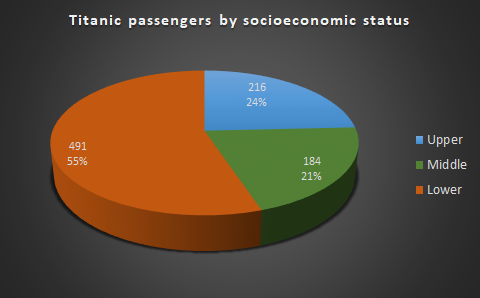

## Line charts
Line charts are ideal for displaying how a variable changes over a continuous interval, such as time. Generally, they are used to represent trends or relationships (in a group with more variables) between the data during a continuous time interval.

 * Note: In order to visualize a use case in a continuous time interval, the following dataset from the Open data initiative of the Government of Spain has been used [the population data by Autonomous Communities from 1997 to 2017.](https://datos.gob.es/es/catalogo/ea0010587-poblacion-por-comunidades-y-ciudades-autonomas-y-tamano-de-los-municipios-anual-comunidades- autonomas-official-figures-of-population-of-the-Spanish-municipalities-revision-of-padron-municipal-identifier-api-2915) *

 

 * Example: Spanish population since 1997  

 

 * Example: Spanish population by Autonomous Communities since 1997
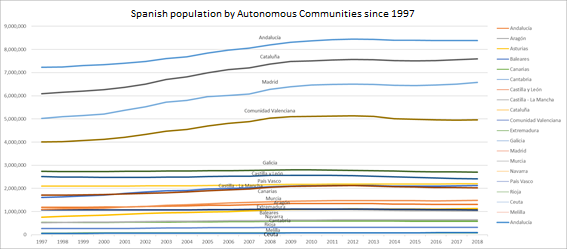

## Treemaps & Sunbursts
Treemaps and sunburst graphs are visualizations to represent hierarchical data and summarize the information in areas proportional to the corresponding values.

In the case of treemaps, the representation consists of rectangles with an area proportional to the value of the corresponding data with respect to the total.
 

 * Example: Proportion of passengers according to their socioeconomic status classified by gender (treemap)

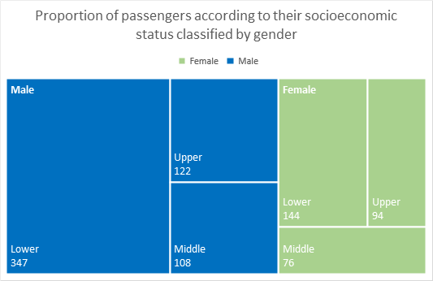

In the case of sunburst, the representation consists groups of rings according to the level represented, which are divided into proportional sections corresponding to the value of the data they represent.
 

 * Example: Proportion of passengers according to their socioeconomic status classified by gender (sunburst)

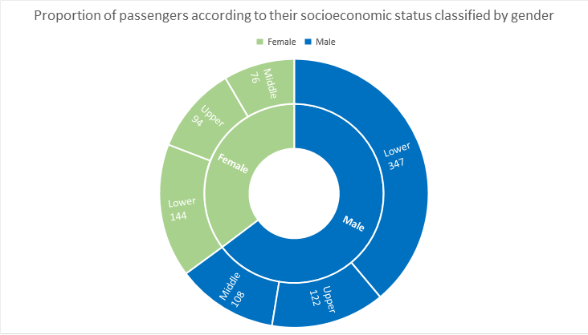

On the example represented, you can quickly see information about the hierarchical data represented as for example that the number of male passengers was almost 2 / 3 of the crew, as well as that male passengers and low socioeconomic status represented something more than 1 / 3 of the crew.

## Histograms & Bar charts
Looking over the information already collected in the post ["Descriptive Statistics"](https://datalaria.com/en/posts/descriptive-analysis/), where these two type of representations widely used in data analysis are explained, we can check that their main objective is to represent the distribution of the data with respect to a variable or characteristic of the dataset. Thus, the histograms allow to visualize continuous data and the bar diagrams represent discrete data.
 

 * Example: Passenger distribution by price of the ticket

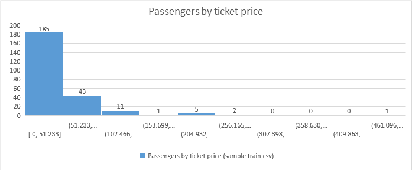
 

 * Example: Passenger distribution by socioeconomic status

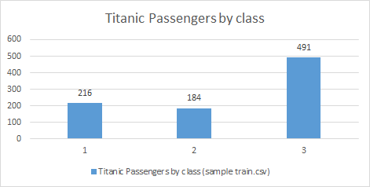

As we saw in the post ["Descriptive Statistics"](https://www.datalaria.com/en/post/fundamentos/2018-10-07-estadistica-descriptiva/), representing on these graphs measures of descriptive statistics (such as the mean or the median), we can characterize the distribution of the variable under analysis and thereby extract more information about it.

## Density plot
As known as Kernel density plots, they serve to visualize the distribution of data in a continuous interval. This type of graphics is a variation of the histograms where the shape of the distribution is smoothly represented.
 

* Example: Distribution of the age of Titanic passengers  

## Boxplots
The boxplots or whisker plots serve to represent a variable or characteristic depending on its range and its quartiles.

*Note: The quartiles are the values that divide a list of ordered numbers into 4 parts in equal percentages*

The boxplot consists of a box that includes the data from the first quartile (Q1 - 25% of the data under it) to the third quartile (Q3 - 75% of the data under it) of the values ​​of the variable represented (Interquartile Range - IQR). Within said box, the median is represented with an horizontal line and optionally, the average is represented by an asterisk or a star.

In addition to the box, this plot also shows 2 horizontal lines (or "fences") that represent the maximum and minimum typical values ​​of our variable, and from which the outliers ​​of the distribution are visualized using points.

*Statistical note: The outliers are those that are numerically distant from the rest of the data of the variable. Taking the Interquartile Range (IQR), outliers ​​are considered those that are below Q1 - 1.5 IQR or above Q3 + 1.5 IQR.*
 

* Example: Distribution of Titanic passengers by age

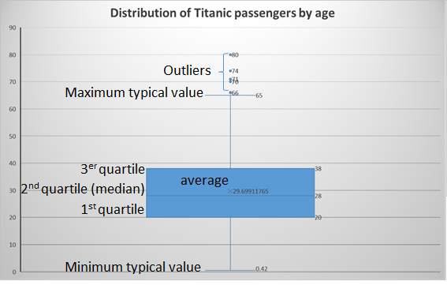

## Violin plots
Violin plots are used to visualize simultaneously the distribution of the data and its probability density. These visual graphs consist of a combination of a boxplot and a density plot. In this plot, the Intercuartile range is represented by a thick black line or small box, the typical data are represented with a thin black line and the median is visualized with a white point.
 

* Example: Distribution and density of Titanic passengers by age

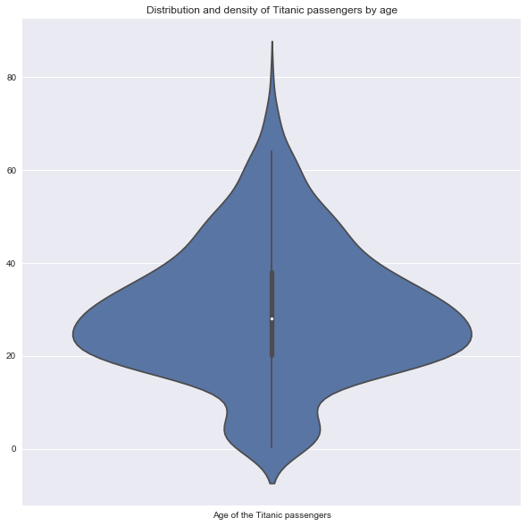

## Scatter plots
Scatter plots consist of visualizations that show the relationship of 2 variables of a dataset on two Cartesian axes. They are quite useful since they allow extracting information about the correlation between these variables.
 

* Example: Representation of ticket price by age and gender of the passenger

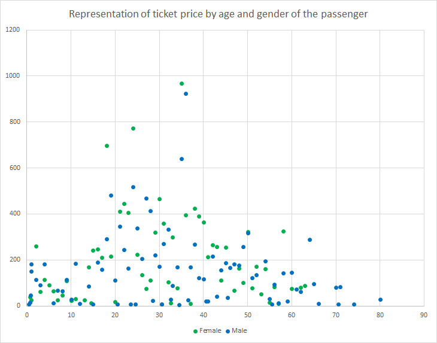

## Pareto charts
The Pareto charts serve to visually represent those distributions or datasets related to the Pareto principle or the 80 / 20 rule.
Pareto principle: also known as the 80 / 20 rule, establishes that generally in a dataset related by a cause-effect relationship, approximately 80% of the results or consequences come from 20% of the causes.
 

* Example: Representation of income data for tickets sold for the socioeconomic status

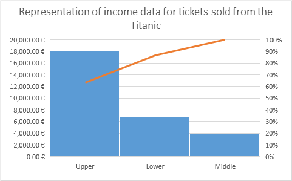  

* Example: Representation of income data for tickets sold for passengers

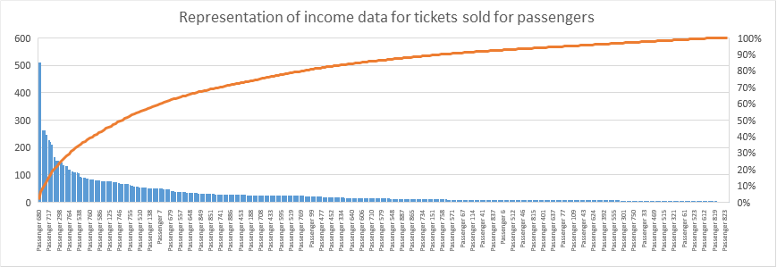

Regarding the example, we can see the usefulness of this graph given that it is quickly visualized that 90% of the ticket sales revenues of the Titanic come from tickets sold to passengers of high socioeconomic status. Or in a more detailed way about the second graph, approximately 80% of the revenue from ticket sales came from ~ 20% of the crew's passengers.
 

#### Sources of interest:
- Kaggle – [Titanic Machine Learning from Disaster](https://www.kaggle.com/c/titanic)
- Open data initiative of the Government of Spain – [datos.gob.es](https://datos.gob.es/en)
- Medium (Clément Viguier) – [The hate of pie charts harms good data visualization...](https://medium.com/@clmentviguier/the-hate-of-pie-charts-harms-good-data-visualization-cc7cfed243b6)
- Course _“[Essential Statistics for Data Analysis using Excel](https://courses.edx.org/courses/course-v1:Microsoft+DAT222x+1T2017/course/)”_ perteneciente al Microsoft Data Science Program
- The Data Visualisation Catalogue - [The Data Visualisation Catalogue](https://datavizcatalogue.com/index.html)
