As a starting point in data analysis, it is necessary to know some mathematical and statistical foundations in order to work with the information to be analyzed.

Thus, we will start learning some basic concepts:

## Population, Samples, Individuals and Variables:

 - **Population**: The set of all the elements under study
 - **Sample**: A subset of elements of the population (it should be  representative of the population)
 - **Individuals**: Every individual element in the popularion
 - **Variables**: Characteristics of the individuals

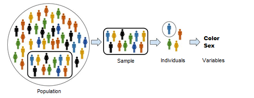

Example: [Titanic Dataset](https://www.kaggle.com/c/titanic/data)

- Population: 2.224 individuals
- Samples: files:
  - *train.csv*: Set of 891 representative individuals of the population used for the training of models of Machine Learning.
  - *test.csv*: Set of 418 representative individuals of the population used for the testing of models of Machine Learning.
- Individuals: Each passenger and crew of the population (every row of the sample or population data collected).
- Variables: The characteristics collected for each individual (every column of the sample or population data, ej.: *survival* (survivals), *sex* (sex) o *Age* (age)).

### Types of Variables
The variables can be classified depending on the type of data they contain and, more specifically:

 - **Numerical**: the data is represented by numbers that are metric or measures of said variable. According to their values, these could be classified in:
   - **Continuous**: they could take a countless or indeterminate number of values. For example, in the data set of the Titanic example, the variable *fare* could be considered a continuous variable by taking different values with up to 4 decimals of precision.
   - **Discretes**: they could take a countable number within a list of values (the data of continuous variables can be truncated to discrete variables for easier analysis). For example, the variable *Sibsp* (# of siblings) would be a discrete variable.
 - **Categorical**: the data is represented by texts or numbers whose meaning is not a metric, but associated with a specific datum or category. Depending on the relationship between their values, the data would be classified in:
	 - **Nominals**: data that have no relation or intrinsic order in themselves. An example of this type would be the *embarked* variable that represents the port of embarkation of passengers.
	 - **Discretes**: data with a natural order or classification among themselves. As for example it could be the variable *Pclass* that represents the class in the Titanic according to the social status.

***Note of interest:*** *The typology of the variables is not always clear and they could be considered of different types depending on the criteria of each person and the objectives sought. An example could be the representation of age, which could be correctly considered both numerical (continuous or discrete depending on the precision) and ordinal, depending on whether you want to work with formulas to treat age as a continuous value or simply work with specific age ranges according to the relationship of the rest of the variables.*

## Histograms and Bar charts
Although I will make a specific post for the data visualization, it is important to briefly mention the histograms and bar graphs. These are two of the most useful representations in the data analysis and help to understand how the data are distributed with respect to a variable or characteristic of the dataset (continuous in the case of histograms and discrete in the case of bar graphs).

 * Example: Bar chart

 * Example: Histogram

 

Thus, significant information about the data distribution can be extracted, classifying it in symmetric or asymmetric, as we will see below.

## Measures of descriptive statistics
A key step when analyzing a dataset is what is called "descriptive statistics", that is, in describing the data through a series of measures that allow to characterize its distribution and its dispersion.

### Measures of central tendency

The measures of central tendency serve to give us an idea of the distribution of our data.

#### Arithmetic Mean (Average)
This measure seeks to obtain the average value of a dataset. That is, all the values in the dataset are summed and divided by the total number of values in that data.

* **Population mean**:
$$ \mu = \frac{1}{N}\displaystyle\sum_{i=1}^Nx_i $$

* **Sample mean**:
$$ \bar x = \frac{1}{n}\displaystyle\sum_{i=1}^Nx_i $$

Being *N* the total of values in the population and *n* the total of values in the sample.

* Example:
If we have the following set of 5 data: [1, 2, 2, 5, 10], the average or mean of these values is their sum (20) divided by the total of data (5), that is, the average or mean is 4.

* Example of the Titanic dataset:
Following up on our example of the Titanic dataset, and taking the *Age* variable in the sample *train.csv*, we visualize its distribution and its average or mean:

 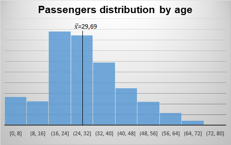

#### Median
This measure represents the middle value in the dataset. That is, for its calculation, we take the data point in the middle of all the dataset xm:

$$ \displaystyle x_{m} = x (\frac{n+1}{2}) $$

The median, due to its dependence on the position of the values and not on their values, is less dependent on extreme values (outliers) than the arithmetic mean. That is why in many common statistics (for example, the average salary of the population) it would be more convenient to use the median instead of the average to avoid the presence of very high values that could misalign or mislead the analysis.

* Example:
If we have the following set of 5 data: [1, 2, 2, 5, 10], the median of these values is the data n the middle of the dataset. That is, the value in the third position, the number 2.

* Example of the Titanic dataset:
Following up on our example of the Titanic dataset, and taking the *Age* variable in the sample *train.csv*, we visualize its distribution and its median:

 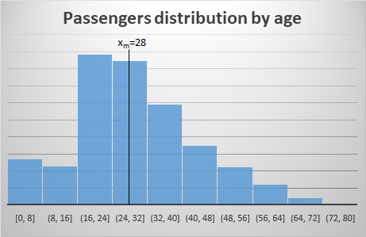

#### Mode
The mode in statistics represents the most frequently accruing value in the dataset.

* Example:
Continuing with our set of 5 data: [1, 2, 2, 5, 10], the mode is the most repeated value, that is 2.

* Example of the Titanic dataset:
Following with our example of the Titanic dataset, and taking the *Age* variable in the sample *train.csv*, we visualize its distribution and its mode:

 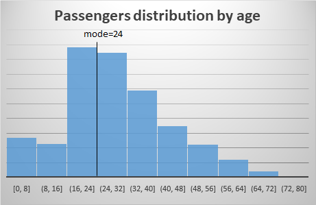

### Analysis of central tendency
As the examples show, first conclusions can be drawn regarding the distribution of the analyzed variable and its most representative values. Therefore, and comparing these values, we can characterize the distribution of a variable to be symmetric (those cases where the mean, median and mode are similar), or to be positive asymmetric (more values are below the mean and in that case the mean is greater than the median and this greater than the mode) or negative asymmetric (more values are above the mean and the mean is lower than the median and this lower than the mode).

As we have seen in our example of the Titanic and the Age of its passengers we have a certain positive asymmetry (Mean = 29.69 > Median = 28 > Mode = 24) which indicates that there were more people below 29.69 years that above.

### Meaures of variability
The measures of variability serve to give us an idea about how spread apart the data values are.

#### Range
The range is simply a way to express full distribution of the data and it's calculated substracting the minimum value in a set from the maximum one.

$$ \displaystyle Range  = Max (i) - Min (i) $$

* Example:
Analyzing our dataset of 5 values: [1, 2, 2, 5, 10], the range is 10 - 1 = 9.

* Example of the Titanic dataset:
Following with our example of the Titanic dataset, the range in the *Age* variable is 80-0,42 = 79,58 years.

#### Variance
The variance is a measure of the dispersion of the values with respect to its average or mean value. It is calculated by obtaining the average value of the square of its residuals (differences of each value with respect to the average). That is:

* **Variance of the population**:
$$ \sigma^{2} = \frac{\displaystyle\sum_{i=1}^N (x_i-\mu)^2}{N} $$

* **Unbiased variance of the sample**:
$$ s^{2} = \frac{\displaystyle\sum_{i=1}^N (x_i-\bar x)^2}{n - 1}  $$

The calculation is made on the square of the differences because if we add all their differences the result would be 0.

Regarding the difference in the denominator of both calculations, this is because we are using what is known as unbiased variance of the sample. This modification is based on the fact that we are calculating a statistical value of a sample that could be leaving the population mean outside or far from our values, if we calculate the variance of the sample dividing by n, we could be underestimating the real value of the population variance (more information can be found at Kahn Academy: [Explanation about why we divide by n-1 for the unbiased variance of the sample](https://www.youtube.com/watch?v= KkaU2ur3Ymw)

* Example:
Continuing with our set of 5 data: [1, 2, 2, 5, 10], the variance of the population is 10,8.

* Example of the Titanic dataset:
Following with our example of the Titanic dataset and the *Age* variable in the sample *train.csv* our unbiased variance is 211,01.

#### Standard deviation
The standard deviation is a measure of the dispersion of the values of the analyzed variable represented in their same units. Its calculation is made by **the square root of the variance** and its representation is simply *σ* or *s* depending on whether it represents the population or the sample.

* Example:
Continuing with our set of 5 data: [1, 2, 2, 5, 10], the standard deviation is 3,67.

* Example of the Titanic dataset:
Following with our example of the Titanic dataset and the *Age* variable in the sample *train.csv* our, the standard deviation of the sample is 14,52 years.

#### Standard error
The standard error serves to measure how well a sample represents the population. The calculation is made by dividing the standard deviation by the square root of the total values of the sample.

$$ \displaystyle SE_{\bar x} = \frac{s} {\sqrt n} $$

* Example of the Titanic dataset:
Following with our example of the Titanic dataset and the *Age* variable in the sample *train.csv* our, the standard error of the sample is 0,54.

### Analysis of the variability
As seen from the examples seen, these measures help to draw first conclusions regarding the dispersion or variability of our distribution values. This is useful when comparing datasets on variables with those we have worked with previously.

In addition, and in combination with the measures of central tendency, these measures are of special interest in order to extract information about the distribution of the data of our variable, and in this way, characterize said variable in one way or another.

## Basic distributions
As final subject in this first article of the *Fundamentals* series, it is interesting to visualize the distributions of the data because they can give more clear information than the one extracted from their calculated values. According to the data treated, the most typical distributions that we can find could be:

1. Based on the asymmetry coefficient (according to the measures of the central tendency), and as mentioned above, we could distinguish:

### Symmetric distribution:
 - The values of the mean, median and mode are similar

  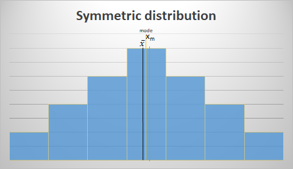

### Asymmetric distribution:
#### Positive asymmetry:
- More values are concentrated below the average or mean. Being this greater than the median and this greater than fashion.

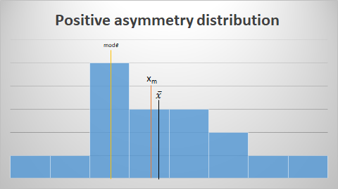

#### Negative asymmetry:
- More values are concentrated above the average or mean. Being this smaller than the median and this smaller than fashion.

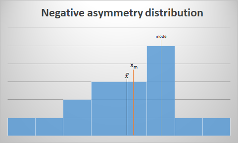

2. According to the shape of the distribution, the most typical cases of representation would be:

### Uniform distribution:
  - Almost all values are identical throughout the range of the variable. This type of distributions could be due to the fact that the representation intervals are too small or too large, and because the variables represented consist of a combination of several variables. Therefore, it is advisable to vary the way of representing the data to detect changes that induce more information:

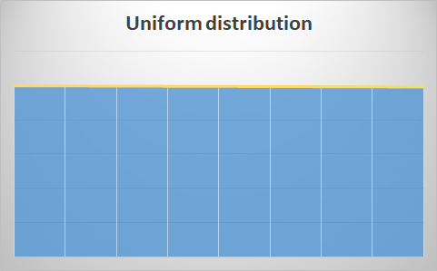

### Random distribution:
 - Those distributions without a clear pattern of representation where different modes or peaks can be distinguished. These could be due to the same cases as those indicated for the normal distribution, so it is recommended to try to make changes in their representation:

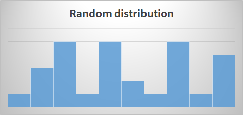

### Bimodal distribution:
  - Distributions with 2 modes or peaks, which generally indicates that they are affected by 2 sources of variation that should try to be studied independently. It could be the case that the measures of  central tendency and variability are similar, so their visualization is convenient for a better understanding.

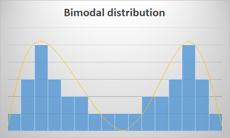

### Normal distribution:
  - The normal or Gaussian distribution consists of the desired distribution for all our data. Although it will have a specific post for analyzing its characteristics, briefly explained, it is a symmetrical bell-shaped function that allows us to model numerous phenomena of nature. The great advantage of having variables whose data are assimilated to this type of distribution is that their distribution can be characterized according to their standard deviation in the following way:

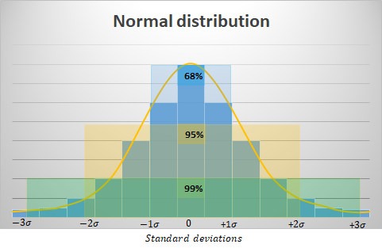

#### Sources of interest:
- Kaggle – [Titanic Machine Learning from Disaster](https://www.kaggle.com/c/titanic)

