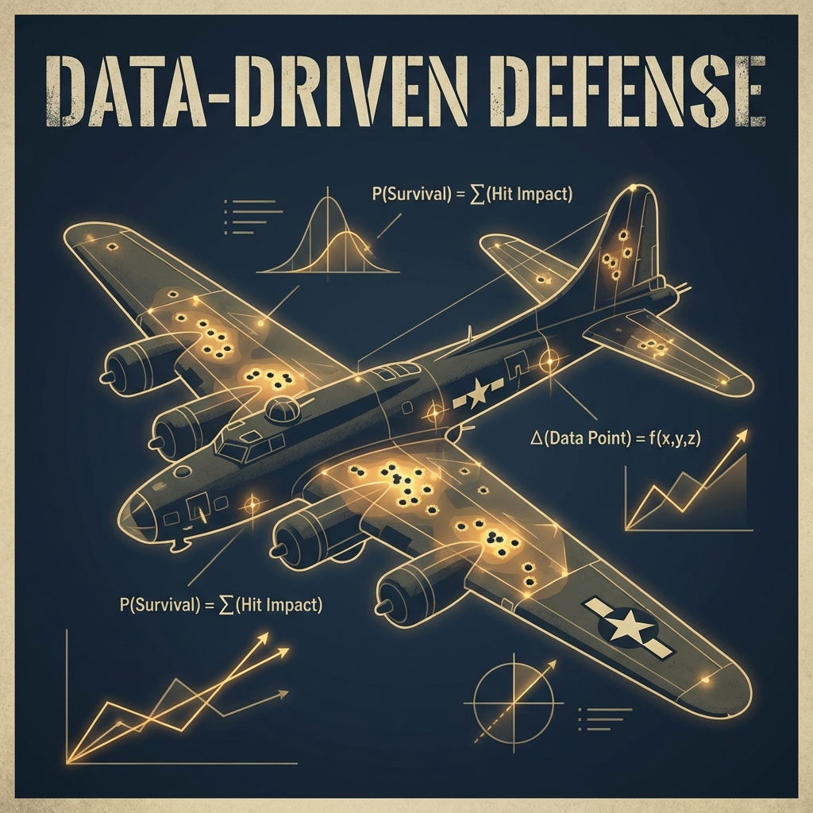

In the high-stakes environment of data engineering and executive decision-making, we are often seduced by the dashboard. We trust the rows in our SQL databases and the logs in our SIEMs because they are tangible. They are what we see.

But in my experience architecting systems—from defense industry logistics to modern cloud infrastructures—the most dangerous data is not the outlier; it is the data that never made it into the database.

Today, we step back from the code to examine a fundamental "First Principle" of data analysis: **Survivorship Bias**. To do so, we must revisit 1943 and the mind of a man who saw the invisible.

## The War of Numbers

World War II was the first conflict where victory depended largely on information processing and the application of mathematical rigor to the uncertainty of the battlefield. It wasn't just fought on the beaches; it was fought in offices where equations were the ammunition and the enemy was cognitive error.

The Allied Air Forces faced a crisis. Their strategic bombers, the B-17 Flying Fortresses, were suffering catastrophic attrition rates over Europe. The intuitive solution for the military command was simple: armor the planes. But armor is a zero-sum game; every kilogram of steel reduces bomb load and maneuverability, paradoxically making the plane easier to shoot down.

The military turned to data. They analyzed the bombers returning from missions and mapped every bullet hole. The data spoke with seductive clarity: the wings, the central fuselage, and the tail were riddled with damage.

The military logic, guided by visible empirical evidence, dictated reinforcing these "wounded" areas. It makes sense, right? You reinforce where you get hit.

This is where **Abraham Wald**, a Jewish-Hungarian mathematician from the Statistical Research Group (SRG) at Columbia University, intervened.

  
  <em>Abraham Wald</em>

## The Inversion of Logic

Wald was an outsider. Excluded from formal education in his youth due to his religion, he developed a radical intellectual independence. He looked at the same diagrams as the generals but reached the diametrically opposite conclusion.

His argument was elegant and counterintuitive: **"The armor doesn't go where the bullet holes are. It goes where the holes aren't: the engines and the cockpit"**.

How did he arrive at this conclusion? By asking the one question nobody else asked: **Where are the missing planes?**

Wald assumed that German flak was random. It didn't have a guidance system seeking out wings. Therefore, hits should be uniformly distributed. If the planes returning to base had holes in the fuselage but pristine engines, it wasn't because the engines weren't getting hit.

It was because the planes hit in the engines **never came back**.

The "red dots" on the diagrams didn't indicate critical damage; they indicated survivable damage. The empty spaces were the kill zones. Wald taught us that truth often resides not in the data we have, but in the silence of the data we lack.

## The Mathematics of Survival

While the story is often told as a "Eureka!" moment, Wald's contribution was a rigorous statistical model involving complex conditional probabilities.

Let's look at this through a simplified engineering lens. Wald essentially established an inverse relationship between observed damage density and vulnerability.

If we define vulnerability as the probability of a plane being downed given a hit in a specific zone, and we observe the density of hits in survivors, the logic flows as follows:

> **If vulnerability(engine) ≈ 1 (Lethal) → Engine Hits in Survivors ≈ 0**

In other words: if getting hit in the engine almost always means death, then surviving planes will almost never have engine damage—not because engines weren't hit, but because those planes crashed.

Wald demonstrated that a returning B-17 with 100 holes in its wings provides statistical proof of the wing's robustness. Conversely, the absence of data on fuel pump damage indicates a critically low failure threshold.

## The Ghost in the Machine: Modern Implications

Why does this matter to a modern CTO or Data Engineer? Because Survivorship Bias is an epidemic in the digital economy. We are building algorithms and strategies based on filtered datasets, often with disastrous results.

### 1. The Startup Graveyard

In the startup ecosystem, we obsess over the "Garage Myth." We see Bill Gates or Mark Zuckerberg drop out of college and succeed, so we infer that formal education is a hurdle.

This is pure Waldian error. We are analyzing the "returning bombers." For every Zuckerberg, there are thousands of dropouts who failed and are invisible to Forbes. By studying only the survivors ("unicorns"), we isolate characteristics that might be irrelevant or even harmful.

### 2. AI and Algorithmic Bias

This is where the legacy of Wald becomes critical for ethical engineering. Machine Learning models are inference engines. If fed survivor-biased data, they automate discrimination.

Amazon, for example, had to scrap a recruiting AI because it penalized women. The model was trained on resumes of successful hires from the last decade (the survivors). Since the tech industry was historically male-dominated, the algorithm learned that "being male" was a predictor of survival. It didn't see the brilliant women who were rejected due to human bias; it only saw the "fuselage holes" of the men who made it.

### 3. Cybersecurity: The Ostrich Effect

In cybersecurity, SOCs often measure success by "attacks blocked" by the firewall. This is dangerous. A blocked attack is a plane that returned. The system worked.

The real threats are the **Silent Failures**—the malware that resides in the network for months without triggering an alert (APTs). If you optimize your budget based solely on logs of blocked attacks, you are reinforcing the fuselage while leaving the engines exposed to zero-day exploits.

## Conclusion: Interrogating the Nulls

Abraham Wald left us an epistemological warning: **Data is not reality; it is a shadow of reality projected through the filter of survival**.

As we build the next generation of data products—whether it's an S&OP forecasting model or an autonomous agent—we must adopt the mindset of the "Architect of the Void".

We must stop cleaning data merely to make it compile. We need to ask:
* Which customers *aren't* in the CRM? (The Churn)
* Which threats *aren't* in the logs?
* Which predictions *failed* to materialize?

The next time you look at a dashboard that points to an obvious conclusion, remember the B-17s over Europe. Remember that the evidence of success can be misleading, and sometimes, the only way to survive is to armor the emptiness.

---

#### References & Further Reading

1.  **Wald, A. (1980).** *A Method of Estimating Plane Vulnerability Based on Damage of Survivors*. Center for Naval Analyses.
2.  **Ellenberg, J.** *How Not to Be Wrong: The Power of Mathematical Thinking*. (Discusses the SRG and Wald's impact).
3.  **Mangel, M., & Samaniego, F. J. (1984).** *Abraham Wald's Work on Aircraft Survivability*. Journal of the American Statistical Association.
4.  **Crescendo.ai.** *16 Real AI Bias Examples & Mitigation Guide*. (Case study on Amazon's hiring algorithm).
5.  **Forbes Tech Council.** *The Ostrich Effect And Survivorship Bias: The Real Cyber Threats*.
