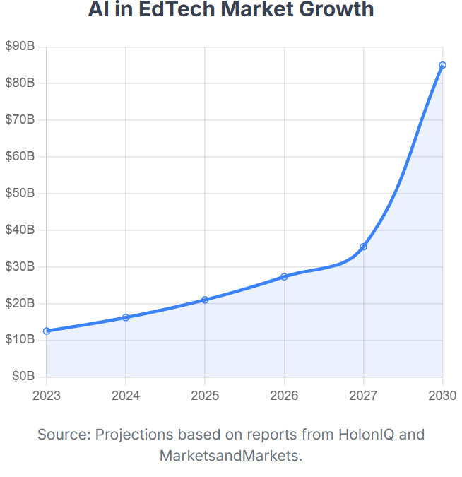

Deep research is the foundation of knowledge, but let's be honest: it's an arduous process that requires a lot of dedication and work. Gathering dozens of sources, synthesizing contradictory data, and structuring a coherent narrative can take weeks, if not months. What if we could accelerate that process from weeks to minutes?

That's the promise of **Gemini's Deep Research** feature, a tool I've put to the test to create a comprehensive report on one of the hottest topics of our time: **the impact of Artificial Intelligence in Education**.

This post is not just about the fascinating findings of that research, but also about the process itself. It's the story of how a simple question to an AI can generate a scholarly-quality analysis, and how we can transform that dense information into a story accessible to everyone.

### The Starting Point: A Question to Gemini

It all started with a conversation among friends about how we imagined education for this generation and the next, considering the transformative impact of Artificial Intelligence. To add more depth and detail to our reflections, we posed a simple request to Gemini using its **Deep Research** option to see what would happen. We simply asked, "Research the global impact of AI in education." The tool got to work, analyzing and synthesizing information from a multitude of sources to generate a complete and structured report in about 5-10 minutes... and this was the result of its work: [Research on the impact of AI in education by Deep Research](AI_in_Education_A_Global_Report.docx)

What follows are the most revealing findings from that analysis, a body of knowledge we can now explore in a fraction of the time it would have traditionally taken, while maintaining an exceptionally high level of content quality.

### The Global Landscape: An Explosive Market Clashing with Ethics

To begin, let's talk about money. The AI in education market is booming, with projections exceeding **$32 billion by 2030**, driven by an insatiable demand for personalized learning.

However, this dizzying expansion clashes with the vision of organizations like **UNESCO**, which advocate for a human-centered and ethical approach. The problem is that technology moves much faster than policy and regulation. A 2023 survey revealed an alarming fact: **only 10% of schools and universities worldwide have an official framework for the use of AI**. This creates a "gulf between policy and practice," where risks are not being addressed in its day-to-day use.

If you want a quick overview of this complex landscape, I've used NotebookLM (recalling what I learned in the [NotebookLM post on Datalaria](https://datalaria.com/en/posts/notebooklm-sql/)) to generate a **video summary** of the key points from this report, which you can watch here: [Video Summary of the AI in Education Report](https://notebooklm.google.com/notebook/86d7a334-5bee-4b40-8932-4c42eeb1707d?artifactId=900393d9-67e7-4715-9813-9ddc0614a45a).

### The Global Race for AI in Education: 4 Countries, 4 Strategies

The way each country adopts AI in its classrooms is a reflection of its values and geopolitical ambitions. The classroom has become a new stage for global competition.

* **China:** Its strategy is centralized and mandatory. Starting in 2025, AI education will be **compulsory for all primary and secondary school students**. The curriculum is systematic, differentiated by age, and establishes a minimum of eight hours of AI instruction per year. Primary school students focus on experiential learning with robotics, while secondary students tackle advanced projects and algorithms.

* **Singapore:** It integrates AI as part of its "EdTech Masterplan 2030," with a systemic approach and strong investment in R&D. The strategy centers on the national *Student Learning Space (SLS)* platform, which is being enhanced with AI tools accessible to all students. Pilot programs are already underway, such as an Adaptive Learning System for mathematics that has been offering personalized recommendations in 33 schools since 2023.

* **Finland:** True to its Nordic values, it bases its strategy on **ethics and data privacy**. Its cornerstone is teacher training and AI literacy for all citizens. One of its most recognized initiatives is the free and world-renowned "Elements of AI" course from the University of Helsinki. Furthermore, its focus on ethics is so profound that they even require ethical reviews for the use of tools like ChatGPT in the classroom.

* **United States:** With a federal structure, it lacks a single mandate. The approach relies on incentives and public-private partnerships, creating a patchwork of diverse policies. This is reflected in initiatives like the "Presidential AI Challenge," which encourages students to use AI to solve community problems. This decentralization also leads to disparate reactions, such as when large school districts (New York, Los Angeles) initially banned ChatGPT only to later reverse their decision.

### But Does It Really Work? The Scientific Evidence

Beyond the money and policies, does AI improve learning? Science says yes, and emphatically so.

A 2025 meta-analysis found a **very large positive impact of AI on educational outcomes** (with a Hedges' g effect size of 0.86). But what does that number mean exactly? **[Hedges' g](https://www.scribbr.com/statistics/effect-size/)** is a statistical measure that tells us the magnitude or strength of an effect—in this case, how much learning improves thanks to the AI intervention. To put it in perspective, in social research, a value of 0.2 is considered a small effect, 0.5 is medium, and anything above 0.8, as in this case, is considered a large effect. In educational research, an effect of this magnitude is very strong evidence.

However, the impact is directly proportional to its ability to facilitate active and personalized learning. **Chatbots and generative AI** show the most substantial impact, while more passive platforms have a more modest effect.

### The Future of the Teacher: Replaced or Reimagined?

One of the greatest anxieties is whether AI will replace teachers. The research consensus is a resounding no. However, their role is being fundamentally redefined, shifting from the "sage on the stage" to the **"guide on the side."** With AI handling tasks like grading (where it can save up to 90% of the time) or lesson planning, teachers will have more time to focus on the uniquely human aspects of education that AI cannot replicate.

This new role breaks down into several key facets:

* **Facilitators of Learning:** Instead of being the main source of information, they will guide students through complex learning experiences, helping them ask the right questions and critically navigate the content AI provides.
* **Content Curators:** They will be responsible for selecting, evaluating, and adapting AI-generated material to ensure it aligns with pedagogical goals and the specific needs of their students.
* **Mentors of Social-Emotional Skills:** Freed from administrative tasks, they can devote more time to fostering empathy, collaboration, critical thinking, and creativity—essential skills that AI cannot teach.
* **Designers of Learning Paths:** They will collaborate with students to map out personalized educational trajectories that align with their strengths, interests, and career aspirations.

This transformation, however, presents an immense challenge: the **training gap among educators themselves**. The report identifies this deficiency as the biggest bottleneck to effective AI integration, as without proper training, teachers cannot responsibly integrate these tools or teach their students to use them critically.

### The Critical Challenges: Bias, Privacy, and Our Own Brains

The path to an AI-enhanced educational future is not without dangers that require proactive management.

* **Algorithmic Bias:** AI systems trained on biased data can amplify discrimination. For example, AI detectors have been shown to be **biased against non-native English speakers**.
* **Data Privacy:** Public trust is low: nearly **70% of parents are opposed to AI accessing their children's data**.
* **Cognitive "Deskilling":** Perhaps the most subtle risk. Over-reliance on AI could erode critical thinking. An MIT study found that students who used ChatGPT to write essays showed **lower brain engagement and weaker memory recall**, suggesting that deep cognitive processes were being bypassed.

### Final Conclusions: An Evidence-Based Path Forward

After analyzing the complete picture, from the market to the classroom, the scientific research converges on a series of key findings that chart a path forward.

#### Synthesis of the Research

The scientific consensus is clear: the integration of Artificial Intelligence in education, when implemented thoughtfully, has a **strong and significant positive impact** on learning outcomes and student motivation. However, this enormous potential is balanced by equally significant risks that require proactive management, such as algorithmic bias, data privacy, and equity in access. Both students and teachers recognize the benefits of AI but express deep concern about the potential erosion of critical thinking, academic integrity, and their own lack of training to integrate these tools effectively and ethically.

#### Strategic Recommendations

Based on the evidence, the report concludes with a three-tiered call to action for responsible implementation. **Policymakers** must develop clear ethical and legal frameworks, as well as invest in closing the digital divide to avoid a two-tiered education system. **Educational institutions** are tasked with establishing transparent usage policies, prioritizing AI literacy for the entire community, and ensuring there is always a "human in the loop" in high-stakes decisions. Finally, **educators** must embrace their new role as facilitators, modeling a critical use of AI and focusing their work on fostering the skills that machines cannot replicate.

### The Research Revolution and Next Steps

This post, in essence, explores and summarizes the information from the research conducted by Gemini's Deep Research. The experience demonstrates the power of tools like "Deep Research" to democratize access to deep knowledge.

What's most interesting is that once the research is complete, the tool itself offers you the next steps to transform the findings into other formats, suggesting actions like:
* **Creating a webpage** with the information.
* Generating an **executive summary**.
* Producing an **audio summary** or podcast.
* Developing a **quiz** to assess comprehension.

AI not only researches for you, but it also helps you communicate the results. The challenge, as always, is not technological, but pedagogical and human: to leverage these tools to enhance our intelligence without diminishing our humanity.

#### Sources and Resources:
* **Gemini**: [Gemini page for chatbot use with the Deep Research option](https://gemini.google.com/app)