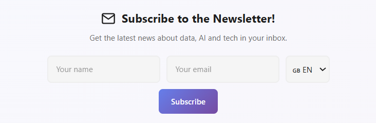

I thought the Autopilot was complete. Twitter, LinkedIn, Dev.to... everything automated with a simple `git push`. But I was missing something important: **a direct connection with my readers**.

Social media is great for reach, but algorithms decide who sees my content. With a **newsletter**, I have control. The email arrives directly in the inbox of those who really want to read me.

So I got to work adding this new piece to the puzzle.


## The Goal

I wanted a system that met these requirements:

1. **Elegant form** integrated into the footer of all pages
2. **Bilingual**: works perfectly in Spanish and English
3. **Language segmentation**: each subscriber chooses their preferred language
4. **Total automation**: when I publish a post, the newsletter is sent automatically
5. **Personalized content**: emails with the subscriber's name and AI-generated text

## Choosing the Platform: Brevo

After evaluating options like Mailchimp, ConvertKit, and Sendinblue (now Brevo), I chose **Brevo** for several reasons:

- **Free API** for small volumes (300 emails/day)
- **Advanced personalization** with content variables
- **Lists and segmentation** to manage languages
- **Simple integration** with Netlify Functions
- **GDPR compliance** Headquarters in France with native GDPR compliance.

## Solution Architecture

The system has three main components:


%%{init: {'theme': 'base', 'themeVariables': { 'primaryColor': '#f0f4f8', 'edgeLabelBackground':'#ffffff', 'tertiaryColor': '#e6e6e6'}}}%%
flowchart LR
    subgraph Frontend["🌐 Frontend (Hugo + Netlify)"]
        FORM[Footer Form]
        FUNC[Netlify Function]
    end
    
    subgraph Backend["🤖 Backend (Autopilot)"]
        ORC[Orchestrator]
        BRAIN[AI Newsletter Agent]
        MGR[Newsletter Manager]
    end
    
    subgraph Brevo["📧 Brevo"]
        LIST_ES[ES List #3]
        LIST_EN[EN List #4]
        CAMP[Campaigns]
    end
    
    FORM -->|"POST + language"| FUNC
    FUNC -->|"API Contacts"| LIST_ES
    FUNC -->|"API Contacts"| LIST_EN
    
    ORC -->|"New post"| BRAIN
    BRAIN -->|"AI Content"| MGR
    MGR -->|"API Campaigns"| CAMP
    CAMP -->|"Email ES"| LIST_ES
    CAMP -->|"Email EN"| LIST_EN


## Part 1: The Subscription Form

### Footer Design

The form lives in `layouts/partials/extend_footer.html`, a Hugo partial that is automatically injected across the entire website. I designed it to adapt to the page language:

```html
{{- $isSpanish := eq .Site.Language.Lang "es" -}}
{{- $title := cond $isSpanish "¡Suscríbete a la Newsletter!" "Subscribe to the Newsletter!" -}}

<div class="newsletter-section">
    <div class="newsletter-container">
        <h3 class="newsletter-title">{{ $title }}</h3>
        <form id="newsletter-form" class="newsletter-form">
            <div class="newsletter-inputs">
                <input type="text" id="newsletter-name" placeholder="{{ $namePlaceholder }}" required />
                <input type="email" id="newsletter-email" placeholder="{{ $emailPlaceholder }}" required />
                <select id="newsletter-lang" name="language" class="newsletter-select">
                    <option value="es" {{ if $isSpanish }}selected{{ end }}>🇪🇸 ES</option>
                    <option value="en" {{ if not $isSpanish }}selected{{ end }}>🇬🇧 EN</option>
                </select>
                <button type="submit" class="newsletter-btn">{{ $buttonText }}</button>
            </div>
        </form>
    </div>
</div>
```

The language selector is key: **it defaults to the page language**, but users can change it if they prefer to receive emails in another language.



### Netlify Function: The Bridge to Brevo

The form sends data to a Netlify Function that handles communication with the Brevo API:

```javascript
// netlify/functions/subscribe.js
const { email, name, language } = JSON.parse(event.body);

// Split first and last name
const nameParts = (name || '').trim().split(' ');
const firstName = nameParts[0] || '';
const lastName = nameParts.slice(1).join(' ') || '';

// Select list based on language
const listId = language === 'es' ? 3 : 4;

// Create contact in Brevo
const response = await fetch('https://api.brevo.com/v3/contacts', {
  method: 'POST',
  headers: {
    'api-key': process.env.BREVO_API_KEY
  },
  body: JSON.stringify({
    email: email,
    attributes: {
      FIRSTNAME: firstName,
      LASTNAME: lastName,
      LANGUAGE: language
    },
    listIds: [listId],
    updateEnabled: true
  })
});
```

The most important thing here is **language segmentation**:
- Subscribers who choose **ES** go to List #3
- Those who choose **EN** go to List #4

## Part 2: The Newsletter Agent

For the email content, I created a new "Agent" in the Autopilot's AI system. This agent has a different personality from the Twitter or LinkedIn ones:

```python
# brain.py - Newsletter Agent
sys_instruction = (
    "You are writing a personal email to a friend who loves technology.\n"
    "Tone: Warm, personal, excited to share something interesting.\n"
    "Structure:\n"
    "1. HOOK: An engaging sentence about why this topic caught your attention.\n"
    "2. CONTEXT: Brief explanation of the problem or situation.\n"
    "3. VALUE: The key insight of the article.\n"
    "4. TEASE: A detail that makes them want to click.\n"
    "Rules:\n"
    "- Write 3-4 SHORT paragraphs.\n"
    "- CRITICAL: Use DOUBLE LINE BREAKS between paragraphs.\n"
    "- Use 2-3 subtle emojis (🔍, 💡, 🎯).\n"
    "- Do NOT include greeting or signature (added automatically)."
)
```

The key difference from social media agents is the **personal tone**. An email is a one-on-one conversation, not a post for the masses.

The agent doesn't just translate. If the post is in Spanish, the 'brain' switches context to generate culturally relevant copy for the Hispanic audience, not just a translation

## Part 3: The Newsletter Manager

This is the piece that orchestrates all the sending. It handles:

1. **Generating the HTML** email with professional design
2. **Personalizing content** with the subscriber's name
3. **Creating and sending the campaign** to the correct list

```python
# newsletter_manager.py
class NewsletterManager:
    def __init__(self):
        self.api_key = os.getenv("BREVO_API_KEY")
        self.list_id_es = int(os.getenv("BREVO_LIST_ID_ES", "3"))
        self.list_id_en = int(os.getenv("BREVO_LIST_ID_EN", "4"))
    
    def send_campaign(self, subject, intro_text, post_title, post_url, lang="es"):
        # Select list based on language
        list_id = self.list_id_es if lang == "es" else self.list_id_en
        
        # Generate email HTML
        html_content = self._build_html_template(intro_text, post_title, post_url, lang)
        
        # Create campaign in Brevo
        create_payload = {
            "name": f"Newsletter {lang.upper()} - {post_title}",
            "subject": subject,
            "sender": {"name": "Datalaria", "email": "datalaria@gmail.com"},
            "htmlContent": html_content,
            "recipients": {"listIds": [list_id]}
        }
        
        # Send immediately
        response = requests.post(f"{self.base_url}/emailCampaigns", json=create_payload)
        campaign_id = response.json().get("id")
        requests.post(f"{self.base_url}/emailCampaigns/{campaign_id}/sendNow")
```

### The HTML Template

The email has a clean design with dynamic personalization:

```html
<p style="font-size: 18px;">
    Hi {{ contact.FIRSTNAME | default: 'friend' }},
</p>

<div style="font-size: 16px; line-height: 1.7;">
    {{ ai_generated_content }}
</div>

<a href="{{ post_url }}" style="background: linear-gradient(135deg, #667eea 0%, #764ba2 100%);">
    👉 Read full article
</a>
```

The `{{ contact.FIRSTNAME }}` variable is Brevo magic: it automatically replaces with each subscriber's name.

## Part 4: Integration with the Orchestrator

The final step was connecting all this with the existing Autopilot flow:

```python
# orchestrator.py
if enable_newsletter:
    post_lang = post_data['lang']  # 'es' or 'en' based on directory
    
    # Generate personalized content
    newsletter_text = brain.generate_social_copy(
        post_data['title'], 
        post_data['content'], 
        platform='newsletter', 
        lang=post_lang
    )
    
    # Send only to the post's language
    newsletter_manager.send_campaign(
        subject=f"🚀 New on Datalaria: {post_data['title']}",
        intro_text=newsletter_text,
        post_url=post_url,
        lang=post_lang
    )
```

The logic is simple but powerful:
- If I publish a post in `/es/posts/` → it's sent to the **ES List**
- If I publish in `/en/posts/` → it's sent to the **EN List**

No mixing or automatic translations. Each audience receives content in their language, about posts written for them.

## The Result

After all this implementation, my workflow became:

1. Write an article in `/content/es/posts/new-article/`
2. Do `git push`
3. GitHub Actions detects the change
4. The Autopilot:
   - Generates tweets and LinkedIn posts (as before)
   - **NEW**: Generates personalized newsletter content
   - Creates a campaign in Brevo
   - Sends the email to all subscribers in the ES List

**Email received by subscribers:**


The email includes:
- ✅ Personalized greeting with name
- ✅ AI-generated content with subtle emojis
- ✅ Gradient call-to-action button
- ✅ Datalaria logo
- ✅ Unsubscribe link

## GitHub Actions Configuration

For everything to work in production, I added the following variables to the workflow:

```yaml
# .github/workflows/autopilot.yml
env:
  ENABLE_NEWSLETTER: ${{ vars.ENABLE_NEWSLETTER }}
  BREVO_API_KEY: ${{ secrets.BREVO_API_KEY }}
  BREVO_LIST_ID_ES: ${{ vars.BREVO_LIST_ID_ES }}
  BREVO_LIST_ID_EN: ${{ vars.BREVO_LIST_ID_EN }}
```

## Lessons Learned

### 1. Brevo doesn't support inline filters
Initially I tried using `segmentConditions` to filter by LANGUAGE attribute directly in the API call. It doesn't work. Brevo requires **predefined lists** or **saved segments**. The solution was to create two separate lists.

### 2. Line breaks matter
The AI-generated content came as plain text. I had to create a `_text_to_html_paragraphs()` function that converts double line breaks into `<p>` tags so the email renders correctly.

### 3. Tone matters more than content
For the newsletter I spent extra time calibrating the AI agent prompt. Unlike Twitter (viral) or LinkedIn (professional), email has to sound like **a friend writing to you**. The model temperature and formatting instructions were key.

## Conclusion

The Autopilot no longer just posts on social media. It now also cultivates a direct relationship with readers through email.

The best part is that the additional effort when publishing is **zero**. Everything is still a simple `git push`. The magic happens on its own.

What about you? Do you have a newsletter yet? If not, I hope this post gave you ideas to get started. And if you do... why not automate it? 😉

---

**Did you enjoy this article?**

Then you know what to do: scroll down and subscribe to the newsletter. I promise not to send spam, just content as interesting as this. 👇
