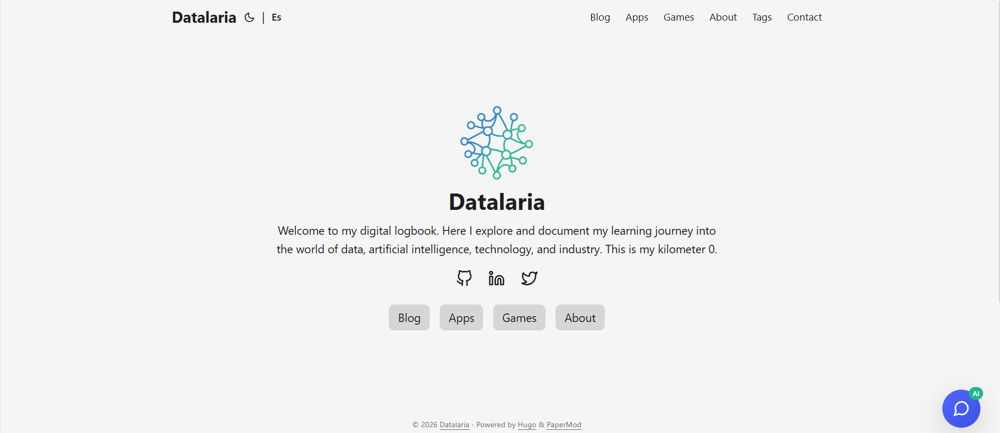

*This is a submission for the [Algolia Agent Studio Challenge](https://dev.to/challenges/algolia): Consumer-Facing Conversational Experiences*

## What I Built

**Ops Engineering Copilot** is an AI-powered chat widget that lives on my Hugo blog and answers visitor questions using conversational AI grounded in my actual content.

Ask it "What is Datalaria?" and instead of a generic response, you get:

> "Datalaria is a technical blog focused on data engineering, artificial intelligence, and business operations. As the Ops Engineering Copilot, I specialize in providing actionable, engineering-focused advice across four key pillars: S&OP, Product, Projects, and People..."

**This is NOT just search** – it's a conversational agent that synthesizes knowledge from 72 indexed posts to provide contextual, helpful answers.

## Demo



**Live Demo:** [datalaria.com](https://datalaria.com)

**Try these questions:**
- "What is the Autopilot project?"
- "How do I detect outliers in S&OP data?"
- "Tell me about GitHub Actions automation"

## The Architecture

This project extends my existing Autopilot system (documented in Parts 1-7) with a new capability: **consumer-facing AI search**.


flowchart TB
    subgraph "Content Pipeline"
        Hugo["📝 Hugo Blog<br/>72 Markdown Posts"]
        Sync["🐍 Python Sync Script<br/>algolia_sync.py"]
        Index["☁️ Algolia Index<br/>datalaria_posts"]
    end

    subgraph "Algolia Agent Studio"
        Agent["🤖 Ops Engineering Copilot<br/>Agent ID: f27a..."]
        LLM["🧠 Google Gemini<br/>LLM Provider"]
        RAG["📚 RAG Pipeline<br/>Context Retrieval"]
    end

    subgraph "Frontend"
        Widget["💬 Chat Widget<br/>algolia-agent.html"]
        Netlify["⚡ Netlify Function<br/>agent-chat.js"]
    end

    subgraph "User"
        Visitor["👤 Blog Visitor"]
    end

    Hugo -->|"Extract & Clean"| Sync
    Sync -->|"Push Records"| Index
    Index -->|"Provides Context"| RAG
    RAG -->|"Augments Prompt"| LLM
    LLM -->|"Generates Response"| Agent
    
    Visitor -->|"Question"| Widget
    Widget -->|"POST /agent-chat"| Netlify
    Netlify -->|"Completions API"| Agent
    Agent -->|"AI Answer"| Netlify
    Netlify -->|"Display"| Widget

    style Agent fill:#5468ff,color:white
    style LLM fill:#4285f4,color:white
    style Index fill:#5468ff,color:white


### Key Components

| Component | Technology | Purpose |
|-----------|------------|---------|
| Content Source | Hugo + Markdown | 72 bilingual posts (EN/ES) |
| Indexing | Python + Algolia API | Extract, clean, classify, push |
| Agent | Algolia Agent Studio | RAG + LLM orchestration |
| LLM | Google Gemini | Response generation |
| Proxy | Netlify Functions | CORS bypass + error handling |
| Widget | Vanilla JS | Embedded chat interface |

## How I Used Algolia Agent Studio

### Step 1: Indexing the Knowledge Base

The foundation is a Python script that processes all Hugo posts and pushes them to Algolia:

```python
# algolia_sync.py - Key extraction logic
def extract_post_data(filepath: Path, lang: str) -> Optional[Dict]:
    """Extract and clean post data for Algolia indexing."""
    post = frontmatter.load(filepath)
    
    # Clean markdown to plain text
    html = markdown.markdown(post.content)
    soup = BeautifulSoup(html, 'html.parser')
    clean_text = soup.get_text(separator=' ', strip=True)
    
    # Classify into operational domains
    domain = classify_domain(post.metadata.get('categories', []))
    
    return {
        'objectID': generate_object_id(filepath),
        'title': post.metadata.get('title', ''),
        'content': clean_text[:8000],  # Algolia limit
        'description': post.metadata.get('description', ''),
        'url': build_url(filepath, lang),
        'lang': lang,
        'domain': domain,  # S&OP, Product, Projects, People
        'date': post.metadata.get('date'),
        'tags': post.metadata.get('tags', []),
    }
```

**Result:** 72 records indexed (36 English + 36 Spanish) across 4 operational domains.

### Step 2: Configuring the Agent in Agent Studio

In the Algolia dashboard, I created an agent with a specialized system prompt:

```
You are the "Ops Engineering Copilot" for the Datalaria technical blog.

Your expertise spans four pillars:
- 📊 S&OP: Demand forecasting, data hygiene, outlier detection
- 📦 Product: Lifecycle management, data-driven decisions
- 📋 Projects: CI/CD, GitHub Actions, automation, DevOps
- 👥 People: Team dynamics, onboarding, collaboration

Guidelines:
1. Ground all answers in the indexed blog content
2. Be conversational but technically precise
3. When relevant, suggest specific articles to read
4. Support both English and Spanish queries
```

**LLM Provider:** Google Gemini (excellent free tier for prototyping)

### Step 3: The CORS Problem (and Solution)

Here's where it got interesting. The Agent Studio API doesn't allow direct browser calls due to CORS restrictions. My first attempt:

```javascript
// ❌ This fails with CORS error
fetch('https://agent-studio.eu.algolia.com/1/agents/{id}/completions', {
    method: 'POST',
    headers: { 'X-Algolia-API-Key': key }
});
```

**Solution:** A Netlify Function as a proxy:

```javascript
// netlify/functions/agent-chat.js
exports.handler = async (event) => {
    const { query, conversationId } = JSON.parse(event.body);
    
    // Call Agent Studio from server-side (no CORS!)
    const response = await fetch(
        `https://agent-studio.eu.algolia.com/1/agents/${AGENT_ID}/completions?compatibilityMode=ai-sdk-4&stream=false`,
        {
            method: 'POST',
            headers: {
                'Content-Type': 'application/json',
                'X-Algolia-API-Key': SEARCH_KEY,
                'X-Algolia-Application-Id': APP_ID
            },
            body: JSON.stringify({
                messages: [{ role: 'user', content: query }],
                id: conversationId
            })
        }
    );
    
    const data = await response.json();
    
    return {
        statusCode: 200,
        body: JSON.stringify({
            answer: data.content,
            conversationId: data.id
        })
    };
};
```

**Key discoveries:**
- `compatibilityMode=ai-sdk-4` is required
- `stream=false` returns JSON instead of SSE
- Response format is `{id, role, content}`, not OpenAI-style

### Step 4: The Chat Widget

A lightweight vanilla JS widget that integrates with Hugo:

```html
<!-- layouts/partials/algolia-agent.html -->
<script src="https://cdn.jsdelivr.net/npm/algoliasearch@4/dist/algoliasearch-lite.umd.js"></script>

<script>
async function sendMessage() {
    const query = input.value.trim();
    
    try {
        // Try Agent Studio via Netlify proxy
        const response = await fetch('/.netlify/functions/agent-chat', {
            method: 'POST',
            body: JSON.stringify({ query, conversationId, language })
        });
        
        const data = await response.json();
        addMessage(data.answer, 'agent');
        
    } catch (error) {
        // Fallback to direct Algolia search
        await fallbackSearch(query);
    }
}
</script>
```

**Features:**
- 🌙 Dark mode support
- 📱 Mobile responsive
- 🌐 Bilingual (ES/EN)
- ⚡ Graceful fallback to search if Agent fails

## Technical Challenges

### Challenge 1: The 422 Validation Error

My first API calls returned `422: Field required: compatibilityMode`. The documentation mentioned it, but I missed it initially.

**Fix:** Added query parameters `?compatibilityMode=ai-sdk-4&stream=false`

### Challenge 2: Streaming Response Format

Even after fixing the 422 error, I got `SyntaxError: Unexpected token 'f:'`. The API was returning SSE format (`f:{"message"...`) instead of JSON.

**Fix:** Added `stream=false` to disable streaming.

### Challenge 3: Response Parsing

The response structure wasn't OpenAI-compatible. I expected `choices[0].message.content` but got `{id, role, content}`.

**Fix:** Updated parsing logic to check `data.content` first.

## Results

| Metric | Value |
|--------|-------|
| Posts Indexed | 72 (36 EN + 36 ES) |
| Avg Response Time | ~3-4 seconds |
| Fallback Coverage | 100% (graceful degradation) |
| Languages Supported | English & Spanish |
| Deployment | Fully automated via Netlify |

## Source Code

The complete implementation is open source:

- **Indexing Script:** [algolia_sync.py](https://github.com/Dalaez/datalaria-website/blob/main/scripts/algolia_sync.py)
- **Netlify Function:** [agent-chat.js](https://github.com/Dalaez/datalaria-website/blob/main/netlify/functions/agent-chat.js)
- **Chat Widget:** [algolia-agent.html](https://github.com/Dalaez/datalaria-website/blob/main/layouts/partials/algolia-agent.html)

## What's Next

This is Part 8 of my Autopilot series. The system now has:

1. ✅ **Content Generation** (Parts 1-3): AI creates social posts
2. ✅ **Distribution** (Parts 4-5): Automated publishing to Twitter/LinkedIn
3. ✅ **Newsletter** (Part 6): Automated email campaigns
4. ✅ **Quality Control** (Part 7): Copilot CLI auditing
5. ✅ **Consumer Search** (Part 8): AI-powered Q&A - *You are here*

---

## Why Fast Retrieval Matters

In Operations Engineering, decisions happen fast. When a supply chain analyst asks "What's the best practice for detecting demand outliers?", they need answers in seconds, not minutes of browsing through archives.

Algolia's millisecond retrieval makes this possible:

| Scenario | Without Fast Retrieval | With Algolia |
|----------|----------------------|---------------|
| Find relevant article | ~30-60s browsing | ~100ms retrieval |
| Get synthesized answer | Manual reading required | ~3-4s AI response |
| Context accuracy | May miss related content | RAG ensures completeness |

The RAG pipeline works because:
1. **Fast vector search** finds semantically similar content across 72 posts instantly
2. **Faceted filtering** narrows results by language and domain (S&OP, Projects, Product, People)
3. **Snippet extraction** provides the LLM with precisely relevant context

Without sub-second retrieval, the conversation would feel sluggish and users would abandon the chat. Algolia enables the "instant" in instant knowledge discovery – transforming a static blog into an interactive, AI-powered knowledge base.

---

## Conclusion

Algolia Agent Studio transforms a static blog into an interactive knowledge base. Instead of forcing visitors to search and read multiple posts, they can simply *ask* and get synthesized answers.

The combination of:
- **Algolia Search** (fast, relevant retrieval)
- **Agent Studio** (RAG orchestration)
- **Google Gemini** (natural language generation)
- **Netlify Functions** (serverless proxy)

...creates a powerful, cost-effective AI assistant that runs 24/7.

**Questions?** Try the live demo at [datalaria.com](https://datalaria.com) or drop a comment below 👇

---

*This post is part of the [Autopilot Project](https://datalaria.com/en/tags/agents/) series, where I document how I automate content creation, distribution, and now consumer interaction using AI.*
