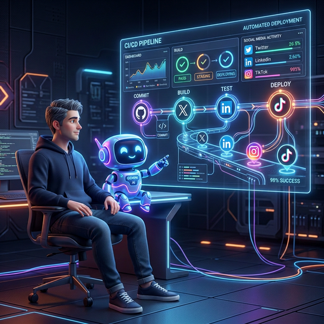

*This is a submission for the [Built with Google Gemini: Writing Challenge](https://dev.to/challenges/mlh-built-with-google-gemini-02-25-26)*

## 1. The Genesis: The Builder's Paradox

In the world of engineering and technical blogging, we often face the "Builder's Paradox": we can spend 40 hours perfecting a complex architecture, defining an S&OP data pipeline, or debugging microservices, but we cannot seem to find 15 minutes to effectively package and promote that work on social media. 


graph TD
    %% Styles
    classDef human fill:#ff9f43,stroke:#333,stroke-width:2px,color:white;
    classDef code fill:#5f27cd,stroke:#333,stroke-width:2px,color:white;
    classDef ai fill:#0abde3,stroke:#333,stroke-width:2px,color:white;
    classDef social fill:#ee5253,stroke:#333,stroke-width:2px,color:white;

    User("👱‍♂️ Me / Author"):::human -->|git push| Git["📂 GitHub Repository"]:::code
    Git -->|Trigger| Action["⚙️ GitHub Actions CI/CD"]:::code
    Action -->|Webhooks| Orchestrator{"🧠 CrewAI Orchestrator"}:::ai

    Orchestrator -->|Raw Markdown| Analyst["🕵️ Analyst Agent (Gemini Pro)"]:::ai
    Analyst -->|JSON Metadata| Orchestrator

    Orchestrator -->|Context + Hooks| WriterX["🐦 Twitter Agent (Gemini Flash)"]:::ai
    Orchestrator -->|Context + Key Points| WriterLI["💼 LinkedIn Agent (Gemini Flash)"]:::ai

    WriterX --> X["Twitter API"]:::social
    WriterLI --> LI["LinkedIn API"]:::social


I reached that breaking point with Datalaria. The content was there, the technical depth was solid, but distribution suffered due to a massive bottleneck: myself. I hated the marketing overhead.

So, I made a strategic decision: I fired myself from the Community Manager role. In my place, I built **Project Autopilot**: an autonomous, event-driven orchestrator running entirely inside GitHub Actions. Every time I push a new Markdown file (Hugo) to the repository, the system wakes up, extracts context using Google Gemini, and employs CrewAI to generate structured Twitter threads and LinkedIn posts. 

The initial conceptual diagram was simple: Text goes in, AI does magic, posts come out. The reality of building a deterministic pipeline with stochastic LLMs proved to be a much deeper engineering challenge.



## 2. Under the Hood: The Gemini Engine

To build a CI/CD pipeline that writes content based on deeply technical articles (spanning Data Science, Operations, and S&OP processes), a simple string-parsing Python script wasn't going to cut it. We needed heavy reasoning and enormous memory capacity. 

This is where Google's Gemini models became the critical engine of the architecture.

### Massive Context Ingestion with Gemini Pro
Technical posts, especially those detailing Sales & Operations Planning (S&OP) or data hygiene with Python, are long and dense. They contain business logic, code snippets, and diagrams. I chose **Gemini Pro** for the initial *Analyst Agent* because of its massive context window and high retention. It can ingest a 3,000-word tutorial without "forgetting" the core premise established in the first paragraph. 

### Structured Data Extraction with Gemini Flash
While Gemini Pro handled the heavy comprehension, I needed an incredibly fast model for repetitive formatting and metadata extraction. **Gemini Flash** became the go-to for these rapid-fire tasks. 

However, CI/CD pipelines require strict determinism. An LLM chatting in natural language breaks automation. I had to force Gemini to act as a strict data processor connecting the LLM output directly to the next GitHub Action step. Here is a real fragment of how we enforced strict JSON outputs using the Gemini API:

```python
import google.generativeai as genai
import os
import json

genai.configure(api_key=os.environ["GEMINI_API_KEY"])

def extract_metadata(markdown_content):
    # We rely on Gemini Flash for speed and strict JSON formatting
    model = genai.GenerativeModel(
        model_name="gemini-1.5-flash",
        generation_config={
            "temperature": 0.1,
            "response_mime_type": "application/json",
        }
    )
    
    prompt = f"""
    Analyze the following technical Markdown post.
    Return ONLY a valid JSON object matching this schema:
    {{
        "summary": "string",
        "key_takeaways": ["string", "string"],
        "target_audience": "string",
        "suggested_hashtags": ["string"]
    }}
    
    CONTENT:
    {markdown_content}
    """
    
    response = model.generate_content(prompt)
    return json.loads(response.text)
```

By setting `response_mime_type="application/json"`, we eliminated the parsing errors that plague so many agentic workflows, allowing the orchestrator to elegantly pass metadata to the specialized CrewAI *Copywriter Agents*.

## 3. The Friction: The Good, The Bad, and The Ugly

Integrating generative AI into a rigid CI/CD workflow is rarely as seamless as the quick-start documentation claims. Here is the raw reality of building with agents in production.

### The Good: Speed as a Feature
In a CI/CD environment, latency translates directly to runner costs. The inference speed of **Gemini 1.5 Flash** is staggering. By routing simple formatting tasks and metadata extraction to Flash, and reserving **Gemini 1.5 Pro** strictly for deep reasoning within CrewAI's Analyst role, we optimized both speed and cost. LangChain provided the glue, but Gemini provided the horsepower. Out-of-the-box, its ability to natively parse complex Markdown structures (including embedded Mermaid diagrams and code blocks) saved me days of writing fragile regex parsers.

### The Bad: Stochastic Models vs. Deterministic Pipelines
The core engineering friction came from an impedance mismatch. GitHub Actions expects deterministic, step-by-step execution. LLMs are inherently stochastic.

Even with temperature set to 0.1, a CrewAI agent might occasionally hallucinate a non-existent standard Markdown tag or subtly break a requested paragraph structure for LinkedIn. I quickly learned that Prompt Engineering is not enough; you need **Defensive Programming**. I had to wrap execution chains in strict `Try/Catch` blocks and implement Pydantic schemas to validate every single output segment. The LLM could not be trusted blindly to hit a social media API. It had to be heavily constrained, validated, and sanitized before any POST request was executed. We essentially had to build a deterministic "quality gate" around a non-deterministic brain.

### The Ugly: Infinite Delegation Loops and Runner Timeouts
The ugliest moments happened inside the GitHub Actions runners. CrewAI features an autonomous delegation mechanism where agents can pass tasks to one another. In theory, this is brilliant. In practice, without strict guardrails, it's a disaster.

Occasionally, the Analyst Agent and the Writer Agent would get stuck in an infinite, highly-polite "thinking loop," debating the best approach to summarize a technical paragraph. 

Because GitHub Actions charges by the minute, these silent loops would devour runner time until the system forcefully halted the pipeline with a frustrating `Error 143 (SIGTERM)`. Fixing this required deep intervention: disabling unnecessary delegation in CrewAI, enforcing hard timeouts (`max_execution_time`) at the agent level, and building strict fail-safes so the pipeline would cleanly abort rather than hang indefinitely.

## 4. The Takeaway: Operations Engineering

This project fundamentally shifted my mindset. Integrating AI into workflows is not a Prompt Engineering problem; **it is a Systems Engineering and CI/CD problem.**

Through this extreme "dogfooding" experiment, I learned to treat content and data pipelines with the exact same rigor I apply to a physical Supply Chain. An AI Agent is basically a highly capable but occasionally unpredictable node in an operations network. You must build fault tolerance, clear contracts (JSON schemas), and quality gating around it.

## 5. Looking Forward: The S&OP Pivot

Project Autopilot solved my distribution problem. But automating social media was merely the sandbox.

Now that Gemini and CrewAI have proven they can reliably ingest complex unstructured text, extract meaning, and orchestrate actions, the next step on the Datalaria roadmap is much more ambitious. I am taking this exact multi-agent architecture and pivoting it toward enterprise operations. 

Instead of reading Markdown to write tweets, the next iteration of these Gemini-powered agents will ingest fragmented ERP data, emails, and Excel dumps to automate data hygiene and summarize risks for **S&OP (Sales & Operations Planning)** meetings. We are moving from solving the Builder's Paradox to optimizing real-world supply chains.

The AI army is built. Now it's time to put it to real work.
