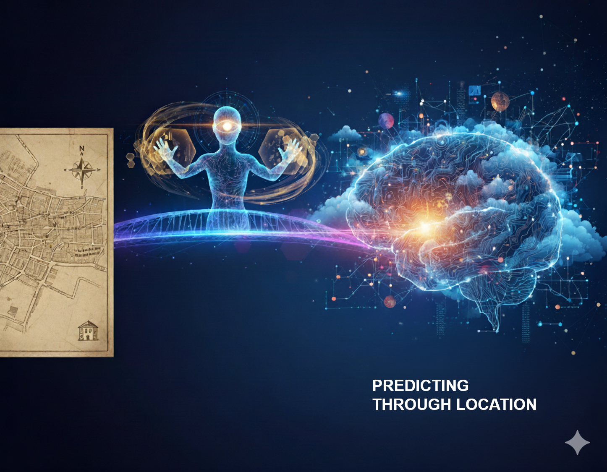

In the competitive world of technology, success stories often follow a predictable script. However, every now and then, a company emerges whose journey breaks the mold—one that isn't born from a preconceived idea in a Silicon Valley garage, but from a need as pragmatic as issuing an invoice.

This is the story of **Carto**, the chronicle of how a small data consulting studio in Madrid transformed into a global leader in geospatial analysis. It is a success story founded on a key strategic revelation: instead of fighting against the giants, they decided to become the indispensable intelligence layer that all of them needed.

### The Origin: A UN Invoice and a Gap in the Market

The story of Carto begins in 2007, not with a product, but with **Vizzuality**, a data visualization consultancy founded by Javier de la Torre and Sergio Álvarez Leiva. Their first major assignment came from a UN agency, and the creation of the company was, initially, a mere formality to be able to invoice for that project.

While working on niche projects for scientists, the founders repeatedly faced the same challenges: handling and visualizing massive volumes of spatial data. This direct experience led them to identify a "critical need" in the market: powerful spatial analysis techniques were inaccessible to mainstream industries like retail, finance, or telecommunications.

That was the "eureka!" moment. They saw an opportunity to **democratize geolocated data analysis**. Thus, within Vizzuality, an internal software project called **CartoDB** was born, designed to solve their own problems. After its official launch in 2012, they made the crucial decision in 2014: Carto spun off from Vizzuality, pivoting from a service-based model to a scalable, product-centric SaaS model, ready to attract venture capital.



### The Strategic Pivot: We Are Not GIS, We Are the Cloud's Intelligence Layer

Carto's most brilliant move was not trying to be a "better GIS" (Geographic Information System). Instead, they created a new category: **Location Intelligence (LI)**.

* **Traditional GIS**: For specialists. It answers "where are things?".
* **Location Intelligence**: For data and business analysts. It answers "**why** do things happen in a certain place?" and "**what if...?**".



Their true competitive advantage, however, lies in their **cloud-native** architecture. Instead of creating another data silo and forcing companies to move their information, Carto brings the analysis directly to where the data already resides: major cloud data warehouses like **Google BigQuery, Snowflake, AWS Redshift, and Databricks**.

!(carto_cloud_architecture.png)

This strategy turned the cloud giants, potential competitors, into their biggest allies and distribution channels. Carto positioned itself as the "Switzerland" of geospatial data, an agnostic analysis layer that enhances the value of the investments companies have already made in the cloud.

This shift in focus was consolidated in 2016 with the rebranding from CartoDB to **CARTO**, dropping the "DB" suffix to signal its evolution from a "database for maps" to a complete intelligence platform under the tagline: *"Predict through location"*.

### The Engine of Growth: Funding Rounds, Acquisitions, and Talent

Carto's trajectory validates its strategy, showing a clear progression in both investor confidence and its ability to attract talent.

#### Key Funding Rounds

The company's financing has evolved from local capital to top-tier global funds, accumulating a total of **$92 million**.

| Round     | Date     | Amount (USD) | Lead Investor(s)          |
| :-------- | :------- | :------------- | :------------------------ |
| **Series A** | Sep 2014 | $8M            | Earlybird Venture Capital |
| **Series B** | Sep 2015 | $23M           | Accel Partners            |
| **Series C** | Dec 2021 | $61M           | Insight Partners          |

#### Team Growth

The team's growth reflects the company's expansion from a founding core to a global organization.

| Date / Period    | Employee Milestone      |
| :--------------- | :---------------------- |
| **2012** | 2 Founders              |
| **Nov 2021** | > 150 Employees         |
| **Early 2024** | > 160 Experts           |
| **Est. 2024/2025** | ~ 313 Employees         |

#### Strategic Maturity

In 2019, the company matured its leadership by appointing **Luis Sanz** as the new CEO, an experienced operator with a successful track record of scaling businesses. Shortly after, Carto acquired **Geographica**, a Seville-based consultancy with extensive experience in spatial solutions for clients like Mastercard, BBVA, and Telefónica. This move was a masterstroke: it provided the company with a seasoned professional services team, essential for addressing the complex needs of large enterprise accounts and executing its market strategy.

### The Future is Agentic: AI and the Next Geospatial Frontier

Carto's vision for the future is centered on the concept of **"Agentic GIS"**: using Artificial Intelligence to make spatial analysis more accessible, conversational, and automated.



The idea is to allow any user to ask complex questions in natural language, such as **"Which neighborhoods will grow the fastest?"**, and get visual answers and insights without needing to be a data expert. By residing where all of a company's data (sales, logistics, customers) already is, Carto's AI Agents can reason over the complete set of information, transforming the platform from a tool for analysts into a decision-making copilot for the entire organization.

This approach positions Carto at the epicenter of the geospatial analytics market, a sector projected to reach **$55.75 billion by 2029**, driven precisely by the convergence of AI and spatial data.

### Conclusion: The Carto Lesson

The story of Carto is a masterclass in strategy and adaptation. Its success comes not from inventing a completely new technology, but from understanding a fundamental paradigm shift before anyone else: the future of data was in the cloud.

By choosing not to compete, but to **complement and enhance** the new data infrastructure, Carto evolved from a niche player into an indispensable part of the modern tech ecosystem. Its journey proves that sometimes, the smartest move isn't to build a bigger castle, but to build the bridges that all the other castles need to connect.

---

#### Sources of Interest:
* [**Carto**: What is Location Intelligence?](https://carto.com/location-intelligence)
* [**Hipertextual**: CartoDB, the startup that wasn't born to be rich, but famous (in Spanish)](https://hipertextual.com/startups/cartodb-historia-vizzuality/)
* [**El Confidencial**: Spain's CartoDB seduces Silicon Valley gurus: receives 23 million (in Spanish)](https://www.elconfidencial.com/tecnologia/2015-09-10/la-espanola-carto-db-recibe-23-millones-de-los-inversores-de-facebook_1009490/)
* [**Marketing4Ecommerce**: Carto closes a €54M round to scale its location intelligence platform (in Spanish)](https://marketing4ecommerce.net/startup-carto-que-es-ronda/)
* [**Diario de Sevilla**: CARTO buys Seville-based Geographica to strengthen growth (in Spanish)](https://www.diariodesevilla.es/economia/CARTO-compra-Geographica_0_1359464168.html)
* [**Google Research**: Geospatial Reasoning with Generative AI](https://research.google/blog/geospatial-reasoning-unlocking-insights-with-generative-ai-and-multiple-foundation-models/)