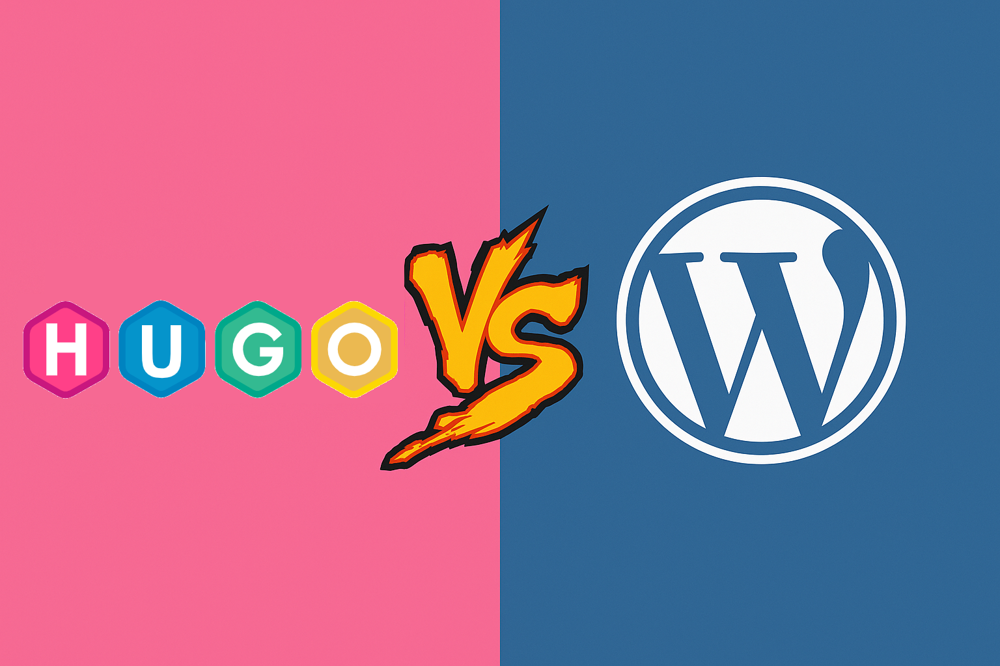

The fundamental goal of [Datalaria](https://datalaria.com/en/) is to experiment with and explore different topics, tools, and technologies. After a few initial posts that were more theoretical and educational to lay the groundwork for future analysis and experiments, now is a good time to discuss the inner workings of this first project: the blog itself. Let's examine the technology behind it and the reasons for choosing it over what many might expect to hear: "WordPress."

This post is a personal journey through the technical decision-making process that led me to build Datalaria with a modern stack: **Hugo**, **GitHub**, and **Netlify**. The goal isn't to demonize other platforms, but to explain why this combination was the perfect fit for this project's objectives, which are based on experimentation and exploration.

## Defining the Objectives

Based on the main interests I mentioned in my [welcome post](https://datalaria.com/en/posts/about/), namely experimentation and **long-term learning**, I defined the core pillars of this project:

1.  **Learning and Control (Priority #1)**: I wanted a system that would force me to understand how things work under the hood, use version control (Git), and become familiar with continuous integration/continuous deployment (CI/CD) workflows.
2.  **Performance**: The website had to be very fast, with minimal loading times for a better user experience and SEO.
3.  **Security**: I wanted to minimize potential attack vectors and not have to worry about constant security updates for plugins or themes.
4.  **Low Initial Cost and Scalability**: The project is not commercial, so maintenance costs needed to be close to zero, but with the ability to scale if traffic increased or new features were integrated.

With these criteria in mind, I evaluated the two main philosophies for web development.

---

## The Traditional Path: Why Not WordPress?

[WordPress](https://wordpress.com/) is the undisputed king of content management, powering over 40% of the entire web. It's a powerful, flexible tool with a massive ecosystem.

Its architecture is **dynamic**. This means that every time you visit a page, the server executes PHP code, queries a MySQL database to get the content, assembles the page into an HTML template, and sends it to you.

### Disadvantages for My Objectives

Despite its strengths, WordPress had several drawbacks for Datalaria's goals:

* **Different Learning Curve**: Learning WordPress is largely about learning its interface and plugin ecosystem. It's about learning the tool itself. It doesn't natively expose you to web design processes, nor to tools like Git, the command line, or modern build processes.
* **Performance**: The dynamic nature, with its database calls, introduces unavoidable latency. While this can be mitigated with complex caching systems, the foundation is inherently slower than serving a static file.
* **Security**: Being so popular and dependent on a database and server-side code, it's a constant target for attacks. It requires proactive maintenance: updating the core, themes, and plugins is an ongoing task.
* **Cost**: You need a hosting provider that supports PHP and MySQL, which is usually more expensive than simple static file hosting.

WordPress is a fantastic solution for non-technical users, for sites with complex functionalities (e-commerce, forums), or for those who want to quickly deploy a solution focused on content rather than on the underlying web development. However, WordPress didn't align with my main objective of deep technical learning and understanding what goes on behind the scenes.

---

## The Modern Path: Jamstack to the Rescue

And then came [Jamstack](https://jamstack.org/) (JavaScript, APIs, and Markup), an architecture that decouples the frontend from the backend.

The idea is revolutionary in its simplicity: instead of building the page every time a user requests it, **you build it once** during deployment. The result is a set of pre-generated HTML, CSS, and JavaScript files—in other words, a **static** site. These files are then distributed through a global Content Delivery Network (CDN).

### Advantages for My Objectives

This philosophy was a perfect match for my goals:

* **Performance**: Serving an HTML file from a CDN is the fastest way to deliver a webpage. The results in tools like [PageSpeed Insights](https://pagespeed.web.dev/) are spectacular.
* **Security**: With no database or server-side code running at runtime, the attack surface is drastically reduced.
* **Scalability and Almost Zero Cost**: CDNs are designed to handle massive traffic spikes effortlessly. Services like [Netlify](https://app.netlify.com/) or [Vercel](https://vercel.com/) offer incredibly generous free tiers for personal projects.
* **Developer Experience and Learning**: The key point! This approach *forces* you to use the tools I wanted to learn. Content is written in [Markdown](https://www.markdownguide.org/), versioned with [Git](https://git-scm.com/), and every `git push` triggers an automated process that builds and deploys the site. It's the workflow of a modern software developer applied to content creation.

---

## My Stack: Hugo + GitHub + Netlify

Once I decided on the Jamstack approach, I just had to choose the tools:

* **[Hugo](https://gohugo.io/) (The Static Site Generator - SSG)**: This is the brain. It takes my content files in Markdown, combines them with HTML templates, and generates the final static site. I chose Hugo for its speed (it's written in Go and can generate thousands of pages in seconds) and its power.
* **[GitHub](https://github.com/) (The Repository and Version Control)**: This is the "source of truth." All of Datalaria's code and content live in a GitHub repository. This gives me a complete history of changes and a central place to manage the project.
* **[Netlify](https://app.netlify.com/) (The Hosting and Continuous Deployment - CI/CD)**: This is the magic. Netlify is connected to my GitHub repository. When I `git push` to the main branch, Netlify automatically detects it, runs the Hugo command to build the site, and if everything goes well, publishes the new version to its global CDN in seconds.

## Conclusion

Choosing between WordPress and a Jamstack stack isn't about "better" or "worse," but about **aligning the tool with the objective**. If I had different goals, like quickly launching an e-commerce site, I probably would have used WordPress.

But for Datalaria, a project born out of curiosity and a desire to learn, the Jamstack path with Hugo, GitHub, and Netlify was the ideal choice. It has offered me control, performance, and most importantly, it has turned the very act of maintaining the blog into a valuable, continuous learning experience.

---

#### Sources and Further Reading:

* **Jamstack.org**: The official site for understanding the Jamstack philosophy. [https://jamstack.org/](https://jamstack.org/)
* **Hugo Documentation**: To learn about the static site generator. [https://gohugo.io/](https://gohugo.io/)
* **Netlify**: Discover how the deployment platform works. [https://www.netlify.com/](https://www.netlify.com/)
* **Smashing Magazine - A Look At The Modern WordPress Stack**: An interesting article for a balanced view on how WordPress can be modernized. [https://www.smashingmagazine.com/2022/07/modern-wordpress-stack/](https://www.smashingmagazine.com/2022/07/modern-wordpress-stack/)