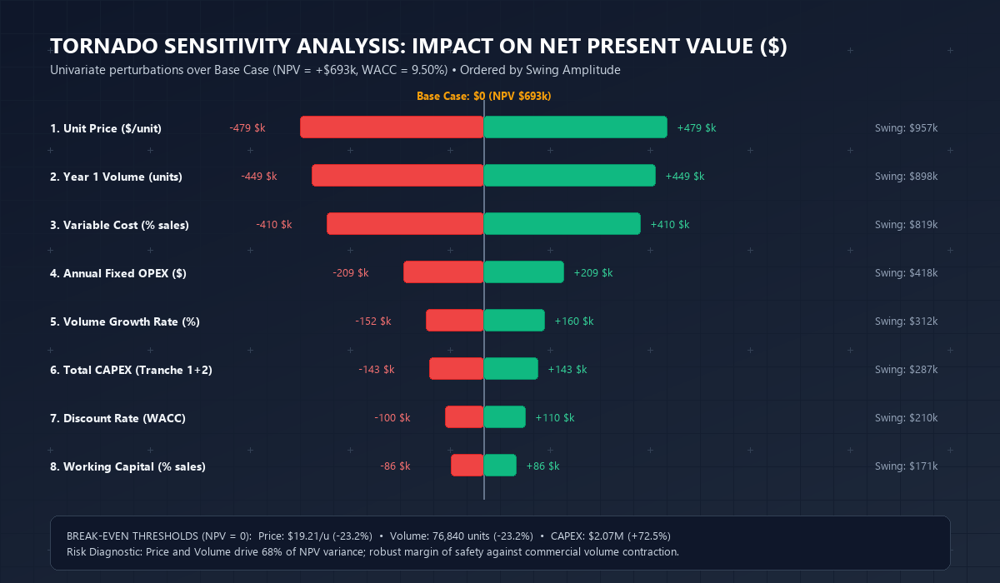

In virtually every corporate board meeting, executive committee, or capital allocation session where a Chief Operating Officer (COO), Chief Technology Officer (CTO), or Business Unit Leader pitches a significant capital expenditure (CAPEX), the same critical pathology unfolds: **the last-mile trap of the Business Case**.

An organization spends months vetting equipment suppliers, drafting engineering specifications spanning hundreds of pages, and negotiating contracts to the penny. Yet, when the proposal arrives at the desks of the Chief Executive Officer (CEO) and Chief Financial Officer (CFO), the financial justification collapses into a handcrafted, improvised spreadsheet. That model frequently conflates accounting profit with cash generation, ignores net working capital requirements, applies an arbitrary discount rate (or simply the commercial loan interest rate), and presumes linear, friction-free revenue scaling.

The strategic and financial fallout of this analytical gap is devastating:
1. **Conflating Accounting Margin with Free Cash Flow:** Teams confuse EBIT or EBITDA with liquidity in the bank account, ignoring the phased timing of cash disbursements and the interest tax shield.
2. **The Working Capital Cash Trap:** Aggressive revenue expansion consumes cash. Increased accounts receivable and elevated safety inventories absorb liquidity. Omitting the change in net working capital ($\Delta\text{NWC}$) blinds management to severe cash crunches during commercial ramp-up.
3. **Optimism Bias and the Planning Fallacy (Kahneman & Lovallo; Flyvbjerg):** As demonstrated by Nobel Laureate Daniel Kahneman and Oxford professor Bent Flyvbjerg in empirical megaproject research, over 80% of business plans suffer cost overruns exceeding 25% and capture less than 60% of projected revenues when reference class forecasting is absent.
4. **The Seductive Trap of the Internal Rate of Return (IRR):** The IRR remains the executive suite's favorite metric due to its intuitive percentage format. However, it conceals two fatal mathematical flaws: it implicitly presumes that intermediate cash flows are reinvested at the project's own IRR, and it fails to measure the absolute scale of economic wealth created.

To eliminate these vulnerabilities and elevate capital allocation to the standard of elite strategy consultancies and investment banks (McKinsey Corporate Finance Practice, BCG Corporate Development, Goldman Sachs), this official Datalaria methodology formalizes the full architecture of an **Institutional Financial Business Case**: rigorous Discounted Free Cash Flow (DCF) modeling, WACC estimation via the Capital Asset Pricing Model (CAPM), 3-year and 5-year Net Present Value (NPV), IRR and Modified IRR (MIRR), linearly interpolated Discounted Payback, Profitability Index (PI), one-way sensitivity modeling via the Tornado Chart, and capital governance anchored in tranched *stage gates* and binding *kill criteria*.

---

## 1. The Institutional Business Case Decision Pipeline

Formulating an investment business case for Board-level capital authorization is not a detached spreadsheet exercise; it is a **sequential, binding decision pipeline** that connects operational shop-floor and market realities with the corporate cost of capital and Board oversight:


flowchart TD
    A["<b>1. Operational Drivers & WACC (CAPM)</b> <small>Cost of equity (Ke), net debt (Kd·(1-t)) Volume, pricing, variable costs, and fixed OPEX</small>"]
    
    B["<b>2. Income Statement Projection (P&L)</b> <small>Gross revenue • Gross Margin • EBITDA Straight-line depreciation • EBIT • Corporate taxes</small>"]
    
    C["<b>3. Free Cash Flow to Firm (FCFF) Modeling</b> <small>FCF = NOPAT + D&A − CAPEX − ΔNWC Phased disbursement calendar</small>"]
    
    D["<b>4. Core Return & Liquidity Metrics</b> <small>3-Yr & 5-Yr NPV • IRR • Modified IRR (MIRR) Interpolated Discounted Payback • Peak Funding</small>"]
    
    E["<b>5. Risk Profiling & Tornado Sensitivity</b> <small>One-way perturbations • Swing ranking Linear break-even thresholds • 3 Scenario states</small>"]
    
    F["<b>6. Phased Investment Plan, Stage Gates & Kill Criteria</b> <small>Tranched capital release tied to OEE & SAT Pre-committed stop-loss liquidation rules</small>"]
    
    G["<b>7. Board Decision Gateway</b> <small>Formal Investment Committee resolution C-Level sign-offs: CEO, CFO, Chair, and COO</small>"]

    A --> B
    B --> C
    C --> D
    D --> E
    E --> F
    F --> G

    style A fill:#F8FAFC,stroke:#64748B,stroke-width:1.5px,color:#0F172A
    style B fill:#EFF6FF,stroke:#3B82F6,stroke-width:1.5px,color:#1E3A8A
    style C fill:#F0FDF4,stroke:#10B981,stroke-width:2px,color:#065F46
    style D fill:#EFF6FF,stroke:#2563EB,stroke-width:2px,color:#1E40AF
    style E fill:#FEF3C7,stroke:#F59E0B,stroke-width:2px,color:#92400E
    style F fill:#FEF2F2,stroke:#EF4444,stroke-width:2px,color:#991B1B
    style G fill:#D1FAE5,stroke:#10B981,stroke-width:2.5px,color:#065F46


---

## 2. Mathematical Foundations: Free Cash Flow, WACC, and Return Metrics

To withstand the scrutiny of independent directors, external auditors, and corporate finance controllers, every line item in the model must be grounded in canonical corporate finance theory.

### 2.1. Formal Definition of Free Cash Flow to Firm (FCFF)

Free Cash Flow to Firm ($\text{FCFF}_t$ or $\text{FCF}_t$) represents the unencumbered cash generated by core operations available for distribution to all capital providers (debt holders and equity investors), after fulfilling all operating obligations, taxes, and necessary capital investments in fixed assets and working capital.

For each period $t \in \{0, 1, \dots, n\}$:

$$\text{FCF}_t = \text{EBIT}_t \cdot (1 - t) + \text{D\&A}_t - \text{CAPEX}_t - \Delta\text{NWC}_t$$

Where:
* **$\text{EBIT}_t$ (Operating Profit):** $\text{Revenues}_t - \text{Variable Costs}_t - \text{Fixed OPEX}_t - \text{D\&A}_t$.
* **$t$ (Effective Corporate Tax Rate):** Statutory corporate income tax rate (standard: 25.0%).
* **$\text{NOPAT}_t = \text{EBIT}_t \cdot (1 - t)$:** Net Operating Profit After Tax. Measures unlevered operating earnings as if the company had zero debt (the financial tax shield is captured within the discount rate).
* **$\text{D\&A}_t$ (Depreciation & Amortization):** Non-cash accounting expense that shields operating income from taxes. Added back because it entails no cash outflow.
* **$\text{CAPEX}_t$ (Capital Expenditures):** Cash disbursements for property, plant, equipment, automation hardware, and software capitalization.
* **$\Delta\text{NWC}_t$ (Change in Non-Cash Working Capital):** Incremental investment in operational liquidity:
  $$\text{NWC}_t = \text{Accounts Receivable}_t + \text{Inventory}_t - \text{Accounts Payable}_t \approx \text{Revenues}_t \cdot \% \text{NWC}$$
  $$\Delta\text{NWC}_t = \text{NWC}_t - \text{NWC}_{t-1}$$

### 2.2. Weighted Average Cost of Capital (WACC) via CAPM

The hurdle rate used to discount enterprise cash flows is not an arbitrary management target; it represents the **opportunity cost of capital** required to compensate debt holders and equity shareholders for systematic project risk:

$$\text{WACC} = \frac{E}{V} \cdot K_e + \frac{D}{V} \cdot K_d \cdot (1 - t)$$

Where:
* $E/V$: Equity weighting as a percentage of total enterprise value ($E/(D+E)$).
* $D/V$: Debt weighting as a percentage of total enterprise value ($D/(D+E)$).
* $K_d$: Pre-tax cost of debt (weighted average bank borrowing rate).
* $K_d \cdot (1 - t)$: After-tax cost of debt reflecting the interest tax shield.
* $K_e$: Cost of equity estimated via the **Capital Asset Pricing Model (CAPM)**:

$$K_e = R_f + \beta \cdot \text{ERP} + \text{Premiums}$$

* $R_f$ (Risk-Free Rate): 10-year sovereign bond yield (benchmark: 3.50%).
* $\beta$ (Levered Beta): Systematic equity risk exposure for the industrial manufacturing sector (Damodaran benchmark: 1.20x).
* $\text{ERP}$ (Equity Risk Premium): Expected market return over sovereign debt (benchmark: 5.50%).
* $\text{Premiums}$: Size and illiquidity risk adjustments for mid-market capitalization (benchmark: 1.40%).

In our institutional Base Case calibration:
$$K_e = 3.50\% + 1.20 \cdot 5.50\% + 1.40\% = 11.50\%$$
$$K_d \cdot (1 - t) = 4.667\% \cdot (1 - 0.25) = 3.50\%$$
$$\text{WACC} = 0.75 \cdot 11.50\% + 0.25 \cdot 3.50\% = 8.625\% + 0.875\% = \mathbf{9.50\%}$$

### 2.3. Net Present Value (NPV) and the Value Additivity Principle

Net Present Value quantifies the absolute economic wealth generated by the project today in excess of the cost of capital:

$$\text{NPV} = \sum_{t=0}^{n} \frac{\text{FCF}_t}{(1 + \text{WACC})^t} + \frac{\text{TV}}{(1 + \text{WACC})^n}$$

Where $\text{TV}$ denotes the optional perpetual Terminal Value modeled via the Gordon-Shapiro constant growth model:

$$\text{TV} = \frac{\text{FCF}_n \cdot (1 + g)}{\text{WACC} - g} \quad \text{subject to } \text{WACC} > g$$

> **Canonical Board Decision Rule:**
> * If $\text{NPV} > 0$: The initiative creates net economic value for shareholders. **APPROVE**.
> * If $\text{NPV} = 0$: The initiative yields exactly the return required by the cost of capital. Indifferent.
> * If $\text{NPV} < 0$: The initiative destroys corporate capital. **REJECT**.

### 2.4. The Critical Year 0 Excel NPV Function Trap

One of the most pervasive technical modeling errors in corporate spreadsheets occurs when using the native `=NPV(rate, value1, [value2], ...)` function in Microsoft Excel or Google Sheets.

By architectural design in the OpenXML/Excel engine, the `NPV` function discounts the **very first value in the supplied range** back by one full period as if it occurred at the end of Year 1 (discounted by $(1+r)^1$). If an analyst passes Year 0 cash disbursements inside the argument range (`=NPV(WACC, FCF0:FCF5)`), Excel erroneously discounts the initial investment, artificially inflating the reported NPV.

The mandatory institutional formula is:
$$\text{Correct Excel Syntax:} \quad = \text{FCF}_0 + \text{NPV}(\text{WACC}, \text{FCF}_1:\text{FCF}_5)$$

### 2.5. IRR vs. Modified IRR (MIRR) and Interpolated Discounted Payback

* **Internal Rate of Return (IRR):** The intrinsic discount rate $r$ that forces the project's NPV to zero:
  $$\sum_{t=0}^n \frac{\text{FCF}_t}{(1 + \text{IRR})^t} = 0$$
* **Modified Internal Rate of Return (MIRR):** Resolves the IRR reinvestment fallacy by assuming positive intermediate cash flows are reinvested at the corporate hurdle rate ($r = \text{WACC}$), while initial capital draws are financed at the borrowing cost:
  $$\text{MIRR} = \left( \frac{\sum_{t=1}^n \text{FCF}_t^+ \cdot (1 + r)^{n-t}}{|\text{FCF}_0 + \sum_{t=1}^n \text{FCF}_t^- \cdot (1 + \text{WACC})^{-t}|} \right)^{1/n} - 1$$
* **Discounted Payback with Linear Interpolation:** Pinpoints the fractional year in which the cumulative present value crosses from negative to positive territory:
  $$\text{Discounted Payback} = (t - 1) + \frac{|\text{Cumulative PV}_{t-1}|}{\text{PV of FCF}_t}$$
* **Profitability Index (PI):** Measures capital efficiency per unit of discounted capital deployed:
  $$\text{PI} = \frac{\sum_{t=1}^n \frac{\text{FCF}_t^+}{(1 + \text{WACC})^t}}{\left| \text{FCF}_0 + \sum_{t=1}^n \frac{\text{FCF}_t^-}{(1 + \text{WACC})^t} \right|}$$

---

## 3. Comparative Metric Matrix: What Each Metric Solves and Its Pitfalls

| Financial Metric | Core Executive Question Answered | Primary Analytical Strength | Critical Pitfall or Vulnerability | Datalaria Governance Standard |
| :--- | :--- | :--- | :--- | :--- |
| **NPV** | How much net enterprise wealth in currency does this create today? | Measures absolute wealth creation and respects the time value of money. | Requires disciplined, objective estimation of the WACC hurdle rate. | **Primary Decision Metric (Binding)** |
| **IRR** | What percentage rate of return does the capital generate? | Highly intuitive for comparisons against lending rates and benchmark returns. | Flawed reinvestment assumption; scale insensitivity; multiple IRR roots. | **Secondary Hurdle ($\ge \text{WACC} + 3\text{ pp}$)** |
| **Modified IRR (MIRR)** | What is the true rate of return assuming reinvestment at WACC? | Neutralizes the aggressive mathematical reinvestment bias of standard IRR. | Less widely understood by non-financial executive stakeholders. | **Consistency & Robustness Check** |
| **Discounted Payback** | In how many years does the firm recoup its capital at WACC? | Quantifies liquidity exposure and downside duration risk. | Blind to all cash generation occurring beyond the cutoff threshold. | **Liquidity Safeguard ($< 4.0\text{ years}$)** |
| **Profitability Index (PI)** | How much present value is created per unit of capital invested? | Superior framework for capital rationing and ranking mutually exclusive options. | Ignores the absolute scale of total wealth generated. | **Capital Efficiency Filter ($\text{PI} > 1.2\text{x}$)** |
| **Peak Funding** | What is the maximum cash and credit line exposure required? | Dictates liquidity reserves and corporate banking facility sizes. | Static balance sheet exposure metric; does not evaluate return. | **Treasury Facility Upper Bound** |

---

## 4. Risk Analysis: Tornado Chart and Break-Even Thresholds

A Business Case that presents only a single deterministic Base Case lacks credibility in the boardroom. Executive directors do not demand prophetic accuracy; they demand to understand **where risk is concentrated and what margin of safety exists before the project fails**.

### 4.1. Tornado Sensitivity Methodology

The Tornado Chart stress-tests the financial model through standardized one-way sensitivity tests. Holding all other drivers constant at their Base Case levels, each operational variable is perturbed to its Low and High bounds (typically $\pm 15\%$ on commercial drivers, $\pm 5\text{ pp}$ on operating cost ratios, and $\pm 2\text{ pp}$ on WACC).

The resulting amplitude or *swing* for each driver is calculated as:
$$\text{Swing}_i = |\text{NPV}_i^{\text{High}} - \text{NPV}_i^{\text{Low}}|$$

Drivers are sorted in descending order of swing, creating the funnel silhouette that defines the Tornado Chart:

### 4.2. Linear Break-Even Points

One-way sensitivity analysis reveals the exact operational safety buffers where $\text{NPV} = 0$:
1. **Break-Even Unit Price (19.21 €/u):** The initiative withstands commercial price compression of up to **-23.2%** before crossing into value-destructive territory.
2. **Break-Even Sales Volume (76,840 units):** Production can absorb a demand contraction of **-23.2%** below the baseline target of 100,000 units in Year 1.
3. **Maximum Allowable CAPEX Overrun (2,070,561 €):** Initial engineering and installation costs can experience an overrun of up to **+72.5%** (+870 k€ in unforeseen outlays) while still preserving a positive NPV.

---

## 5. The Investment Committee Hurdle Policy Gateway

To eliminate subjective politicking and executive hierarchy bias (*HiPPO syndrome*), the model applies an algorithmic decision rule based on corporate hurdle policy:


flowchart TD
    A{"<b>5-Year NPV > 0?</b>"}
    
    B{"<b>IRR ≥ WACC + 3 pp?</b> <small>IRR ≥ 12.50%</small>"}
    C["<b>⛔ REJECT</b> <small>Project destroys net shareholder wealth. Capital destroyed.</small>"]
    
    D{"<b>Discounted Payback ≤ 4.0 yrs?</b>"}
    E["<b>🟠 REVIEW</b> <small>Positive NPV but return margin thin. Restructure CAPEX or cost structure.</small>"]
    
    F["<b>✅ APPROVE</b> <small>Simultaneously satisfies value, return, and liquidity. Release Tranche 1.</small>"]
    G["<b>🟠 REVIEW</b> <small>Excessively long capital recovery. Unacceptable liquidity risk.</small>"]

    A -->|Yes| B
    A -->|No| C
    B -->|Yes| D
    B -->|No| E
    D -->|Yes| F
    D -->|No| G

    style A fill:#0F172A,stroke:#2563EB,stroke-width:2px,color:#FFFFFF
    style B fill:#0F172A,stroke:#2563EB,stroke-width:2px,color:#FFFFFF
    style C fill:#FEE2E2,stroke:#EF4444,stroke-width:2px,color:#991B1B
    style D fill:#0F172A,stroke:#2563EB,stroke-width:2px,color:#FFFFFF
    style E fill:#FEF3C7,stroke:#F59E0B,stroke-width:2px,color:#92400E
    style F fill:#D1FAE5,stroke:#10B981,stroke-width:2.5px,color:#065F46
    style G fill:#FEF3C7,stroke:#F59E0B,stroke-width:2px,color:#92400E


---

## 6. Solved Case Study: Manufacturing Production Line Automation & Digitalization

To illustrate the end-to-end framework, we model a representative industrial automation project for a mid-market manufacturing plant:
* **Initial Capital Investment (CAPEX):** 1,200,000 € across two tranches (850,000 € in Year 0; 350,000 € in Year 1).
* **Horizon:** 5 operational years.
* **WACC:** 9.50% (Equity: 75% at Ke = 11.50%; Debt: 25% at after-tax Kd = 3.50%).

### 6.1. Operating Projection and Free Cash Flow (Years 0 to 5)

| Financial Line Item (k€) | Year 0 | Year 1 | Year 2 | Year 3 | Year 4 | Year 5 |
| :--- | :---: | :---: | :---: | :---: | :---: | :---: |
| **Sales Volume (units)** | 0 | 100,000 | 105,000 | 110,250 | 115,763 | 121,551 |
| **Unit Selling Price (€/u)** | 0.00 | 25.00 | 25.50 | 26.01 | 26.53 | 27.06 |
| **Gross Revenues** | **-** | **2,500.0** | **2,677.5** | **2,867.6** | **3,071.2** | **3,289.2** |
| (-) Variable Costs (60%) | - | -1,500.0 | -1,606.5 | -1,720.6 | -1,842.7 | -1,973.5 |
| (-) Fixed Annual OPEX | - | -450.0 | -459.0 | -468.2 | -477.5 | -487.1 |
| **EBITDA** | **-** | **550.0** | **612.0** | **678.9** | **750.9** | **828.6** |
| (-) Linear D&A (5 yrs) | - | -170.0 | -240.0 | -240.0 | -240.0 | -240.0 |
| **EBIT** | **-** | **380.0** | **372.0** | **438.9** | **510.9** | **588.6** |
| (-) Corporate Taxes on EBIT (25%) | - | -95.0 | -93.0 | -109.7 | -127.7 | -147.2 |
| **NOPAT** | **-** | **285.0** | **279.0** | **329.1** | **383.2** | **441.5** |
| (+) D&A (Non-cash addback) | - | +170.0 | +240.0 | +240.0 | +240.0 | +240.0 |
| (-) Tranched CAPEX | -850.0 | -350.0 | 0.0 | 0.0 | 0.0 | 0.0 |
| (-) Working Capital Change (10% Sales) | - | -250.0 | -17.8 | -19.0 | -20.4 | -21.8 |
| **FREE CASH FLOW (FCFF)** | **-850.0** | **-145.0** | **+501.3** | **+550.1** | **+602.8** | **+659.7** |
| Cumulative Nominal FCF | -850.0 | -995.0 | -493.8 | +56.4 | +659.2 | +1,318.9 |
| **Cumulative Discounted PV (J-Curve)** | **-850.0** | **-982.4** | **-564.4** | **-145.4** | **+274.0** | **+693.0** |

### 6.2. Executive Financial Diagnostic

1. **Substantial Wealth Creation:** The project yields a **5-year Net Present Value of +692,991 €**, delivering nearly 700 k€ in net discounted economic value over and above the 9.50% cost of capital.
2. **Robust Return Spread:** The project's **IRR stands at 28.89%**, outperforming the 9.50% WACC by **+19.39 percentage points** (far exceeding the +3.0 pp policy requirement). The **Modified IRR (MIRR) reaches 21.84%**, validating exceptional profitability under the realistic assumption of reinvestment at the cost of capital.
3. **Favorable Capital Recovery:** The **simple payback period is 2.90 years**, while the **discounted payback period is 3.35 years** (full discounted capital recovery occurs comfortably before the 4.0-year policy ceiling).
4. **Controlled Liquidity Exposure:** The project experiences its maximum cash drain (**Peak Funding**) in Year 1 at **-995,000 €**, which is fully accommodated within the designated credit facility.

---

## 7. Boardroom Defense Protocol (C-Level FAQ)

When sponsoring executives defend the Business Case before the CFO and Board Investment Committee, these six governance challenges consistently arise:

### 1. Where does the 9.50% WACC come from, and why can't we just use our bank lending rate?
*Model Answer:* The commercial debt interest rate ($K_d \approx 4.67\%$, yielding an after-tax cost of 3.50%) compensates only senior lenders who hold asset-backed guarantees. Equity investors provide 75% of capital and demand a return commensurate with industrial operating risk ($K_e = 11.50\%$ based on CAPM with a 1.20x manufacturing beta and size risk adjustments). Using the bank borrowing rate as a hurdle rate would cause the Board to greenlight projects that destroy shareholder capital.

### 2. Why prioritize NPV over IRR if IRR is far more intuitive to our operational leaders?
*Model Answer:* The IRR harbors two dangerous mathematical flaws: first, it presumes intermediate cash flows are reinvested at the project's own 28.89% return, an assumption contradicted by real-world treasury deployment; NPV presumes reinvestment at the actual corporate WACC (9.50%), as confirmed by the MIRR (21.84%). Second, IRR is blind to scale: an immaterial 50 k€ project with a 40% IRR generates far less economic wealth than a 1.2 M€ project with a 28.9% IRR.

### 3. What happens if commercial sales volume drops by 20% against plan?
*Model Answer:* Our Tornado sensitivity analysis and linear break-even calculations show the project can absorb up to a -23.2% drop in volume and up to a -23.2% drop in unit price before NPV turns negative. A 20% sales volume contraction compresses NPV from 693 k€ to approximately 95 k€, meaning the initiative remains profitable, cash-generative, and solvent.

### 4. What is our maximum downside capital loss if the implementation fails completely?
*Model Answer:* Peak exposure is bounded at 995,000 € (Peak Funding). By structuring the investment into two conditional tranches governed by binding Kill Criteria, if at month 9 the project fails to achieve 75% of scheduled throughput or engineering overruns exceed 15%, Tranche 2 (350,000 €) is automatically cancelled, capping total capital exposure at 850,000 €.

### 5. Why deduct working capital from cash flows if customers will eventually pay their invoices?
*Model Answer:* Because uncollected accounts receivable and warehouse inventories tie up real balance sheet liquidity. Every 1.0 M€ in incremental top-line revenue locks up 100,000 € of cash in working capital. Omitting $\Delta\text{NWC}$ would induce severe cash rationing and liquidity crises during commercial expansion.

### 6. How can the Board be confident these projections aren't inflated by optimism bias?
*Model Answer:* Through three institutional safeguards: 1) A documented Assumption Register backed by binding equipment vendor quotes; 2) Reference class forecasting against comparable manufacturing automation benchmarks; and 3) A mandatory 12-month Post-Investment Review (PIR) tied directly to the executive project sponsor's compensation scorecard.

---

## 8. Official Executive Decision Pack: Financial Business Case (NPV, IRR, Payback)

For Chief Financial Officers (CFO), Chief Executive Officers (CEO), Corporate Development leaders, and management consultants who need to deploy this quantitative framework with immediate production quality and Board-level rigor, we have released the complete official Suite 02 package:

{{< product-card
  title="Financial Business Case (NPV, IRR, Payback)"
  category="Finance & Investment"
  price="8€"
  original_price="25€"
  badge="📈 CFO Standard"
  icon="📈"
  deliverables="Excel .xlsx + Sheets|PowerPoint .pptx 16:9 C-Level|Methodology Guide PDF"
  features="Discounted free cash flow model over 3 and 5-year horizons|Automated calculation of NPV, IRR, MIRR, and interpolated Discounted Payback|CAPM-based WACC calculator, 3 scenario states, and probability-weighted expected NPV|One-way sensitivity analysis and dynamic Tornado chart for risk profiling|16:9 C-Level executive presentation structured under the Minto Pyramid|Instant direct download (.ZIP with ES and EN versions)"
  checkout_url="https://datalaria.lemonsqueezy.com/buy/business-case-financiero"
  button_text="Download Full Pack (.ZIP) • 8€"
>}}
The downloadable archive includes the institutional analytical workbooks in **Excel (.xlsx)** across 6 interconnected worksheets with ECMA-376 standard protection (formulas protected under password provided in the instructions, and white input cells 100% editable), the executive presentation in **PowerPoint (.pptx 16:9 widescreen)** under the Minto Pyramid with native editable Tornado charts and the Board Decision Gateway featuring 4 C-Level sign-offs, the **Official Methodology Guides in PDF** (5 pages) with complete mathematical proofs and Boardroom defense FAQs, and seamless Google Sheets import instructions.


*Legal Disclaimer: This financial model and methodology guide are decision-support tools designed for strategic quantitative modeling and capital allocation analysis. They do not constitute formal investment, legal, or tax advisory services.*

---

## 9. Authoritative Bibliographical References

1. **Brealey, Richard A., Myers, Stewart C., & Allen, Franklin (2020).** *Principles of Corporate Finance*. McGraw-Hill Education, New York (13th Edition).  
   *The seminal corporate finance treatise formalizing the mathematical superiority of NPV over IRR, free cash flow discounting, and project appraisal under uncertainty.* ISBN: `978-1260565553`

2. **Koller, Tim, Goedhart, Marc, & Wessels, David — McKinsey & Company (2020).** *Valuation: Measuring and Managing the Value of Companies*. John Wiley & Sons, Hoboken, NJ (7th Edition).  
   *The gold-standard corporate valuation handbook defining institutional Free Cash Flow to Firm (FCFF), WACC derivation, and value preservation in capital budgeting.* ISBN: `978-1119610885`

3. **Damodaran, Aswath (2012).** *Investment Valuation: Tools and Techniques for Determining the Value of Any Asset*. John Wiley & Sons, Hoboken, NJ (3rd Edition).  
   *Canonical reference work for empirical levered beta estimation, equity risk premiums (ERP), and industry cost of capital calibration.* [Explore data on Damodaran Online](https://pages.stern.nyu.edu/~adamodar/)

4. **Graham, John R., & Harvey, Campbell R. (2001).** *The Theory and Practice of Corporate Finance: Evidence from the Field*. Journal of Financial Economics, 60(2-3), 187-243.  
   *Foundational empirical survey analyzing how Fortune 500 CFOs apply NPV, IRR, and sensitivity analysis in capital expenditure decision-making.* DOI: `10.1016/S0304-405X(01)00044-7`

5. **Lovallo, Dan, & Kahneman, Daniel (2003).** *Delusions of Success: How Optimism Undermines Executives' Decisions*. Harvard Business Review, 81(7), 56-63.  
   *Seminal research on the planning fallacy and cognitive confirmation bias that distort corporate financial projections in strategic initiatives.* [Read at Harvard Business Review](https://hbr.org/2003/07/delusions-of-success-how-optimism-undermines-executives-decisions)

6. **Flyvbjerg, Bent (2006).** *From Nobel Prize to Project Management: Getting Risks Right*. Project Management Journal, 37(3), 5-15.  
   *Reference class forecasting methodology designed to eliminate cost overruns and schedule delays in industrial capital expenditures.* DOI: `10.1177/875697280603700302`

7. **Minto, Barbara (2009).** *The Pyramid Principle: Logic in Writing and Thinking*. Financial Times / Prentice Hall (3rd Edition).  
   *The universal executive communication standard for inductive logic, Action Titles, and persuasive governance synthesis before Corporate Boards.* ISBN: `978-0273710516`
