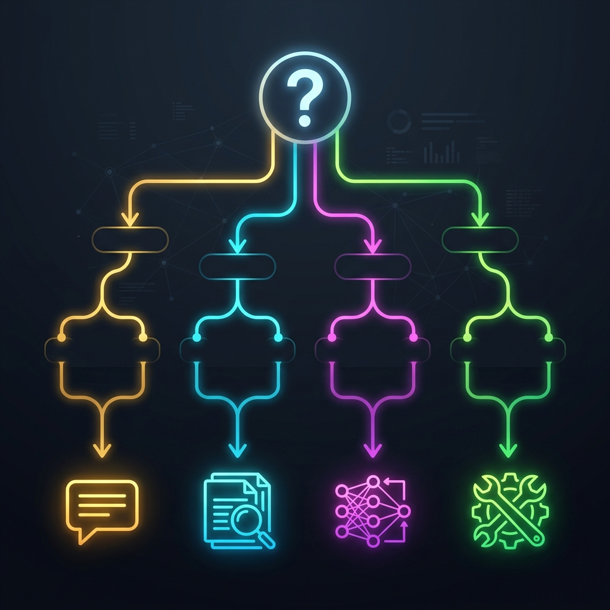

You have an AI model that hallucinates with your company's data. You open a support ticket and ask the chatbot about your returns policy. The chatbot, powered by GPT-4 or Gemini 2.5, responds with a fabricated policy that sounds perfectly plausible but has nothing to do with your company's reality. Your boss stares at you. Your customer complains. You open Google and search **"how to connect LLM to my data"**.

The top 10 results offer three contradictory answers: "use RAG," "do fine-tuning," "improve your prompt." All three are right. All three are wrong. Because the correct answer isn't any of the three in the abstract — it's **the one that fits your specific use case**. And there's a fourth option that almost nobody mentions, and which, in my experience, is the right call in more cases than the industry admits.

This article is the decision tree I wish I'd had when I started building the AI systems behind this blog. I've distilled it after implementing all four techniques in real production: Prompt Engineering across the entire [Autopilot series](/en/posts/ai_agents_part1/), RAG in the [Ops Copilot](/en/posts/ai_agents_part8/) with Algolia, pure Tool Calling in the [Obsolescence Radar](/en/posts/obs_part5_radar_agent/), and experimental fine-tuning in industrial classification pipelines. It closes the trilogy that began with [RAG: 7 Anti-Patterns](/en/posts/rag_antipatterns/) and continued with [MCP Protocol](/en/posts/mcp_protocol/).

### The Question Nobody Asks

Before choosing a technique, ask yourself this: **Does the knowledge your LLM needs change, or is it static?**

If the answer is "it changes frequently" (product documentation, inventory, prices, regulations), you need a technique that accesses data **in real time** without retraining the model. If the answer is "it's static or changes very slowly" (brand tone, formatting rules, domain nomenclature), you can consider techniques that **incorporate that knowledge into the model**.

This distinction is the first node of the decision tree. It seems obvious written this way. Yet most teams I've seen jump straight to whatever technique is trending (RAG in 2024, fine-tuning in 2023, prompt engineering always) without asking this fundamental question.

### Option 1: Prompt Engineering — 80% of Cases

The uncomfortable truth the AI tooling industry doesn't want you to know: **for 80% of use cases, a well-designed prompt is sufficient**. You don't need RAG. You don't need fine-tuning. You need a system prompt that clearly defines the role, context, constraints, and expected output format.

**When it's sufficient**:
- The required knowledge fits in the model's context window (Gemini 2.5 handles up to 1 million tokens; Claude up to 200K).
- The task is generic but needs structure (drafting emails, summarizing documents, classifying text, generating code).
- You don't need updated proprietary data — the model's general knowledge is enough.

**Advanced techniques that make the difference**:
- **Structured system prompts**: Define the role ("You are a senior supply chain engineer"), constraints ("Always respond in technical English"), and output format ("Return a JSON with fields: analysis, recommendation, confidence").
- **Few-shot prompting**: Include 3-5 correct input-output examples in the prompt. In the [Autopilot series](/en/posts/ai_agents_part3/), CrewAI agents use few-shot to maintain style consistency across generated articles.
- **Chain-of-thought (CoT)**: Instruct the model to "think step by step" before giving the final answer. Dramatically improves accuracy in reasoning, calculation, and multi-step analysis tasks.
- **Prompt chaining**: Break complex tasks into sequential subtasks, each with its own optimized prompt. This is exactly what CrewAI does with its agent architecture: each agent has a specialized prompt for its role.

**Cost**: Virtually zero (only API token cost). A well-designed prompt can take hours of iteration, but operational cost is minimal.

**Fatal limitation**: The context window has a limit. If you need the model to "know" about 10,000 documents from your knowledge base, you can't inject them all into the prompt. This is where RAG enters.

### Option 2: RAG — Updatable Proprietary Knowledge

**RAG (Retrieval-Augmented Generation)** is the right answer when you need the LLM to respond about **your proprietary knowledge** and that knowledge **updates frequently**.

**When it's necessary**:
- Product documentation, technical manuals, internal knowledge bases that update weekly or monthly.
- The user can ask unpredictable questions about a broad document corpus (you don't know in advance which fragment the LLM will need).
- You need **citability**: the answer must include the sources it draws from (critical for compliance, as we documented in the [EU AI Act](/en/posts/eu_ai_act/), Article 13 on transparency).

**When NOT to use it**: When data is structured (SQL tables, APIs with defined schemas) or when you need numerical precision. As I extensively documented in [Anti-Pattern 7 of the RAG article](/en/posts/rag_antipatterns/), RAG over structured data generates narrative hallucinations where you need exact figures.

**Correct architecture (summarized)**:
1. **Semantic chunking** (not fixed-length — Anti-Pattern 1)
2. **Evaluated embeddings** with your domain benchmark (Anti-Pattern 2)
3. **Reranking** between retriever and LLM (Anti-Pattern 3)
4. **Generous context** (top-10/15, not top-3 — Anti-Pattern 4)
5. **Evaluation with RAGAS/DeepEval** before production (Anti-Pattern 6)

**Real cost**: Moderate. The vector store (Pinecone, Weaviate, Algolia) has a monthly cost (€0-100 depending on volume), plus embedding cost (low) and generation cost (API tokens). In the [Ops Copilot](/en/posts/ai_agents_part8/), the total RAG cost with Algolia was under **€3/month** for the blog's ~70 posts.

**Real case at Datalaria**: The Ops Engineering Copilot ([Autopilot Part 8](/en/posts/ai_agents_part8/)) uses RAG with Algolia Agent Studio to answer questions about blog content. Posts are indexed as semantic records (one record per section), and the copilot retrieves relevant fragments before generating the response. Works well for semantic search over free text.

### Option 3: Fine-Tuning — The Scalpel, Not the Hammer

**Fine-tuning** is the most powerful technique and the most misused. It involves **partially retraining** a base model (Gemini, Llama, Mistral) with your own data so the model internalizes specific knowledge, style, or behavior.

**When it's essential**:
- You need the model to adopt a **very specific tone or style** consistently (a brand with strict voice & tone, a domain with very particular technical jargon).
- The task is **highly specialized** and generalist models don't solve it well even with advanced prompting (industrial defect classification, proprietary nomenclature entity extraction, specialized medical diagnosis).
- You need to **reduce latency and cost** in production: a fine-tuned smaller model (7B-13B parameters) can match the quality of a large model (70B+) on your specific task, at a fraction of the cost and latency.

**When NOT to use it** (the most widespread myth):
- **Don't use fine-tuning to "teach the model data."** Fine-tuning is not a database. If you need the model to know your product catalog, use RAG. Fine-tuning "burns in" behavioral patterns, not updatable facts.
- **Don't use fine-tuning if your knowledge changes frequently.** Each update requires retraining, which can cost hours and hundreds of euros. RAG is instant: update the document and the retriever finds it immediately.

**Modern tools**:
- **LoRA (Low-Rank Adaptation)**: The standard technique. Instead of retraining the model's billions of parameters, LoRA trains only low-rank matrices "attached" to the model's layers. Reduces training cost by 90%+ and stores the fine-tuned model as a few MB of "adapters."
- **QLoRA**: LoRA applied to a 4-bit quantized model. Enables fine-tuning 70B-parameter models on a single consumer GPU (24GB VRAM). Democratized fine-tuning for startups and teams without GPU clusters.
- **Vertex AI Tuning / OpenAI Fine-Tuning API**: Managed services where you upload your training dataset (instruction-response pairs) and the platform runs the fine-tuning without you managing GPU infrastructure.

**Real cost**: Variable. Fine-tuning with LoRA on a 7B-parameter model with 10,000 examples costs **€5-20** on cloud (Google Cloud, AWS). A 70B model can cost **€50-200** per training session. Plus the cost of preparing the dataset (hours of human work). As we analyzed in [The Hidden Economics of AI](/en/posts/hidden_economics_ai/), fine-tuning's hidden cost isn't compute — it's **training dataset curation**.

### Option 4: Tool Calling / MCP — The One Nobody Mentions

This is the option I discovered by elimination after RAG failed spectacularly on the [Obsolescence Radar](/en/posts/obs_part5_radar_agent/). **Tool Calling** means the LLM doesn't try to "know" the answer; instead, it knows **who to ask** — that is, which tool to execute to get the information with deterministic precision.

**When it's the right option**:
- Data is **structured** (SQL databases, REST APIs, spreadsheets with schemas).
- You need **absolute numerical precision** (financial calculations, inventory metrics, sensor data).
- The operation requires **actions**, not just answers (create a ticket, send an email, run a query, call an external API).
- You want to **standardize connections** between the LLM and tools to avoid vendor lock-in — exactly the problem solved by [MCP (Model Context Protocol)](/en/posts/mcp_protocol/).

**Architecture**: The LLM (Gemini 2.5, Claude) acts as a **semantic orchestrator**: it understands the user's natural language intent, decides which tool(s) to execute, constructs the parameters, executes the tool(s), and interprets results for the user. Tools are deterministic Python functions (decorated with `@tool` in CrewAI) that execute precision operations: SQL queries to Supabase, supplier API calls, linear programming calculations with PuLP.

**Cost**: The lowest of all four options. You only pay for LLM tokens (typically few, since the prompt is short) and tool execution (SQL queries, API calls). In the Obsolescence Radar, the cost per complete execution (analyze a component, traverse the BOM graph, calculate financial impact, generate executive report) was under **€0.02 per query**.

**Real case at Datalaria**: The [Agentic Obsolescence Radar](/en/posts/obs_part5_radar_agent/) uses Tool Calling exclusively. The LLM (Gemini 2.5 via CrewAI) understands the obsolescence alert in natural language, but all data operations — SQL query to the component catalog, BOM graph traversal, P&L calculation, PDF generation — are executed by deterministic Python tools. Result: executive reports in 4 seconds with **0% numerical hallucination**.

### The Decision Matrix

| Criterion | Prompt Engineering | RAG | Fine-Tuning | Tool Calling |
| :--- | :---: | :---: | :---: | :---: |
| **Initial cost** | ⭐ Minimal | ⭐⭐ Low-medium | ⭐⭐⭐ High | ⭐⭐ Low |
| **Operational cost** | ⭐ Low | ⭐⭐ Medium | ⭐ Low (small model) | ⭐ Minimal |
| **Precision (free text)** | ⭐⭐ Medium | ⭐⭐⭐ High | ⭐⭐⭐ Very high | ⭐ N/A |
| **Precision (structured data)** | ⭐ Low | ⭐ Low | ⭐ Low | ⭐⭐⭐ Exact |
| **Data freshness** | ⭐⭐⭐ Instant | ⭐⭐⭐ Instant | ⭐ Requires retraining | ⭐⭐⭐ Real-time |
| **Implementation effort** | ⭐ Hours | ⭐⭐ Days-weeks | ⭐⭐⭐ Weeks-months | ⭐⭐ Days |
| **Maintenance** | ⭐ Minimal | ⭐⭐ Medium | ⭐⭐⭐ High (data drift) | ⭐⭐ Medium |
| **Traceability (EU AI Act)** | ⭐ Difficult | ⭐⭐⭐ High (citable sources) | ⭐ Opaque (black box) | ⭐⭐⭐ Total (deterministic) |
| **Ideal use case** | Generic tasks with clear instructions | Updatable proprietary text knowledge | Specific style/tone, ultra-specialized tasks | Structured data, numerical precision, actions |

### The 3-Question Framework

If the matrix seems dense, I've distilled a 3-question framework that resolves 90% of decisions:

**Question 1: Does the data the LLM needs fit in the prompt?**
- Yes → **Prompt Engineering**. Inject context directly. Simpler, cheaper, faster.
- No → Next question.

**Question 2: Is the data free text or structured?**
- Free text (documentation, manuals, posts) → **RAG**. Semantic retrieval is superior for searching unstructured text.
- Structured (SQL, APIs, tables, calculations) → **Tool Calling**. Deterministic tools that execute exact queries.
- Both → **Hybrid architecture** (RAG for textual context + Tool Calling for structured data, as we proposed in the [RAG article](/en/posts/rag_antipatterns/)).

**Question 3: Do you need a behavior or style the base model can't reproduce even with the best prompt?**
- Yes (unique brand tone, ultra-specific domain jargon, task that generalist models consistently fail) → **Fine-Tuning** on a base model.
- No → Go back to Prompt Engineering and refine your prompt before considering more complex techniques.

### What I Learned Implementing All Four

The most valuable lesson from operating these four techniques in production fits in a single sentence: **always start with the simplest technique that could work**.

The temptation is to jump straight to RAG or fine-tuning because they're more "sophisticated." But sophistication doesn't correlate with effectiveness. In the [Autopilot](/en/posts/ai_agents_part1/), the majority of output quality comes from Prompt Engineering — carefully designed system prompts, few-shot examples, and Chain-of-thought. RAG added marginal value in the Ops Copilot for blog search. Fine-tuning wasn't necessary in any case. And Tool Calling was the transformative technique in the Obsolescence Radar, where RAG had failed.

The evaluation order should always be:
1. **Prompt Engineering** (hours, ~€0)
2. **Tool Calling** if data is structured (days, ~€0)
3. **RAG** if you need access to proprietary text (days-weeks, ~€3-50/month)
4. **Fine-Tuning** only if the previous three consistently fail (weeks, €50-500+)

And in the era of the [EU AI Act](/en/posts/eu_ai_act/), there's a fifth consideration that isn't technical but legal: **traceability**. Article 10 of the regulation requires that training data for high-risk systems be "relevant, representative, and to the extent possible, free of errors and complete." This applies directly to fine-tuning: if you fine-tune a model with biased or incorrect data, and that model makes decisions in a regulated domain, you're exposed to sanctions. RAG and Tool Calling, being transparent in their sources, offer traceability that fine-tuning cannot match.

As we wrote in [The Hidden Economics of AI](/en/posts/hidden_economics_ai/), the 10x Rule applies: if a more complex technique doesn't give you a result **10 times better** than the previous one, it probably doesn't justify its added cost and complexity. Start simple. Measure. Scale only when the data demands it.

---

#### Sources of Interest:
* [**Google Cloud**: Tuning & Fine-tuning with Vertex AI](https://cloud.google.com/vertex-ai/docs/generative-ai/models/tune-models)
* [**Hugging Face**: LoRA — Low-Rank Adaptation of Large Language Models](https://huggingface.co/docs/peft/conceptual_guides/lora)
* [**Pinecone**: RAG vs Fine-Tuning — How to Choose](https://www.pinecone.io/learn/rag-vs-fine-tuning/)
* [**Anthropic**: Prompt Engineering Guide](https://docs.anthropic.com/en/docs/build-with-claude/prompt-engineering)
* [**Datalaria**: RAG in Production — 7 Anti-Patterns That Destroy Precision](/en/posts/rag_antipatterns/)
* [**Datalaria**: MCP Protocol — The USB of AI (Standardized Tool Calling)](/en/posts/mcp_protocol/)
* [**Datalaria**: The Agentic Radar — Tool Calling in Production](/en/posts/obs_part5_radar_agent/)
* [**Datalaria**: The Hidden Economics of AI — Real Costs of Each Technique](/en/posts/hidden_economics_ai/)
* [**Datalaria**: EU AI Act — Article 10 and Training Data](/en/posts/eu_ai_act/)
