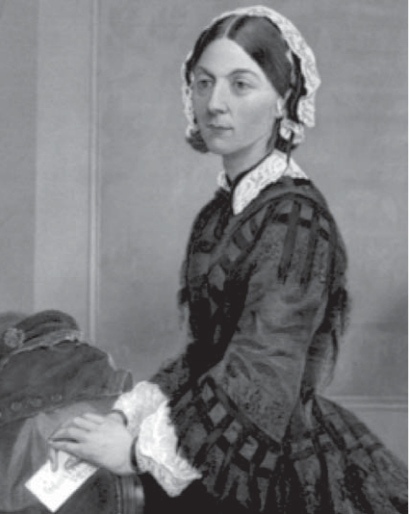

We continue our series on data analysis success stories to talk about Florence Nightingale (May 12, 1820 – August 13, 1910), a revolutionary figure. A British nurse, writer, and statistician, she is considered the **mother of modern nursing** and, as we will see, **one of the first and most influential data scientists**.

Her case is particularly relevant because, in addition to fighting for women's emancipation by opening up new qualified professional paths, she stood out in the field of nursing for being the pioneer of modern professional nursing through the creation of the **first conceptual model**.

To develop this model, Florence applied her statistical and mathematical knowledge, as well as all the data and information related to nursing care that she gathered during a learning period in which she visited different hospitals, prisons, asylums, and orphanages in France, Germany, Italy, Switzerland, Ireland, and England.

The success of this new professionalized nursing model was validated by its study and application to the **high mortality rate of the wounded in the Crimean War**, which had broken out in 1853 following Russia's ambitions to occupy the Danubian territories.

Mortality rates within the British army were high, not as a result of the war itself, but due to the chaotic healthcare system that governed them. The field hospitals barely had any resources, and the filth was indescribable.

Faced with this situation, the British Government decided to send Florence Nightingale to completely reform the army's sanitary administration. Upon her arrival, Florence began the arduous task of collecting and gathering data with the aim of analyzing the existing health conditions and presenting her findings to Parliament. To do this, she created a chart, known as the **polar area diagram or rose diagram**, which made it easier to visualize and interpret all the collected data. It starkly highlighted that the mortality rate in English hospitals was higher than on the battlefield itself.

With this data, she convinced Parliament of the need to improve sanitary conditions in hospitals. As a result, Florence revolutionized aspects such as patient care, hygiene, and nutrition.

After the war, she returned to London and focused on the civilian sector, where she wrote a textbook with her knowledge and founded a nursing school to train these professionals. Among her contributions, it is also worth highlighting the **formulation of a model for Hospital Statistics** so that hospitals could collect and generate consistent data and statistics.

Therefore, in summary, Florence Nightingale represents a clear case of success and disruption within the healthcare field, thanks to her application of data collection and analysis to achieve greater clarity in its interpretation and, above all, to drive continuous improvement.

#### Sources of Interest
- [CODEM - Official College of Nursing of Madrid](https://www.codem.es/Adjuntos/CODEM/Documentos/Informaciones/Publico/7e040f14-0bea-421f-b327-440fe67f3617/6B276772-CAC4-4790-810D-A61458561AC2/a725b-c56a-45ad-a794-fe9942e52081/a725b57c-c56a-45ad-a794-fe9942e52081.pdf)
- [Master Telefónica in Big Data & Business Analytics](https://www.campusbigdata.com/master-telefonica-en-big-data-y-business-analytics)
- [Did Nightingale’s ‘Rose Diagram’ save millions of lives?](http://www.florence-nightingale-avenging-angel.co.uk/?p=462)