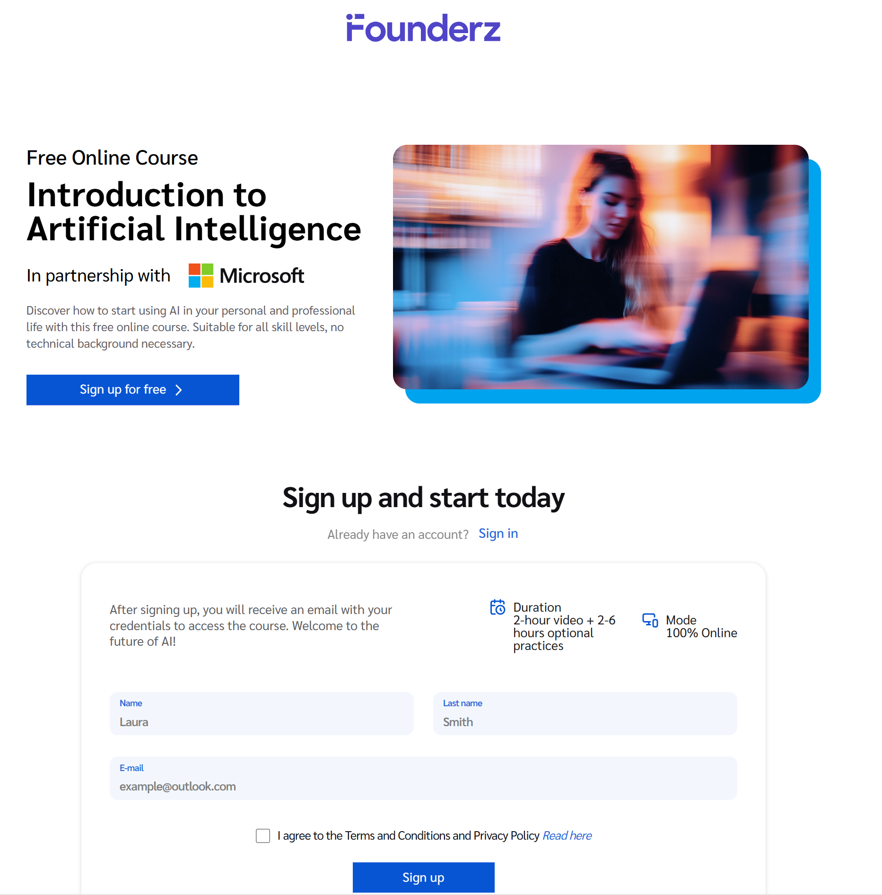

In our daily lives, we constantly face barriers when trying to implement good ideas, often due to a lack of technical knowledge and the time needed to figure out where to start. The AI models available today have brought about a revolution in this regard, accelerating timelines and removing learning obstacles. Thanks to these models, we can do more in less time and delve into highly complex fields like programming, allowing us to bring simple applications that implement good ideas to life.

In this context, I recently completed the **[Introduction to AI and Prompt Engineering course by Founderz](https://founderz.com/en/program/introduction-to-ai-and-prompt-engineering)**, taught by Pau García-Millá (Founder and Co-CEO of Founderz), Anna Cejudo (Founder and Co-CEO of Founderz), and Magda Teruel (Client Account Manager at Microsoft). I would say it's a highly recommended course! It's easy to follow, very educational, well-structured, and it truly makes an impact, offering glimpses of what can be achieved with AI through brief and effective instructions.

The course consists of short videos, between 5 and 15 minutes long, that explain and develop the idea of AI models as "Copilots" in our daily lives. Pau, Anna, and Magda present examples of how to "talk" to these "Copilots" and how to use them in our day-to-day tasks, showing some advanced use cases and practical examples of how to turn our project ideas into web applications without knowing how to program, thanks to the good work of our "Copilots." To finish, they propose that you try creating a basic project yourself with these models based on what you've learned, providing a very interesting feedback mechanism from both themselves and other students.

Besides recommending this course to anyone who wants to get started with AI models and learn more about having these "Copilots," I'm going to use this post to illustrate one of the key takeaways from the course, focusing on how to create a functional application through a simple conversation with ChatGPT and the right instructions.

### The "Aha!" Moment of the Founderz Course

The Founderz course is tremendously educational, and its greatest lesson is presenting AI (in this case, Copilot and ChatGPT) not just as a simple search assistant but as a **creation partner (a copilot)**.

The clearest example of this copilotage is how a language model can help us create structured and functional code from an initial idea through a series of simple instructions. Through several practical cases, it teaches how to create self-contained web applications in a single HTML file, unleashing our ideas to improve our daily lives.

### The Challenge: Creating a Useful Tool from Scratch with ChatGPT

To put this skill to the test, we're going to create a **learning game for basic math operations aimed at preschool and elementary school children between 5 and 7 years old**.

The goal was simple: a webpage that would teach and allow practice of basic mathematical operations (addition, subtraction, multiplication, and division) by learning levels, making it engaging for users.

### The Recipe: The Detailed Prompt (and its Refinement) is Key

This is where *Prompt Engineering* comes into play. It's not about asking ChatGPT to "make me an app," but about acting as a product manager who gives the development team (the AI) clear and detailed specifications.

#### The Initial Prompt

This was the first prompt I used, inspired by the course's methodology, where I defined the entire structure and functionality I wanted (I encourage anyone to experiment and reproduce it themselves on ChatGPT):

> Create a simple web application to practice basic math functions: addition, subtraction, multiplication, and division. The goal is to create a simple application that makes it easier for preschool and elementary school children (between 5 and 7 years old) to learn these operations. The application must:
> 1.  Start with a learning page that explains the 4 mathematical operations.
> 2.  Allow the selection of a learning level from 4 levels (preschool 1 & 2, elementary 1 & 2).
> 3.  Allow the selection of a difficulty level (easy with 1 digit, hard with 2).
> 4.  Have a "Start Game" button that leads to a screen with operations.
> 5.  Check if the answer is correct and display a motivating message and an emoticon.
> 6.  Keep track of correct and incorrect answers.
> 7.  Have an attractive and responsive design using Tailwind CSS.
> 8.  Include all HTML, CSS, and JavaScript code in a single file.

ChatGPT processed the request and, in seconds, returned a single block of code containing a fully functional application.

#### The Refinement: The Conversation Continues

The first result worked quite well, but there's always room for improvement 😄. This is where the true power of conversational AI lies: the ability to iterate and improve thanks to the coherence it can maintain in its results. As a test, I asked for a series of changes to make the application more dynamic and attractive:

> It works! Now I want you to make the following changes:
> 1.  Edit the design to be more attractive with gradient colors and nicer fonts.
> 2.  Add a 10-second countdown for each operation and a scoring system.
> 3.  Once the answer is submitted, show the correct/incorrect message for 3 seconds and then move to the next operation.
> 4.  Display the total score at all times.
> 5.  After 10 operations, show the final result.
>
> Write the complete code again.

And as if by magic, the AI integrated all the improvements and provided me with the final, polished code. You can see the full conversation and the result here: **[Math App Prompt on ChatGPT](https://chatgpt.com/share/68b5fa88-be78-8004-8d93-612409d559f5)**.

### The "Magic": Your App Running in 30 Seconds

This is the most rewarding part. To run the application we just created, just follow these steps:

1.  **Open a plain text editor** (like Notepad on Windows or TextEdit on Mac).
2.  **Paste the complete code** provided by ChatGPT.
3.  **Save the file** with any name you like, but make sure the extension is `.html` (for example: `math-game.html`).
4.  **Double-click the saved file.**

And that's it! The file will open in your web browser, and you'll have a fully functional educational application, created by you and your AI copilot.

!(app_matematicas_chatgpt.png)

### Conclusion and Next Steps

This experience demonstrates the incredible democratization that AI is bringing to the world of digital creation. It is no longer essential to be an expert programmer to build simple and useful tools. What is now crucial is the ability to **think in a structured way and give clear instructions**, the essence of *Prompt Engineering*.

This method is incredibly fast for creating and testing tools. But how can we take it a step further and publish this application so that anyone in the world can use it?

We'll talk about that in one of our next posts, where we'll explore the creation process with **Gemini's Code Canvas** and its public deployment using **GitHub Pages**. In the meantime, for those who haven't been trying it out in parallel, you can see the result created here: [My math app for kids created with ChatGPT](https://datalaria.com/apps/math)

---

#### Sources and Resources:
* **Founderz**: [Introduction to AI and Prompt Engineering Course](https://founderz.com/en/program/introduction-to-ai-and-prompt-engineering)
* **OpenAI**: [ChatGPT](https://chat.openai.com/)
* **App's Page**: [My math app for kids created with ChatGPT](https://datalaria.com/apps/math)