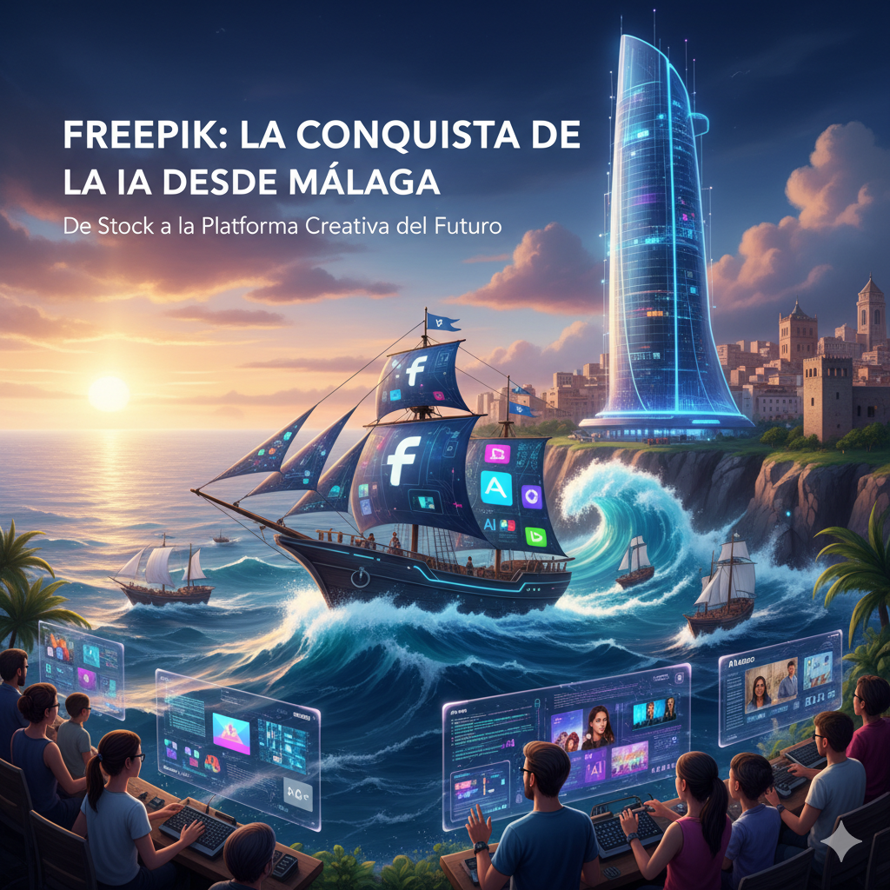

In 2022, the explosion of generative artificial intelligence sent an earthquake through the creative industry. Models like Midjourney or DALL-E 2 posed an existential question that shook the foundations of stock content giants: **"What's the point of an image bank when users can create exactly what they need from scratch?"**. Many companies froze. One, however, saw the threat coming and decided to bet "all or nothing" on a total reinvention.

That company wasn't born in Silicon Valley, but in Málaga, Spain. This is the story of [**Freepik**](https://www.freepik.com/), the journey of a Spanish startup that, thanks to a unique culture and astonishing strategic agility, has not only survived the disruption of AI but is positioning itself to lead the new era of creativity.

### The DNA: A Google Mindset with a "Homegrown" Heart

Freepik's success was no accident. Founded in 2010, its culture was forged from a unique combination of talents: the brothers Alejandro (the frustrated designer who had the original idea) and Pablo Blanes, along with Joaquín Cuenca, a serial entrepreneur who had already sold his company Panoramio to Google.

Cuenca imported Google's discipline and data-driven methodology, but operating from Málaga, far from major venture capital, they couldn't afford "star signings." In their own words, they were like the **"Athletic Bilbao"** football club: their strength lay in their "youth academy," in developing local talent and an obsessive focus on the product.

Their initial business model was a disruptive stroke of genius. They started as a simple search engine indexing free resources. Their *freemium* model eliminated the cost barrier, attracting millions of users. Their first source of revenue? A cunning alliance with their main competitor, Shutterstock, to whom they sent traffic in exchange for a commission. At the same time, the attribution requirement for free resources turned their massive user base into an **unpaid global marketing army**, generating millions of links that catapulted their dominance on Google.



### The Existential Pivot: Sacrificing the Present to Win the Future

Freepik was already a giant before AI. After being acquired by the private equity firm EQT in 2020 for an estimated 250 million euros, it doubled its revenue to 61.5 million in 2021 and surpassed Shutterstock in the number of premium subscribers.

But then came the "earthquake" of generative AI. The leadership understood that a lukewarm response was not enough; the threat required a complete reinvention. They made a courageous decision: **to bet "all or nothing" on AI**, massively reallocating their resources to build a new ecosystem of creative tools.

This decision came at a deliberate cost. After growing by 45% in 2022, the company's growth **dramatically slowed to just 11% in 2023**. It was a conscious slowdown: they sacrificed short-term results to invest in their long-term survival and leadership.

| Fiscal Year | Revenue (€M) | Annual Growth (%) | Key Strategic Context |
| :--- | :--- | :--- | :--- |
| 2019 | 31 | - | Organic growth pre-acquisition. |
| 2021 | 61.5 | - | Accelerated growth post-EQT; surpasses Shutterstock. |
| 2022 | 79 | 45% | Strong growth; beginning of AI disruption. |
| 2023 | 88 | 11% | **Year of the AI pivot**: Growth slowed to invest in the AI Suite. |
| 2024 (E) | > 100 | > 13.6% | Return to growth driven by new AI tools. |

The result of this investment is the **Freepik AI Suite**, an ecosystem that includes everything from an image and video generator to innovative tools like **Pikaso** (which turns sketches into images in real-time) and the upscaling technology of the recently acquired **Magnific**.

### The Secret Weapon: A Hybrid Ecosystem for the Real World

Freepik's strategy is not to beat Midjourney at creating conceptual art. Its goal is to win in the **commercial workflow**. While Midjourney serves the "Artist/Explorer," Freepik has positioned itself to dominate the much larger "Creator/Communicator" segment: the marketing professional, the educator, or the small business owner who needs to create professional-looking content quickly and, above all, with legal safety.

Its competitive advantage lies in a unique hybrid model:

1.  **Integrated Workflow**: A user can generate an image with AI, remove its background, add an icon from its stock library, and add text with its editor, all within the same platform and subscription. This is impossible in pure AI tools.
2.  **Stock Library as a Strategic Moat**: Its gigantic library of over 200 million assets is no longer just a product but a defensive advantage. It offers a fast and safe route for users ("it's easier to tweak a stock photo than to generate the perfect one from scratch") and serves as a potential "clean" dataset for training future proprietary AI models, avoiding copyright issues.
3.  **Legal Security**: By offering legal indemnification in its enterprise plans, Freepik directly addresses the biggest pain point for corporate clients, providing a security that tools trained on internet data cannot guarantee.

### Conclusion: Defining the New Creative Standard

The story of Freepik is a masterclass in strategic agility. It has navigated two seismic shifts in its industry: the disruption of the *freemium* model against paid-only, and now, the transformation brought by generative AI.

With the AI in graphic design market projected to grow to nearly **$14 billion by 2034**, Freepik is in an unbeatable position to capture a significant portion of this growth. By building an ecosystem that combines generation, editing, and a vast library of safe content, Freepik is not just participating in the AI revolution; it is positioning itself to become the **go-to platform for the new era of augmented creativity**. Its journey proves that in the age of AI, the ability to adapt is not just an advantage—it's the key to defining the future. And on the other hand, it shows that with creativity and by playing the right cards, you can compete from Málaga or any corner of the planet against the giants of Silicon Valley or the new leaders emerging in this world of AI, like those in [Hangzhou, the home of the Six Little Dragons](https://www.xataka.com/robotica-e-ia/hay-ciudad-china-que-se-mide-cara-a-cara-silicon-valley-bienvenidos-a-hangzhou-casa-six-little-dragons).

---

#### Sources of Interest:
* [**Freepik**: Freepik Website](https://www.freepik.com/)
* [**YouTube**: Itnig video interviewing Joaquín Cuenca from Freepik (in Spanish)](https://www.youtube.com/watch?v=WrdIIUZ_ScA)
* [**Jot Down**: Interview with Joaquín Cuenca, "People think the idea is the most important thing, and that needs to be demystified" (in Spanish)](https://www.jotdown.es/2023/05/joaquin-cuenca-entrevista/)
* [**EQT**: Press release on the acquisition of Freepik Company](https://eqtgroup.com/news/eqt-acquires-freepik-company-the-global-leading-freemium-provider-of-digital-visual-content-2020-05-28)
* [**20Minutos**: Freepik expects to close this year with over 100 million in revenue amid its pivot to AI (in Spanish)](https://www.20minutos.es/lainformacion/empresas/freepik-cerrar-cien-millones-ingresos-pleno-giro-ia-5635101/)
* [**Xataka**: Spanish startup Freepik becomes one of the most important 'exits' in Spain's history after being bought by the EQT fund (in Spanish)](https://www.xataka.com/empresas-y-economia/fondo-inversion-sueco-eqt-compra-a-startup-espanola-freepik)
* [**Xataka**: Freepik acquires Magnific and strengthens its arsenal of 'made in Spain' AI tools (in Spanish)](https://www.xataka.com/robotica-e-ia/freepik-adquiere-magnific-refuerza-su-arsenal-herramientas-ia-made-in-spain)
* [**Xataka**: Hangzhou, the home of the Six Little Dragons (in Spanish)](https://www.xataka.com/robotica-e-ia/hay-ciudad-china-que-se-mide-cara-a-cara-silicon-valley-bienvenidos-a-hangzhou-casa-six-little-dragons)