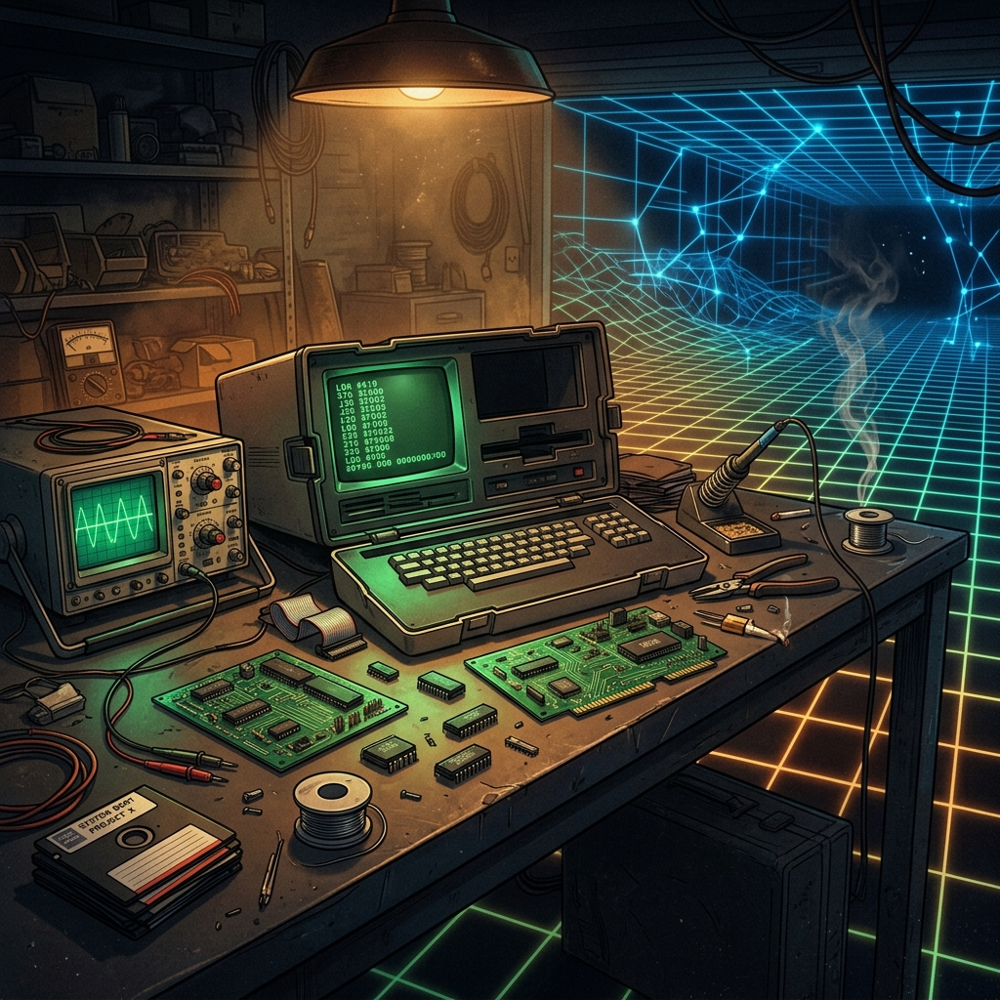

Almost every fictional story Hollywood has produced about technology makes the same unforgivable mistake: reducing computing to black screens with blinking green monospace fonts, futuristic 3D user interfaces, and rogue hackers breaching government firewalls in five seconds using one hand.

Broadcast by AMC across four masterful seasons, **"Halt and Catch Fire"** did the exact opposite. It captured the unmistakable smell of burnt solder in a humid Texas garage at 3:00 AM, the painstaking agony of reverse-engineering a copyright-protected BIOS, the visceral battles between hardware engineers and software developers, and the bitter truth that **having the superior technical architecture almost never guarantees winning the commercial war**.

Just as we explored in [The Thinking Game](/en/posts/the_thinking_game/) with DeepMind's quest for artificial intelligence, or in [The Goal](/en/posts/the-goal/) with Eliyahu Goldratt's Theory of Constraints, *Halt and Catch Fire* is an essential masterclass for anyone working in data engineering, software development, or digital product management.



### The Meaning of HCF: The Self-Destruct Mnemonic

The series title itself is an uncompromising statement of intent. In early computing lore from the 1970s and 1980s, **"Halt and Catch Fire" (HCF)** was the hacker moniker for an undocumented machine-code instruction (found in processors such as the Motorola 6800). When executed, the CPU entered an unrecoverable, infinite bus-read cycle that completely froze the microprocessor, requiring a hard physical reboot and, in extreme experimental rigs, causing circuit overheating.

This engineering metaphor anchors the entire narrative: **technological innovation as an obsessive, destructive flame that consumes the personal lives of those daring to push the boundaries of what is possible**.

The story begins in 1983 in the *Silicon Prairie* of Dallas-Fort Worth, Texas, converging around four archetypal personalities that every industry veteran will instantly recognize:

* **Joe MacMillan** (Lee Pace): The charismatic, manipulative commercial visionary, channeling the brilliance and dark corners of Steve Jobs.
* **Gordon Clark** (Scoot McNairy): The brilliant but frustrated hardware engineer, a master of the soldering iron, bus timing, and motherboard optimization.
* **Cameron Howe** (Mackenzie Davis): The rebellious prodigy programmer, an intuitive and anarchic coder who writes clean assembly and foresees the emotional connection between humans and computers.
* **Donna Clark** (Kerry Bishé): The true technical and executive powerhouse, capable of translating raw engineering feats into sustainable, scalable business models.

### The 4 Technological Revolutions of the Series

Unlike other tech dramas trapped in a single timeframe, each season of *Halt and Catch Fire* leaps half a decade forward, chronicling the four tidal waves that forged the modern digital ecosystem:

#### Season 1 (1983): Reverse Engineering and the IBM PC Clone
Inspired by the real-world founding of **Compaq**, the first season is a masterwork of pure systems engineering. Joe and Gordon set out to break IBM's crushing monopoly by creating an IBM-compatible portable computer. To survive multi-million-dollar copyright infringement lawsuits, they implement a strict **Clean Room Design** methodology:
1. Gordon and Joe disassemble the IBM PC's original BIOS assembly code and author a purely functional specification document (defining strictly what inputs and outputs each BIOS interrupt handles).
2. Cameron, quarantined in an isolated room having never laid eyes on a single line of IBM's proprietary source code, writes an entirely original BIOS from scratch that satisfies those exact functional specs.

It is the foundational lesson of software architecture: **cleanly decouple the interface from the implementation**.

#### Season 2 (1985): Mutiny and the Dawn of Online Communities
Cameron and Donna leave hardware behind to launch **Mutiny**, a scrappy startup foreshadowing Prodigy, CompuServe, and early AOL. Connecting Commodore 64 computers via 300 and 1200-baud dial-up modems over analog telephone lines, they build early multiplayer games and community chatrooms. Their breakthrough technical insight: users didn't care about the games; they were paying for **the raw human urge to connect with each other in real time**.

#### Season 3 (1986–1990): Infrastructure, Networking, and Fintech
Mutiny relocates to Silicon Valley and collides with the physical limits of infrastructure: network bandwidth contention, peak-hour server crashes, and the invention of **Swap Meet**, a pioneering digital marketplace that anticipated Craigslist, eBay, and the global cross-border payment gateways later perfected by companies like [Flywire](/en/posts/flywire/).

#### Season 4 (1993–1994): The World Wide Web and the Search Engine Wars
The saga culminates during the birth of the World Wide Web and Tim Berners-Lee's HTTP protocol. The protagonists wage a fierce architectural battle to index the expanding internet: Donna backs **Rover** (an automated algorithmic crawler), while Joe and Gordon build **Comet** (a human-curated web directory inspired by early Yahoo!). It is the ultimate confrontation between semantic algorithmic indexing and structured taxonomy.

### 3 Timeless Lessons for Engineers and Technical Leaders

Beyond retro-computing nostalgia, *Halt and Catch Fire* distills immutable engineering principles:

#### 1. The Superior Technical Architecture Doesn't Guarantee Victory
In the first season, the team designs *The Giant*, an astonishing portable PC with an empathetic, interactive operating system engineered by Cameron. Yet to bring the machine to market at a viable price point and satisfy retail distributors, Joe is forced to strip Cameron's bespoke OS and replace it with generic MS-DOS.

This is the cold reality of *Time-to-Market*: a technically flawless product that arrives late or defies the established ecosystem will die in the distribution channel.

#### 2. Technical Debt is Human Debt
The series portrays the psychological toll of software engineering with unmatched authenticity: *burnout*, decision fatigue, the agony of refactoring an entire monolithic backend because the foundation cannot scale, and the lonely despair of hunting an elusive race condition at 4:00 AM. Technical excellence is never free; it is paid for in cognitive bandwidth and relentless focus.

#### 3. "Computers aren't the thing. They're the thing that gets us to the thing."
In the pilot episode, Joe MacMillan delivers the line that became the defining manifesto of the series and one of the most profound reflections in tech history:

> *“Computers aren't the thing. They're the thing that gets us to the thing.”*

This insight is remarkably relevant in 2026. In the era of Large Language Models, agentic frameworks, and automated pipelines, it is easy to become mesmerized by compute benchmarks, GPU clusters, and neural parameters. But every tool — from the punched cards of [Ada Lovelace](/en/posts/ada_lovelace/) and the bits of [Claude Shannon](/en/posts/claude_shannon/) to [FastAPI](/en/posts/obs_parte6_fastapi/) and [pgvector](/en/posts/pgvector_vs_vectordb/) — matters only insofar as it amplifies human intelligence, empathy, and creative potential.

### Conclusion

If you work in software development, data science, infrastructure, or product management, *Halt and Catch Fire* is far more than compelling television: it is a historical mirror. It will remind you why you chose this craft, teach you reverence for the giants upon whose shoulders modern AI is being built, and prove that no matter how much technology evolves, the true magic will always belong to the humans writing the code.

---

#### Sources of Interest:
* [**AMC**: Halt and Catch Fire — Official Series Portal](https://www.amc.com/shows/halt-and-catch-fire)
* [**YouTube**: Halt and Catch Fire — Official Series Trailer](https://www.youtube.com/watch?v=jm81w3nC_bY)
* [**Datalaria**: The Thinking Game — Demis Hassabis and DeepMind](/en/posts/the_thinking_game/)
* [**Datalaria**: The Goal — Eliyahu Goldratt and the Theory of Constraints](/en/posts/the-goal/)
* [**Datalaria**: Ada Lovelace — The First Computer Programmer in History](/en/posts/ada_lovelace/)
* [**Datalaria**: Claude Shannon — The Man Who Turned the World into Bits](/en/posts/claude_shannon/)
* [**Datalaria**: Flywire — The Spanish Fintech Powering Global Payments](/en/posts/flywire/)
