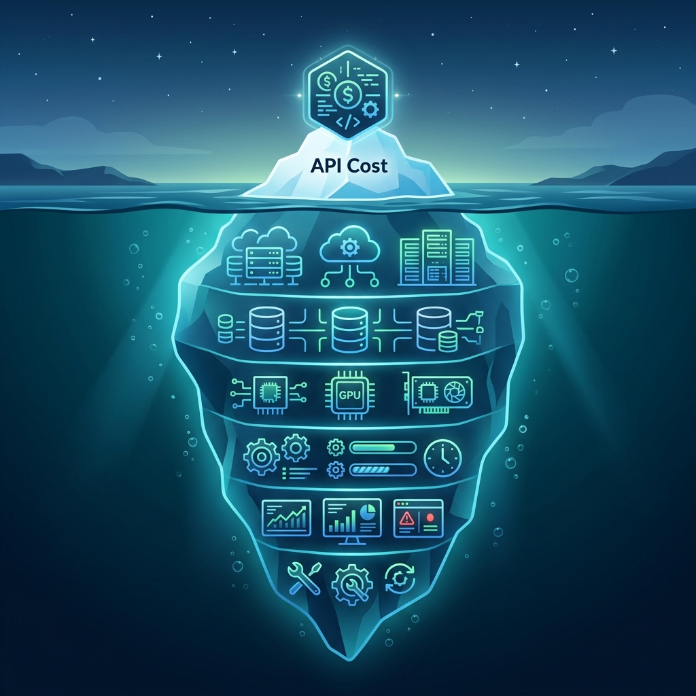

There is an inconvenient truth the artificial intelligence industry prefers to whisper rather than proclaim: **the real cost of putting an LLM into production almost never matches the API invoice**. It's like buying a car and discovering that the dealership price didn't include the wheels, the insurance, or the fuel. The label says "$0.15 per million input tokens." What it doesn't say is how many millions of tokens your agent will burn in a delegation loop that spirals out of control at 3 AM.

I know this because it happened to me. Over the past six months I've operated autonomous agent systems in real production: the [Autopilot Project](/en/posts/ai_agents_part1/) (9 installments) to automate content distribution across social media, and the [Obsolescence Engineering](/en/posts/obs_part1_intro/) series (7 installments) with a 24/7 agentic radar to monitor supply chain risks. This article is not a theoretical exercise: it is an X-ray of my real invoices, my mistakes, and my lessons learned.

### The Iceberg: What the API Invoice Doesn't Tell You

The most dangerous mistake when budgeting a generative AI project is **confusing the API cost with the total system cost**. It's like measuring the cost of a restaurant only by the price of the ingredients. In my experience operating these systems, the API represents roughly **15-25% of the real cost**. The rest is the submerged iceberg:

| Cost Layer | What It Includes | Typical % |
| :--- | :--- | :---: |
| **LLM API** | Input/output tokens, context caching | 15-25% |
| **Infrastructure** | GitHub Actions (minutes), Netlify Functions, Supabase | 25-35% |
| **Engineer Time** | Agent debugging, prompt tuning, defensive programming | 30-40% |
| **Silent Costs** | Retries on failures, infinite loops, token overconsumption | 10-15% |

The third block — engineer time — is where most projects die. As I documented in the [Autopilot post-mortem](/en/posts/ai_agents_part9/), models are stochastic: you run the same pipeline ten times and get ten different results. This means **you can't test an AI agent the way you test a conventional microservice**. You need defensive programming, output validation with JSON Schemas, and retries with exponential backoff. Every hour invested in that engineering has a cost.

### The Comparison No One Makes: Gemini vs GPT-4o vs Claude in Real Production

The LLM comparisons flooding the internet typically measure academic benchmarks: MMLU, HumanEval, logical reasoning. That's fine for research papers, but in production what matters is the **cost-quality-reliability equation per specific task**. Here is my operational experience with the three main models:

| Criterion | Gemini 2.5 Flash | GPT-4o | Claude Sonnet 4 |
| :--- | :--- | :--- | :--- |
| **Input Cost** (per 1M tokens) | $0.15 | $2.50 | $3.00 |
| **Output Cost** (per 1M tokens) | $0.60 | $10.00 | $15.00 |
| **Average latency** (complete response) | ~2.1s | ~3.8s | ~4.5s |
| **JSON reliability** (structured output) | ⭐⭐⭐⭐ | ⭐⭐⭐⭐⭐ | ⭐⭐⭐⭐⭐ |
| **System prompt adherence** | ⭐⭐⭐⭐ | ⭐⭐⭐⭐ | ⭐⭐⭐⭐⭐ |
| **Creativity / "personality"** | ⭐⭐⭐ | ⭐⭐⭐⭐ | ⭐⭐⭐⭐⭐ |

The price difference between Gemini Flash and its competitors is not a percentage: it's an **order of magnitude**. For high-volume, low-creativity tasks — classification, structured data extraction, email parsing — Gemini Flash is unbeatable. That's exactly why I chose it as the engine for the [obsolescence agentic radar](/en/posts/obs_part5_radar_agent/): I needed to run hundreds of analyses per month without the bill spiraling out of control.

However, when the task demands nuance, personality, or complex reasoning, the quality difference justifies the price. In the Autopilot Project, the agent writing LinkedIn posts with a "corporate" tone and the one writing tweets with a "cynical" tone ([Part 3](/en/posts/ai_agents_part3/)) performed significantly better with premium-tier models. **The lesson: there is no "best model," there is the right model for each task in your pipeline.**

### Anatomy of a Real Invoice: The Autopilot Project

Let's break down the actual costs of operating the Autopilot Project during a typical month. This system analyzes each new blog post, generates optimized content for Twitter and LinkedIn in two languages (ES/EN), runs a quality audit, and publishes automatically with human approval.

| Item | Monthly Cost | Notes |
| :--- | :--- | :--- |
| **Gemini API** (Flash + Pro) | ~€1.20 | ~4 executions/month, ~50K tokens per execution |
| **GitHub Actions** (CI/CD minutes) | €0.00 | Free tier: 2,000 min/month (more than enough) |
| **Brevo** (Newsletter) | €0.00 | Free tier: 300 emails/day |
| **Netlify** (Functions + Hosting) | €0.00 | Free tier: 125K invocations/month |
| **Supabase** (PostgreSQL) | €0.00 | Free tier: 500MB, 2 projects |
| **Domain** (datalaria.com) | ~€1.50 | Monthly prorated |
| **Engineer time** | ¿? | The real hidden cost |
| **Total infrastructure** | **~€2.70/month** | |

Yes, you read that right: **less than 3 euros per month** to operate a complete AI agent system with automated social media publishing, newsletter, and CI/CD. The key lies in three deliberate architectural decisions:

1. **Gemini Flash as the main engine**: At $0.15/M input tokens, the cost per execution is cents, not euros.
2. **Aggressive free tiers**: GitHub Actions, Netlify, Supabase, and Brevo offer generous free plans that comfortably cover an individual project or early-stage startup.
3. **On-demand execution**: The pipeline doesn't run 24/7 — it only triggers on each new post (event-driven), avoiding the cost of always-on servers.

### The Loop Trap: When Your Agent Burns Money on Its Own

But the invoice isn't always that friendly. In the Autopilot post-mortem I documented a critical failure every engineer should know about: CrewAI's **infinite delegation loops**. When an agent can't find the expected answer, it can re-delegate the task to itself in a loop that consumes tokens exponentially until GitHub Actions kills the process on timeout (**SIGTERM** at 60 minutes).

In a single failed execution, that loop can consume **more tokens than an entire month of normal operation**. It's the digital equivalent of leaving a tap running overnight. The solution is brutally simple, yet nobody implements it by default:

* **`max_iter`** and **`max_execution_time`** on every CrewAI agent
* **Output validation** with Pydantic before passing to the next agent
* **Cost alerts** configured in the Google Cloud console
* **Circuit breakers** that kill execution if consumption exceeds a threshold



### The 10x Rule: When It's Worth Paying More

After six months operating these systems, I've distilled a pragmatic rule I call the **10x Rule**: a more expensive model is only justified if it produces a result at least **10 times better** on the metric that matters for your use case. What does "10 times better" mean?

* **In classification**: 10x fewer classification errors
* **In content generation**: 10x fewer human correction iterations
* **In data extraction**: 10x fewer verifiable hallucinations
* **In latency**: 10x faster on the user's critical path

If the improvement is 20-30%, stick with the cheap model. If it's 2x-3x, evaluate. If it's 10x, don't think twice. This rule led me to use Gemini Flash for 90% of tasks and reserve premium models only for creative content generation.

### Looking Ahead: The Deflation of Intelligence

There is a macro trend every engineer needs to have on their radar: **the cost per token is falling at a brutal pace**. Gemini Flash in June 2025 cost $0.35/M input tokens. One year later, it costs $0.15 — a **57% drop in 12 months**. If this trend holds (and everything suggests it will accelerate with competition from open-source models like Llama and Mistral), in two years we'll be talking about API costs that are **essentially free** for most use cases.

That doesn't mean AI will be free. It means **the cost will definitively shift from the API to the engineer**: the ability to design robust systems, implement defensive programming, and orchestrate complex pipelines will be the true competitive differentiator. The model will be a commodity; the architecture will be the moat.

As W. Edwards Deming — to whom I dedicated a [full article](/en/posts/deming/) — put it: *"It is not enough to do your best; you must first know what to do."* In the hidden economics of AI, knowing which model to use, when to use it, and when **not** to use it is the most valuable skill you can develop.

---

#### Sources of Interest:
* [**Google AI**: Gemini API Pricing — Updated Models and Prices](https://ai.google.dev/pricing)
* [**OpenAI**: API Pricing — GPT-4o, GPT-4o mini Models](https://openai.com/api/pricing/)
* [**Anthropic**: Claude API Pricing — Claude 4 and Sonnet Models](https://www.anthropic.com/pricing)
* [**Datalaria**: Autopilot Project Post-Mortem — Lessons Learned](/en/posts/ai_agents_part9/)
* [**Datalaria**: The Agentic Radar — Tool Calling vs RAG in Production](/en/posts/obs_part5_radar_agent/)
* [**Andreessen Horowitz**: The Cost of AI — Who Pays and How Much? (Andreessen Horowitz Report)](https://a16z.com/navigating-the-high-cost-of-ai-compute/)
* [**GitHub**: GitHub Actions Billing — Free Tier and Pricing](https://docs.github.com/en/billing/managing-billing-for-github-actions/about-billing-for-github-actions)
