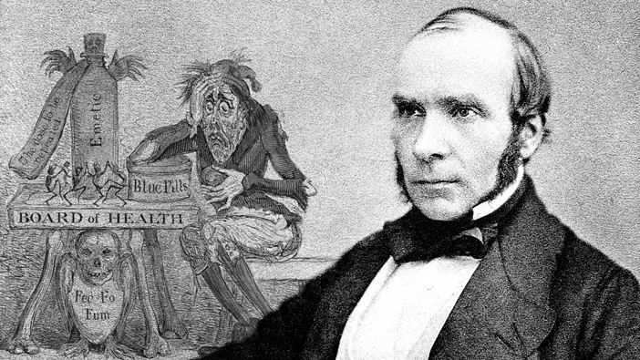

Despite the fact that nowadays, for the great majority of people, the name of John Snow brings to his mind to Aegon Targaryen or the heir to the iron throne, there is actually another, perhaps less popular, John Snow (United Kingdom 15/03/1813 - 16/06/1858). This another John Snow should be known as a precursor or forerunner of epidemiology and geolocation and one of the references in the field of dissemination of data thanks to its Cholera map of 1854.

John Snow was an English doctor who was able to demonstrate in an innovative way that the Cholera was driven by the consumption of water contaminated with feces, breaking with the then-dominant [miasma theory](https://en.wikipedia.org/wiki/Miasma_theory) which assured that the origin of the disease was based on the air or the foul odors of soils or impure waters.

For that purpose, John Snow analyzed in detail the cases of the cholera outbreak in the city of London in 1854 and detected that approximately 700 people deceased in the area of Soho during the same week. To make a clearer view of this issue, Dr. Snow developed a geographic information system based on information layers over a map of the neighborhood. Specifically, John Snow represented a layer with the water pumps (points in the map labeled as "pump") and another layer visualizing the deaths occurred in every building of this area (stacked black lines in each house).

As a result of this representation, Dr. Snow identified the water pump located on Broad Street, in the heart of the epidemic, as the source of the problem because more than 70% of deaths were caused in its service area. However, and in spite of the clairvoyance of the conclusions, the authorities did not taken into account immediately and John Snow had to clear some confusing cases. For example, some workers in a workshop and others in a distillery had hardly suffered cholera cases due to the fact that they had private well pumps. In addition, certain cases of deaths far from the area of ​​the water pump were also clarified based on visits to the area for work or family reasons.

Finally, and thanks to the fact that the origin of the epidemic was also detected (the contamination of the waters by the filtration of a baby's diapers that had been thrown into a black hole days before the epidemic began), John Snow got the authorities to remove the handle of the pump and then, the cholera cases began to reduce.

Today, there are several references to Dr. John Snow in the current neighborhood of Soho, on the famous Broad Street renamed today as Broadwick Street. A pub with its name where the John Snow Society meets, a sculpture of the famous pump of water, or even a small plate in the building where said pump was.

Below, and for more information, you can find the link to the TED talk "The Ghost Map" by Steven Johnson about the impact that John Snow and his map had in science, cities and modern societies.



#### Sources of Interest
- [TED Talks - Steven Johnson - The Ghost Map](https://www.ted.com/talks/steven_johnson_tours_the_ghost_map)
- [Wikipedia - John Snow](https://es.wikipedia.org/wiki/John_Snow)
- [Victorian Web - John Snow](http://www.victorianweb.org/science/health/johnsnow.html)
- [Master Telefónica en Big Data & Business Analytics](https://www.campusbigdata.com/master-telefonica-en-big-data-y-business-analytics)
- [All3dform - John Snow y el mapa que salvó Londres](https://all3dform.com/es/john-snow-y-el-mapa-que-salvo-londres/)
- [psanxiao - El mapa del cólera de John Snow](http://psanxiao.com/el-mapa-del-colera-de-john-snow)
