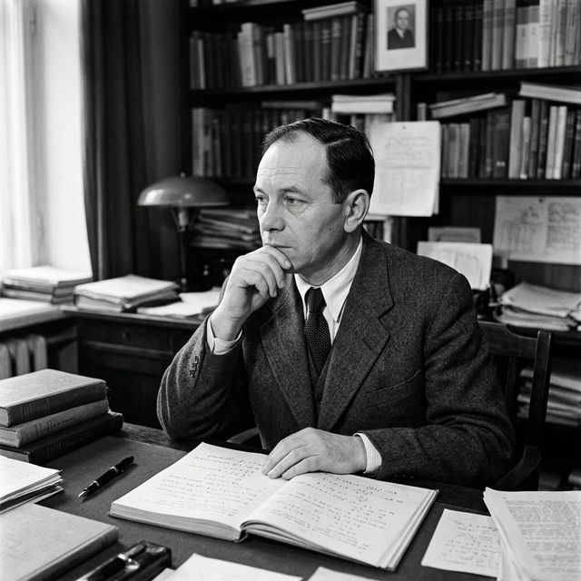

The history of mathematical economics and data science is bound to a fundamental human need: the optimal allocation of scarce resources to maximize performance. At the epicenter of this revolution stands **Leonid Vitaliyevich Kantorovich**, the Soviet mathematician whose pioneering work laid the foundations for **linear programming**.

Today, tools like PuLP or SciPy in Python handle optimization algorithms as everyday occurrences. But in 1938, formulating these mathematics under the watchful eye of Joseph Stalin required both intellectual genius and sheer bravery.

## The Plywood Trust Challenge

Leonid Kantorovich was a prodigy. At 22, he was already a full professor at Leningrad University. However, the birth of linear programming happened in an accidental and pragmatic way.

In 1938, the Plywood Trust approached Kantorovich with a problem: how should they optimally allocate their limited resources (machinery and different woods) to maximize production while meeting strict State quotas?

Traditional analysis required exhaustively comparing all production combinations, a brute-force approach that was impossible to compute. Kantorovich realized he was facing a "very special extreme problem" and developed the **"method of resolving multipliers"**.

He classified resources in order of their productive advantage, managing to increase the Trust's joint production from 77 to 86 units without a single extra worker or new machine. Modern resource optimization was born.

  
  <em>Leonid Vitaliyevich Kantorovich</em>

## The Shadow Price and the Schism with Orthodoxy

The most revolutionary aspect of Kantorovich's work was the discovery of **Duality Theory**. His multipliers acted as dual variables that measured the "marginal rate of change" upon adding one extra unit of a restrictive resource. In the West, this would be known as the **Shadow Price**.

But in the Stalinist USSR, this was heresy.

The Soviet economy was inflexibly based on Marx's Labor Theory of Value: the value of a good is 100% the human labor used to produce it. Kantorovich demonstrated mathematically that value also emanated from resource scarcity and opportunity cost. His calculations gave price to inert machinery and land.

When Kantorovich submitted his findings to *Gosplan* (the state economic planning agency) in 1943, he was met with absolute institutional condemnation. His work was forcibly shelved for defying Marxist dogma.

## From Industrial Sabotage to the Nobel Prize

Kantorovich proceeded tactically by applying his methods to local engineering. In 1948, he optimized steel sheet stamping in a train car factory, reducing waste (scrap) by an astounding 50%.

But in the Soviet central economy, that inefficiency was already planned: adjacent smeltering plants needed that scrap as an input. By becoming efficient, Kantorovich collapsed the local supply chain. He was summoned by the Communist Party on charges of "industrial sabotage", a sentence that could mean the Gulag or the firing squad.

History tells that he was secretly saved by the Soviet military high command. The military desperately needed his optimizing genius for tactical logistics and atomic development.

After Stalin's death and the "Khrushchev Thaw," Kantorovich's work finally saw international light in 1956, connecting with the independent discoveries of George Dantzig (creator of the Simplex Algorithm) and Tjalling Koopmans.

Finally, history did him justice. In 1975, Leonid Kantorovich received the **Nobel Memorial Prize in Economic Sciences** alongside Tjalling Koopmans, for their invaluable contributions to the theory of optimum allocation of resources.

## The Architecture of Efficiency

The next time you import an optimization library in Python or run a linear solver to plan your company's logistics, remember Leonid Kantorovich. His algorithm doesn't just solve matrices; it is a testament to how the rigor of data and pure mathematics can penetrate the thickest iron curtains in history.

---

#### References and Further Reading
- Kantorovich, L. V. (1939). *Mathematical Methods of Organizing and Planning Production*.
- [Leonid Kantorovich - Biographical (Nobel Prize)](https://www.nobelprize.org/prizes/economic-sciences/1975/kantorovich/biographical/)
- [History of Operations Research (INFORMS)](https://www.informs.org/Explore/History-of-O.R.-Excellence/Biographical-Profiles/Kantorovich-Leonid-V)
