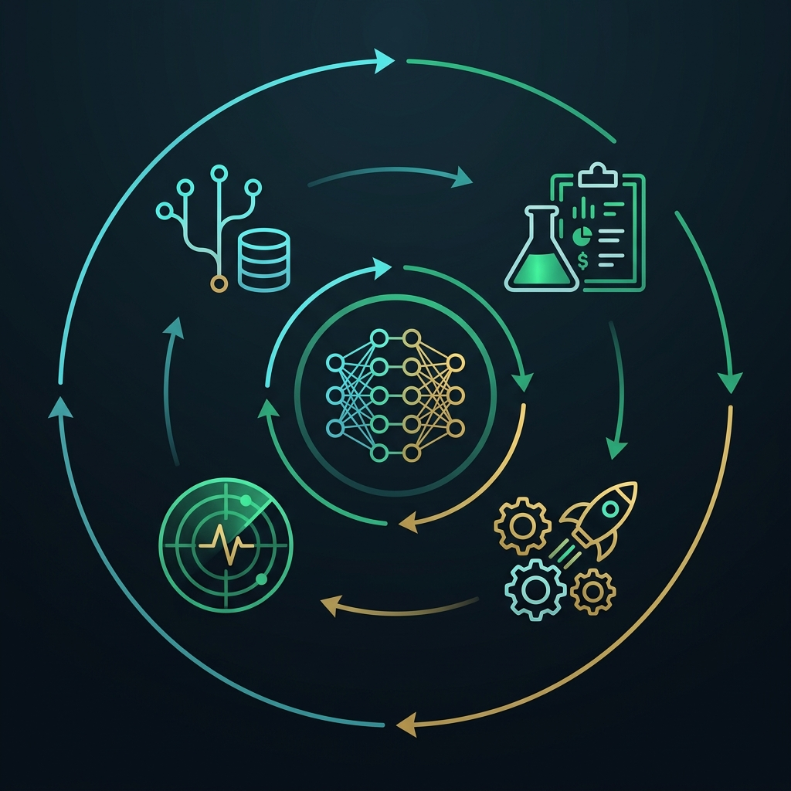

There is a statistic from Gartner that every data team knows and most prefer to ignore: **87% of Machine Learning and AI projects never make it to production**. They remain trapped in "prototype limbo": a Jupyter notebook on a data scientist's laptop boasting an impressive 96% accuracy over a static CSV file from 2023, but which no one knows how to deploy, version, update, or monitor within an enterprise's live infrastructure.

The reason for this widespread failure is neither mathematical nor algorithmic. It's not a matter of needing more hyperparameters to tune or deeper neural network layers to stack. **It is a software engineering and operations failure**.

As demonstrated in Google's landmark paper *"Hidden Technical Debt in Machine Learning Systems"* (Sculley et al.), the actual ML model code accounts for a mere **5% to 10%** of the entire production system. The remaining 90% is infrastructure: data extraction and verification, dependency management, automated retraining, artifact versioning, observability against the dreaded *Data Drift*, and continuous governance.

This integrative discipline is called **MLOps** (*Machine Learning Operations*). And after building, deploying, and operating real production pipelines on this blog — from demand forecasting with Prophet in the [S&OP series](/en/posts/sop-engineering-part2-forecasting/) to autonomous agents in the [Autopilot series](/en/posts/ai_agents_part1/) and the [Obsolescence Radar](/en/posts/obs_part5_radar_agent/) —, this article is the practical guide that distills the journey from a sandbox script to an industrial production system.

### Anatomy of the Problem: Why Traditional Software Engineering Falls Short with ML

In traditional software development (DevOps), system behavior depends entirely on **source code**. If you write a deterministic function, test it with unit tests, and deploy it via CI/CD, the system behaves predictably as long as the underlying infrastructure remains healthy.

In Machine Learning and generative AI systems, behavior depends upon an interdependent trinity: **Code + Data + Model**.

1. **Code may remain unchanged**, yet if the statistical distribution of real-world data shifts (which happens constantly across supply chains, financial markets, and customer behaviors), **model performance degrades silently**.
2. **Reproducibility is non-trivial**: retraining the exact same Python script with today's data produces a completely different binary artifact than last week's run.
3. **Failures don't throw an HTTP 500 error**: a production model doesn't crash like a web server; it simply begins serving garbage predictions with 99% statistical confidence.

To keep your system from becoming an uncontrollable black box, your architecture must stand upon four fundamental pillars.



### Pillar 1: Comprehensive Versioning (Code, Data, and Models)

If you cannot recreate the exact environment, data snapshot, and parameters that produced a prediction six months ago, your system is neither reproducible nor auditable. In regulated enterprise environments, this is not merely good engineering hygiene; it is a strict legal requirement under the [EU AI Act](/en/posts/eu_ai_act/) (Article 12 on automated logging and traceability).

Versioning in MLOps spans three distinct layers:

* **Code Versioning**: Standard Git. Centralized repository with protected branches, pull request reviews, and version tags.
* **Data Versioning (DVC / Delta Lake)**: Git was never designed to store gigabyte- or terabyte-scale binary files. Tools like **DVC** (*Data Version Control*) create lightweight metadata pointer files versioned in Git, while actual datasets reside in object storage (Amazon S3, Google Cloud Storage, or Supabase Storage). This allows a simple `git checkout v1.2.0` to restore both the training code and the exact data snapshot that fed it.
* **Model Registry (MLflow / Weights & Biases)**: A centralized catalog acting as the "Docker Hub" for trained models. Each registered model tracks serialized weights (ONNX, Pickle, Safetensors), hyperparameters, validation metrics, author, associated Git commit hash, and lifecycle stage (`Staging`, `Production`, `Archived`).

### Pillar 2: Experiment Tracking and Pipeline Automation

A data scientist's or ML engineer's workflow is inherently iterative. Testing dozens of feature permutations, model algorithms, Pandas transformations, and regularization parameters without systematic logging leads straight to chaos: scattered notebook files, models named `final_model_v2_really_final.pkl`, and complete loss of institutional knowledge.

**MLflow** and **Weights & Biases (W&B)** solve this by systematically intercepting every training run:

```python
import mlflow
import mlflow.prophet
from prophet import Prophet

# Start experiment tracking
mlflow.set_experiment("sop_demand_forecasting")

with mlflow.start_run(run_name="prophet_multiplicative_v3"):
    # Log configuration parameters
    params = {
        "seasonality_mode": "multiplicative",
        "changepoint_prior_scale": 0.05,
        "n_changepoints": 20
    }
    mlflow.log_params(params)
    
    # Train the model
    model = Prophet(**params)
    model.fit(train_df)
    
    # Evaluate and log performance metrics
    metrics = evaluate_forecast(model, test_df)
    mlflow.log_metrics({
        "mape": metrics["mape"],
        "rmse": metrics["rmse"],
        "coverage_p95": metrics["coverage"]
    })
    
    # Automatically register the artifact
    mlflow.prophet.log_model(model, artifact_path="prophet_model")
```

By structuring experiments with automated tracking, comparing 50 model iterations transforms from a guessing game into an instant analytical query on a unified dashboard.

### Pillar 3: CI/CD and Automated Deployment (CT: Continuous Training)

In MLOps, CI/CD expands to incorporate a vital third dimension: **Continuous Training (CT)**.

* **CI (Continuous Integration)**: Goes beyond validating Python syntax and running unit tests (`pytest`, `flake8`). It executes specialized data validation tests: verifying that incoming schemas match expectations, null values remain within acceptable tolerances, and feature ranges stay valid (using libraries like **Great Expectations** or Pydantic).
* **CD (Continuous Delivery / Deployment)**: Packages the validated model into an optimized Docker container or a **FastAPI** microservice (as showcased in [Observability Part 6](/en/posts/obs_part6_fastapi/)) and automatically deploys it upon passing regression test suites.
* **CT (Continuous Training)**: When production monitoring detects performance degradation or new data batches arrive, an automated pipeline (orchestrated via [GitHub Actions](/en/posts/ai_agents_part5/), Prefect, or Airflow) retrains the model, verifies that new metrics surpass the baseline champion model, and automatically promotes the candidate to the Model Registry.

### Pillar 4: Production Observability (The War Against Drift)

Once your model is deployed and serving batch or real-time inferences, the real challenge begins. Models degrade over time due to two distinct mathematical phenomena:

#### 1. Data Drift (Covariate Shift)
The statistical distribution of input variables ($P(X)$) changes relative to the training distribution, even if the underlying relationship between inputs and outputs holds steady.

* *Real-world example*: A demand forecasting model trained prior to a global supply chain disruption experiences a sudden surge in supplier lead times. The model receives valid numbers, but operates in a vector space region where it was never trained.

#### 2. Concept Drift
The mathematical relationship between input features and target variables ($P(Y|X)$) shifts over time.

* *Real-world example*: In customer purchasing predictions, a product historically bought primarily during winter becomes an all-season hit due to a social media trend. The inputs remain identical, but consumer behavior has fundamentally evolved.

```python
# Data Drift detection example using Evidently AI
from evidently.report import Report
from evidently.metric_preset import DataDriftPreset

data_drift_report = Report(metrics=[DataDriftPreset()])
data_drift_report.run(reference_data=reference_df, current_data=production_df)

# If drift exceeds threshold, trigger automatic alerting & retraining
if data_drift_report.as_dict()["metrics"][0]["result"]["dataset_drift"]:
    trigger_mlops_alert("DATA_DRIFT_DETECTED: Triggering automated retraining pipeline")
```

Tools like **Evidently AI** or Prometheus + Grafana allow data engineering teams to track statistical drift tests (such as Kolmogorov-Smirnov for numerical features or Chi-Square tests for categorical data) and alert engineers long before degraded accuracy causes financial losses.

### Real Production Case: Moving Prophet from Notebook to S&OP Pipeline

To see how MLOps applies in real industrial contexts, consider the evolution of our demand planning pipeline in the [S&OP series](/en/posts/sop-engineering-part2-forecasting/):

| Stage | Initial Sandbox (Jupyter) | Production Architecture (MLOps) |
| :--- | :--- | :--- |
| **Data Ingestion** | Manual loading of static `sales_2023.csv` | Automated Supabase PostgreSQL sync with schema assertion |
| **Data Hygiene** | Manual `df.dropna()` without validation | Automated Z-Score outlier detection as detailed in [Data Hygiene](/en/posts/sop_engineering-data-hygiene/) |
| **Training** | Manual top-to-bottom cell execution | Decoupled pipeline running weekly via GitHub Actions |
| **Bayesian Inference** | Single point forecast | Probabilistic confidence intervals directly driving Safety Stock calculations |
| **Consumption** | Static `plt.show()` inline charts | FastAPI microservice feeding the PuLP linear optimization engine ([Part 3](/en/posts/sop-engineering-part3-optimization/)) |
| **Monitoring** | None | Continuous weekly MAPE tracking triggering automated retraining |

This engineering transition transformed an isolated data analysis script into an **automated, resilient, enterprise-grade system**.

### From MLOps to LLMOps: The Agentic Frontier

In 2026, the rise of LLMs and autonomous agent architectures hasn't eliminated the need for MLOps; it has evolved it into **LLMOps**.

When designing multi-agent workflows like those in the [Autopilot series](/en/posts/ai_agents_part1/) or navigating [Fine-Tuning vs Prompt Engineering vs RAG](/en/posts/finetuning_vs_rag/), operational challenges take on fresh complexities:

* **Automated Prompt CI/CD Regression Testing**: Adjusting an agent's system prompt can fix one edge case while subtly breaking three others. LLMOps pipelines run automated regression test suites against curated evaluation datasets using frameworks like **RAGAS** or DeepEval.
* **Token Cost and Latency Observability**: As discussed in [The Hidden Economics of AI](/en/posts/hidden_economics_ai/), token consumption and inference latency are mission-critical operational metrics that must be monitored just as closely as server CPU or memory utilization.
* **Proactive Security Governance**: Given vulnerabilities like [Prompt Injection](/en/posts/prompt_injection/), LLMOps observability must continuously audit tool execution payloads (Tool Calling / MCP) and flag anomalous behaviors before they trigger unauthorized downstream actions.

### The EU AI Act Connection: Compliance as Code

The [EU AI Act](/en/posts/eu_ai_act/) has elevated MLOps from a best-practice engineering recommendation to a **mandatory legal requirement**:

* **Article 9 (Risk Management System)**: Mandates continuous risk identification and mitigation across the entire AI lifecycle (fulfilled via automated CI/CD and continuous testing).
* **Article 12 (Record-Keeping & Logging)**: Requires automated event logging throughout production operations (fulfilled via Model Registries and observability tracking).
* **Article 15 (Accuracy, Robustness & Cybersecurity)**: Demands that high-risk systems maintain consistent accuracy benchmarks and resist adversarial manipulation.

Implementing rigorous MLOps practices allows companies to satisfy these regulatory mandates natively through infrastructure-as-code, eliminating the friction and overhead of retrospective audits.

### Conclusion: MLOps is the Maturity of Artificial Intelligence

Anyone can clone a repository, open a Jupyter notebook, and fit a model in three lines of Python. But real engineering is not about making an algorithm work once in a sanitized sandbox; it is about **ensuring it runs reliably, accurately, and securely ten thousand times a day in production**.

The continuous MLOps loop — design, train, validate, deploy, monitor, and retrain — is the purest technological expression of the PDCA (*Plan-Do-Check-Adjust*) cycle that [W. Edwards Deming](/en/posts/deming/) pioneered for industrial quality excellence.

If you aspire to build AI systems that generate enduring enterprise value, leave behind the comfort of the solitary notebook and embrace the discipline of MLOps. Your future self — and your on-call engineering team — will thank you forever.

---

#### Sources of Interest:
* [**Google Research**: Hidden Technical Debt in Machine Learning Systems (Sculley et al.)](https://research.google/pubs/pub43146/)
* [**MLflow**: Open Source Platform for the Machine Learning Lifecycle](https://mlflow.org/)
* [**DVC (Data Version Control)**: Data & Model Versioning for ML](https://dvc.org/)
* [**Evidently AI**: Open-Source ML Model Monitoring and Drift Detection](https://www.evidentlyai.com/)
* [**Datalaria**: S&OP Part 2 — Demand Planning with Prophet](/en/posts/sop-engineering-part2-forecasting/)
* [**Datalaria**: S&OP Part 3 — Linear Optimization with PuLP](/en/posts/sop-engineering-part3-optimization/)
* [**Datalaria**: S&OP Data Hygiene for Industrial Pipelines](/en/posts/sop_engineering-data-hygiene/)
* [**Datalaria**: Fine-Tuning vs Prompt Engineering vs RAG](/en/posts/finetuning_vs_rag/)
* [**Datalaria**: Prompt Injection — AI Security and Agent Vulnerabilities](/en/posts/prompt_injection/)
* [**Datalaria**: EU AI Act — Engineering Guide](/en/posts/eu_ai_act/)
* [**Datalaria**: W. Edwards Deming — Total Quality and the PDCA Cycle](/en/posts/deming/)
