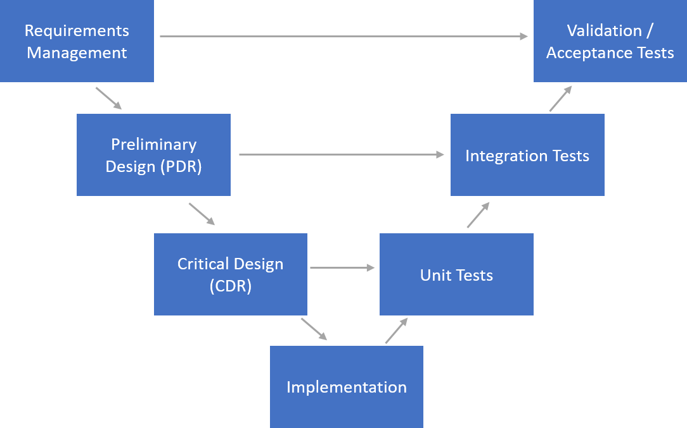
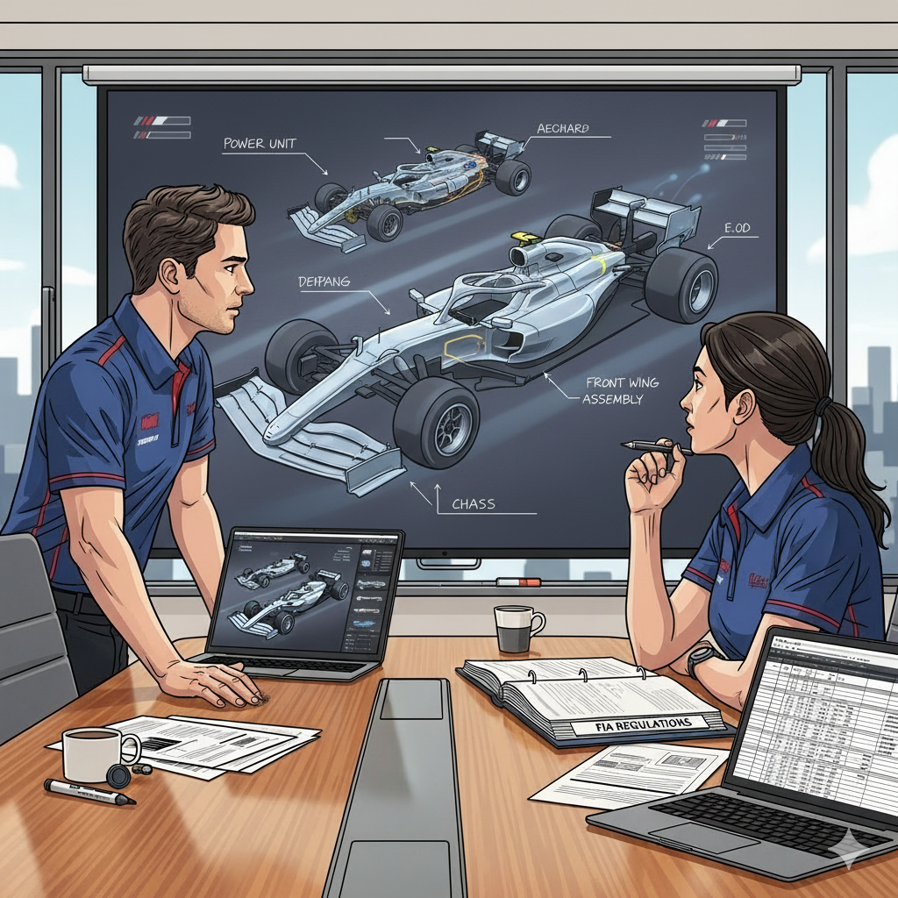
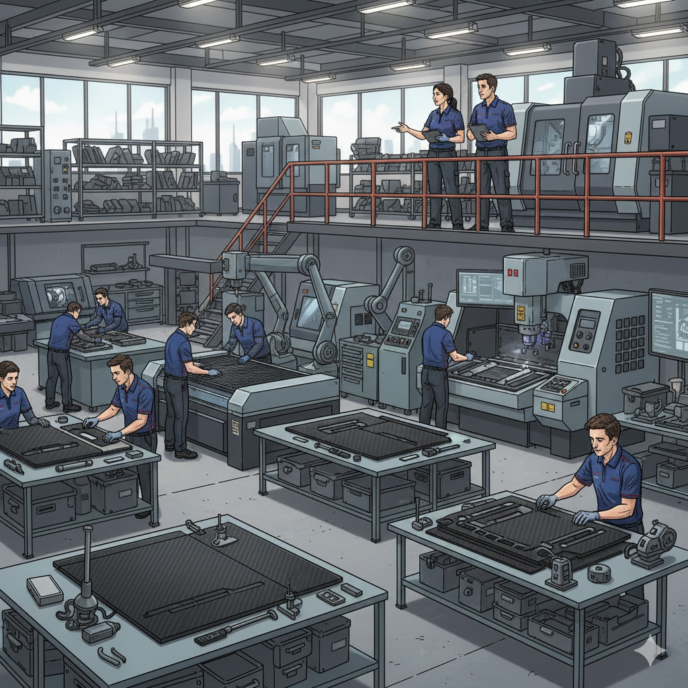
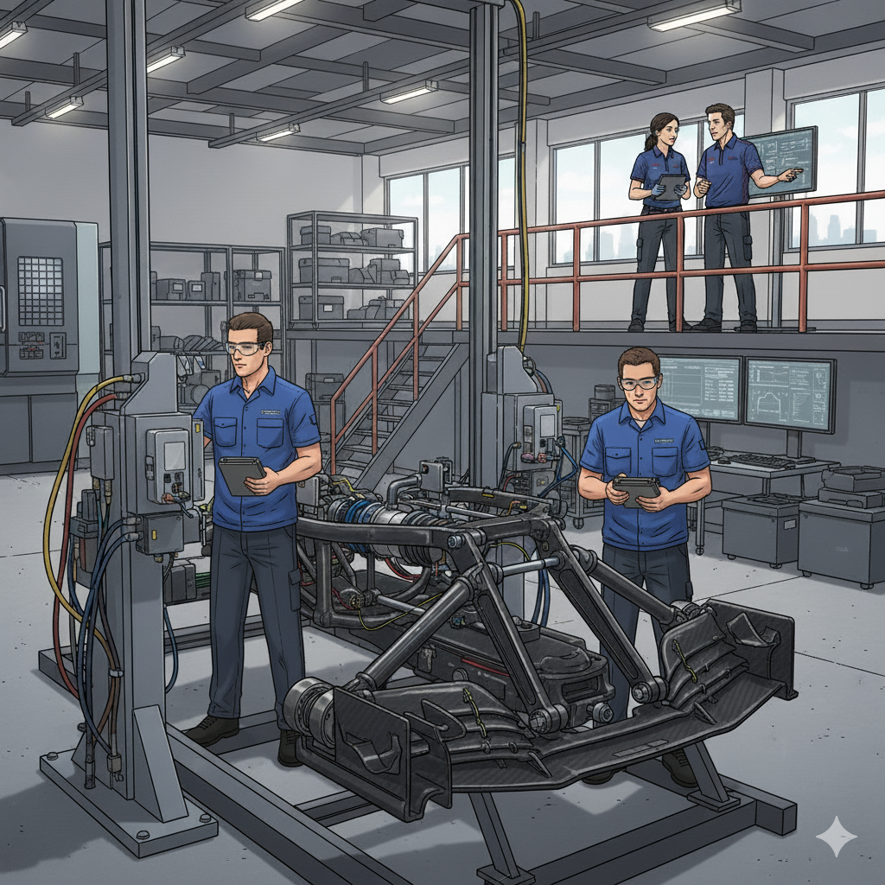
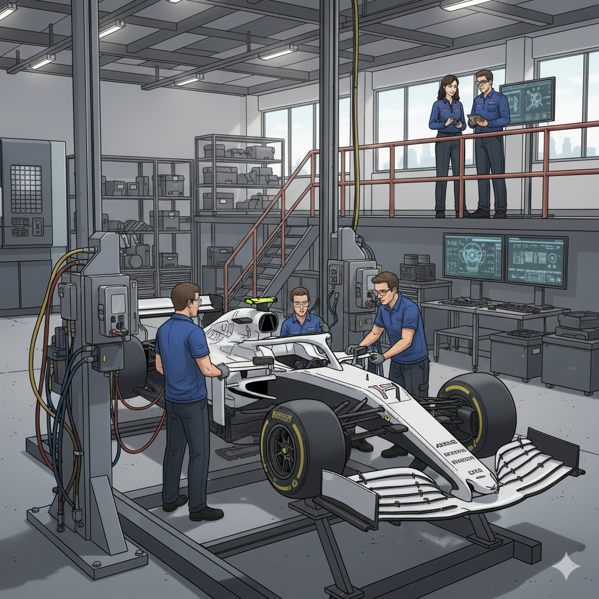
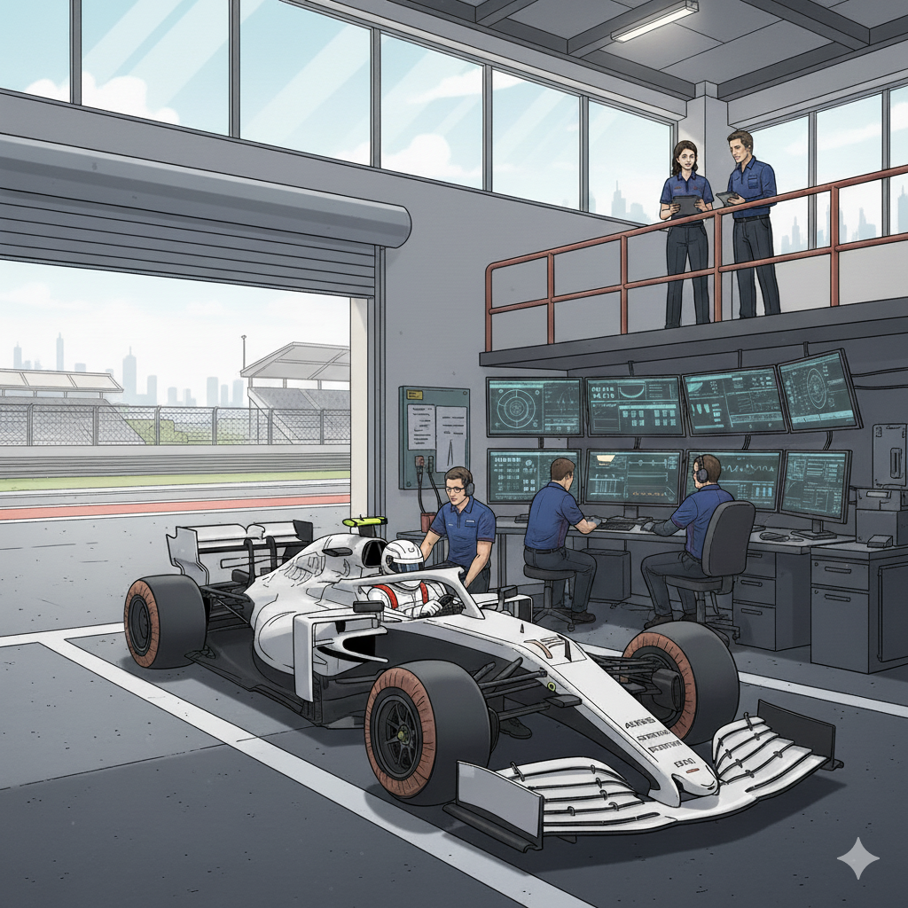
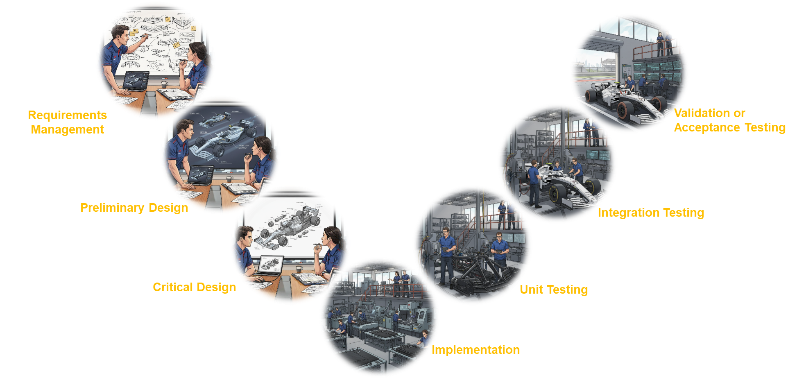

In the world of engineering, one of our biggest challenges isn't solving the technical problem, but **communicating the solution**. We often find ourselves in front of managers, clients, or other departments trying to explain complex processes with dry diagrams or indigestible, hundred-page documents. The result is usually blank stares and a disconnect between the technical team and stakeholders, leading to widespread confusion.

Recently, I faced this very challenge: I needed to present a status and progress report for the implementation of a complex engineering process whose roadmap closely resembled the traditional **V-Model of systems engineering**. Instead of resorting to the usual diagram, I decided to experiment and find a more engaging analogy. What if I could use AI not just to analyze data, but to tell a story?

This post is the chronicle and result ([Downloadable template](Nanobana_engineering.pptx)) of how I used Google's AI tool, **Nanobanana**, to transform an engineering roadmap into an attractive visual presentation, using an analogy that almost everyone understands and admires: **the design of a Formula 1 car**.

### The Challenge: Making the V-Model Understandable

For those unfamiliar, the V-Model is a development model that represents the sequence of phases in a product's design or development lifecycle. Its great virtue is that it connects each design and development phase with its corresponding testing phase, ensuring that everything specified is verified.

It sounds logical, but its standard graphical representation can be abstract and uninspiring for those who are not familiar with it. In my case, for the simile of the process I was presenting, I used a variation of the basic V-diagram as illustrated below, instead of the traditional V-diagram used in Hardware or Software design which has a deeper level of detail:

The V-diagram would help make the initiative's roadmap easier to understand, but for the concept to truly sink in and leave a lasting image in each stakeholder's mind, I needed a powerful metaphor. And few things combine design, testing, and a clear performance objective like the creation of an F1 car.

### The Tool: Nanobanana to the Rescue

To bring this idea to life, I turned to **Nanobanana**, an AI tool specializing in generating images and visuals with a clean and consistent style. Its strength lies in its ability to create images that are true to the requested context and to maintain coherence across different interactions—as was my case, where I sought to create an evolutionary flow of images for the design that followed the metaphor's narrative thread, instead of using loose, disconnected images..

### The Visual Roadmap: Designing an F1 Car Phase by Phase

The plan was simple: for each phase of the V-Model, I would generate an image representing the equivalent stage in the design of a race car. Here is the detail of each phase:

#### Phase 1: Requirements Management

* **In Engineering**: This is the starting point. Here, the client's needs and the system's constraints are defined and documented. What must the product do?
* **The F1 Analogy**: This is the team's initial meeting. The engineers study the strict FIA regulations (the constraints), analyze data from the previous season, and listen to the driver's requests (the client). The goal is clear: to build a winning car.
* **The Prompt for Nanobanana**: "Create an illustrative image of a pair of F1 engineers in a meeting room, analyzing a technical rulebook and sketching initial concepts on a whiteboard."

#### Phase 2: Preliminary Design (System Architecture)

* **In Engineering**: The high-level architecture is defined. How will the system be structured? What are its main components and how do they interact?
* **The F1 Analogy**: The engineers design the overall concept of the car: weight distribution, aerodynamic philosophy, engine integration with the chassis. It's the conceptual skeleton.
* **The Prompt for Nanobanana**: "Maintain a similar scene to the previous one but change the whiteboard in the background to a screen where a conceptual 3D model of an F1 car is being projected, showing its main interconnected systems (engine, chassis, aerodynamics)."

#### Phase 3: Detailed Design

* **In Engineering**: The individual components of the system are designed in detail.
* **The F1 Analogy**: The moment of ultra-specialization. The aerodynamics team designs every millimeter of the front wing; the suspension team, every titanium piece. These are the detailed blueprints for each component.
* **The Prompt for Nanobanana**: "On this same stage, create an image in which an engineer is working on a detailed CAD design or blueprint of the F1 vehicle, visualizing it on the background projection."

#### Phase 4: Implementation

* **In Engineering**: The "coding" or physical component construction phase.
* **The F1 Analogy**: The factory machines start running. Parts are machined, carbon fiber monocoques are molded. The blueprints become tangible reality.
* **The Prompt for Nanobanana**: "Generate a scene with a similar illustration style but depicting the manufacturing process in an F1 factory workshop, showing operators working with carbon fiber parts and precision machinery, with the man and woman from the previous images in the background."

#### Phase 5: Unit Testing

* **In Engineering**: It is verified that each individual component works correctly on its own.
* **The F1 Analogy**: Every manufactured part undergoes exhaustive quality control. The wing is tested in the wind tunnel, the suspension is put through stress tests. Each "unit" is checked to ensure it meets its specification.
* **The Prompt for Nanobanana**: "Generate an image of an F1 suspension component on a stress testing rig, keeping the man and woman in the background supervising the tests."

#### Phase 6: Integration Testing

* **In Engineering**: Components are assembled and tested to ensure they work correctly together.
* **The F1 Analogy**: The chassis, engine, suspension, and aerodynamics come together for the first time. The engine is fired up, and all systems are checked to ensure they communicate and function in harmony.
* **The Prompt for Nanobanana**: "Create an illustration of an F1 car in the garage, on which mechanics are running integration tests, with the man and woman from the previous images supervising in the background."

#### Phase 7: Validation Testing

* **In Engineering**: The complete system is validated to ensure it meets the original client requirements.
* **The F1 Analogy**: The moment of truth. The complete car hits the track for the first time in pre-season testing. Is it fast? Is it reliable? Does it meet the objectives set in that first meeting?
* **The Prompt for Nanobanana**: "Generate an image of an F1 car going out onto a racetrack for its first tests, with engineers monitoring the data and the man and woman from the other images supervising in the background."

From here, it will enter the product maintenance and evolution phase.

### Conclusion: AI as a Universal Translator

In my case, the result was a presentation with these 7 stages as analogies for the implementation phases of my process initiative, where the process ceased to be an abstract concept and became "digestible" and illustrative steps of the proposed plan. The AI, in this case Nanobanana, didn't just generate images; it acted as a **universal translator**, turning technical engineering jargon into a visual language that everyone could understand and follow.

For those who want to create a similar roadmap or story, here is the PowerPoint template with these images for you to adapt to the metaphor or simile that best fits your needs: [Roadmap Metaphor PowerPoint Template](Nanobanana_engineering.pptx)

This experience reinforces my conviction that AI tools are not just for automating tasks, but also for helping us improve other *soft skills*, such as **enhancing our communication abilities**. In a technical world, knowing how to tell a good story is as important as having the right solution. And sometimes, you just need the right analogy and a good AI copilot to bring it to life.

---

#### Sources and Resources:
* **IBM**: [What is the V-model?](https://www.ibm.com/topics/v-model)
* **Nanobanana**: [Official Tool Page](https://gemini.google/overview/image-generation/)
* **Gemini**: [Gemini page for chatbot use with image generation via Nanobanana](https://gemini.google.com/app)