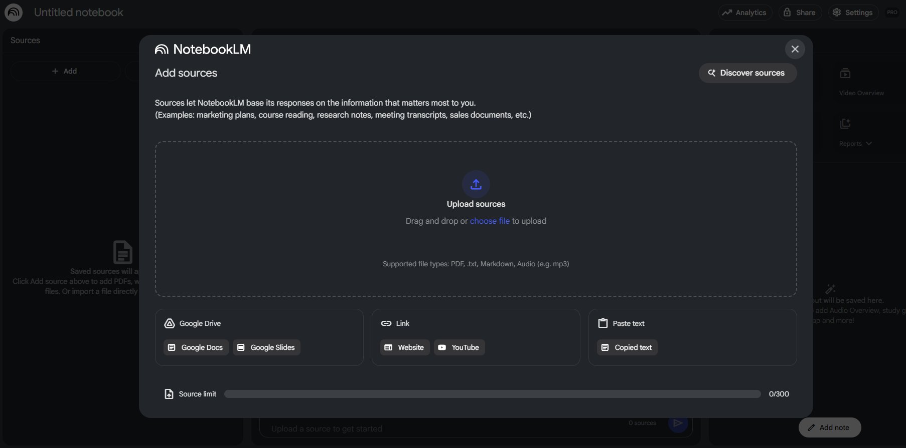
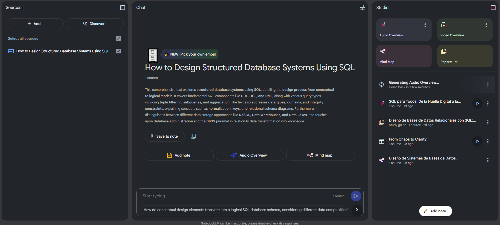
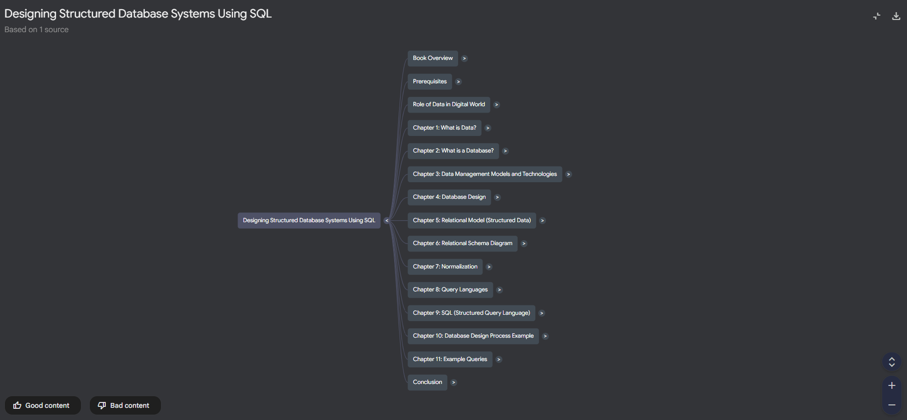

In the current age of information and knowledge, we face a colossal challenge whenever we want to learn something new: mountains of raw information. Books, academic papers, documents of any kind, websites, videos, podcasts... Extracting genuinely useful knowledge from all these sources is an arduous task that consumes our most valuable resource: time. While there is inherent value in drifting through these seas of information to build and consolidate a foundation on any topic, I have always sought tools to optimize this process, allowing me to pinpoint key concepts and guidelines along the way. In this article, I'm going to talk about the most revolutionary tool I've encountered to date, one that is set to completely change my workflow: **Google's NotebookLM**.

To illustrate what it is and to understand its potential, I've based this on a practical example using the very interesting book shared on [freeCodeCamp](https://www.freecodecamp.org/) by **Daniel García Solla**, [**How to Design Structured Database Systems Using SQL**](https://www.freecodecamp.org/news/how-to-design-structured-database-systems-using-sql-full-book/). With the help of NotebookLM, I transformed it into a complete multimedia learning arsenal.

## What is NotebookLM and Why Is It a Silent Revolution?

Imagine a personal research assistant that has perfectly read and understood *only the sources (documents, videos, podcasts, etc.) you provide*. That is the essence of NotebookLM. Unlike other AIs that dive into the entire internet (regardless of the reliability of the sources), NotebookLM is **exclusively based on your sources**.

This simple premise is its superpower. By being "grounded" in your documents, it **eliminates hallucinations and generic answers**. Its knowledge is your knowledge, making it a custom-built expert on any topic you feed it (PDFs, Google Docs, URLs, etc.).

## My Proving Ground: A Technical Book on SQL

To put it to the test, I chose a detailed and specialized source: the complete book [**How to Design Structured Database Systems Using SQL**](https://www.freecodecamp.org/news/how-to-design-structured-database-systems-using-sql-full-book/) shared by **Daniel García Solla** on [freeCodeCamp](https://www.freecodecamp.org/).
My goal was not just to "summarize" it, but to deconstruct and reconstruct it into formats adapted to different learning styles that would facilitate the process of assimilating its concepts.

The first step was as simple as going to the [**NotebookLM**](https://notebooklm.google.com/) tool and creating a new "notebook" by linking the URL with the book's content. In seconds, NotebookLM had not only processed it but was already offering me an initial summary and key questions.

But this was just the beginning...

## From Information to Knowledge: My 4 Creations

This is where the magic begins to happen. Using a series of specific, pre-defined prompts within the tool itself, I had NotebookLM generate several high-value learning resources:

### 1. The Mind Map: The Structure at a Glance 🗺️

To understand the book's architecture, I needed a bird's-eye view. For that, NotebookLM presents a very prominent button called **Mind Map**. By pressing it, as if by magic...

A perfectly organized structure appeared, allowing me to navigate the book's concepts, from the relational model to complex queries, understanding how each piece fit into the whole. Ideal for structuring my study.

### 2. The Video Summary: The Educational Script 🎬

Next trick: could it generate a visual resource like an explanatory video of all this content? The idea was to create a short introductory video on the main concepts from the book, allowing me to see the forest before diving into the trees. To this end, NotebookLM offers a **Video Summary** button. With this, it puts on its video editor hat and, in a few minutes, generates an impressive video summary of key aspects of the book, presented clearly and didactically in a narrative format that keeps the viewer's attention.

**Video summary for the book "How to Design Structured Database Systems Using SQL"**: [Video summary generated by NotebookLM](https://notebooklm.google.com/notebook/b84af865-6950-4686-bb15-0b27e8cc6871?artifactId=3b5fdafe-ce67-4c5b-9c7d-1d1ceba8dd5c)

### 3. The Audio Summary: The Podcast for Learning on the Move 🎧

Still amazed by NotebookLM's capabilities and wanting to review the book's concepts while traveling or working out, I launched the **Audio Summary** feature. Once again, as if by magic, it generated a natural-sounding audio podcast between two people that was easy to follow. The most surprising part was how the tool's AI could adapt the tone, format, and content in a very natural and engaging way to hook the listener.

**Audio summary for the book "How to Design Structured Database Systems Using SQL"**: [Audio summary generated by NotebookLM](https://notebooklm.google.com/notebook/b84af865-6950-4686-bb15-0b27e8cc6871?artifactId=39632a28-da97-4fdf-a8d1-2bf785123896)

### 4. The Study Guide Report: My Ultimate Review Companion 📝

Finally, after consuming the other resources and having delved deeper into the parts of the book that most interested me, I tried the **Reports** feature offered by NotebookLM to consolidate and self-assess my knowledge. Specifically, I launched the **Study Guide** report, and the result was the creation of a series of questions, exercises, and a glossary, all perfectly extracted and formulated, creating an incredibly high-value review tool.

## Final Verdict: Who is NotebookLM For?

After trying it in detail, I believe that **NotebookLM is the definitive tool for deep work focused on a specific topic or body of knowledge**. This stands in contrast to other existing generalist AIs, which are excellent for fostering creativity and open-ended exploration but lack the focus and practicality this tool offers.

In summary, NotebookLM is ideal for:
* **Students and Academics**: To break down papers, textbooks, or notes.
* **Professionals**: To analyze market reports, technical documentation, or legal contracts.
* **Content Creators**: To transform a source of knowledge into multiple content formats.

## Conclusion

NotebookLM is not just a tool for finding answers faster from specific, reliable sources. It is a catalyst for thinking better and/or learning faster and more consciously. NotebookLM allows you to dialogue with your sources, challenge them, and, most importantly, transform them into active and useful knowledge tailored to your needs. This tool will undoubtedly and radically change the process of learning and creation, turning the overwhelming task of "reading and reading" during research and learning phases into an exciting process of "building."

I invite you to try it with your own documents, podcasts, videos... The experience, I assure you, is revealing.

P.S. Oh, and if all that wasn't enough, you can try feeding it sources in other languages and generate the learning outputs in a different language. How about that?

---

#### Sources and References:

* **NotebookLM**: [Official NotebookLM Page](https://notebooklm.google.com/)
* **How to Design Structured Database Systems Using SQL (Post by Daniel García Solla on freeCodeCamp)** [freeCodeCamp post containing the book's content](https://www.freecodecamp.org/news/how-to-design-structured-database-systems-using-sql-full-book/)
* **Example Notebook for the post: How to Design Structured Database Systems Using SQL**: [You can explore the notebook I created for this post here](https://notebooklm.google.com/notebook/b84af865-6950-4686-bb15-0b27e8cc6871)