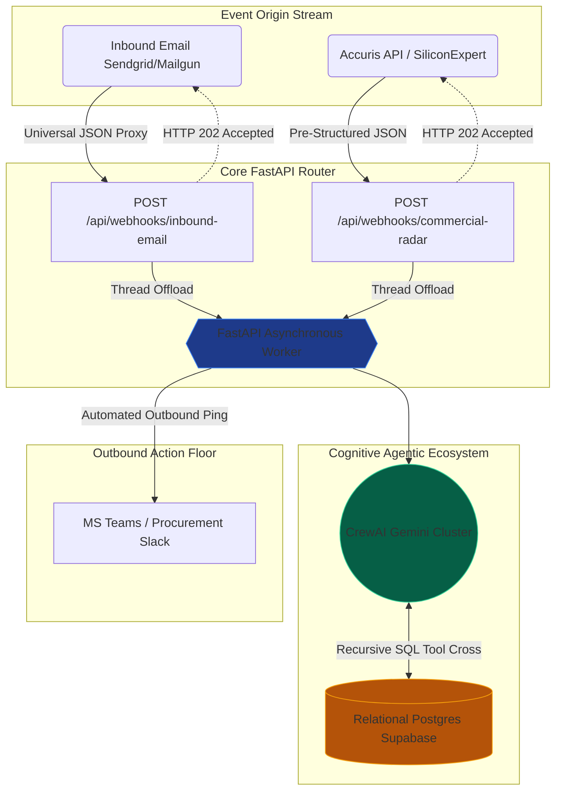

In the previous section of this series, we demonstrated that Artificial Intelligence can calculate the P&L impact of component obsolescence. This was achieved by isolating the semantic inference module from execution, using deterministic SQL tools. 

However, running a Python script locally in a terminal is not suitable for production. Product Discontinuance Notices (PDNs) arrive continuously across global time zones. Supply chain operations require a centralized, continuous, and scalable system.

To achieve production readiness, the architecture must transition to an **Event-Driven Architecture (EDA)**.

### Blueprint Topology: Legacy Vectors vs. Modern API Frameworks

At the architectural level, supply chain logistics systems must accommodate two distinct alert ingestion methods:

1. **The Modern API Vector (B2B SaaS):** Commercial component lifecycle management tools, such as SiliconExpert or Accuris, provide structured data. These platforms dispatch standardized JSON payloads detailing market lifecycle transitions. 
2. **The Legacy Vector (Email):** Many manufacturers and Tier 2 suppliers continue to use plain text emails or PDF attachments to announce fabrication facility shutdowns or EOL statuses. 

**The Software Engineering Decision:** Polling IMAP mailboxes continuously with Python processes is resource-intensive and prone to latency. Instead, we use *Inbound Parse* gateways (like SendGrid or Mailgun). These services intercept emails, extract the relevant properties (Subject, Body), package them into a standardized JSON payload, and forward them to an integration endpoint. Through this approach, both communication channels are normalized into standard HTTPS POST requests.

### Routing Logic: Structuring the Backbone with FastAPI

We utilize **FastAPI** to build the asynchronous microservice in Python. The objective is to deploy a routing layer that directs incoming alerts to the CrewAI framework.

The following simplified code demonstrates the dual webhook implementation:

```python
@app.post("/api/v1/webhooks/commercial-radar")
async def commercial_radar_webhook(alert: CommercialAlert, background_tasks: BackgroundTasks):
    # Vector 1 Protocol: Commercial API Consumption
    synthetic_pdn = f"Manufacturer: {alert.manufacturer}. MPN: {alert.mpn}. Status: EOL."
    
    background_tasks.add_task(process_obsolescence_background, synthetic_pdn)
    return {"status": "accepted"}

@app.post("/api/v1/webhooks/inbound-email")
async def inbound_email_webhook(email: InboundEmail, background_tasks: BackgroundTasks):
    # Vector 2 Protocol: Inbound Parsed Email Payload
    pdn_text = f"Subject: {email.subject}\nBody: {email.text}"
    
    background_tasks.add_task(process_obsolescence_background, pdn_text)
    return {"status": "accepted"}
```

### Asynchronous Execution: Handling LLM Latency

The snippet above highlights a mandatory pattern for web resilience when integrating LLMs. A CrewAI-orchestrated inference cycle typically requires 5 to 15 seconds to complete. This process involves parsing the input, extracting the part number, querying the Supabase relational graph, calculating the financial impact, and formatting the response.

Keeping the HTTP socket open while awaiting this execution will cause the sending API (e.g., SendGrid) to encounter a Timeout error (usually capped at 10 seconds), leading to redundant internal retries. The standard solution is to decouple the execution using **Background Tasks**. 

The server immediately returns an "HTTP 202 Accepted" status code, closing the connection with the client. Concurrently, the internal worker instantiates the LLM operations in the background without blocking network resources.

### The Closed Control Loop: System Notifications

If the autonomous agent successfully evaluates the downtime risk but only logs the output locally, the system does not fulfill its operational purpose. The output data must be pushed to the relevant stakeholders.

The final stage of the architecture involves sending the generated mitigation brief to the procurement team's communication channels (such as Microsoft Teams or Slack) via an outbound webhook.

```python
def process_obsolescence_background(pdn_text: str):
    # ... Multi-Agent Inference Iteration ...
    assessment = execute_obsolescence_analysis(pdn_text)
    
    # MS Teams/Slack Procurement Alert
    header = f"🚀 Agentic P&L Alert Processed\n"
    notify_teams(header + str(assessment))
```

### Complete System Architecture

The integration of these modules forms an event-driven pipeline where SQL table queries and LLM text processing operate together asynchronously.



### Next Steps 

We have configured the data ingestion engine (Block 2), established the semantic inference framework (Block 3), and deployed an API-centric service to process global component anomalies 24/7 (Block 4). 

In the final segment of this engineering series, we will focus on data visualization. We will document how to expose these asynchronous alerts by building an **Executive Dashboard**, making the agent's operations accessible for management review.
