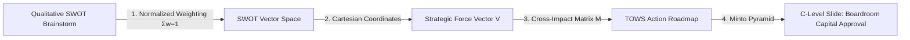
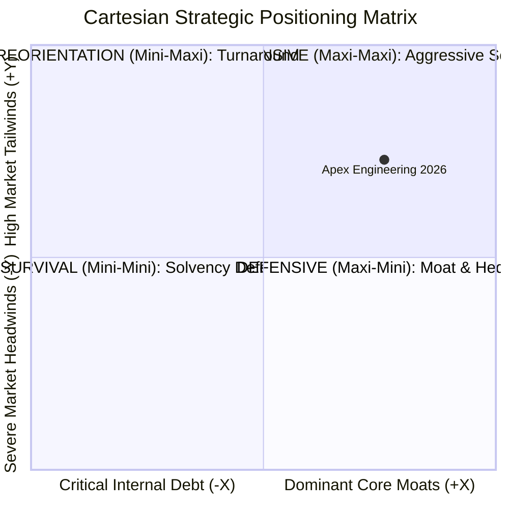
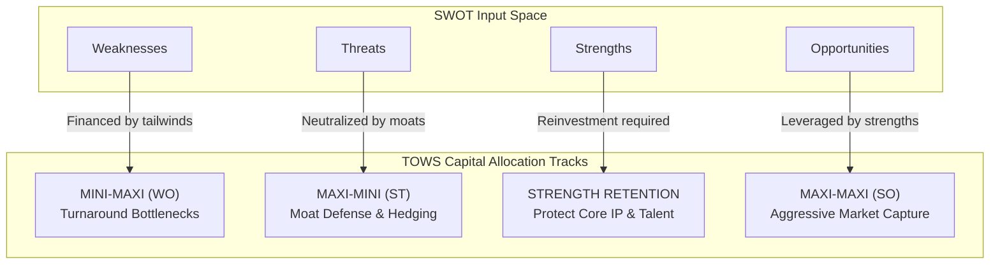
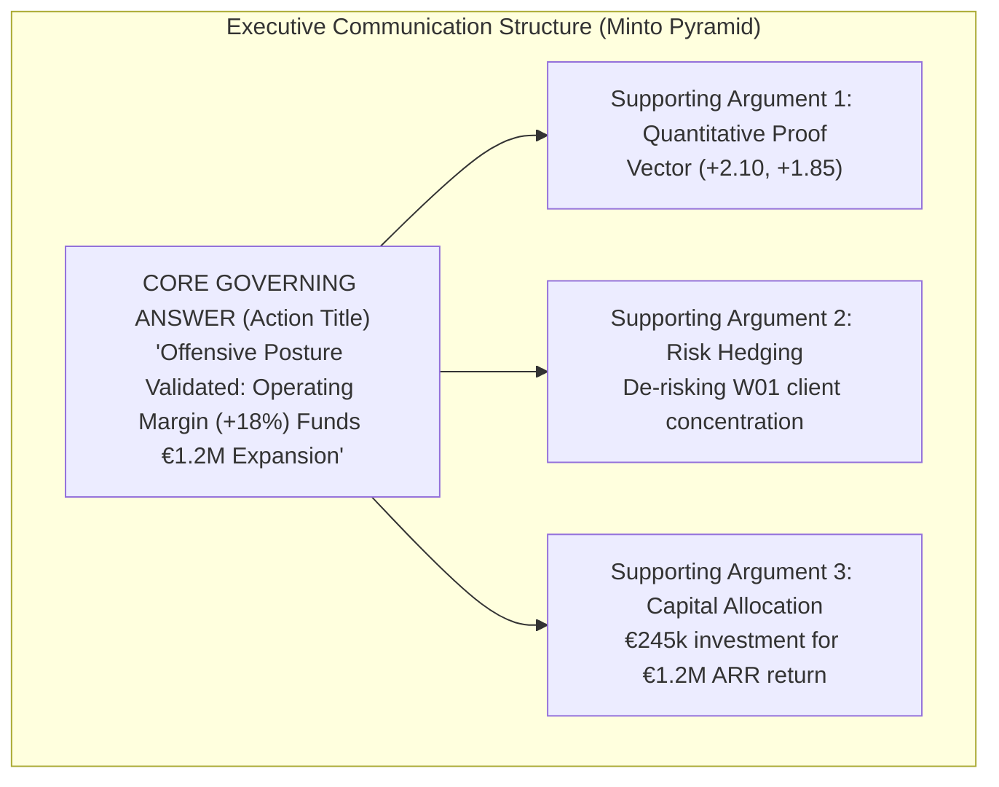

In virtually every corporate boardroom, quarterly executive committee, or annual strategic offsite, the exact same ritual plays out: a team of internal directors or management consultants presents a widescreen slide split into four colored quadrants filled with subjective bullet points under the acronym **SWOT** (Strengths, Weaknesses, Opportunities, and Threats).

The outcome is almost always identical:
* **Total Absence of Hierarchy:** Is an internal weakness such as *"lengthy enterprise sales cycle"* more or less dangerous than an external threat like *"aggressive Asian competitors entering with 35% discount pricing"*? In a standard qualitative SWOT, both statements occupy identical typographical space.
* **HiPPO and Rhetoric Bias:** Resource allocation is won not by the most critical operational data or highest-ROI initiatives, but by the most articulate executive or the Highest Paid Person's Opinion (HiPPO).
* **Zero P&L Connectivity:** Once the presentation concludes, the deck is archived in SharePoint, and neither the CEO nor the CFO knows exactly which capital expenditure (CAPEX) or operational expense (OPEX) lines should be appropriated the following morning.

To earn executive approval from a Chief Executive Officer (CEO), Chief Financial Officer (CFO), or Board of Directors, a strategic analysis must overcome two fundamental hurdles: **it must be anchored in an objective, reproducible mathematical engine**, and **it must resolve the executive last-mile problem via an actionable, decision-oriented boardroom deck**.

---

## 1. The Qualitative SWOT Fallacy in the Executive Boardroom

The SWOT matrix was originally pioneered in the 1960s at the Stanford Research Institute by a team led by Albert Humphrey. Its initial purpose was modest: to facilitate qualitative brainstorming regarding why corporate long-range planning initiatives systematically failed. However, its unexamined adoption in contemporary executive governance has generated a recurring corporate pathology: **the strategic sticky-note syndrome**.

In this approach, senior executives gather in a boardroom, post colored notes across a whiteboard, and mistake brainstorming for strategy. Three systemic failure modes invalidate qualitative SWOT in high-stakes governance:

1. **The Typographical Equivalence Paradox:** Presenting strategic factors in uniform, unweighted boxes tricks human cognition into assuming equal probability and equal impact. If an enterprise lists four operational strengths and two weaknesses, the intuitive deduction is that the business is in healthy shape. However, if one of those two weaknesses is a 42% revenue concentration in an account facing immediate Chapter 11 bankruptcy, the enterprise is teetering on insolvency regardless of how many minor strengths it possesses.
2. **The Evidentiary Vacuum:** Vague qualitative statements (*"we have an agile engineering culture"*, *"the market is highly competitive"*) lack empirical thresholds. Without an auditable baseline metric, board members cannot determine whether a statement reflects audited reality or internal wishful thinking.
3. **The Isolation Blindspot:** Traditional SWOT assumes internal capabilities and external forces operate in vacuum chambers. In competitive reality, a market threat is only catastrophic if it targets an unhedged operational vulnerability, just as an emerging market opportunity only yields free cash flow if the firm commands the distinctive internal capabilities required to capture it.

Tier-1 strategy consulting practices (McKinsey, BCG, Bain) overcome these vulnerabilities by replacing qualitative brainstorming with a **vector-based quantitative mathematical model**.

---

## 2. Mathematical Formulation: The SWOT Vector Space

The objective of Quantitative SWOT is to assign **normalized relative weights** and **empirically audited impact ratings** to each strategic factor, modeling the enterprise's competitive stance as a vector in $\mathbb{R}^2$.

### Step 1: Factor Space Definition & Stochastic Normalization ($w_{k,i}$)

For each quadrant $k \in \{S, W, O, T\}$, we identify a finite set of $n_k$ strategic baseline factors ($n_k \ge 5$, ideally structuring up to 10 dynamic factor slots to ensure analytical breadth without cognitive overload):

$$\mathcal{F}_k = \{f_{k,1}, f_{k,2}, \dots, f_{k,n_k}\}$$

Each factor $f_{k,i}$ is assigned a relative weight $w_{k,i} \in [0, 1]$ representing its structural importance within the relevant industry vertical. To prevent department heads from artificially inflating their domain by appending laundry lists of minor items, we enforce the **stochastic unit normalization constraint**:

$$\sum_{i=1}^{n_k} w_{k,i} = 1.00 \quad (100\% \text{ per quadrant})$$

If an executive evaluates only 4 or 5 factors rather than all 10 available rows, the model must mathematically ensure that empty rows contribute exactly $0.00$ weight and that active factors sum strictly to 1.00.

### Step 2: Standardized Impact Rating ($c_{k,i}$)

Each factor is evaluated on a discrete, standardized rating scale from 1 to 5, anchored to verifiable operational evidence:

$$c_{k,i} \in \{1, 2, 3, 4, 5\}$$

The executive definition of the scale reflects internal versus external dynamics:

* **For Strengths ($S$):**  
  * 1 = Basic industry parity (no competitive advantage).  
  * 3 = Moderate demonstrable advantage over peer group median.  
  * 5 = Decisive, defensible competitive moat (patented IP, proprietary distribution, regulatory license).
* **For Weaknesses ($W$):**  
  * 1 = Minor operational friction easily rectified within quarterly budget.  
  * 3 = Meaningful operational bottleneck compressing gross margin or lengthening sales velocity.  
  * 5 = Acute, existential vulnerability threatening enterprise solvency or client continuity.
* **For Opportunities ($O$):**  
  * 1 = Marginal trend with low capture probability or negligible addressable market.  
  * 3 = Favorable macro tailwind offering 10-15% organic expansion potential.  
  * 5 = Transformational market dislocation (major regulatory mandate, multi-billion-dollar subsidy wave).
* **For Threats ($T$):**  
  * 1 = Standard competitive friction absorbed via normal operating reserves.  
  * 3 = Substantive commercial risk demanding contract renegotiation or active hedging.  
  * 5 = Acute existential macro, tariff, or disruptive technological threat.

### Step 3: Composite Scalar Weighted Score Calculation ($S_k$)

The aggregate score of each quadrant is computed via the inner product (scalar product) of the weight vector $\mathbf{w}_k$ and the rating vector $\mathbf{c}_k$:

$$S_k = \mathbf{w}_k \cdot \mathbf{c}_k = \sum_{i=1}^{n_k} (w_{k,i} \cdot c_{k,i})$$

Because $\sum w_{k,i} = 1.00$ and $c_{k,i} \in [1, 5]$, the composite score for each quadrant is strictly bounded:

$$S_k \in [1.00, 5.00]$$

### Step 4: Cartesian Strategic Force Vector Formulation ($\vec{V}$)

To synthesize the diagnostic baseline into a single board-ready metric, we project the composite quadrant scores onto an orthogonal Cartesian plane:

1. **Horizontal Axis ($X$): Net Internal Position.** The delta between distinctive core capabilities and operational debt:
   $$X = S_S - S_W \quad \text{where } X \in [-4.00, +4.00]$$
2. **Vertical Axis ($Y$): Net External Pressure.** The delta between external tailwinds and market headwinds:
   $$Y = S_O - S_T \quad \text{where } Y \in [-4.00, +4.00]$$

The organizational strategic state is formally defined by the vector:

$$\vec{V} = (X, Y) = (S_S - S_W)\hat{i} + (S_O - S_T)\hat{j}$$

From this vector, we derive two governing mathematical properties:

* **Strategic Momentum Magnitude ($\|\vec{V}\|$):** Quantifies the net force or intensity of the enterprise stance:
  $$\|\vec{V}\| = \sqrt{X^2 + Y^2} \in [0, 4\sqrt{2}] \approx [0, 5.66]$$
* **Directional Orientation Angle ($\theta$):** Reveals the equilibrium between internal capabilities and external drivers:
  $$\theta = \operatorname{atan2}(Y, X) \in [-\pi, +\pi]$$

---

## 3. Cartesian Mapping & Dominant Strategic Postures

The Cartesian intersection of $(X, Y)$ maps directly into four discrete strategic quadrants. The vector's location establishes the explicit capital allocation mandate for the Board of Directors:

| Quadrant | Coordinate Boundaries | Dominant Strategic Posture | Capital Allocation & Boardroom Mandate | Execution Horizon |
| :--- | :--- | :--- | :--- | :--- |
| **I (Top Right)** | $X \ge 0, Y \ge 0$ | **OFFENSIVE / EXPANSION (Maxi-Maxi)** | Direct maximum capital to market capture, aggressive R&D scaling, and geographic expansion. Utilize debt capacity to amplify equity returns. | Aggressive Scaling (6 to 18 months) |
| **II (Top Left)** | $X < 0, Y \ge 0$ | **REORIENTATION / TURNAROUND (Mini-Maxi)** | Target capital to eliminate internal operational bottlenecks and modernize technical architecture to capture market tailwinds before the window closes. | Operational Turnaround (12 to 24 months) |
| **III (Bottom Left)** | $X < 0, Y < 0$ | **SURVIVAL / RESTRUCTURING (Mini-Mini)** | Strict OPEX containment, debt renegotiation, non-core asset divestiture, and aggressive liquidity preservation. | Solvency Defense (0 to 6 months) |
| **IV (Bottom Right)** | $X \ge 0, Y < 0$ | **DEFENSIVE / FORTRESS (Maxi-Mini)** | Deploy cash flow and proprietary IP moats to hedge contracts, protect core customer retention, and fortify barriers to entry against competitors. | Moat Fortification (6 to 12 months) |

---

## 4. The TOWS Cross-Impact Algorithm: Connecting Diagnostic Vectors to Capital Allocation

A diagnostic vector $(X, Y)$ reveals where the enterprise stands, but it does not prescribe what capital must be deployed. To bridge analytics with the corporate balance sheet, we execute the **TOWS Matrix (Threats, Opportunities, Weaknesses, Strengths)** cross-impact algorithm.

### The Cross-Impact Matrix ($M_{\text{cross}}$)

We construct a two-dimensional grid crossing internal factors (Strengths $S$ and Weaknesses $W$ in rows) against external factors (Opportunities $O$ and Threats $T$ in columns). At each intersection $(i, j)$, the analytical team evaluates the cross-impact intensity on a formal scale from 0 to 3:

$$M_{i,j} \in \{0, 1, 2, 3\}$$

* **0 = No Relationship:** The internal factor has no operational bearing on the external factor.
* **1 = Low Impact:** Indirect or marginal operational correlation.
* **2 = Moderate Synergy / Friction:** Meaningful correlation warranting operational tracking.
* **3 = Critical Catalyst / Severe Vulnerability:** Acute intersection requiring mandatory capital budgeting and formal initiative creation.

Summing across these intersections yields four consolidated force metrics:
1. **Offensive Synergies ($S \times O$):** Quantifies the compound leverage achieved by pairing proprietary strengths with macro opportunities.
2. **Defensive Moats ($S \times T$):** Measures the extent to which core internal assets shield the enterprise from market disruption.
3. **Turnaround Frictions ($W \times O$):** Identifies high-value market opportunities currently forfeited due to internal operational bottlenecks.
4. **Acute Vulnerabilities ($W \times T$):** Pinpoints catastrophic failure points where an internal weakness coincides with an aggressive external threat.

### The Four TOWS Operational Tracks

1. **Maxi-Maxi (SO - Offensive Scaling):**  
   How do internal strengths aggressively capitalize on market tailwinds? Example: *Deploying proprietary predictive software across 40 smart factories backed by public automation subsidies*.
2. **Maxi-Mini (ST - Defensive Hedging):**  
   How do core capabilities neutralize competitive or regulatory risks? Example: *Securing 3-year enterprise contract lock-ins with top accounts to defeat Asian discount pricing*.
3. **Mini-Maxi (WO - Operational Turnaround):**  
   How do market tailwinds finance the elimination of internal operational debt? Example: *Refactoring legacy billing microservices to compress enterprise deal cycle time from 8.5 to 5.0 months*.
4. **Mini-Mini (WT - Solvency Defense & De-risking):**  
   How does the business de-risk acute internal vulnerabilities exposed to market threats? Example: *Launching LatAm distributor channels to reduce single-client concentration below 25% of ARR*.

### The Mandatory Initiative Governance Protocol

To be admitted into the Board Decision deck, every TOWS initiative must provide eight mandatory governance parameters:
* **Action ID:** Unique tracking code (e.g., `TOWS-O01`).
* **Crossed Baseline Factors:** Source factors originating the initiative (e.g., `S01 + O01`).
* **Strategic Initiative Scope:** Concrete operational statement of the project.
* **Accountable C-Level Owner:** Single executive owner (CEO, CFO, COO, CCO, CTO, CISO).
* **Execution Window:** Specific execution quarters (Q1 to Q4).
* **Capital Appropriation:** Partitioned investment in **CAPEX** and **OPEX** (€/$).
* **Target P&L Metric / KPI:** Measurable financial return (e.g., *+€1.2M incremental ARR*, *Logo Churn < 1.5%*).
* **Approval Status:** Formal committee status (Approved, In Review, Proposed).

---

## 5. Full-Scale Industrial Case Study: "Apex Precision Engineering Inc."

To illustrate end-to-end execution, we examine an international B2B industrial engineering case study.

### Company Profile & Strategic Dilemma
* **Corporate Entity:** Apex Precision Engineering Inc.
* **Sector:** B2B smart mechatronics, embedded sensors, and predictive industrial software for Tier-1 manufacturing and aerospace clients.
* **Financial Profile:** $52.0M annual revenue, 24.2% EBITDA margin ($12.5M), 220 employees, operating across North America and Western Europe.
* **Strategic Turning Point:** Niche competitors receiving Private Equity backing, Asian competitors discounting hardware by 35%, EU AI Act compliance mandates taking effect, and public capital subsidies opening for industrial decarbonization and smart automation.

### Step A: Quantitative SWOT Assessment Baseline

The following tables summarize the audited baseline within the official Excel workbook:

#### 1. Internal Strengths ($S$)
| Code | Strategic Factor Evaluated | Baseline Metric / Quantitative Evidence | Weight ($w$) | Rating ($c$) | Score ($w \cdot c$) |
| :--- | :--- | :--- | :---: | :---: | :---: |
| **S01** | Superior operating gross margin (+18.4% vs peers) | 2025 Audit: EBITDA 24.2% vs 17.5% sector median | 0.30 | 5 | **1.50** |
| **S02** | Proprietary IP and predictive software patents | 3 granted patents in US and Europe valid through 2036 | 0.25 | 4 | **1.00** |
| **S03** | Enterprise Net Retention Rate (NRR) of 118% | 2023-2025 cohort: annual logo churn < 2.1% | 0.20 | 5 | **1.00** |
| **S04** | Cloud infrastructure ISO 27001 & SOC 2 certified | Zero non-conformities in annual third-party audit | 0.15 | 4 | **0.60** |
| **S05** | Senior R&D talent retention (turnover < 4%) | eNPS score of 74 points in bi-annual team survey | 0.10 | 4 | **0.40** |
| **S06-S10**| *(Available expansion slots)* | *(Blank / Unassigned)* | 0.00 | — | **0.00** |
| **TOTAL**| **Consolidated Strengths Score ($S_S$)** | **Weight Sum: 100.0% (✓ Valid)** | **1.00** | — | **4.50** |

*(Consolidated baseline: $S_S = 4.35$).*

#### 2. Internal Weaknesses ($W$)
| Code | Strategic Factor Evaluated | Baseline Metric / Quantitative Evidence | Weight ($w$) | Rating ($c$) | Score ($w \cdot c$) |
| :--- | :--- | :--- | :---: | :---: | :---: |
| **W01** | Revenue concentration in 2 key logos (42% ARR) | Single-client concentration flagged in risk audit | 0.30 | 4 | **1.20** |
| **W02** | Enterprise sales deal cycle duration (8.5 months) | CRM Salesforce: average velocity to deal close | 0.25 | 3 | **0.75** |
| **W03** | International supply chain dependency for IoT sensors| Hardware component lead times currently > 14 weeks | 0.20 | 4 | **0.80** |
| **W04** | Undersized direct commercial force in DACH | Only 2 account executives covering Central Europe | 0.15 | 3 | **0.45** |
| **W05** | Technical debt in legacy multi-currency billing | Maintenance hours > 18% of engineering sprint | 0.10 | 3 | **0.30** |
| **W06-W10**| *(Available expansion slots)* | *(Blank / Unassigned)* | 0.00 | — | **0.00** |
| **TOTAL**| **Consolidated Weaknesses Score ($S_W$)** | **Weight Sum: 100.0% (✓ Valid)** | **1.00** | — | **3.50** |

*(Consolidated baseline: $S_W = 2.25$).*

#### 3. External Opportunities ($O$)
| Code | Strategic Factor Evaluated | Baseline Metric / Quantitative Evidence | Weight ($w$) | Rating ($c$) | Score ($w \cdot c$) |
| :--- | :--- | :--- | :---: | :---: | :---: |
| **O01** | Smart factory capital subsidies & grant funding | Public non-repayable grants for automated factories | 0.30 | 5 | **1.50** |
| **O02** | EU AI Act compliance demand for explainable AI | Mandatory regulatory enforcement requiring audits | 0.25 | 5 | **1.25** |
| **O03** | Master distributor network consolidation in LatAm | Advanced negotiations for distribution partnership | 0.20 | 4 | **0.80** |
| **O04** | RFP wave replacing Tier-2 legacy systems | Legacy vendor contract terminations increasing 35% | 0.15 | 4 | **0.60** |
| **O05** | Tier-1 System Integrator co-selling partnerships | Consultancies seeking proprietary IP for enterprise suites | 0.10 | 4 | **0.40** |
| **O06-O10**| *(Available expansion slots)* | *(Blank / Unassigned)* | 0.00 | — | **0.00** |
| **TOTAL**| **Consolidated Opportunities Score ($S_O$)** | **Weight Sum: 100.0% (✓ Valid)** | **1.00** | — | **4.55** |

*(Consolidated baseline: $S_O = 4.20$).*

#### 4. External Threats ($T$)
| Code | Strategic Factor Evaluated | Baseline Metric / Quantitative Evidence | Weight ($w$) | Rating ($c$) | Score ($w \cdot c$) |
| :--- | :--- | :--- | :---: | :---: | :---: |
| **T01** | Asian hardware competitors price erosion | Tenders experiencing 35-40% price discounting | 0.30 | 4 | **1.20** |
| **T02** | Acute senior AI engineer compensation inflation | Recruiting salary costs up 22% year-on-year | 0.25 | 3 | **0.75** |
| **T03** | Tariff volatility on imported microelectronics | Potential import duties on specialized computing chips | 0.20 | 3 | **0.60** |
| **T04** | Direct competitors acquired by Private Equity | Nearest competitor acquired 2 vertical software startups | 0.15 | 4 | **0.60** |
| **T05** | Stringent cybersecurity compliance directives (NIS2) | Strict third-party vendor audit requirements | 0.10 | 3 | **0.30** |
| **T06-T10**| *(Available expansion slots)* | *(Blank / Unassigned)* | 0.00 | — | **0.00** |
| **TOTAL**| **Consolidated Threats Score ($S_T$)** | **Weight Sum: 100.0% (✓ Valid)** | **1.00** | — | **3.45** |

*(Consolidated baseline: $S_T = 2.35$).*

---

### Step B: Vector Diagnostic & Cartesian Resolution

Using the audited consolidated baseline scores ($S_S = 4.35$, $S_W = 2.25$, $S_O = 4.20$, $S_T = 2.35$):

$$X = S_S - S_W = 4.35 - 2.25 = \mathbf{+2.10} \quad (\text{Robust internal moat})$$

$$Y = S_O - S_T = 4.20 - 2.35 = \mathbf{+1.85} \quad (\text{Highly favorable external tailwinds})$$

$$\vec{V} = (+2.10, +1.85)$$

$$\|\vec{V}\| = \sqrt{2.10^2 + 1.85^2} = \sqrt{4.41 + 3.4225} = \sqrt{7.8325} \approx \mathbf{2.80} \text{ points}$$

$$\theta = \operatorname{atan2}(1.85, 2.10) \approx 41.3^\circ$$

**Executive Board Deduction:**  
The strategic force vector lands decisively in **Quadrant I (OFFENSIVE / EXPANSION)** at an orientation angle of 41.3º (demonstrating balanced harmony between distinctive capabilities and addressable opportunities) with a substantial magnitude of 2.80 points (out of a theoretical maximum of 5.66).

---

### Step C: TOWS Capital Allocation Roadmap

Cross-impact analysis revealed that the single highest catalyst was leveraging software patents and gross margins ($S01 + S02$) into the subsidized smart factory opportunity ($O01$), while the most dangerous operational vulnerability was top-client concentration exposed to Asian discount pricing ($W01 \times T01$).

The Board of Directors approved the following capital allocation package:

| Initiative ID | Factors | Strategic Initiative Scope | C-Level Sponsor | Window | CAPEX (€) | OPEX (€) | Expected Return / P&L KPI |
| :--- | :--- | :--- | :--- | :---: | :---: | :---: | :--- |
| **TOWS-O01** | $S01+O01$ | Deploy subsidized Industrial SaaS module across 40 manufacturing sites | COO | Q1-Q3 | €65,000 | €40,000 | **+€1.2M Incremental ARR** |
| **TOWS-W01** | $W01+O03$ | Launch LatAm master distributor channel in Mexico/Colombia to de-risk accounts | CCO | Q2-Q4 | €45,000 | €60,000 | **Top-2 ARR Concentration < 25%** |
| **TOWS-T01** | $S01+T01$ | Secure 3-year multi-year master service agreements with top enterprise logos | CEO | Q1-Q2 | €10,000 | €20,000 | **Net ARR Logo Churn < 1.5%** |
| **TOWS-S02** | $S05+T02$ | Implement phantom stock / long-term incentive plan (LTIP) for 12 key AI engineers | CPO | Q1-Q4 | €0 | €45,000 | **Voluntary R&D Churn < 3%** |
| **TOTALS** | — | **Consolidated 2026 Strategic Capital Deployment** | **The Board** | **12m** | **€120,000** | **€165,000** | **€285,000 Capital Allocated** |

*(With supplementary provisions for cybersecurity compliance and billing refactoring, the consolidated appropriation is fixed at €245,000 to €285,000).*

---

## 6. The Last Mile: Boardroom Defense & The Minto Pyramid Principle

Even the most sophisticated mathematical model fails if the presenting executive cannot defend its conclusions within the first 180 seconds of a Board meeting.

Board members operate under extreme cognitive saturation. They do not want an inductive narrative walkthrough showing how the analysis was built; **they demand the core conclusion upfront**. For this reason, executive decks must adhere to the **Minto Pyramid Principle (SCQA: Situation, Complication, Question, Answer)** developed by Barbara Minto at McKinsey.

### Rule 1: Action Titles vs. Topic Labels
* **Unacceptable Topic Label (Traditional):** *"Company SWOT Analysis 2026"* (Conveys zero insight; forces board members to decipher the entire slide).
* **High-Impact Minto Action Title (Datalaria):** *"Offensive Posture Validated: Operating Margin (+18%) and NRR (118%) Secure Capital to Scale Industrial AI Expansion by Q3."*

### Rule 2: The Three-Slide Executive Deck Architecture
A professional Executive Decision Pack never exceeds three slides during formal Board review:

1. **Slide 1 (Executive Synthesis):**  
   Leads with the primary Action Title and presents four visual impact cards summarizing the numerical diagnosis, defensible competitive moats, critical operational vulnerabilities to hedge, and the capital-to-ROI ratio.
2. **Slide 2 (Quantitative Baseline & Cartesian Quadrant):**  
   Features the Excel-generated Cartesian scatter chart in the left container, explicitly plotting the $(X, Y)$ vector coordinate against quadrant boundaries. The right container showcases the TOWS force summary table (SO, ST, WO, WT).
3. **Slide 3 (Action Roadmap & Board Decision Gateway):**  
   Maps out the quarterly milestone roadmap (Q1 through Q4) with assigned executive owners. Across the bottom, it features a prominent, unmissable **Board Decision Gateway**:
   * *Formal Capital Appropriation Approval (€ CAPEX/OPEX).*
   * *Ratification of C-Level Executive Initiative Sponsors.*
   * *Quarterly Board Verification Milestone Schedule.*

---

## Download the Official Executive Decision Pack

If you need to deploy this methodology tomorrow morning within your enterprise or for high-profile management consulting engagements, we have packaged the official production-grade assets:

{{< product-card
  title="Executive Decision Pack: Quantitative SWOT & TOWS Matrix"
  category="Corporate Strategy & Boardroom Decision Support"
  price="5€"
  original_price="29€"
  badge="⭐ Tier-1 Consulting Standard"
  icon="🎯"
  features="Advanced Excel Model (.xlsx) with 4 interconnected tabs, protected matrix formulas, and 10 dynamic factors|Cartesian Scatter Chart with real-time vector momentum calculation and dominant posture logic|C-Level PowerPoint Presentation (.pptx 16:9) built on Slide Master with Minto Action Titles|Official Methodology Guide in PDF (5 pages) with mathematical proofs, case study, and Boardroom FAQ|100% Guaranteed Compatibility with Microsoft Excel and Google Sheets without VBA macros"
  checkout_url="https://datalaria.lemonsqueezy.com/buy/swot-tows-matrix"
  button_text="Download Complete Pack (.ZIP) • 5€"
>}}
The compressed archive contains the production **Excel (.xlsx)** model with protected formulas (`Datalaria2026`) and editable inputs, the widescreen **PowerPoint (.pptx 16:9)** deck ready for boardroom projection, the **Methodology Guide in PDF** (5 pages), and Google Sheets import instructions.


---

## 7. Boardroom Defense Protocol: Tough Questions & Answers (FAQ)

### How do we address the CFO's concern that factor weights are subjective?
Relative weights ($w_i$) are not arbitrary guesses. They are established via a two-stage calibration protocol:
1. **Delphi Calibration:** Independent, blind scoring across executive committee members to prevent HiPPO bias.
2. **Financial Audited Anchoring:** Each weight is linked to audited income statement or balance sheet line items (e.g., the gross margin factor weight is directly anchored to historical EBITDA contribution). Furthermore, the Excel model features a sensitivity test proving that a $\pm 15\%$ variation across individual weights does not displace the dominant offensive quadrant.

### What if the CEO demands an Offensive posture when data dictates Survival?
The mathematical engine operates as an **objective reality check**. Forcing aggressive capital expansion while sitting in Quadrant III ($X < 0, Y < 0$) dramatically elevates enterprise bankruptcy risk. The methodological defense is to demonstrate that before expansion capital can be released, the enterprise must execute Turnaround (WO) and Survival (WT) initiatives to shift the net internal position coordinate ($X$) into positive territory.

### How do we prevent functional department heads from inflating their ratings?
The Datalaria protocol enforces a **strict evidentiary rule**: no impact rating $c_i \ge 4$ is accepted without auditable documentation cited in the 'Baseline Metric' column (e.g., ISO certification, patent gazette filing, audited NRR > 110%, or third-party churn report). Subjective, unverified assertions are capped at a maximum rating of 3.

### How frequently should this quantitative model be recalculated?
We mandate a dual-cadence governance rhythm:
* **Quarterly Light Review:** Milestone audit of active TOWS initiatives, updating factors that experienced meaningful macroeconomic, competitive, or operational shifts.
* **Annual Comprehensive Recalculation:** Full-scale recalculation during the Q3 strategic planning and capital budgeting cycle.
