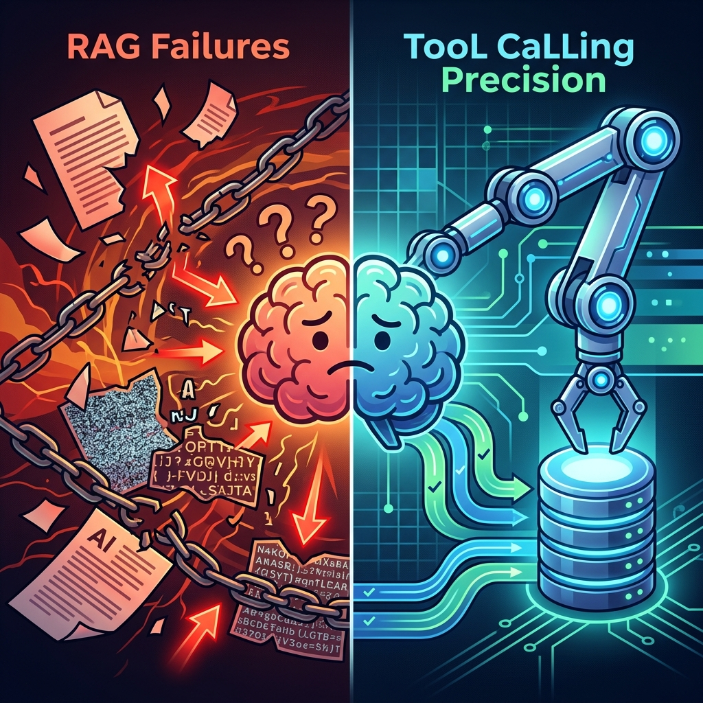

RAG is the aspirin of generative AI: everyone prescribes it, almost no one truly understands how it works, and when it fails, the patient hallucinates. If you've attended any tech conference in the past 18 months, you'll have heard the same promise repeated like a mantra: *"Connect your LLM to your documents with RAG and you'll have a chatbot that responds with your company's truth."* It's a seductive promise. It is also, in most implementations I've seen, **a well-intentioned lie**.

I know this because I've walked both paths. I built a working RAG system in production — the [Ops Engineering Copilot](/en/posts/ai_agents_part8/) with Algolia Agent Studio, indexing over 70 posts from this blog — and I also built a system that **deliberately rejects RAG** — the [agentic obsolescence radar](/en/posts/obs_part5_radar_agent/), which uses pure Tool Calling to query industrial databases with mathematical precision. The experience of operating both systems in production left me with an uncomfortable conclusion: **RAG isn't bad; what's bad is how we implement it**.

This article is the catalogue of the 7 errors that destroy a RAG system's precision, the solutions that work, and the question no one wants to ask: do you really need RAG, or do you need something else?

### Anti-Pattern 1: Blind Chunking

The first step in any RAG pipeline is splitting your documents into fragments (*chunks*) that will be stored as vectors. And this is where most tutorials commit the first mortal sin: **chunking by fixed length** (e.g., 500 tokens per chunk with 50 tokens of overlap).

The problem is brutal: a paragraph explaining a complex technical concept gets cut in half. The first half ends up in one chunk, the second in another. When the user asks a question, the retriever finds the first half (which contains the keywords) but misses the context from the second. The LLM, true to its nature, **fills in what's missing with a plausible fabrication**. Hallucination served.

**The fix**: Semantic chunking. Split by logical units of meaning: sections delimited by headers, complete paragraphs, or functional blocks of the document. In the Ops Copilot, when we indexed Datalaria's posts with Algolia, each *record* corresponds to a complete article section (delimited by `###` in Markdown), not an arbitrary block of N tokens. The result: each chunk is self-contained and holds a complete thought.

### Anti-Pattern 2: Generic Embeddings for Specialized Domains

Pre-trained embeddings (like OpenAI's `text-embedding-3-small` or Vertex AI's) are trained on general internet text. They work reasonably well for generic questions. But when your domain is highly specialized — industrial engineering, European regulation, electronic component nomenclature — the semantic distance between key terms can be **completely wrong** in the vector space.

A real example: in the context of [obsolescence management](/en/posts/obs_part1_intro/), the terms "EOL" (*End of Life*), "NRND" (*Not Recommended for New Designs*), and "PDN" (*Product Discontinuation Notice*) are semantically very close for a supply chain engineer. But for a generic embedding, "End of Life" might be closer to an article about palliative care than to a chip discontinuation notice.

**The fix**: Evaluate embeddings with your own dataset before committing. Build a small benchmark of 50-100 question-answer pairs from your domain and measure the retriever's *hit rate*. If generic embeddings don't exceed 80% accuracy on your benchmark, consider fine-tuning or specialized embeddings for your sector. And if your domain is highly structured (codes, nomenclatures, tables), you probably don't need embeddings at all: you need [Tool Calling](/en/posts/obs_part5_radar_agent/).

### Anti-Pattern 3: Forgetting Reranking

The vector retriever returns the *k* documents "closest" in the embedding space. But vector proximity is not synonymous with relevance. A document can contain the same keywords as the user's question and yet answer a completely different question.

I've seen this anti-pattern cause havoc in technical support systems: the user asks *"How do I configure the CrewAI agent timeout?"*, the retriever returns a chunk about GitHub Actions timeouts (same vocabulary, different context), and the LLM generates a response that's technically correct for the wrong chunk.

**The fix**: Add a **reranking** layer between the retriever and the LLM. A reranker (like Cohere Rerank or a local cross-encoder) receives the original question and the *k* candidates from the retriever, and reorders them by actual semantic relevance, not mere vector proximity. In practice, a well-configured reranker can improve retrieval precision by **15% to 30%** — an improvement that translates directly into fewer hallucinations.

### Anti-Pattern 4: Insufficient Context in the Prompt

The most widespread and easiest mistake to make: injecting 2-3 chunks into the LLM's prompt and expecting a miracle. Modern models like Gemini 2.5 or Claude handle context windows of hundreds of thousands of tokens. Feeding them 500 tokens of retrieved context is like giving a Formula 1 engine the fuel from a cigarette lighter.

**The fix**: Experiment aggressively with the size of the injected context window. Increase from *top-3* to *top-10* or *top-15* chunks and measure the impact on response quality. Include **enriched metadata** in each chunk: source document title, creation date, author, section. These metadata give the LLM a referential framework to evaluate the relevance and recency of the information. In the Ops Copilot, each Algolia record includes not just the post text, but also the title, category, tags, and publication date.

### Anti-Pattern 5: Hallucination from Partial Retrieval

This is the most dangerous anti-pattern because it's silent. The retriever finds a partially relevant chunk. The LLM detects that the information is incomplete. Instead of stopping and confessing its ignorance, **it completes the answer with fabricated information** that sounds perfectly plausible. The user has no way to distinguish which part of the answer comes from retrieval and which part is a hallucination.

In industrial applications, this can be catastrophic. Imagine a RAG system connected to your maintenance documentation that, when asked about the torque specification of a critical bolt, returns a fabricated value because the correct chunk wasn't retrieved. The result could be a mechanical failure in production.

**The fix**: Double barrier. First: instruct the LLM in the system prompt to answer **"I don't have sufficient information in the provided documentation to answer this question"** when the retrieved context is insufficient or ambiguous. Include examples in the prompt (few-shot) of correct answers that acknowledge limitations. Second: implement a **post-validation** of the response. Programmatically evaluate whether the answer contains claims not supported by the injected chunks (frameworks like RAGAS automate this verification with metrics like *faithfulness* and *answer relevancy*).

### Anti-Pattern 6: Not Measuring Quality

The sixth anti-pattern is cultural, not technical: launching a RAG system to production **without evaluation metrics**. Asking "does it work?" to five teammates is not an evaluation methodology; it's an anecdote. Without quantitative metrics, you can't know if a change in chunking improved or worsened precision, if a new embedding model is superior to the previous one, or if the reranker you just added justifies its latency cost.

**The fix**: Implement an automated evaluation framework **before** launching to production. The most mature tools are:

* **RAGAS** (*Retrieval Augmented Generation Assessment*): Measures *faithfulness* (the answer is grounded in context), *answer relevancy* (the answer is relevant to the question), and *context precision* (the retrieved chunks are relevant).
* **DeepEval**: An open-source framework that lets you define test suites with metrics like *hallucination score*, *bias*, and *toxicity*.

The key point is to treat RAG evaluation the way you treat your code's unit tests: **if it doesn't have tests, it doesn't go to production**. Every pipeline iteration (embedding change, chunk size adjustment, new reranker) must pass through the evaluation suite before deployment. It's the same CI/CD philosophy we applied in [Autopilot Part 5](/en/posts/ai_agents_part5/) with GitHub Actions, but applied to retrieval quality.

### Anti-Pattern 7: Using RAG When You Need Tool Calling

This is the anti-pattern that was hardest for me to accept, because it meant questioning my own architectural decision. When we built the [agentic obsolescence radar](/en/posts/obs_part5_radar_agent/), the first temptation was to use RAG: index all component documentation, datasheets, and price histories in a vector store, and let the LLM search for relevant information for each *End of Life* alert.

The result was disastrous. LLMs are, as I wrote in that article, **mediocre calculators**. When the radar needed to calculate the financial impact of an obsolescence (traverse the BOM graph, multiply quantities by prices, sum redesign costs), RAG returned narrative approximations where we needed exact figures. The financial precision was unacceptable for an executive report.

The solution was to radically separate the **"semantic brain"** from the **"mathematical muscle"**: the LLM (Gemini 2.5 + CrewAI) handles natural language comprehension (extracting the *Part Number* from a supplier email, understanding the context of an alert), and Python tools (CrewAI's `@tool`) handle precision operations (SQL queries to Supabase, P&L calculations, relational graph traversal). The result: executive reports generated in 4 seconds with **0% hallucination in numerical data**.

The rule I've distilled is simple:

| You need... | Use... | Why |
| :--- | :--- | :--- |
| Answers about **unstructured knowledge** (manuals, posts, narrative documentation) | **RAG** | Semantic retrieval is superior for searching free text |
| Answers with **structured data and numerical precision** (SQL, APIs, financial calculations) | **Tool Calling** | Tools execute deterministic code, no hallucinations |
| **Both** (interpret an email + calculate financial impact) | **Hybrid architecture** | The LLM orchestrates; the tools execute |

And if you're wondering how to standardize those connections between the LLM and the tools so you're not locked into a vendor, that's exactly what we addressed in the article about [MCP (Model Context Protocol)](/en/posts/mcp_protocol/).

### Conclusion: RAG Isn't Broken; Your Implementation Is

If there's one message I want you to take from this article, it's this: **RAG is a legitimate and powerful architecture when implemented with engineering rigor**. The problem isn't the pattern; the problem is that the industry has popularized it as a magical plug-and-play solution, when in reality it's a complex pipeline that requires intelligent chunking, evaluated embeddings, reranking, generous context, hallucination defenses, quality metrics, and the humility to recognize when Tool Calling is the right tool for the job.

The [10x Rule](/en/posts/hidden_economics_ai/) I proposed in the Hidden Economics of AI article applies perfectly here: if RAG doesn't give you a result **10 times better** than a direct SQL query or an API call, you're probably using the wrong tool for the wrong problem.

And in the era of the [EU AI Act](/en/posts/eu_ai_act/), where traceability (Article 12) and precision are legal obligations for high-risk systems, deploying a RAG that hallucinates isn't just a technical error: it's a regulatory risk.

---

#### Sources of Interest:
* [**RAGAS**: Evaluation Framework for RAG — Official Documentation](https://docs.ragas.io/)
* [**DeepEval**: Open-Source LLM Evaluation Framework](https://docs.confident-ai.com/)
* [**Pinecone**: Chunking Strategies for RAG Applications](https://www.pinecone.io/learn/chunking-strategies/)
* [**Cohere**: Reranking — Improving Search Relevance](https://cohere.com/rerank)
* [**Datalaria**: The Agentic Radar — Why Tool Calling > RAG in Production](https://www.datalaria.com/en/posts/obs_part5_radar_agent/)
* [**Datalaria**: Autopilot Part 8 — Ops Copilot with Algolia Agent Studio and RAG](https://www.datalaria.com/en/posts/ai_agents_part8/)
* [**Datalaria**: MCP Protocol — The Standard That Wants to Be the USB of AI](https://www.datalaria.com/en/posts/mcp_protocol/)
* [**Datalaria**: EU AI Act — Traceability and Precision as Legal Obligations](https://www.datalaria.com/en/posts/eu_ai_act/)
