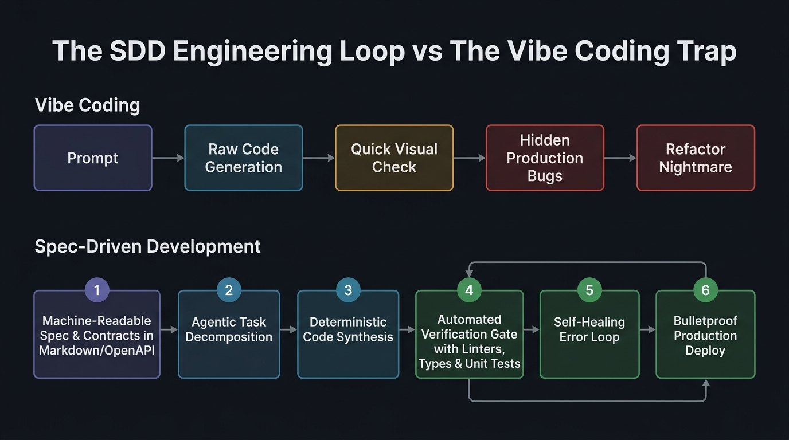

In early 2025, a viral post by computer scientist and OpenAI co-founder **Andrej Karpathy** triggered a massive cultural earthquake across the software industry:

> *“There is a new kind of coding I call **Vibe Coding**, where you fully give in to the vibes, forget that the code even exists, and just talk to the model. I see stuff, say stuff, run stuff, and copy-paste stuff. When errors pop up, I don’t even read the traceback—I just paste it into the LLM with 'fix this.' It is remarkably liberating.”*

The promise felt intoxicating. Overnight, non-technical founders shipped functional web apps in a single weekend; seasoned engineers built prototype dashboards during an afternoon coffee break simply dictating voice prompts; and the broader tech community celebrated what seemed to be the dawn of an era where syntax, software architecture blueprints, and formal domain modeling were discarded as obsolete relics.

By late 2026, however, that initial euphoria has given way to a brutal engineering hangover that CTOs and VP of Engineering worldwide refer to by a very specific term: **Ghost Technical Debt (*Vibe Debt*)**.

Applications that performed seamlessly in local development crash violently under real production concurrency; bloated repositories accumulate redundant dependencies and hallucinated external APIs; and any attempt to refactor a core module triggers an unpredictable cascade of silent regressions that no human engineer understands or knows how to debug.

As we analyzed in [AI Agent Evaluation & Testing in Production](/en/posts/evaluacion_agentes_ia/) when warning against the perils of superficial *vibe checking*, and in [Silicon Valley and the PiperNet Dilemma](/en/posts/silicon_valley/) regarding rogue autonomous agents, software engineering has reached a historic fork in the road.

The professional response to this crisis has not been to abandon AI and revert to manual keystroke typing, but rather to embrace a mature, disciplined methodology: **SDD (*Spec-Driven Development*)**.



---

### The Anatomy of Failure: Why 'Vibe Coding' Breaks Down in Production

Vibe Coding is undeniably phenomenal for one specific use case: **zero-to-one velocity on throwaway prototypes**. If you need to validate a business hypothesis in 48 hours, whip up a pitch deck demo, or write a one-off migration script, conversational prompt workflows are unmatched.

The catastrophe begins the exact moment that prototype must mature into a scalable, secure, enterprise-grade software product.

```
Software Lifecycle Velocity Curve:
Velocity ^
         |  /-- Vibe Coding (Initial explosive velocity, collapse from Vibe Debt)
         | / \
         |/   \___________
         |   /------------ SDD (Initial specification investment, sustained velocity)
         |  /
         +-----------------------------------> Time (Weeks)
```

The underlying pathologies of *Vibe Coding* are structural:

1. **The Degenerative Context Window Paradox**: As an interactive multi-turn chat progresses, the LLM’s context window fills up with failed attempts, band-aid patches, and conflicting code snippets. The model begins forgetting foundational architectural decisions made earlier in the session, introducing subtle regressions with every new instruction.
2. **The Absence of a Unified Mental Model**: In traditional engineering, code is the executable crystallization of the engineer's internal mental model. In *vibe coding*, **nobody possesses that mental model**: neither the developer (who skimmed the generated code) nor the LLM (which retains zero persistent state between sessions). The codebase degenerates into an opaque, brittle black box.
3. **The 'Prompt-and-Pray' Antipattern**: When a unit test fails or a production bug surfaces, the vibe coder does not perform root-cause analysis; they issue a reactive prompt: *“It's still throwing 500, just make it return an empty object if it fails.”* The patch suppresses the symptom while cementing a critical security hole or silent data corruption beneath the surface.

---

### What is SDD (Spec-Driven Development) in the AI Era?

Spec-Driven Development starts from a fundamentally different philosophical understanding of modern frontier models (such as **Gemini 3.8 / 4 Pro**, **Claude Fable 5.1**, or **GPT Sol 5.6**):

> **An LLM should not be used as an omniscient conversational oracle or an unpredictable chat assistant. It should be treated as an ultra-fast, stochastic compiler that translates unambiguous, formal specifications into verified, deterministic code.**

Under SDD, the human engineer's cognitive effort is inverted:

* **80% of human engineering time** is invested in domain modeling, interface contract design, state machine transitions, and edge-case boundary definitions documented in machine-readable specification files.
* **20% of human time** is dedicated to reviewing validation assertions and automated test gates.
* **95% of mechanical code synthesis** (boilerplate controllers, database queries, serializers, interface implementations) is delegated deterministically to AI agents.



---

### The Three Pillars of an Effective SDD Specification

To enable an AI agent to generate clean, decoupled code without hallucinating, an SDD specification cannot be a casual sentence in a prompt box. It consists of three tightly coupled, machine-readable artifacts:

#### 1. The Architectural RFC (System Specification)
A structured Markdown document detailing:
* **Context & Core Objectives**: What specific problem this component solves.
* **Non-Goals**: What is explicitly out of scope (essential to prevent autonomous agents from over-engineering unnecessary abstractions).
* **Architectural Decision Records (ADRs)**: Approved libraries, data storage paradigms, and infrastructure constraints.

#### 2. Strictly Typed Interface Contracts & Schemas
Rather than describing data structures using ambiguous natural language, SDD mandates formal contracts using **Pydantic, TypeScript, Zod, OpenAPI, or JSON Schema**:
* Strict type definitions with boundary constraints.
* Domain invariants (e.g., *“a discount can never exceed the cart subtotal”*).
* State transition diagrams and sequence flows rendered directly in Markdown using Mermaid syntax.

#### 3. Executable Acceptance Criteria (The Spec-Test-Code Loop)
Inheriting the core wisdom of TDD (*Test-Driven Development*), in SDD **test suites and verification assertions are generated directly from the specification before writing any implementation code**.

When an agent is constrained by rigid input/output schemas and automated test suites that define expected behavior, the solution space collapses mathematically, eliminating non-deterministic hallucinations.

---

### Practical Example: From Vague Vibe Prompt to SDD Contract

To understand the practical gulf between both paradigms, observe how each methodology handles a payment checkout service:

#### Vibe Coding Approach (Prompt-and-Pray):
> *“Create a FastAPI endpoint to process cart checkout. Charge with Stripe, save order in Postgres, and send an email. Make it secure and add auth.”*

**Typical Outcome**: The model spits out a 150-line monolithic function. It forgets idempotency headers (meaning a double-click charges the customer twice); catches errors with generic `except Exception: pass`; and executes database writes outside an atomic transaction. If Stripe succeeds but the database connection drops, the customer is billed for an order that never recorded.

#### SDD Approach (Formal Contract and Invariants):
The engineer provides a structured specification file `specs/checkout_service.md`:

````markdown
# Specification: Order Checkout Service (v1.2)

## 1. Domain Invariants & Rules
- **Idempotency**: All requests MUST include a valid `Idempotency-Key` header (UUIDv4). Duplicate keys within 24h must return the cached result without charging the card.
- **Atomicity**: Payment confirmation, inventory deduction, and order creation must execute within a strict transactional boundary or issue a compensatory rollback.
- **State Transition**: Order state must strictly follow: `PENDING` -> `PAYMENT_PROCESSING` -> `COMPLETED` | `FAILED`.

## 2. Interface Contract (Pydantic / OpenAPI)
```python
class CheckoutRequest(BaseModel):
    cart_id: UUID4
    currency: Literal["EUR", "USD"]
    idempotency_key: UUID4

class CheckoutResponse(BaseModel):
    order_id: UUID4
    status: Literal["COMPLETED", "FAILED"]
    charged_amount_cents: conint(gt=0)
    transaction_reference: str
```

## 3. Test Invariants (Acceptance Criteria)
- Test 1: Given a valid cart, when duplicate `Idempotency-Key` is sent, exactly 1 Stripe charge is executed.
- Test 2: If inventory deduction fails, Stripe charge must be refunded immediately and return HTTP 409 Conflict.
- Test 3: Unauthorized token must return HTTP 401 without executing any database query.
````

Armed with this specification, any modern agentic development tool (such as Claude Code, Cursor, Windsurf, or automated CI/CD agents) generates modular, decoupled, production-hardened code. The model does not need to guess developer intent: **the specification makes the correct path the only mathematically compliant solution**.

---

### Comparative Matrix: Vibe Coding vs. SDD vs. Classical TDD

| Dimension | Vibe Coding | Classical TDD (Manual) | SDD with AI Agents |
| :--- | :--- | :--- | :--- |
| **Starting Artifact** | Informal natural language prompt | Hand-written unit tests | Formal machine-readable spec & schema contracts in Markdown |
| **Initial Velocity (Day 1)** | ⚡ Extreme | 🐢 Slow | 🚀 High |
| **Maintainability (Month 6)** | 💥 Catastrophic (*Vibe Debt*) | 🛡️ High | 🛡️ Exceptionally High & Documented |
| **Engineer Role** | Chat operator / Surface reviewer | Line-by-line syntax & test author | Specification architect & invariant governor |
| **AI Hallucination Rate** | 🔴 Very High (>40% on edge cases) | N/A (human manual) | 🟢 Minimal (<3%, tightly bounded by schema) |
| **Correction Mechanism** | Manual: copy tracebacks to chat | Manual: IDE debugging | **Automated: closed-loop verification & self-healing** |
| **Enterprise Readiness** | ❌ Unacceptable production risk | ✅ High | ✅ High (Optimal for enterprise scale) |

---

### The Self-Healing Agentic Loop

The defining technical breakthrough of SDD in 2026 is the automated **Self-Healing Verification Loop**:

1. **Synthesis**: The agent reads the spec and synthesizes the source code and tests.
2. **Verification Gate**: The pipeline automatically runs the static type checker (`mypy` / `tsc`), linter (`ruff` / `eslint`), and test runner (`pytest` / `vitest`).
3. **Self-Healing**: If a test fails or a schema validation errors out, the pipeline requires zero manual developer intervention. The compiler traceback is piped directly back into the agent context: *“Idempotency test failed because the header key does not persist in Redis cache. Refactor the implementation to comply with Section 1 of the specification.”*
4. **Convergence**: Within one or two autonomous feedback cycles, the code compiles cleanly, passing 100% of defined acceptance criteria.

This workflow aligns directly with the decoupled tool architecture explored in our analysis of the [Model Context Protocol (MCP)](/en/posts/mcp_protocol/) and the standardized operational engineering of [Project Operations Engineering](/en/posts/proj_ops_parte1_intro/).

---

### The Evolution of the Software Engineer in the AGI Era

The rapid advancement of deep reasoning models and inference-time scaling—which we explore in our upcoming article—will not make software engineers obsolete; it will **liberate them from the mechanical drudgery of syntax**.

In 2026, writing a `for` loop, structuring CRUD endpoints, or handwriting JSON serializers is no longer an intellectual skill that justifies a senior engineer’s salary. Those are commoditized compute operations.

The irreplaceable value of senior engineers has shifted upwards to:
* **Critical Systems Modeling**: Deconstructing messy business problems into clean, modular, scalable domain abstractions.
* **Invariant & Security Governance**: Identifying concurrency race conditions, security vectors, and regulatory compliance requirements mandated by standards like the [EU AI Act](/en/posts/eu_ai_act/).
* **Flawless Specification Authoring**: The engineers who write the clearest, most precise specifications for AI agents will build software with 10x the velocity, 10x lower operational costs, and zero technical debt.

---

### An Open Question for the Reader

Vibe Coding proved that anyone can build software that works for five minutes. Spec-Driven Development demonstrates how true engineers build software systems that thrive for decades.

In your day-to-day work with AI coding agents:

**Are you still chatting casually with the model, hoping for lucky statistical completions... or have you started authoring the formal specifications and typed contracts that guarantee deterministic reliability?**

**Do you believe that future programming languages will evolve into formal specification formats rather than executable syntax?**

We would love to hear your experiences. Share your thoughts in the comments below.

---

#### References and Further Reading:
* [**Andrej Karpathy (2025/2026)**: *From Vibe Coding to Agentic Engineering — AI Ascent Keynote*](https://www.youtube.com/watch?v=96jN2OCOfLs)
* [**Martin Fowler**: *Specification-By-Example and Contract-Driven Design Patterns*](https://martinfowler.com/)
* [**OpenAPI Specification**: *The Standard for Machine-Readable Interface Contracts*](https://spec.openapis.org/oas/latest.html)
* [**Datalaria**: AI Agent Evaluation & Testing in Production — How to Measure the Unpredictable](/en/posts/evaluacion_agentes_ia/)
* [**Datalaria**: 2026 Data & AI Productivity Stack](/en/posts/stack_productividad_2026/)
* [**Datalaria**: Model Context Protocol (MCP) — The Open Integration Standard](/en/posts/mcp_protocol/)
* [**Datalaria**: Silicon Valley and the PiperNet Dilemma — Uncontrollable Autonomous AI](/en/posts/silicon_valley/)
* [**Datalaria**: Project Operations Engineering — Systems Management & Standards](/en/posts/proj_ops_parte1_intro/)
* [**Datalaria**: EU AI Act — Governance & Technical Oversight Framework](/en/posts/eu_ai_act/)
