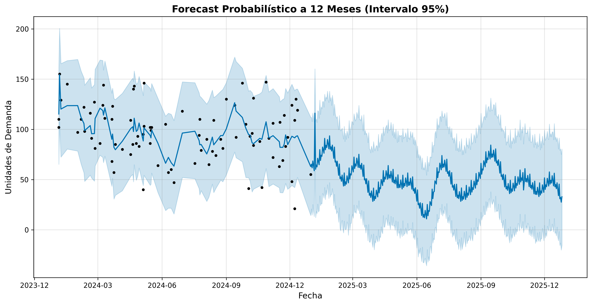
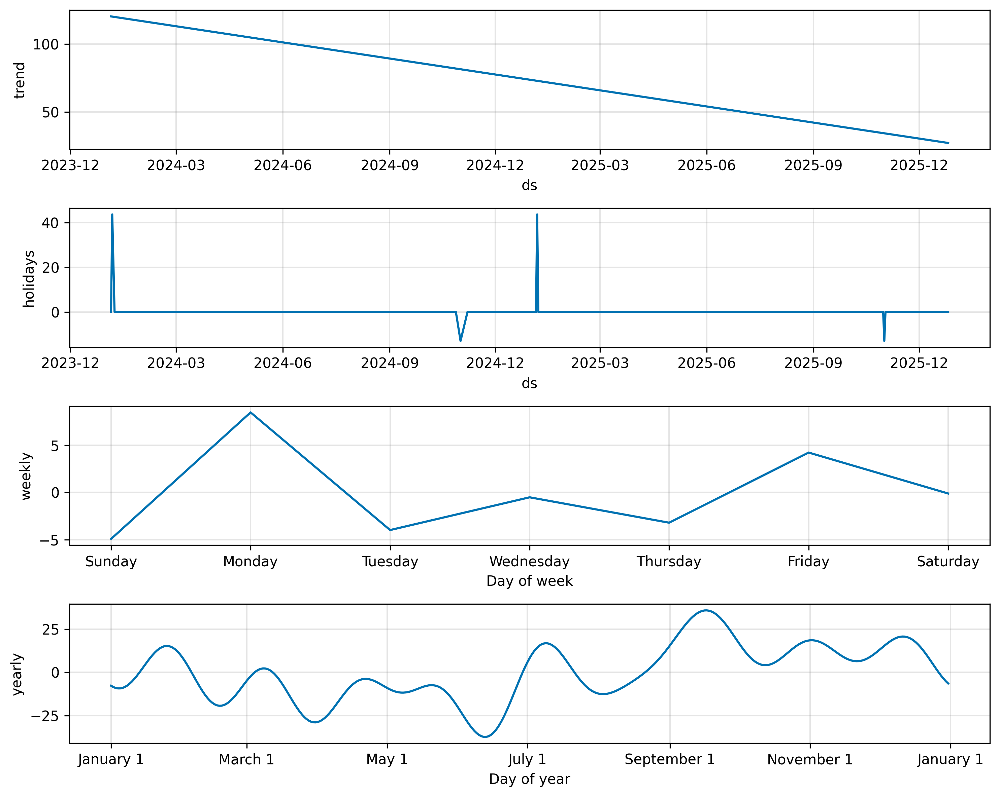

Your Excel says "we'll sell 100 units." A round, clean, deterministic number. What if you sell 120? Stockout, unhappy customer, contractual penalty. What if you sell 50? 50 units sitting in your warehouse, immobilizing capital that could be generating returns.

The problem isn't the forecast itself. It's the **arrogance of the single number**.

In [Chapter 1](/en/posts/sop_engineering-data-hygiene/) we built a "Quality Valve" that filters ERP noise. Now that we have a pure signal, we're going to do something Excel can't: **measure uncertainty**.

> **Executive Summary:** A probabilistic forecast doesn't tell you "you'll sell 100." It tells you "with 95% probability, you'll sell between 35 and 157." That uncertainty band is the mathematical foundation for calculating your Safety Stock without resorting to rules of thumb.

## The Architecture: MLOps, Not Scripts

We haven't written a throwaway script. We've connected our mathematical brain (Python/Prophet) directly to our Single Source of Truth (Supabase/PostgreSQL).

The key design is the `demand_forecasts` table. Notice one column that separates this from a basic tutorial:

```sql
CREATE TABLE demand_forecasts (
    id              UUID PRIMARY KEY DEFAULT uuid_generate_v4(),
    execution_date  DATE NOT NULL,     -- ← When we ran the model
    ds              DATE NOT NULL,     -- Predicted future date
    yhat            NUMERIC NOT NULL,  -- Central prediction
    yhat_lower      NUMERIC NOT NULL,  -- Lower bound (Safety Stock)
    yhat_upper      NUMERIC NOT NULL,  -- Upper bound (Risk)
    model_version   TEXT NOT NULL,     -- Traceability
    UNIQUE(execution_date, ds)         -- One forecast per execution and date
);
```

**Why `execution_date`?** Because in 6 months, when you want to audit whether your model was accurate, you need to know *when* you made the prediction versus *what actually happened*. This is what MLOps calls **Snapshotting**: recording the context of each execution to evaluate model drift over time.

Without this column, you have a model. With it, you have an **auditable system**.

## The Engineering: Why Prophet (and Not a Textbook ARIMA)

Prophet is a time series engine developed by Meta, designed for irregular business data: gaps, holidays, trend changes. Exactly what a real supply chain has.

Here's the core fragment from our `ProphetPredictor` class:

```python
def train_model(self, country_code='ES'):
    """
    Trains Prophet with two key S&OP configurations:
    - interval_width: Confidence interval width
    - country_holidays: Country operational context
    """
    self.model = Prophet(
        interval_width=0.95,     # ← 95% confidence interval
        weekly_seasonality=True,
        yearly_seasonality=True
    )
    # Holidays that alter loading/unloading patterns
    self.model.add_country_holidays(country_name=country_code)
    self.model.fit(self.ts_df)
```

Two engineering decisions that separate us from a YouTube tutorial:

**`interval_width=0.95`**: This is not a decorative parameter. The upper bound (`yhat_upper`) represents the maximum probable demand with 95% confidence. This is literally your calculation basis for **Safety Stock**: `Safety Stock = yhat_upper - yhat`. Without this interval, your safety stock is a gut feeling; with it, it's mathematics.

**`add_country_holidays('ES')`**: In S&OP, holidays aren't "days off." They're operational anomalies: the factory closes, the warehouse doesn't dispatch, transportation stops. If the model doesn't know that August 15th is a national holiday in Spain, it will interpret the drop in orders as a downward trend. This corrupts the September prediction.

## Translating Math into Business Decisions

Theory is nice. But a CEO doesn't approve budgets based on Python code. They need visual evidence.

### The Probabilistic Forecast


*The black dots are your actual historical demand. The central blue line is the prediction (yhat). The shaded band is the 95% confidence interval. The greater the historical volatility, the wider the band → the more Safety Stock you need → the more cash you immobilize. This band is the conversation you should be having with your CFO.*

### Explainability: Separating Trend from Seasonal Noise


*This is XAI (Explainable AI) applied to business. The model separates Trend (is the business growing or shrinking?) from Seasonality (are there spikes by time of year?) and holiday effects. This is what the CEO needs to see to approve the operations plan: knowing whether growth is real or just a calendar effect.*

## Open Kitchen: Try It Yourself

I distrust articles I can't execute. That's why I've prepared an isolated environment where you can train the model on an anonymized snapshot of the data we just cleaned in Chapter 1.

You don't need to install Python, Prophet, or configure Supabase. You just need a browser:

📎 **[Open the interactive Notebook on Google Colab](https://colab.research.google.com/drive/1q_iZ3rPmcoXXJ3qXQzSrlxMYCSstyP12?usp=sharing)**

Hit "Play" on the cells and watch a probabilistic forecast with uncertainty bands being generated. Modify the horizon, the country, the confidence interval. Do engineering, not faith.

## Next Step: From Prediction to Decision

Now we know the probability of what we're going to sell. The question shifts from *"how much will we sell?"* to **"what should we manufacture or purchase to maximize margin and minimize risk?"**.

In Chapter 3, we'll introduce **Mathematical Optimization** (PuLP) and **Theory of Constraints** to transform predictions into supply decisions: how much to buy, when to produce, and how to distribute finite resources while minimizing costs.

> The difference between an Operations Director who reacts and one who decides is a mathematical model between the data and the action.
