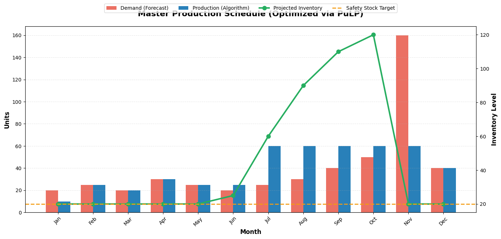

"We always want 4 weeks of coverage." This phrase, repeated like a mantra in every S&OP meeting on the planet, is financially toxic.

Why? Because it's a **fixed rule applied to a dynamic system**. If your demand in January is 200 units and in July is 20, you're forcing yourself to maintain 800 and 80 units respectively "just in case." January falls short. July immobilizes capital for no reason.

The alternative isn't more sophisticated intuition. It's **mathematics**.

> **Executive Summary:** In this chapter, we connect the probabilistic forecast from [Chapter 2](/en/posts/sop-engineering-part2-forecasting/) with a Linear Programming engine (PuLP) that calculates the exact production plan minimizing total cost (production + storage) while respecting Safety Stock constraints. We move from passive prediction to active prescription.

## From Forecast to Decision: Architecture

In [Chapter 1](/en/posts/sop_engineering-data-hygiene/) we cleaned the signal. In [Chapter 2](/en/posts/sop-engineering-part2-forecasting/) we predicted demand. Now we take the step Excel can't: **optimize**.

Our pipeline on GitHub connects to Supabase, reads the `demand_forecasts` table (the future we predicted), and generates a new `supply_plans` table. The system has evolved from **descriptive** (what happened?) to **predictive** (what will happen?) and now to **prescriptive** (what should I do?).

This is Operations Research. The same discipline that optimizes airline routes, military logistics, and global supply chains. And we run it with 50 lines of Python.

## The Mathematics of Business

We're not going to hide the equations. They're the heart of the decision. Here's the core fragment from our `SupplyOptimizer` class:

```python
# Objective Function: Minimize total cost
problem += pulp.lpSum(
    production_cost * production[t] + holding_cost * inventory[t]
    for t in range(T)
), "Total_Cost"

# Constraint: Inventory Balance (Conservation of Mass)
for t in range(T):
    prev_inv = initial_inventory if t == 0 else inventory[t - 1]
    problem += (
        inventory[t] == prev_inv + production[t] - demand[t],
        f"Balance_t{t}"
    )

# Constraint: Safety Stock (Risk Policy)
for t in range(T):
    problem += (
        inventory[t] >= safety_stock,
        f"SafetyStock_t{t}"
    )
```

Three engineering decisions worth explaining:

**The Objective Function** doesn't seek "lots of stock" or "high production." It seeks the **minimum financial cost**: the equilibrium between manufacturing (expensive) and storing (also expensive). The solver automatically finds the exact point where the combined cost is minimal.

**The Mass Balance** is a physical constraint: you can't sell what you don't have. Today's inventory equals yesterday's, plus what you produce today, minus what you sell. No magic. The equations forbid cheating.

**The Safety Stock** is the risk policy: never let inventory drop below a safety minimum. In our case, 1.5 months of average demand. The system calculates this, not a spreadsheet with a number pulled from thin air.

## The Master Plan: From Algorithm to Business Decision


*This is what the Operations Director needs to see. The algorithm doesn't produce uniformly: if it detects a massive demand spike in one period, it decides to "pre-build" inventory in preceding months to flatten the production load. If Holding Cost is high, it keeps the warehouse empty and manufactures Just-in-Time. Excel doesn't do this on its own; mathematics does.*

The result from our solver with test data:

- **Production cost:** €1,680
- **Storage cost:** €540
- **Total optimized cost:** €2,220

This number is not an estimate. It's the **provable global minimum** given the constraints. If someone proposes a cheaper plan with the same parameters, they're violating a constraint.

## Open Kitchen: Play with the Solver

I distrust theories that can't be put into practice. That's why I've prepared a Google Colab where you can run the optimizer on a snapshot of our real data.

The most revealing experiment: **change `holding_cost` to an extremely high value** (e.g., €50/unit). Watch how the algorithm automatically decides to manufacture Just-in-Time and keep the warehouse practically empty. Then lower the production cost and watch it prefer to produce in bulk and store. Mathematics adapts. Excel's fixed rules don't.

📎 **[Open the Interactive Google Colab](https://colab.research.google.com/drive/1fF9DY-eHL13G0AFg_geNxQ6duEMOWy4N?usp=sharing)**

Modify the costs, capacity constraints, Safety Stock. Do engineering, not faith.

## The Complete Chain: From Data to Decisions

With this third chapter, we've built an end-to-end S&OP system that goes from a dirty ERP CSV to an optimal production plan:


flowchart LR
    subgraph CH1["Chapter 1"]
        A["Dirty CSV"]
        B["Clean Data"]
    end

    subgraph CH2["Chapter 2"]
        C["Forecast Prophet"]
    end

    subgraph CH3["Chapter 3"]
        D["Optimal Plan PuLP"]
    end

    subgraph DB["Supabase"]
        E[("Single Source of Truth")]
    end

    A --> B --> E
    E --> C --> E
    E --> D --> E

    style A fill:#ff6b6b,stroke:#c0392b,color:#fff
    style B fill:#2ecc71,stroke:#27ae60,color:#fff
    style C fill:#3498db,stroke:#2980b9,color:#fff
    style D fill:#9b59b6,stroke:#8e44ad,color:#fff
    style E fill:#f39c12,stroke:#d35400,color:#fff


**Legend:**
- 🔴 **Red:** Raw data with noise
- 🟢 **Green:** Clean signal
- 🔵 **Blue:** Probabilistic forecast
- 🟣 **Purple:** Optimized supply plan
- 🟠 **Orange:** Centralized database (Supabase)

## Next Step: Scaling to Enterprise

We now have the perfect plan in our database. But only for one product. What happens when you add 3 SKUs sharing the same factory?

In [Chapter 4](/en/posts/sop-engineering-part4-enterprise/) we break the MVP: we inject multi-product data with radically different profiles, parallelize the forecasting with **MLOps**, and build a unified Linear Programming model where products *compete mathematically* for shared production capacity.

> The difference between an Operations Director who plans and one who optimizes is an objective function between their intuition and reality.
