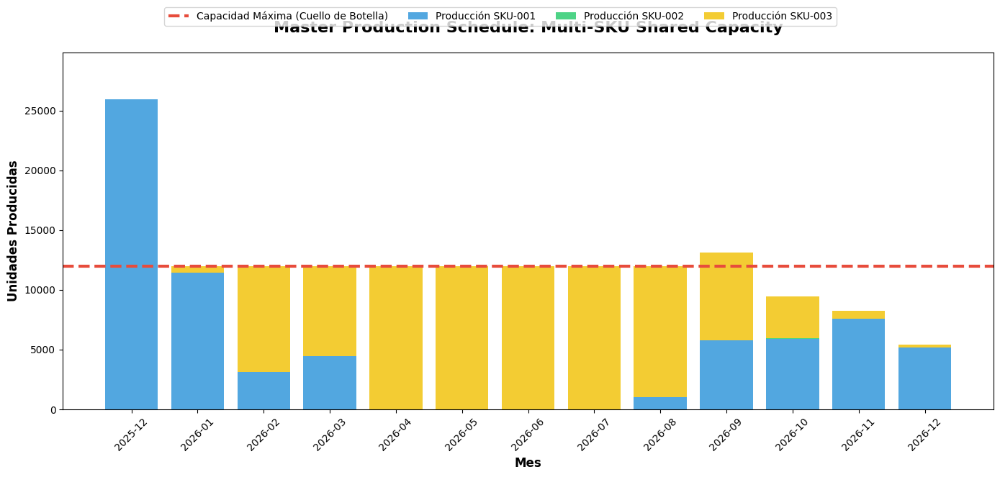

Your MVP works. One product, one model, one perfect plan. Congratulations: you just solved the easiest problem in Supply Chain.

Now add 3 products sharing the same factory. Product A needs 14,000 units in July. Product C needs 13,000 that same month. Your factory produces 15,000. **Who gets shorted?**

If your answer is "we'll figure it out in Thursday's meeting," your company has an engineering problem, not a management one.

> **Executive Summary:** In chapters [1](/en/posts/sop_engineering-data-hygiene/), [2](/en/posts/sop-engineering-part2-forecasting/) and [3](/en/posts/sop-engineering-part3-optimization/) we built a working MVP for a single product. In this Chapter 4, we break it. We inject 3 years of history with 3 SKUs of radically different demand profiles (Core, Intermittent, and Seasonal), parallelize Prophet model training with MLOps, and build a unified Linear Programming model where products *compete mathematically* for limited factory capacity. Welcome to Theory of Constraints executed in code.

## The Fatal Error: Optimizing in Silos

The biggest sin in Supply Chain Planning isn't using dirty data (we fixed that in [Chapter 1](/en/posts/sop_engineering-data-hygiene/)). It's **optimizing each product as if the factory were infinite**.

Imagine three product managers, each with their optimized Excel:

- SKU-001 Manager (Core): "I need to produce 6,000/month. Already calculated."
- SKU-002 Manager (Spare Part): "I only need 15/month. No big deal."
- SKU-003 Manager (Seasonal): "In July I need 14,000. Non-negotiable."

Sum: 6,000 + 15 + 14,000 = **20,015 units**. Your factory produces 15,000. Each manager is right individually. Collectively, it's a collapse.

This is what Eli Goldratt described in *The Goal* as **Theory of Constraints**: the system is not optimized by summing local optima. It's optimized by identifying the bottleneck and letting mathematics allocate the resources.

## Stress-Test: The 3 Profiles That Break Your MVP

To validate the Enterprise architecture, we generated a 3-year dataset (2023-2025) with three SKUs designed to break any naïve model:

| SKU | Profile | Average Demand | Trap |
|-----|---------|----------------|------|
| **SKU-001** | Core Product | ~200/day | High variance + 3x Black Friday |
| **SKU-002** | Intermittent Spare | ~0.6/day | 70% zero-demand days |
| **SKU-003** | Seasonal Summer | ~250/day | 500+ peaks in July, zero in winter |

We injected real ERP noise: outliers (x50), corrupted dates, nulls, negatives. This isn't a toy tutorial. It's what comes out of a production SAP on any given Tuesday.

## MLOps: Parallelizing the Forecasting

With a single product, training Prophet takes 2 seconds. With 50 SKUs in a `for` loop, you wait 100 seconds. With 500, you go home.

The solution is the same one production pipelines use: **parallelization**. Each SKU is statistically independent, so each model can train on its own thread:

```python
from concurrent.futures import ThreadPoolExecutor

def process_sku(sku, df_sku, months, country_code):
    """Worker: trains Prophet for one SKU."""
    predictor = ProphetPredictor(df_sku, sku_name=sku)
    predictor.preprocess_daily_aggregation()
    predictor.train_model(country_code=country_code)
    return predictor.generate_forecast(months=months)

with ThreadPoolExecutor(max_workers=3) as executor:
    futures = {
        executor.submit(process_sku, sku, df, 12, "ES"): sku
        for sku, df in sku_dataframes.items()
    }
```

3 Prophet models, 3 seconds. Not 6. Three. If you add 50 SKUs like any mid-sized company has, the difference between sequential and parallel is the difference between an operational pipeline and a script nobody wants to run.

### Negative Clipping: The Business Rule Prophet Ignores

Prophet can generate negative predictions. Mathematically it makes sense (the regression doesn't know demand can't be -12 units). Operationally it's a disaster.

Our `forecasting_engine_v2.py` applies a **Negative Clipping** post-prediction:

```python
# Business Rule: Demand cannot be negative
for col in ["yhat", "yhat_lower", "yhat_upper"]:
    self.forecast[col] = self.forecast[col].clip(lower=0)
```

One line. One fewer production bug. This is what separates MLOps from "Machine Learning in a Jupyter Notebook."

### Fault Tolerance: One SKU Doesn't Kill the Pipeline

What happens if SKU-002 has only 10 records and Prophet fails? In an amateur script, the entire pipeline dies. In an Enterprise system:

```python
sku_name, forecast_df, error = future.result()
if error:
    print(f"[!!] {sku_name}: FAILED - {error}")
    result["skus_failed"] += 1
else:
    forecasts.append(forecast_df)
    result["skus_success"] += 1
```

The 2 healthy SKUs finish their work. The failed one gets logged. This is the difference between a script and a **system**.

## The Mathematics of Bottlenecks: Unified PuLP Model

Here's the intellectual core of the entire chapter. In [Chapter 3](/en/posts/sop-engineering-part3-optimization/) we optimized one product. Now we create a **single LP model** where all SKUs coexist:

```python
# ── MULTI-DIMENSIONAL decision variables ──
production[sku][t]  # How much to produce of SKU s in period t
inventory[sku][t]   # Inventory of SKU s at end of period t

# ── Objective Function: TOTAL system cost ──
problem += lpSum(
    prod_cost[sku] * production[sku][t]
    + hold_cost[sku] * inventory[sku][t]
    for sku in skus for t in range(T)
), "Total_System_Cost"

# ── THE KEY CONSTRAINT: Shared Capacity ──
for t in range(T):
    problem += (
        lpSum(production[sku][t] for sku in skus) <= SHARED_MAX_CAPACITY,
        f"SharedCapacity_t{t}"
    )
```

Read that last constraint. It's a single line of code, but it contains **Goldratt's entire Theory of Constraints encoded**:

`lpSum(production[sku][t] for sku in skus) <= 15,000`

You're telling the machine: "The factory produces at most 15,000 units per month. I don't care if it's 15,000 of SKU-001 or 7,500 of each. You decide the allocation that minimizes total system cost."

And the solver decides. No meetings. No politics. No "we always prioritize the big client." Mathematics.

## The Result: Intelligent Capacity Allocation

Our solver with real Supabase data:

```
  SKU-001: demand=70,879 | prod=70,579 | avg_inv=5,754 | cost=855,394 EUR
  SKU-002: demand=143   | prod=128   | avg_inv=6     | cost=6,775 EUR
  SKU-003: demand=84,298 | prod=84,098 | avg_inv=115   | cost=1,265,970 EUR

  Total production cost:       1,973,660 EUR
  Total holding cost:            154,479 EUR
  ** TOTAL SYSTEM COST:        2,128,139 EUR **
```

Observe the decisions the algorithm made:

- **SKU-001** (prod_cost=€10, hold_cost=€2): Cheap to store. The solver produces ahead during cheap months and stockpiles inventory (avg 5,754 units). Intelligent pre-build.
- **SKU-002** (prod_cost=€50, hold_cost=€5): Expensive part. Strict just-in-time production (avg_inv=6 units). Doesn't stockpile a single extra piece.
- **SKU-003** (seasonal): Minimum inventory at safety stock. Produces exactly what it needs each month, following the seasonal wave.

No human with Excel can calculate this with 3 products and 13 months. And they definitely can't recalculate it every week when the forecast changes.

## The Ah-Ha Moment: The Bottleneck Visualized


*Look at the summer months. Combined demand from the 3 SKUs exceeds factory capacity (red line). What does the algorithm do? Instead of breaking stock, it decides to advance production of the cheapest-to-store SKU (SKU-001) to spring, freeing factory space for the critical seasonal product (SKU-003) in summer. This is Theory of Constraints executed by a machine.*

*If you look at the chart, it seems like SKU-002 (spare parts) doesn't exist. But it's there. It represents 0.1% of the factory's volume, but in manual management, it usually consumes 20% of the planner's mental time due to its high volatility. By delegating this to a Linear Programming model, the system manages large volumes and the long tail simultaneously without stress.*

## Open Kitchen: Break the System

I distrust theories that can't be put into practice. I've prepared a new Enterprise Google Colab where you can run the most revealing experiment of the entire series:

**Lower the `SHARED_MAX_CAPACITY` variable to 12,000.** Watch the solver start juggling: it sacrifices SKU-001 inventory to prioritize SKU-003 in July. Lower it to 10,000 and you'll see the model declare `INFEASIBLE` — the factory literally cannot meet demand even with the best possible planning. That's your inflection point for investing in capacity expansion.

📎 **[Open the Multi-SKU Enterprise Google Colab](https://colab.research.google.com/drive/1fBun7rDVGWN7XQGeSUbffm9VuhtTN9Bo?usp=sharing)**

Change the maximum factory capacity, modify holding costs, add a fourth SKU. Do engineering, not faith.

## The Full Chain: From MVP to Enterprise

With this fourth chapter, we've scaled a single-product prototype to a Multi-SKU Enterprise architecture:


flowchart LR
    subgraph CH1["Chapter 1: Hygiene"]
        A["Dirty ERP CSV"]
        B["Clean Data"]
    end

    subgraph CH2["Chapter 2: Forecast"]
        C["Probabilistic Prophet"]
    end

    subgraph CH3["Chapter 3: Optimization MVP"]
        D["PuLP 1 SKU"]
    end

    subgraph CH4["Chapter 4: Enterprise"]
        E["Parallel Prophet - 3 SKUs"]
        F["Unified PuLP - Shared Capacity"]
    end

    subgraph DB["Supabase"]
        G[("Single Source of Truth")]
    end

    A --> B --> G
    G --> C --> G
    G --> D --> G
    G --> E --> G
    G --> F --> G

    style A fill:#ff6b6b,stroke:#c0392b,color:#fff
    style B fill:#2ecc71,stroke:#27ae60,color:#fff
    style C fill:#3498db,stroke:#2980b9,color:#fff
    style D fill:#9b59b6,stroke:#8e44ad,color:#fff
    style E fill:#e67e22,stroke:#d35400,color:#fff
    style F fill:#e74c3c,stroke:#c0392b,color:#fff
    style G fill:#f39c12,stroke:#d35400,color:#fff


**Legend:**
- 🔴 **Red:** Raw data / Critical constraint (Shared Capacity)
- 🟢 **Green:** Clean signal
- 🔵 **Blue:** Probabilistic prediction
- 🟣 **Purple:** MVP Optimization (1 SKU)
- 🟠 **Orange:** Parallel processing (Multi-SKU)
- 🟡 **Yellow:** Centralized database

## Next Step: The Autonomous Brain

Our Supabase database now has the perfect master plan. Three products, thirteen months, every unit assigned to the optimal month considering costs, seasonality, and physical capacity.

But databases don't send emails to suppliers. They don't negotiate with plant directors. They don't generate purchase orders at 6am on Monday.

In **Chapter 5 (Grand Finale)**, we'll connect this plan to **AI Agents** (CrewAI) to execute operations autonomously. The algorithm decides how much to buy. The agent executes the purchase. The human... supervises.

> The difference between a company that plans and one that optimizes is a mathematical model between its data and its decisions. And between its decisions and its actions, an autonomous agent.
