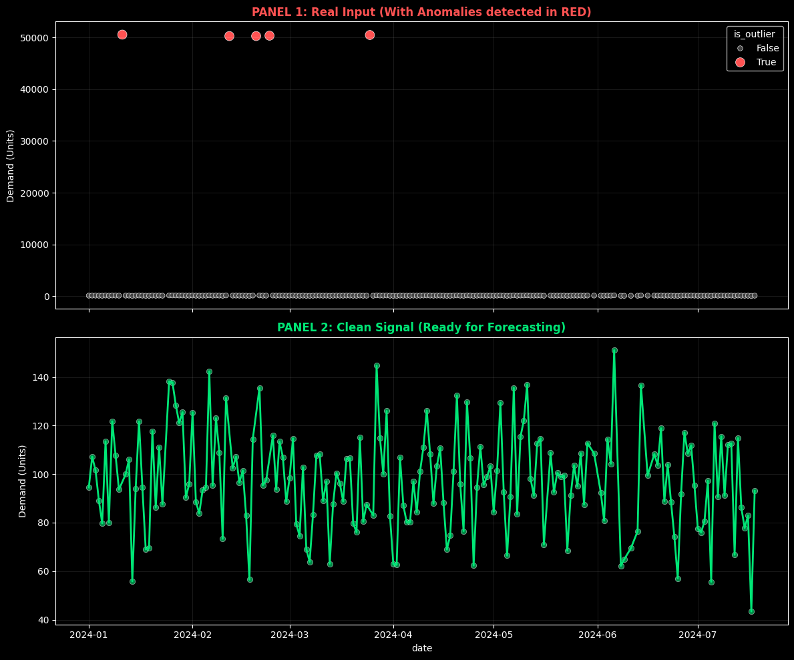

In S&OP (Sales & Operations Planning) meetings, opinions are often discussed instead of facts. *"I think we'll sell more"*, *"Last month was weird"*.

The root problem is not the lack of business vision, it's the **lack of signal integrity**.

Most supply chains are managed on spreadsheets that accept anything: dates as text, blank spaces, and typos that turn a 100-unit order into 100,000. When you feed your prediction algorithm with that "garbage," you get amplified garbage (the financial *Bullwhip* effect).

Today we kick off the **S&OP Engineering** series. We're not going to talk theory; we're going to build a data architecture that audits your business automatically.


## The Problem: Signal-to-Noise Ratio

In telecommunications (my original background), noise is any interference that corrupts the signal. In Supply Chain, "noise" is dirty data.

If you don't filter the noise before planning demand, you're **immobilizing capital**. An undetected *outlier* is money on fire. If your algorithm sees a false spike of 100,000 units, it will order raw materials you don't need, burning cash and taking up warehouse space. Data hygiene is not 'cleaning', it's protecting your operating margin.

### The Visual Evidence

Before seeing a single line of code, look at the difference between what your ERP exports (top) and the statistical reality of your demand (bottom).


*Top: Raw data with human errors. Bottom: The clean signal ready for AI algorithms.*

## The Solution: "Quality Valve" Architecture

To solve this, we apply **First Principles Thinking**. We don't need to "be more careful" with Excel. We need a system that mathematically **prohibits** the entry of dirty data into our "Single Source of Truth."

We've designed an automated pipeline with the following stack:

* **Brain:** Python (Pandas + Scipy) for statistical logic.
* **Warehouse:** Supabase (PostgreSQL) as the "Single Source of Truth."
* **Agent:** A script that runs automatically when new files arrive.

### The Code: Statistics > Intuition

We don't use fixed rules ("if greater than 1000, delete"). We use statistics. We implement the **Z-Score**, which measures how many standard deviations a data point is from the mean.

If a sale has a `Z-Score > 3` (it's more than 3 sigmas from normality), it's mathematically unlikely to be standard behavior. The system doesn't delete it (it could be a real sale), but it **flags it for audit** and excludes it from automatic prediction.

*Note*: We use Z-Score assuming normality to simplify this example. In production scenarios with intermittent demand, we use methods like IQR (Interquartile Range) or MAD (Median Absolute Deviation) which are more robust for non-Gaussian distributions.

Here's the core logic from our `SupplyChainSanitizer` class:

```python
def detect_outliers_zscore(self, threshold=3):
    """
    Detects statistical anomalies using Z-Score.
    We don't delete the row (info loss), we label it.
    """
    # Calculate the standard deviation of the signal
    z_scores = np.abs(stats.zscore(self.df['qty']))
    
    # Flag what is mathematically suspicious
    self.df['is_outlier'] = z_scores > threshold
    return self
```

## Open Kitchen: Try It Yourself

As an engineer, I distrust what I can't execute. That's why I've isolated the cleaning logic in an [interactive Colab Notebook](https://colab.research.google.com/drive/13BxVyaw46BYWGz8LQQ4WE83KGrQf79jJ?usp=sharing).

You don't need to install Python or configure databases. I've prepared an ephemeral environment where you can:

* Generate a corrupt sales dataset (simulated).
* Run the `SupplyChainSanitizer` cleaning engine.
* See how the algorithm detects and separates the noise.

Click the button, hit "Play" on the cells, and observe data engineering in action.

## Production Architecture (Behind the Scenes)

For technical profiles interested in how this scales in a real company (Datalaria Core):

* **Ingestion:** CSVs are uploaded to a private Bucket in Supabase Storage or a local database.
* **Trigger:** A Python worker detects the file.
* **Processing:** Executes the cleaning in memory (Docker Container).
* **Persistence:** Clean data is injected into PostgreSQL using Row Level Security (RLS) to ensure nobody can manually alter the financial history.

> **Security Note:** In production, we never connect scripts with superuser permissions. We use specific Service Roles and strict RLS policies to ensure supply chain integrity.

### Data Flow Visualization

The following diagram shows how "dirty" data passes through our **Quality Valve** before reaching the Single Source of Truth:


flowchart LR
    subgraph ORIGIN["📂 Origin"]
        A["ERP CSV<br/>(Dirty Data)"]
    end

    subgraph PIPELINE["🧠 Quality Valve (Python)"]
        B["structural_clean()<br/>Dates · Nulls · Duplicates"]
        C["detect_outliers()<br/>Z-Score σ > 3"]
        D["get_audit_report()<br/>Hygiene Metrics"]
    end

    subgraph DESTINATION["🗄️ Single Source of Truth"]
        E[("Supabase<br/>PostgreSQL")]
        F["Clean Data<br/>(Pure Signal)"]
        G["Flagged Outliers<br/>(For Audit)"]
    end

    A --> B --> C --> D
    D --> E
    E --> F
    E --> G

    style A fill:#ff6b6b,stroke:#c0392b,color:#fff
    style F fill:#2ecc71,stroke:#27ae60,color:#fff
    style G fill:#f39c12,stroke:#d35400,color:#fff
    style E fill:#3498db,stroke:#2980b9,color:#fff


**Legend:**
- 🔴 **Red:** Raw data with noise (the problem)
- 🟢 **Green:** Clean signal ready for prediction
- 🟠 **Orange:** Anomalies labeled for human review
- 🔵 **Blue:** Centralized warehouse (Supabase)

## Next Step: Scientific Prediction

Now that we have a clean database (a pure signal), we're ready to look into the future.

In the next chapter of the series, we'll connect this clean table with **Facebook Prophet** to generate probabilistic demand forecasts, forever abandoning Excel's simple moving averages.

Subscribe to receive Chapter 2: *"Demand Planning: From Guessing to Probability"*.
