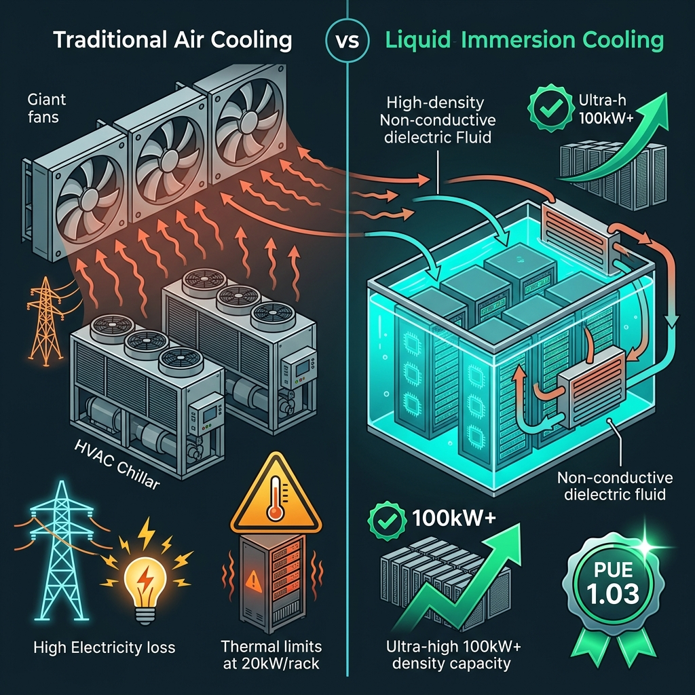

When the technology industry in 2026 debates the horizon of **Artificial General Intelligence (AGI)**, discussions routinely gravitate toward mathematical abstractions: trillion-parameter architectures, test-time reasoning compute, frontier models like **Gemini 3.8 / 4 Argon**, **Claude Mythos**, and **GPT Astra**, and autonomous agent swarms.

Yet inside the hyper-scale data centers where those models are trained and executed, reality is brutally physical, deafening, and thermodynamic: **watts, silicon, and extreme heat**.

A single server rack engineered for frontier AI workloads — packed with dense GPU clusters and high-throughput interconnects — routinely consumes between **80 and 120 kilowatts (kW)** of electrical power. To put that in perspective: a single metal cabinet generates the thermal equivalent of forty industrial ovens running continuously in the footprint of one square meter.

Attempting to cool that thermal mass by blowing chilled air through high-velocity fans is, under the laws of physics, the equivalent of trying to extinguish an active volcano with a hand fan.

Historically, **up to 40% of a data center's total electricity bill was never spent on computing data; it was squandered on massive HVAC chillers, compressors, and roaring fans simply to keep microchips from melting**.

In 2015, two engineers in Barcelona recognized that this legacy paradigm would inevitably collapse under the weight of accelerated computing. They asked a question that sounded like heresy: **What if we submerge entire running servers directly in liquid?**

That audacious question gave birth to **Submer**.

Following our deep dives into [Wallapop](/en/posts/wallapop/), [HappyRobot](/en/posts/happyrobot/), [Devo](/en/posts/devo/), [Carto](/en/posts/carto/), and the climate analytics of [Clarity AI](/en/posts/clarity_ai/), this article examines the engineering triumphs of Submer: the startup founded in Catalonia that pioneered **Single-Phase Liquid Immersion Cooling**, becoming an indispensable infrastructure partner to global giants like **Intel, Nvidia, Dell, and Supermicro** to make AGI physically viable.



### The Origin: From Deafening Noise to an Industrial Garage in L'Hospitalet

The genesis of Submer was rooted in acute operational frustration. **Daniel Pope**, an entrepreneur with extensive hands-on experience in telecommunications networks and data center architecture, spent years managing traditional server facilities. He lived the daily nightmare of air cooling: server halls with sustained noise levels exceeding 90 decibels, massive evaporative water consumption in cooling towers, and expensive processors throttling down clock speeds (*thermal throttling*) at the slightest cooling failure.

Partnering with **Pol Valls** (a software engineer with a sharp focus on product design and operations), Pope arrived at an immutable conclusion: air is a terrible thermal conductor. Non-conductive liquids have a volumetric heat capacity **more than one thousand times greater than air**.

In 2015, operating out of an industrial warehouse in L'Hospitalet de Llobregat (Barcelona), the co-founders began submerging running motherboards in home-built acrylic tanks filled with mineral oils and dielectric formulations. Early prototypes were raw and met with intense skepticism by conservative IT directors, horrified by the prospect of pouring liquid over hundreds of thousands of dollars in microchips.

Yet thermodynamics prevailed. In 2018, Submer unveiled its first commercial product at the *Mobile World Congress*: the **SmartPod**. A modular, horizontal immersion tank where standard compute blades are slid vertically into a clear, viscous fluid. When powered on, the servers ran ice-cold without a single cooling fan, in dead silence, and slashing cooling electricity consumption by over **95%**.

### The Science of Single-Phase Immersion: Dielectric Fluids and Thermodynamics

Unlike Direct-to-Chip liquid cooling (where narrow cold-plates circulate water across the CPU lid alone), Submer engineered a complete **Single-Phase Liquid Immersion Cooling** architecture.

The system relies on three fundamental engineering pillars:

#### 1. Synthetic Biodegradable Dielectric Fluids
The core of the technology is not water (which would trigger catastrophic short-circuits), but proprietary synthetic hydrocarbon formulations developed in partnership with chemical leaders like Castrol/BP. These fluids are **dielectric** (absolute electrical insulators), odorless, non-toxic, readily biodegradable, and possess extraordinarily high boiling points. Microprocessors, memory sticks, power supplies, copper traces, and high-speed bus capacitors remain fully submerged without experiencing physical degradation or corrosion.

#### 2. Natural Convection and Ultra-Low Energy Pumping
Chilled dielectric fluid enters through the bottom manifold of the tank. As it flows across hot silicon dies and GPUs, the fluid absorbs thermal energy through direct conduction, expands slightly, loses density, and rises naturally toward the surface via buoyant convection. Low-power circulation pumps pull warm fluid from the top and route it through external plate heat exchangers (cooled via a closed-loop dry cooler), returning chilled fluid to the base in a continuous, hermetic loop.

#### 3. The Gold Standard: PUE of 1.03
Data center energy efficiency is governed globally by the **Power Usage Effectiveness (PUE)** metric:
$$\text{PUE} = \frac{\text{Total Facility Power}}{\text{IT Equipment Power}}$$
In a traditional air-cooled facility, PUE typically lingers between **1.50 and 1.60** (for every watt powering a processor, an extra 0.50 to 0.60 watts are lost to fans and air conditioning).

Submer shattered this baseline, achieving a certified PUE of **1.03**. Nearly **97% of every kilowatt-hour entering the building is funneled directly into computational chips**, virtually eliminating cooling waste.

### Capital Scaling and Alliances: Building an Industrial Powerhouse

Submer's funding trajectory reflects the maturation of one of Europe’s most ambitious deep-tech hardware enterprises:

* **Early Venture Rounds (2018–2020)**: Backed early by Spanish venture firm **Alma Mundi Ventures**, validating immersion tanks across European telecom and high-performance computing (HPC) research pilots.
* **Series B ($34M in 2022)**: European impact investment heavyweight **Planet First Partners** led a \$34 million round, enabling Submer to open assembly facilities and R&D centers in Houston (Texas) and Taiwan.
* **Series C and the Pathway to Unicorn Status (2024–2026)**: In October 2024, Submer closed a **\$55.5 million Series C round** led by UK institutional investor **M&G Investments**, with participation from **Norrsken VC** and Mundi Ventures. The financing pegged Submer’s valuation near **€500 million**, setting the stage for unicorn status.
* **Turnkey Infrastructure Operator and InferX (2025–2026)**: Transcending tank manufacturing, Submer launched dedicated infrastructure entities such as **InferX** to design, build, and operate full-scale hyperscale facilities, headlined by a flagship **56 MW campus in Barcelona** dedicated exclusively to hosting AI-as-a-Service clusters.

Crucially, Submer anchored its dominance by championing the **Open Compute Project (OCP)**. By co-authoring open immersion standards and partnering directly with **Intel** (designing reference specifications for immersed Xeon processors) and **Nvidia's** server ecosystem, Submer ensured that enterprise hardware ships with certified manufacturer warranties intact.

---

### The Physical Ceiling of AGI: Thermodynamics Decides the Race

In our historical portraits of [Alan Turing](/en/posts/alan_turing/) and [J. Robert Oppenheimer](/en/posts/oppenheimer/), we examined how conceptual scientific revolutions inevitably confront the physical realities of the material world.

The race toward AGI has encountered an inescapable physical ceiling: **power density per square meter**.

To train reasoning models with deep test-time verification loops (as explored in [Silicon Valley](/en/posts/silicon_valley/)), accelerators must sit microscopically close together to minimize interconnect latency across high-bandwidth memory. Clustering eight 1,000-watt chips within a compact server chassis creates thermal spikes that air cannot dissipate without chips throttling performance.

Submer removes this barrier:
1. **Unprecedented Compute Density**: Enables over **100 kW per rack**, compared to the 15 to 20 kW ceiling of air, packing five times more AI compute into the same floor space.
2. **Zero Evaporative Water Waste**: While traditional hyperscalers face public backlash for evaporating millions of gallons of municipal drinking water in cooling towers during droughts, Submer’s closed-loop immersion operates completely waterless.
3. **Circular Energy and District Heating**: Thermal energy harvested from the dielectric fluid leaves heat exchangers at temperatures between 45°C and 55°C — an ideal thermal band to feed directly into municipal district heating networks or commercial agriculture, aligning seamlessly with the environmental reporting mandates of the [EU AI Act](/en/posts/eu_ai_act/) and [Clarity AI](/en/posts/clarity_ai/).

---

### Comparative Analysis: Spanish Tech Startups Profiled on Datalaria

With Submer's addition, Datalaria’s portfolio of Spanish deep-tech pioneers encompasses the complete software, data, and hardware stack:

| Company | Founded / HQ | Core Technology Domain | Business Model | Notable Corporate Milestone |
| :--- | :---: | :--- | :--- | :--- |
| **Devo** | 2011 / Madrid–Boston | Petabyte-scale real-time log ingestion & cloud SIEM | B2B SaaS Enterprise | Unicorn ($1.5B+ valuation) |
| **Flywire** | 2011 / Valencia–Boston | Complex cross-border payment rails with ML routing | B2B2C Fintech | Publicly traded on NASDAQ ($FLYW) |
| **Carto** | 2012 / Madrid–NY | Geospatial analytics (Location Intelligence) & Spatial SQL | B2B Cloud Data Analytics | Global leader in spatial intelligence |
| **Clarity AI** | 2017 / Madrid–NY | AI-driven ESG scoring & environmental impact analytics | B2B SaaS Fintech | Partnerships with BlackRock & BNP Paribas |
| **Nextail** | 2014 / Madrid | Retail inventory optimization using prescriptive analytics | B2B SaaS Retail / Supply Chain | Deployed across 30+ countries |
| **Freepik** | 2010 / Málaga | Foundational generative AI vision models & creative assets | B2C/B2B Freemium / GenAI | Majority acquisition by EQT |
| **Multiverse Computing** | 2019 / San Sebastián | Quantum tensor networks for LLM compression & inference | B2B Deep Tech Quantum | European leader in industrial quantum software |
| **Wallapop** | 2013 / Barcelona | Computer vision, dynamic pricing & circular marketplaces | C2C/B2C Marketplace | Majority acquisition by NAVER (>€800M) |
| **HappyRobot** | 2022 / SF–Madrid | Autonomous real-time voice agents for enterprise operations | B2B SaaS Enterprise / Voice AI | Unicorn ($1.2B valuation, Series C) |
| **Submer** | 2015 / Barcelona | **Liquid immersion cooling for AGI supercomputing & datacenters** | **B2B Deep Tech Hardware / Data Centers** | **Series C round ($55.5M, ~€500M valuation)** |

---

### 5 Engineering and Product Lessons from Submer

Submer’s scaling journey provides enduring takeaways for deep-tech founders and hardware engineers:

#### 1. Attack Physical Limits, Not Just Algorithmic Layers
Too many startups rush to build thin software wrappers on third-party APIs. The most durable enterprise moats are anchored in physical fundamentals: thermodynamics, materials science, and power efficiency.

#### 2. Frame Sustainability as an Economic Advantage
Submer did not win hyperscale contracts by preaching corporate social responsibility; they won because a 1.03 PUE saves tens of millions of dollars in operational expenditure (*OPEX*) and slashes capital investment in physical floor space (*CAPEX*). The most successful green technology is that which is economically unbeatable.

#### 3. Commit to Open Industry Standards from Day One
Proprietary form factors invite market resistance. Standardizing chassis dimensions and specifications through the *Open Compute Project* allowed Submer to plug seamlessly into global server supply chains.

#### 4. Hardware Reliability Demands Patient Capital
Building mission-critical data center infrastructure requires years of chemical compatibility trials, toxicity certifications, and stress-testing. Partnering with deep-tech and impact investors (such as Planet First and Norrsken) proved vital to surviving the capital-intensive valley of death.

#### 5. Waste Heat is a Resource, Not an Exhaust
In an era of industrial energy transition, dumping thermal waste into the atmosphere is unacceptable. Designing architectures that channel warm fluid into municipal heating networks transforms data centers from reviled energy sinks into vital community infrastructure.

---

### Conclusion

The race toward Artificial General Intelligence will not be won solely in research labs fine-tuning novel loss functions or in academic machine learning conferences. It will be decided, in equal measure, by human civilization’s capacity to supply power and safely dissipate the staggering heat generated by millions of silicon chips operating in unison.

From an industrial warehouse in Barcelona, Daniel Pope and Pol Valls realized that the future of computing required submerging silicon in liquid. Today, as the planet's largest AI clusters begin operating under a silent sea of dielectric fluid, Submer's breakthrough has ceased to be an experimental alternative: it has become **the physical foundation upon which the future of artificial intelligence is built**.

---

#### Sources of Interest:
* [**Submer**: Official Website and Immersion Technology Catalog](https://submer.com/)
* [**YouTube**: Submer channel](https://www.youtube.com/@Submer)
* [**Open Compute Project (OCP)**: Immersion Cooling Requirements & Standards](https://www.opencompute.org/)
* [**Datalaria**: Clarity AI — The ESG Sustainability Revolution](/en/posts/clarity_ai/)
* [**Datalaria**: Devo — Massive Data Ingestion and Real-Time Infrastructure](/en/posts/devo/)
* [**Datalaria**: HappyRobot — How Voice Agents Conquered Global Logistics](/en/posts/happyrobot/)
* [**Datalaria**: J. Robert Oppenheimer — From Monte Carlo to the Ethical Dilemma of AGI](/en/posts/oppenheimer/)
* [**Datalaria**: EU AI Act — Practical Guide to AI Governance and Efficiency](/en/posts/eu_ai_act/)
* [**Datalaria**: Silicon Valley and the PiperNet Dilemma — Runaway Optimization](/en/posts/silicon_valley/)
