Como punto de partida en el análisis de datos, es necesario conocer unas nociones matemáticas y estadísticas para poder trabajar con la información a analizar.

Para ello, vamos a comenzar viendo unos conceptos básicos:

## Población, Muestras, Individuos y Variables

 - **Población**: Total de elementos bajo estudio
 - **Muestra**: Subconjunto de elementos de la población (debería ser representativo de la población)
 - **Individuos**: Elementos individuales de la población
 - **Variables**: Características de los individuos

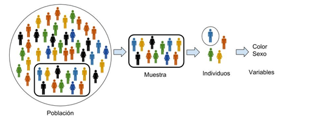

Ejemplo: [Dataset Titanic](https://www.kaggle.com/c/titanic/data)

- Población: 2.224 individuos
- Muestras: ficheros
  - *train.csv*: Conjunto de 891 individuos representativo de la población utilizado para el entrenamiento de modelos de Aprendizaje automático.
  - *test.csv*: Conjunto de 418 individuos representativo de la población utilizado para las pruebas de los modelos entrenados de Aprendizaje automático.
- Individuos: Cada pasajero y tripulante de la población (cada fila de los datos de las muestras o población recogidas).
- Variables: Las características recogidas para cada individuo (cada columna de los datos de las muestras o población recogidas, ej.: *survival* (superviviente), *sex* (sexo) o *Age* (edad)).

### Tipos de Variables
Las variables se pueden clasificar dependiendo del tipo de datos que contengan y, más concretamente:

 - **Numéricas**: los datos se representan mediante números que son métricas o medidas de dicha variable. Según los valores que pueda tomar ese número se clasificarían en:
   - **Continuas**: podrían tomar  un número incontable o indeterminado de valores. Por ejemplo, en el conjunto de datos del ejemplo del Titanic, la variable “fare” podría considerarse una variable continua al tomar valores diferentes con hasta 4 decimales de precisión.
   - **Discretas**: tomarían un número contable dentro de una lista de valores (los datos de variables continuas pueden ser truncados a variables discretas por mayor facilidad de análisis). Por ejemplo, la variable Sibsp (# de hermanos) serían variables discretas.
 - **Categóricas**: los datos se representan con textos o números cuyo significado no es una métrica, sino que se asocian a un dato concreto o categoría. Según la relación entre los valores que puedan tomar los datos se clasificarían en:
	 - **Nominales**: datos que no tienen ninguna relación u orden intrínseco en sí mismas. Un Ejemplo de este tipo sería la variable “embarked” que representa el puerto de embarque de los pasajeros.
	 - **Ordinales**: datos que siguen un orden natural o clasificación entre sí. Como por ejemplo podría ser la variable Pclass que representa la clase en el Titanic según el estatus social.

***Nota de interés:*** *No siempre está clara la tipología de las variables y éstas podrían ser consideradas de diferentes tipos dependiendo del criterio de cada persona y de los objetivos que se estén buscando. Un ejemplo podría ser la representación de la edad, la cual podría ser correctamente considerada tanto numérica (continua o discreta dependiendo de la precisión) como ordinal, dependiendo de si se desea trabajar con fórmulas para tratar la edad como un valor continuo o simplemente se trabaja con intervalos de edad específicos según la relación del resto de variables.*

## Histogramas y Gráficos de barras
Aunque más adelante haré una entrada dedicada a la visualización de datos y los principales gráficos a utilizar, es importante citar brevemente a los histogramas y los gráficos de barras, los cuales son dos de las representaciones más útiles en el análisis de datos y sirven para entender cómo se distribuyen los datos respecto a una variable o característica del conjunto de datos (continua en el caso de los histogramas y discreta en el caso de los gráficos de barras).

 * Ejemplo: Diagrama de Barras

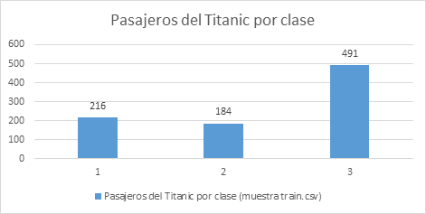

 * Ejemplo: Histograma

 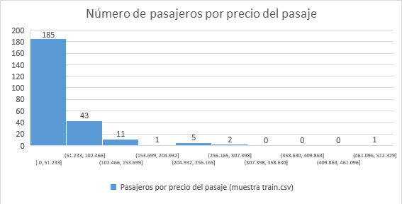

Así pues, gracias a estos gráficos se puede extraer información significativa sobre la distribución de los datos representados y según su distribución se pueden clasificar en simétricos o asimétricos como veremos a continuación.

## Medidas de Estadística Descriptiva
Un paso clave a la hora de analizar un conjunto de datos es lo que se denomina “estadística descriptiva” y que consiste, como el nombre indica, en describir los datos mediante una serie de medidas que permitan caracterizar principalmente su distribución y su dispersión.

### Medidas de la tendencia central

Las medidas de la tendencia central sirven para darnos una idea de la distribución de nuestros datos.

#### Media aritmética (Promedio)
Esta medida busca obtener el valor medio de un conjunto de datos. Es decir, para ello se suman todos los valores del conjunto de datos y se dividen por el total de datos que lo componen.

* **Media de la población**:
$$ \mu = \frac{1}{N}\displaystyle\sum_{i=1}^Nx_i $$

* **Media de la muestra**:
$$ \bar x = \frac{1}{n}\displaystyle\sum_{i=1}^Nx_i $$

Siendo N el total de datos de la población y n el total de datos de la muestra.

* Ejemplo:
Si tenemos el siguiente conjunto de 5 datos: [1, 2, 2, 5, 10], la media de dichos valores será por lo tanto la suma de los mismos (20) dividido por el total de datos (5), es decir, la media será 4.

* Ejemplo Titanic:
Siguiendo con nuestro ejemplo de datos del Titanic, y tomando la variable Age sobre la muestra *train.csv*, visualizamos su distribución, así como su media aritmética:

 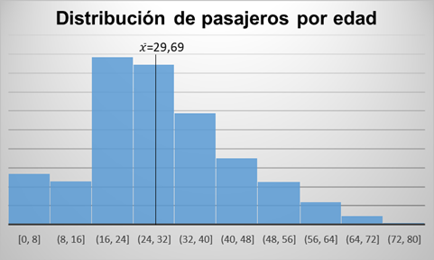

#### Mediana
Esta medida representa el valor medio en el conjunto de datos. Es decir, para su cálculo, tomamos el valor medio del conjunto de datos xm:

$$ \displaystyle x_{m} = x (\frac{n+1}{2}) $$

La mediana al depender de la posición de los valores y no de su valor, es menos dependiente de valores extremos que la media aritmética. Es por esto que en muchas estadísticas comunes (por ejemplo el salario medio de la población) sería más adecuado utilizar la mediana en vez de la media para evitar la presencia de valores muy altos que puedan desajustar o dar una idea equivocada del análisis realizado.

* Ejemplo:
Si tenemos el siguiente conjunto de 5 datos: [1, 2, 2, 5, 10], la mediana de dichos valores será el dato que se encuentra en el valor medio del conjunto. Es decir, el valor ubicado en la tercera posición del vector y que será 2.

* Ejemplo Titanic:
Siguiendo con nuestro ejemplo de datos del Titanic, y tomando la variable Age sobre la muestra *train.csv*, visualizamos su distribución, así como su mediana:

 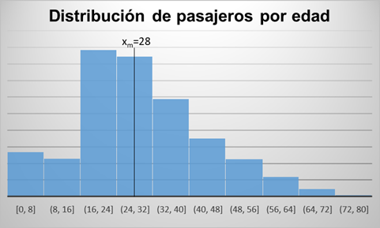

#### Moda
La moda en estadística representa el valor con mayor frecuencia dentro de una distribución.

* Ejemplo:
Manteniendo nuestro conjunto de 5 datos: [1, 2, 2, 5, 10], la moda sería el valor más repetido en nuestro conjunto, es decir, el valor 2.

* Ejemplo Titanic:
Siguiendo con nuestro ejemplo de datos del Titanic, y tomando la variable Age sobre la muestra *train.csv*, visualizamos su distribución, así como su moda sería:

 

### Análisis de la tendencia central
Tal como se observa de los ejemplos vistos, mediante estas medidas se pueden extraer unas primeras conclusiones respecto a la distribución de la variable analizada, así como sus valores más representativos. Por lo tanto, y comparando estos valores, se puede caracterizar la distribución de una variable y ver si tiende a ser simétrica (casos donde la media, la mediana y la moda son similares), o si tiende a ser asimétrica positiva (más valores se concentran por debajo de la media y en ese caso la Media es mayor que la mediana y ésta mayor que la moda) o asimétrica negativa (más valores se concentran por encima de la media y en ese caso la Media es menor que la mediana y ésta menor que la moda).

Como hemos podido ver en nuestro ejemplo del Titanic y la Edad de sus pasajeros tenemos una cierta asimetría positiva (Media=29,69 > Mediana=28 > Moda=24) lo que nos indica que había más personas por debajo de 29,69 años que por encima.

### Medidas de  variabilidad
Las medidas de variabilidad sirven para darnos una idea de la dispersión o separación de nuestros datos.

#### Rango
El rango simplemente recoge la amplitud de la distribución y se calcula mediante la diferencia del valor más alto y el valor más bajo.
$$ \displaystyle Rango  = Max (i) - Min (i) $$

* Ejemplo:
Manteniendo nuestro conjunto de 5 datos: [1, 2, 2, 5, 10], el rango sería 10 - 1 = 9.

* Ejemplo Titanic:
Siguiendo con nuestro ejemplo de la muestra de datos del Titanic, el rango sería de 80-0,42 = 79,58 años.

#### Varianza
La varianza es una medida de la dispersión de los valores de la variable analizada respecto a su valor medio. Se calcula obteniendo el valor medio del cuadrado de sus residuos (diferencias de cada valor respecto a la media). Es decir:

* **Varianza de la población**:
$$ \sigma^{2} = \frac{\displaystyle\sum_{i=1}^N (x_i-\mu)^2}{N} $$

* **Varianza insesgada de la muestra**:
$$ s^{2} = \frac{\displaystyle\sum_{i=1}^N (x_i-\bar x)^2}{n - 1}  $$

El hecho de que el cálculo se realice sobre el cuadrado de las diferencias, se debe a que si sumáramos todas sus diferencias el resultado sería 0.

En cuanto a la diferencia en el denominador de ambos cálculos, esto se debe a que estamos utilizando lo que se conoce como varianza insesgada de la muestra. Este modificación radica en que estamos calculando un valor estadístico de una muestra que podría estar dejando la media poblacional fuera o alejada de nuestros valores, si calculamos la varianza de la muestra dividiendo por n, podríamos estar subestimando el valor real de la varianza poblacional (más información al respecto puede encontrarse en Kahn Academy: [Revisión e intuición del porqué se divide entre n-1 para la varianza muestral insesgada](https://www.youtube.com/watch?v=icL43NvY5vU)

* Ejemplo:
Manteniendo nuestro conjunto de 5 datos: [1, 2, 2, 5, 10], la varianza poblacional sería de 10,8.

* Ejemplo Titanic:
Siguiendo con nuestro ejemplo de la muestra de datos del Titanic, la varianza de la muestra sería de 211,01.

#### Desviación estándar o típica
La desviación estándar o desviación típica es una medida de la dispersión de los valores de la variable analizada representada en sus mismas unidades. Su cálculo se realiza mediante **la raíz cuadrada de la varianza** y por lo tanto su representación es simplemente *σ* o *s* dependiendo de si representa a la población o a la muestra.

* Ejemplo:
Manteniendo nuestro conjunto de 5 datos: [1, 2, 2, 5, 10], la desviación estándar sería de 3,67.

* Ejemplo Titanic:
Siguiendo con nuestro ejemplo de la muestra de datos del Titanic, la desviación típica de la muestra sería de 14,52 años.

#### Error estándar
El error estándar sirve para medir cómo de bien una muestra representa a la población. El cálculo del error estándar se realiza dividiendo la desviación estándar por la raíz cuadrada del total de valores de la muestra.

$$ \displaystyle SE_{\bar x} = \frac{s} {\sqrt n} $$

* Ejemplo Titanic:
Siguiendo con nuestro ejemplo de la muestra de datos del Titanic, el error estándar de nuestra muestra es de 0,54

### Análisis de la variabilidad
Tal como se observa de los ejemplos vistos, mediante estas medidas se pueden extraer unas primeras conclusiones respecto a la dispersión o variabilidad de los valores de nuestra distribución, la cual será de gran utilidad cuando comparemos conjuntos de datos sobre variables con las que hayamos trabajado con anterioridad y podamos comparar los resultados obtenidos.

Además, y en combinación con los datos de tendencia central, estas medidas cobran especial interés con el fin de extraer información sobre la distribución de los datos de nuestra variable, y de esta manera, caracterizar dicha variable de una u otra manera.

## Distribuciones básicas
Para finalizar con este primer artículo de la serie de *Fundamentos*, además de las medidas y cálculos de tendencia central y variabilidad, es muy interesante y conveniente tratar de visualizar las distribuciones de los datos dado que de un vistazo rápido puede proporcionar información más clara de la que se extrae de los valores calculados. De acuerdo a los datos tratados las distribuciones más típicas que podemos encontrarnos podrían ser:

1. En base al coeficiente de asimetría (en base a las medidas de la tendencia central), y como se citó anteriormente, podríamos distinguir:

### Distribución simétrica:
 - Los valores de la media, la mediana y la moda son similares:

  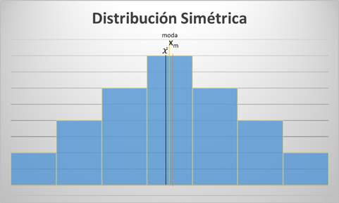

### Distribución asimétricas:
#### Asimetría positiva:
- Se concentran más valores por debajo de la media. Siendo ésta mayor que la mediana y ésta a su vez mayor que la moda.

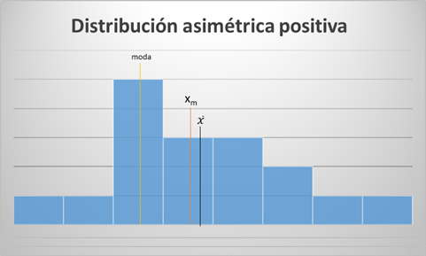

#### Asimetría negativa:
- Se concentran más valores por encima de la media. Siendo ésta menor que la mediana y ésta a su vez menor que la moda.

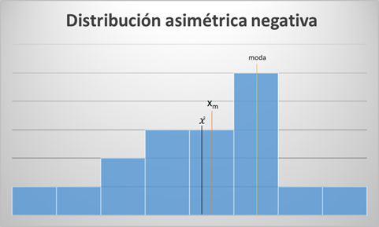

2. Según la forma que toma la distribución, los casos más típicos de representación serían:

### Distribución uniforme:
 - Prácticamente todos los valores son idénticos en todo el rango de la variable. Este tipo de distribuciones podrían deberse a que se están tomando intervalos de representación demasiado pequeños o demasiado grandes, así como a que la variables representada consiste en una combinación de varias variables. Por lo tanto, es aconsejable variar la forma de representar los datos para detectar cambios que induzcan más información:

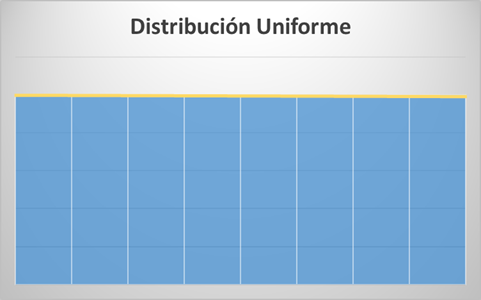

### Distribución aleatoria:
 - Aquellas distribuciones sin un patrón claro de representación. Pueden distinguirse diferentes modas o picos. Podrían deberse a los mismos casos que los indicados para la distribución normal, por lo que se recomienda tratar de hacer cambios en la representación de los mismos:

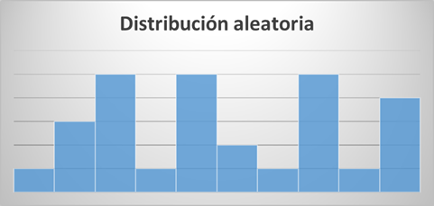

### Distribución bimodal:
 - Distribuciones con 2 modas o picos, indicando generalmente que están afectadas por 2 fuentes de variación que deberían tratar de ser estudiadas independientemente. En este tipo de distribuciones podría darse el caso de que las medidas de variabilidad y tendencia central sean parecidas por lo que su visualización se considera conveniente para un mayor entendimiento.

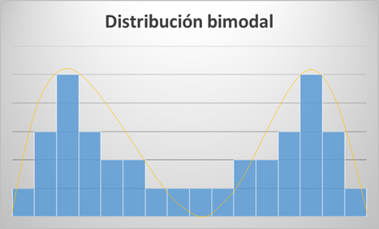

### Distribución normal:
 - La distribución normal o distribución gaussiana consiste en la distribución deseada para todos nuestros datos. Aunque debido a su importancia se dedicará una entrada específica a este tipo de distribución, explicado de manera breve, se trata de una función simétrica con forma de campana que permite modelar numerosos fenómenos de la naturaleza. La gran ventaja que presenta disponer de variables cuyos datos se asimilan a este tipo de distribución es que su distribución puede caracterizarse en función de su desviación estándar de la siguiente manera:

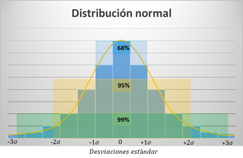

#### Fuentes de interés:
- Kaggle – [Titanic Machine Learning from Disaster](https://www.kaggle.com/c/titanic)
