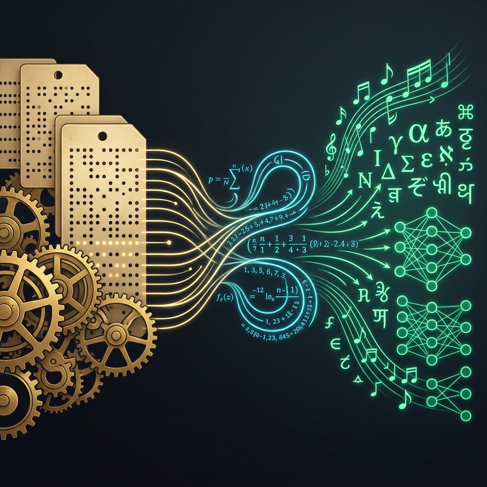

En 1843, una mujer de 27 años, madre de tres hijos y condesa de Lovelace, publicó un apéndice técnico de notas que triplicaba en longitud al texto que pretendía traducir. En aquellas páginas manuscritas con tinta y pluma, en plena Inglaterra victoriana del carbón y el vapor, **Augusta Ada King, Condesa de Lovelace**, no solo escribió el **primer algoritmo informático de la historia** destinado a ser procesado por una máquina. Hizo algo infinitamente más revolucionario: **concibió el concepto mismo de software y computación de propósito general**.

Mientras su mentor y colaborador, el genial inventor **Charles Babbage**, estaba obsesionado con construir una gigantesca calculadora mecánica de bronce y engranajes para corregir los errores en las tablas de navegación marítima y astronomía, Ada Lovelace vio lo que nadie más en el siglo XIX pudo ver. Comprendió que si una máquina podía manipular números, y esos números podían representar cualquier entidad del mundo real —notas musicales, letras del alfabeto o píxeles visuales—, **la máquina podía manipular símbolos y crear arte, lenguaje y conocimiento**.

En el panteón de pioneros que construyeron los cimientos de nuestra civilización de datos — junto a [Florence Nightingale](/es/posts/florence-nightingale/) y la estadística sanitaria, [Thomas Bayes](/es/posts/thomas_bayes/) y la inferencia probabilística, [Claude Shannon](/es/posts/claude_shannon/) y la teoría de la información, y [Abraham Wald](/es/posts/abraham_wald/) y el análisis de lo invisible —, Ada Lovelace ocupa el lugar originario: fue la primera persona en comprender que **el hardware es solo el cuerpo mecánico, pero el algoritmo es el alma pensante del sistema**.

### La Princesa de los Paralelogramos: Educación contra la Locura

Ada Lovelace nació en Londres en diciembre de 1815 como la única hija legítima del célebre poeta romántico **Lord Byron** y de la aristócrata y matemática **Annabella Milbanke**. El matrimonio fue un desastre volcánico: Byron abandonó Inglaterra apenas unas semanas después del nacimiento de Ada para no regresar jamás, dejando tras de sí un halo de escándalos, deudas y genialidad tormentosa.

Aterrorizada por la posibilidad de que su hija heredara el temperamento tempestuoso y la «locura poética» de su padre, Lady Byron sometió a la pequeña Ada a un régimen educativo inusualmente estricto para las mujeres de la época victoriana. Prohibió la poesía en casa e impuso una dieta intensiva de **matemáticas rigurosas, lógica, geometría, astronomía y latín**. Annabella, a quien el propio Lord Byron había apodado irónicamente en sus cartas como *«la princesa de los paralelogramos»*, contrató a los mejores tutores privados del reino, entre ellos el reputado lógico y matemático **Augustus De Morgan** (célebre por las Leyes de De Morgan del álgebra booleana) y la astrónoma y divulgadora científica **Mary Somerville**.

De Morgan reconoció de inmediato que la mente de la joven Ada no era convencional: poseía una capacidad abstracta para interconectar conceptos matemáticos con una intuición filosófica y poética que él mismo confesó no haber visto jamás en un estudiante. La propia Ada bautizó su metodología de pensamiento como **«Ciencia Poética»** (*Poetical Science*): un enfoque integrador que utilizaba la imaginación metafórica para explorar las verdades matemáticas más profundas y ver aplicaciones prácticas donde otros solo veían números estériles.

### El Encuentro con Babbage: De la Calculadora al Ordenador Universal

El 5 de junio de 1833, en una fiesta de la alta sociedad londinense, una Ada de diecisiete años conoció a **Charles Babbage**, profesor lucasiano de matemáticas en la Universidad de Cambridge (la misma cátedra que habían ocupado Isaac Newton y que siglos más tarde ocuparía Stephen Hawking). Babbage mostró a los invitados un prototipo parcial de su **Máquina Diferencial** (*Difference Engine*): una compleja máquina mecánica de engranajes diseñada para tabular polinomios utilizando el método de las diferencias finitas.

Mientras la mayoría de los asistentes contemplaban el artilugio como una curiosidad mecánica o un juguete caro de feria científica, Ada quedó fascinada por la belleza lógica subyacente del mecanismo. Se inició así una correspondencia epistolar y una colaboración intelectual que duraría casi dos décadas.

Pronto, Babbage abandonó el desarrollo de la Máquina Diferencial para embarcarse en un proyecto incalculablemente más ambicioso: la **Máquina Analítica** (*Analytical Engine*). La diferencia entre ambas máquinas es, en esencia, la misma diferencia que existe entre una calculadora de bolsillo y un ordenador moderno:

* **La Máquina Diferencial** era un dispositivo de propósito único: solo podía sumar y restar para calcular polinomios numéricos prefijados.
* **La Máquina Analítica** era una máquina de **propósito general programable**: contaba con una unidad central de procesamiento de cálculo que Babbage llamaba el «Molino» (*the Mill*), una memoria de almacenamiento de datos llamada el «Almacén» (*the Store*), y un sistema de control de entrada y salida basado en **tarjetas perforadas**, inspiradas directamente en el telar inventado por Joseph Marie Jacquard en 1804.

Babbage concibió la máquina. Pero fue Lovelace quien comprendió qué significaba realmente.

### Las "Notas" de 1843 y el Primer Algoritmo (Note G)

En 1842, Babbage viajó a Turín para dar una serie de conferencias sobre la Máquina Analítica. El ingeniero militar y matemático italiano **Luigi Menabrea** (futuro primer ministro de Italia) tomó minuciosos apuntes y publicó un artículo en francés describiendo el funcionamiento de la máquina en una revista suiza.

Charles Wheatstone sugirió a Ada Lovelace que tradujera el artículo de Menabrea al inglés para la revista académica *Taylor's Scientific Memoirs*. Babbage, encantado con la idea, le propuso que añadiera sus propios comentarios y notas explicativas. Ada trabajó febrilmente durante nueve meses entre 1842 y 1843, expandiendo el texto original hasta convertirlo en una obra fundacional. Sus notas —rotuladas alfabéticamente de la **Note A** a la **Note G**— ocupaban más del triple de páginas que el tratado de Menabrea.

En la **Note A**, Ada articuló la distinción filosófica y técnica que separa el cálculo mecánico de la computación universal. Escribió una de las frases más visionarias de la historia de la ciencia:

> *«La Máquina Analítica teje patrones algebraicos del mismo modo que el telar de Jacquard teje flores y hojas».*

Pero el clímax de la obra se encuentra en la legendaria **Note G**. En esta sección, Ada diseñó un diagrama operativo completo y estructurado para calcular los **números de Bernoulli** (una secuencia compleja de números racionales con aplicaciones esenciales en la teoría de números y el análisis matemático).

No era una simple tabla de operaciones matemáticas: era un **algoritmo informático formal**. Lovelace definió con precisión de relojero:

1. **Variables de estado y registros**: Asignó ubicaciones de memoria específicas en el «Almacén» de la máquina para almacenar variables intermedias ($V_1, V_2, V_3 \dots$).
2. **Bucles e iteración (*Loops*)**: Diseñó instrucciones para que la máquina repitiera secuencias de tarjetas perforadas automáticamente hasta cumplir una condición aritmética.
3. **Bifurcaciones condicionales (*Branching*)**: Estableció cómo el flujo de control del programa podía desviarse en función del resultado de una operación previa.
4. **Ejecución paralela y optimización de recursos**: Analizó cómo minimizar el número de ciclos de cálculo del Molino para maximizar la velocidad de computación.

Por esta Note G, la comunidad científica internacional reconoce unánimemente a Ada Lovelace como la **primera programadora de software de la historia**.

### El Salto a la Computación Simbólica: El Software Antes del Hardware

Para Babbage, la Máquina Analítica era una máquina de números: su objetivo era acelerar cálculos astronómicos, tablas balísticas y registros financieros.

Para Lovelace, los números eran únicamente el medio, no el fin. En la Note A, Ada dio el salto conceptual que tardaría cien años en ser redescubierto por John von Neumann y Alan Turing:

> *«Si suponemos que las relaciones fundamentales de los sonidos afinados en la ciencia de la armonía y de la composición musical fueran susceptibles de tales expresiones y adaptaciones, la máquina podría componer piezas de música elaboradas y científicas de cualquier grado de complejidad o extensión».*

Esta afirmación es asombrosa. En 1843, en un mundo sin electricidad, sin válvulas de vacío y sin semiconductores, una matemática comprendió que **cualquier sistema de información que pueda formalizarse mediante reglas lógicas puede ser procesado, transformado y generado por una máquina algorítmica**.

Ada intuyó el software, la síntesis digital de audio, el procesamiento de lenguaje natural y la computación gráfica antes de que se inventara la bombilla eléctrica. Desacopló el contenido simbólico de la máquina física, exactamente como [Claude Shannon](/es/posts/claude_shannon/) desacoplaría un siglo después el significado humano de la entropía matemática del bit.

### La "Objeción de Lady Lovelace": El Debate Original de la IA

En la Note G, Ada reflexionó sobre los límites ontológicos de las máquinas inteligentes y escribió una advertencia que cambiaría el debate filosófico sobre la inteligencia artificial para siempre:

> *«La Máquina Analítica no tiene ninguna pretensión de originar nada. Puede hacer cualquier cosa que sepamos cómo ordenarle que ejecute. Puede seguir el análisis; pero no tiene poder para anticipar ninguna relación analítica o verdad».*

Un siglo más tarde, en 1950, el padre de la computación teórica y pionero de la IA, **Alan Turing**, publicó su histórico artículo *"Computing Machinery and Intelligence"* (donde presentó el célebre Test de Turing). En ese texto, Turing dedicó una sección entera a analizar formalmente lo que él mismo bautizó como la **«Objeción de Lady Lovelace»** (*Lady Lovelace's Objection*).

Turing debatió si las máquinas realmente son incapaces de sorprendernos o si la aparente creatividad es simplemente una propiedad emergente de reglas deterministas extremadamente complejas ejecutadas a gran escala.

En 2026, en plena era de los Grandes Modelos de Lenguaje (LLMs) y los agentes autónomos de razonamiento como Gemini 2.5, Claude 3.7 y DeepSeek, la Objeción de Lovelace sigue en el epicentro de la controversia:

* ¿Cuando un pipeline agéntico con [CrewAI y Tool Calling](/es/posts/ia_agents_part1/) resuelve de forma autónoma una incidencia compleja de supply chain en nuestro [Radar de Obsolescencia](/es/posts/obs_parte5_radar/), está "creando" nuevo conocimiento o simplemente ejecutando con precisión estadística los billones de parámetros condicionados durante su entrenamiento?
* Cuando comparamos [Fine-Tuning vs Prompt Engineering vs RAG](/es/posts/finetuning_vs_rag/), estamos reconociendo la validez práctica del postulado de Lovelace: el modelo no inventa la verdad de tu empresa por arte de magia; necesita que le inyectemos el contexto determinista de las herramientas y los datos para producir resultados fiables.

La pregunta que Ada formuló en 1843 sigue siendo el estándar ético y técnico con el que el [EU AI Act](/es/posts/eu_ai_act/) regula la supervisión humana (Artículo 14): la máquina ejecuta con brillantez, pero la responsabilidad, el propósito y el criterio último pertenecen al ser humano.

### El Legado: De la Máquina de Vapor a los Sistemas Críticos

Ada Lovelace falleció trágicamente de cáncer de útero en noviembre de 1852, con solo 36 años —la misma edad a la que murió su padre, Lord Byron— y fue enterrada, por deseo propio, junto a él en la iglesia de Santa María Magdalena en Hucknall, Nottinghamshire.

La Máquina Analítica de Babbage nunca llegó a construirse en vida de ambos debido a la falta de fondos públicos y a las limitaciones de tolerancia mecánica de la metalurgia victoriana. Durante casi un siglo, el trabajo de Lovelace permaneció como una curiosidad bibliográfica olvidada en los anales de la ciencia británica.

Sin embargo, el tiempo hizo justicia matemática a su legado:

* **El Lenguaje de Programación Ada**: A finales de la década de 1970, el Departamento de Defensa de los Estados Unidos (DoD) encargó el desarrollo de un lenguaje de programación de alta fiabilidad y tipado estricto para gestionar sus sistemas militares, aeroespaciales y de control crítico de misiones. En 1980, el DoD bautizó oficialmente al lenguaje como **Ada** (estándar militar MIL-STD-1815, en honor al año de su nacimiento). Hoy, Ada sigue controlando los sistemas de control de tráfico aéreo europeo, los trenes de alta velocidad TGV y el software de vuelo de la aviación comercial internacional.
* **Ada Lovelace Day**: Cada segundo martes de octubre, la comunidad científica y tecnológica global celebra el *Ada Lovelace Day* para visibilizar el liderazgo y los logros de las mujeres en las disciplinas STEM (ciencia, tecnología, ingeniería y matemáticas).
* **La Arquitectura GPU de NVIDIA**: NVIDIA bautizó su microarquitectura de GPUs de la serie GeForce RTX 40 como *Ada Lovelace*, rindiendo homenaje a la matemática que concibió por primera vez la paralelización algorítmica.

### Pensar como Ada: La Síntesis entre Poesía e Ingeniería

Si hay una lección imperecedera que Ada Lovelace legó a los ingenieros de software, científicos de datos y arquitectos de IA de nuestra era, es el poder de la **Ciencia Poética**.

La ingeniería sin imaginación produce calculadoras más rápidas; la poesía sin rigor produce quimeras sin aplicación práctica. Pero cuando el rigor matemático de los datos se une a la audacia conceptual de imaginar cómo esos datos transforman la experiencia humana, nacen las revoluciones.

Ada no se limitó a calcular polinomios: **imaginó el futuro digital cuando el mundo todavía se movía a caballo**. Doscientos años después de su nacimiento, cada vez que escribimos una función en Python, orquestamos un agente inteligente o transformamos un flujo de datos en decisiones industriales, estamos caminando sobre las huellas que una joven matemática victoriana trazó en el papel con tinta, genialidad y absoluta clarividencia.

---

#### Fuentes de Interés:
* [**The British Library**: Ada Lovelace's Mathematical Papers and Correspondence with Charles Babbage](https://www.bl.uk/people/ada-lovelace)
* [**Taylor's Scientific Memoirs (1843)**: Sketch of the Analytical Engine with Notes by the Translator](https://www.fourmilab.ch/babbage/sketch.html)
* [**Alan Turing (1950)**: Computing Machinery and Intelligence — Section on Lady Lovelace's Objection](https://academic.oup.com/mind/article/LIX/236/433/986238)
* [**Computer History Museum**: The Babbage Engine & Lovelace Legacy](https://www.computerhistory.org/babbage/)
* [**Datalaria**: Claude Shannon — El Hombre que Convirtió el Mundo en Bits](/es/posts/claude_shannon/)
* [**Datalaria**: Thomas Bayes — El Reverendo que Nos Enseñó a Actualizar Nuestras Creencias con Datos](/es/posts/thomas_bayes/)
* [**Datalaria**: Florence Nightingale — El Diagrama de la Rosa y la Estadística](/es/posts/florence-nightingale/)
* [**Datalaria**: Abraham Wald — El Sesgo del Superviviente](/es/posts/abraham_wald/)
* [**Datalaria**: Fine-Tuning vs Prompt Engineering vs RAG](/es/posts/finetuning_vs_rag/)
