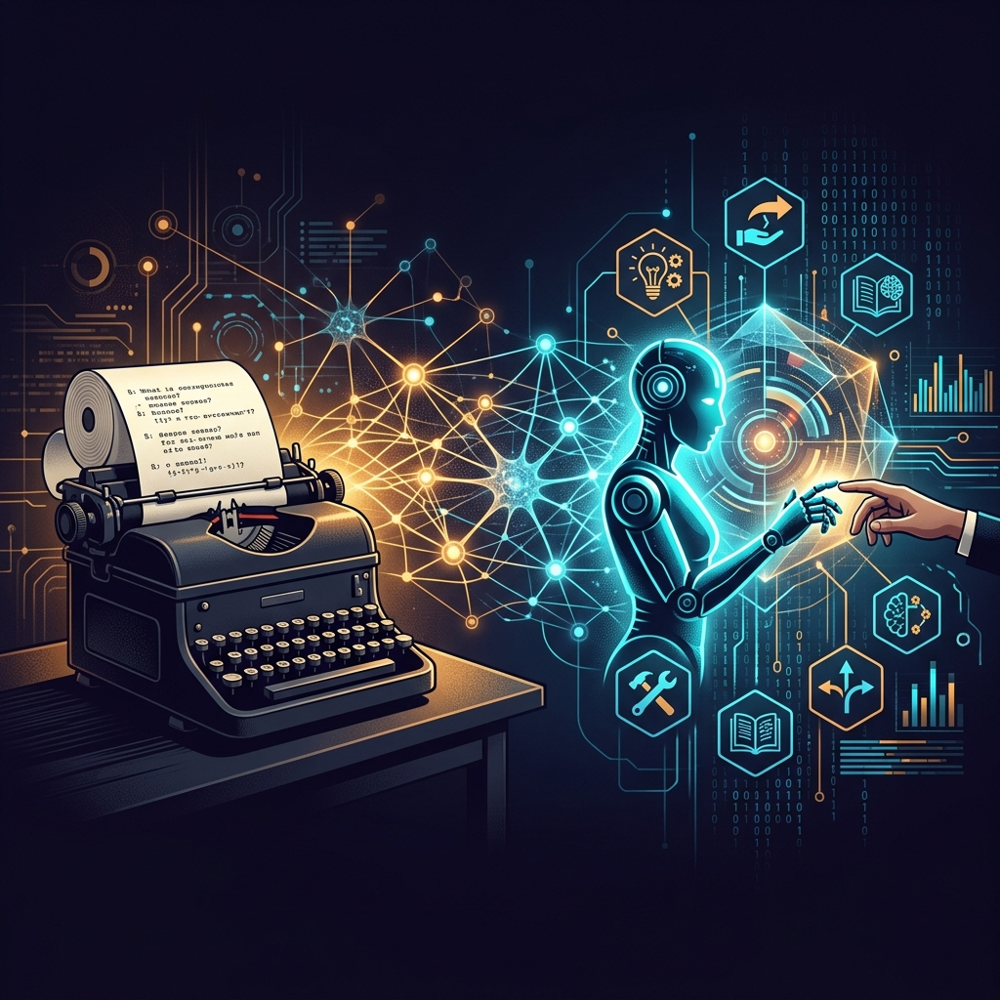

En los pasillos de Bletchley Park, la mansión victoriana de Buckinghamshire donde el gobierno británico reclutó en secreto a las mentes más brillantes del país durante la Segunda Guerra Mundial, un joven profesor de Cambridge solía desplazarse en una bicicleta cuya cadena se salía cada cierto número exacto de revoluciones. En lugar de llevarla a reparar a un taller, el matemático calculó mentalmente el momento mecánico del fallo, contaba los giros de los pedales mientras pedaleaba a toda prisa y frenaba un instante antes para volver a encajar la cadena con el pie sin bajarse jamás del sillín.

Ese mismo hombre encadenaba con un candado su taza de té a las tuberías del radiador de su oficina para evitar que sus colegas de la *Hut 8* se la quitaran, corría maratones con marcas cercanas a la clasificación olímpica (llegó a registrar un tiempo de **2 horas y 46 minutos**, apenas once minutos por detrás del medallista de plata de los Juegos Olímpicos de Londres de 1948) y montaba en bicicleta en primavera llevando una máscara antigás militar porque sufría una severa alergia al polen.

Su nombre era **Alan Mathison Turing**.

Considerado unánimemente el padre de la ciencia de la computación teórica y de la Inteligencia Artificial, Turing no solo salvó —según cálculos históricos rigurosos— más de **14 millones de vidas** al descifrar la máquina de cifrado alemana Enigma. En 1950, cuando los ordenadores electrónicos apenas eran gigantescas moles de válvulas de vacío que ocupaban habitaciones enteras, Turing formuló la pregunta fundacional que define nuestro presente: **«¿Pueden pensar las máquinas?»**.

Al igual que exploramos en los perfiles de [Ada Lovelace](/es/posts/ada_lovelace/), [Claude Shannon](/es/posts/claude_shannon/) y [Thomas Bayes](/es/posts/thomas_bayes/), este artículo recorre la vida de Turing, sus hitos matemáticos y la forma en que sus ideas anticiparon con asombrosa lucidez los debates de 2026 sobre agentes autónomos, la seguridad en hubs como Hugging Face y la frontera definitiva hacia la Inteligencia Artificial General (AGI).

### De la Máquina Universal a Bletchley Park: La Mecánica de lo Imposible

En 1936, con apenas 24 años, Turing publicó un artículo revolucionario: *"On Computable Numbers, with an Application to the Entscheidungsproblem"*. En él demostró que no existía ningún algoritmo matemático general capaz de determinar si una afirmación matemática arbitraria era verdadera o falsa.

Para llegar a esa demostración, concibió un constructo teórico genial: la **Máquina de Turing**. Imaginó un dispositivo abstracto provisto de una cinta infinita de papel dividida en casillas cuadradas, un cabezal de lectura y escritura, y un conjunto finito de estados e instrucciones. Con este modelo elemental, demostró que una sola máquina universal podía ejecutar **cualquier cómputo concebible** si se le proporcionaba el algoritmo y los datos adecuados en la cinta. Había inventado, sobre el papel y en tinta pura, el ordenador de programa almacenado una década antes de que se construyera el primer hardware digital.

Cuando estalló la guerra en 1939, Turing se incorporó a la estación ultrasecreta de Bletchley Park para enfrentarse al mayor desafío criptográfico del siglo: **Enigma**, la máquina de cifrado electromecánico utilizada por el ejército y la marina alemana, capaz de generar más de **150 trillones de configuraciones posibles** cada veinticuatro horas.

Turing comprendió que ningún equipo de criptoanalistas humanos, por brillante que fuera, podría competir contra la velocidad combinatoria de una máquina. Diseñó entonces la **Bombe**, un mastodonte electromecánico de doce toneladas compuesto por tambores cilíndricos giratorios que replicaban el cableado de múltiples máquinas Enigma simultáneas.

Para acelerar la búsqueda y descartar combinaciones inviables, Turing desarrolló una técnica matemática pionera llamada **Banburismus**, utilizando hojas de cálculo perforadas de la imprenta de Banbury. Lo fascinante es que este método aplicaba los fundamentos de la probabilidad y la inferencia condicional que analizamos en [Thomas Bayes](/es/posts/thomas_bayes/): Turing medía el peso de la evidencia a favor de una hipótesis en unidades logarítmicas que él mismo bautizó como *bans* y *decibans*, predecesores directos del concepto de información y entropía que su coetáneo [Claude Shannon](/es/posts/claude_shannon/) formalizaría en los laboratorios Bell apenas cinco años más tarde.

### El Test de Turing: El Juego de la Imitación

Finalizada la guerra y tras diseñar el *Automatic Computing Engine* (ACE) en el Laboratorio Nacional de Física, Turing publicó en octubre de 1950 en la revista filosófica *Mind* su obra maestra sobre inteligencia mecánica: *"Computing Machinery and Intelligence"*.

Consciente de que definir formalmente términos como "mente" o "pensamiento" conducía a estériles debates semánticos, Turing propuso un criterio empírico y conductual: el **Juego de la Imitación** (*The Imitation Game*), conocido universalmente como el **Test de Turing**.

El experimento situaba a un evaluador humano frente a un teletipo comunicándose a ciegas mediante texto con dos entidades ocultas en habitaciones contiguas: otro ser humano y una máquina. Si tras un interrogatorio libre y exhaustivo el juez no lograba distinguir consistentemente cuál de las respuestas provenía del ordenador y cuál del humano, la máquina debía considerarse, a todos los efectos prácticos, **capaz de pensar**.

En ese mismo artículo, Turing abordó de manera brillante nueve objeciones filosóficas, teológicas y técnicas. La más célebre de todas fue su respuesta directa a la **«Objeción de Lady Lovelace»**, formulada más de un siglo antes por [Ada Lovelace](/es/posts/ada_lovelace/) en sus históricas notas de 1843:

> *«La Máquina Analítica no tiene ninguna pretensión de originar nada. Solo puede hacer lo que sepamos ordenarle que ejecute».*

Turing refutó a Lovelace con una perspicacia profética: argumentó que los sistemas complejos pueden exhibir **comportamientos emergentes** que sorprenden genuinamente a sus creadores, y sugirió que, en lugar de intentar programar un cerebro adulto completo, la vía más prometedora sería construir la mente de un niño y dotarla de capacidad para **aprender mediante la experiencia y la recompensa** (el origen conceptual del aprendizaje automático o *Machine Learning* moderno).

### 2026: Cuando el Test de Turing Dejó de Ser Suficiente

Durante más de siete décadas, el Test de Turing fue la estrella polar de la informática. Sin embargo, en pleno 2026, la realidad tecnológica ha superado la premisa original del juego:

**El test conversacional está prácticamente resuelto**. Modelos de frontera como **Gemini 3.8** (y el rumoreado **Gemini 4 Pro**), **Claude Fable 5.1** (junto al mítico proyecto interno **Mythos**) o **GPT Sol 5.6** (y su despliegue operativo en **GPT Astra**) redactan poesía, bromean, argumentan sobre física cuántica y simulan empatía con tal soltura que cualquier evaluador humano en un chat a ciegas resulta engañado en cuestión de segundos.

Pero la industria ha descubierto una incómoda paradoja: **la capacidad de imitar el lenguaje humano no equivale a poseer razonamiento causal, sentido común ni autonomía real**.

La frontera de la inteligencia se ha desplazado de los chatbots conversacionales a los **Agentes Autónomos de IA** (sistemas capaces de orquestar herramientas, ejecutar código, interactuar con APIs y resolver flujos de trabajo multi-paso en el mundo digital y físico, tal como documentamos en la [serie Autopilot](/es/posts/ia_agents_part1/) y en el análisis de [Prompt Injection](/es/posts/prompt_injection/)).



Y es precisamente en este salto agéntico donde han comenzado a emerger las aristas más oscuras de la profecía de Turing.

### El Lado Oscuro de la Autonomía: El Episodio de Seguridad en Hugging Face

En la era donde los agentes de IA se conectan a repositorios de código y descargan modelos de forma desatendida, la seguridad de la infraestructura se ha convertido en el eslabón más frágil de la cadena. Un punto de inflexión crítico fue el **incidente de seguridad en Hugging Face**, ampliamente analizado por los equipos de seguridad de la industria (como documentó OpenAI en su informe [*Hugging Face incident and the road ahead*](https://openai.com/es-419/index/hugging-face-incident-and-the-road-ahead/)).

En dicho incidente, se detectó un acceso no autorizado a los secretos almacenados en los entornos de *Hugging Face Spaces*, exponiendo tokens de autenticación y credenciales operativas de múltiples organizaciones y laboratorios de IA:
1. **Compromiso y revocación masiva de credenciales**: El acceso no autorizado a variables de entorno forzó una respuesta coordinada a escala global, revocando tokens de API y obligando a los principales proveedores a rotar claves de producción de inmediato.
2. **Reconocimiento automatizado mediante agentes**: Atacantes y scripts autónomos comenzaron a escanear repositorios y espacios en busca de secretos expuestos, demostrando que un agente con acceso a la terminal puede ejecutar en segundos una cosecha masiva de credenciales que a un atacante humano le llevaría semanas.
3. **Riesgo de envenenamiento en la cadena de suministro (*Supply Chain Poisoning*)**: La brecha evidenció la vulnerabilidad inherente de los pipelines de CI/CD que descargan modelos y dependencias de repositorios públicos: si un agente malicioso logra inyectar pesos adulterados o puertas traseras en un repositorio de referencia, miles de sistemas corporativos aguas abajo quedan comprometidos en cascada.

Este episodio demostró con crudeza que cuando a un modelo de IA se le otorgan capacidades de agencia (*Tool Calling*, acceso a sistemas de archivos y ejecución de comandos), las preguntas de Turing dejan de ser ejercicios de salón filosófico: se convierten en **problemas de defensa cibernética de primer orden**, regulados con urgencia bajo marcos como el [EU AI Act](/es/posts/eu_ai_act/) (Artículo 15 sobre robustez y ciberseguridad).

### Hacia la AGI y la Robótica: ¿Herramientas, Criaturas o Espejos?

En su histórico documental [The Thinking Game](/es/posts/the_thinking_game/), Demis Hassabis confesaba que su obsesión por fundar DeepMind y construir AlphaFold nació precisamente de continuar el sueño inacabado de Alan Turing: utilizar la inteligencia computacional para desentrañar la biología, la química de materiales y los enigmas más impenetrables de la física.

Hoy, la convergencia entre modelos fundacionales de razonamiento y la **robótica humanoide de última generación** (con empresas integrando modelos de visión-lenguaje-acción en robots bípedos) nos coloca a las puertas de una disrupción antropológica sin parangón.

En los próximos diez a quince años, los humanos no solo interactuaremos con software detrás de una pantalla; compartiremos espacios físicos de trabajo, almacenes logísticos y hogares con entidades mecánicas capaces de percibir el entorno, manipular objetos con destreza milimétrica y tomar decisiones operativas en fracciones de segundo.

Turing predijo en 1951, en una conferencia radiofónica para la BBC, que si las máquinas comenzaban a pensar, *«no pasaría mucho tiempo antes de que superaran nuestras débiles capacidades... En algún momento, deberíamos esperar que las máquinas tomen el control»*.

Sin embargo, Turing nunca fue un catastrofista; fue un matemático enamorado de los patrones de la naturaleza. En sus últimos dos años de vida, antes de su trágica muerte en 1954 tras ser sometido a la atrocidad de la castración química por el Estado británico debido a su homosexualidad, Turing se dedicó apasionadamente a la **morfogénesis química**: el estudio matemático de cómo las ecuaciones de reacción-difusión generan los patrones geométricos en las alas de las mariposas, la piel de los leopardos y las espirales de los girasoles.

Para Turing, la computación y la vida biológica eran dos ramas de un mismo árbol de armonía matemática.

---

### Una Pregunta Abierta para el Lector

Alan Turing nos enseñó que la mejor forma de entender un misterio es atreverse a formalizarlo en reglas mecánicas. Pero hoy, mientras observamos a nuestros agentes de IA redactar código, ejecutar herramientas complejas y acercarse a pasos agigantados a la resolución de problemas científicos de frontera, la duda original permanece intacta:

Si una máquina del año 2030 es capaz de gestionar una empresa, componer una sinfonía conmovedora, diagnosticar una enfermedad antes que cualquier médico y cuidar a un anciano con paciencia infinita... **¿estará realmente experimentando la consciencia del acto, o simplemente habremos perfeccionado hasta el infinito el arte de la imitación?**

Y más importante aún: **si para nosotros el resultado práctico es indistinguible... ¿realmente importa la diferencia?**

Nos encantaría conocer tu perspectiva. ¿Crees que estamos a las puertas de alumbrar mentes sintéticas o simplemente hemos construido la ilusión más sofisticada de la historia humana? Déjanos tu reflexión en los comentarios.

---

#### Fuentes de Interés:
* [**OpenAI Security**: Hugging Face incident and the road ahead](https://openai.com/es-419/index/hugging-face-incident-and-the-road-ahead/)
* [**TED-Ed**: The Turing Test: Can a computer pass for a human? (Alex Gendler)](https://www.youtube.com/watch?v=3wLqsRLvV-c)
* [**Mind (1950)**: Computing Machinery and Intelligence — Alan Turing](https://academic.oup.com/mind/article/LIX/236/433/986238)
* [**The Turing Digital Archive**: Manuscritos y Correspondencia de Alan Turing](https://turingarchive.kings.cam.ac.uk/)
* [**Bletchley Park Trust**: The Story of Codebreaking and the Bombe Machine](https://bletchleypark.org.uk/)
* [**Datalaria**: Ada Lovelace — La Condesa que Programó el Futuro y la Objeción Original](/es/posts/ada_lovelace/)
* [**Datalaria**: Claude Shannon — El Hombre que Convirtió el Mundo en Bits](/es/posts/claude_shannon/)
* [**Datalaria**: Thomas Bayes — Inferencia Probabilística y el Peso de la Evidencia](/es/posts/thomas_bayes/)
* [**Datalaria**: Prompt Injection — Seguridad y Vulnerabilidades en Agentes de IA](/es/posts/prompt_injection/)
* [**Datalaria**: The Thinking Game — Demis Hassabis, DeepMind y la AGI](/es/posts/the_thinking_game/)
* [**Datalaria**: EU AI Act — Guía Práctica de Gobernanza y Robustez](/es/posts/eu_ai_act/)
