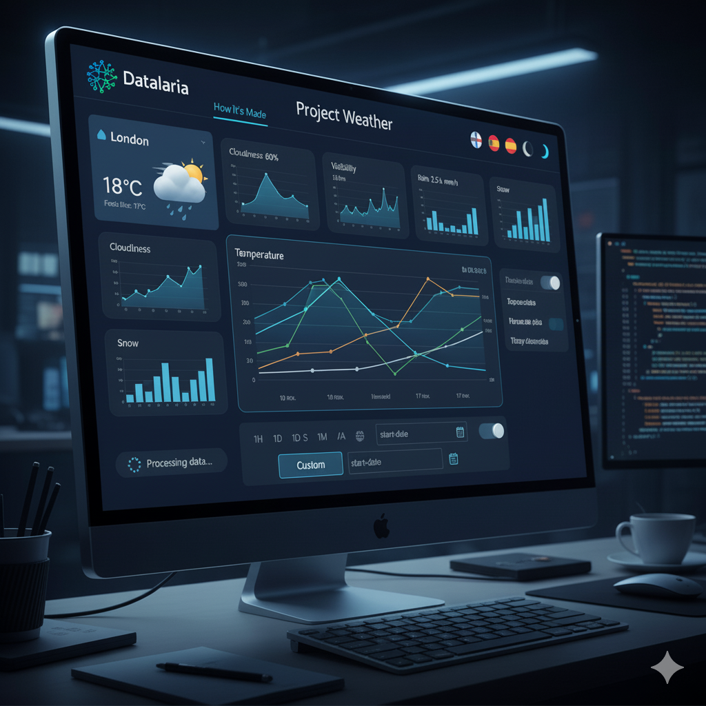

En las publicaciones anteriores, hemos explorado el núcleo del **Proyecto Weather**, centrado en su plataforma básica de backend-frontend y sus capacidades de predicción por IA. Una vez conseguidos estos puntos y con la aplicación operativa, surgieron ciertos aspectos de mejora de cara a una experiencia de frontend más fluida e intuitiva.

Esta publicación desvela las "extras", las mejoras significativas y las decisiones de diseño que transformaron el Proyecto Weather de una piloto básico a un dashboard meteorológico integral y listo para producción. Estas mejoras, aunque no están directamente relacionadas con la predicción por IA, fueron cruciales para construir una experiencia de usuario fiable, escalable y agradable.

---

### 1. Expansión de Métricas y Recolección de Datos: De Básico a Completo

Nuestro dashboard meteorológico inicial, aunque funcional, solo proporcionaba métricas básicas como temperatura, viento y humedad. Para evolucionar hacia una estación meteorológica verdaderamente útil, necesitábamos más datos. Esto requirió modificaciones significativas tanto en nuestro script de recolección de datos del backend como en la visualización del frontend.

#### Nuevas Métricas y Visualizaciones Dinámicas
Renovamos nuestro script de Python `read_weather.py` para obtener y almacenar cuatro nuevas variables meteorológicas críticas:

* **Nubosidad (%):** Porcentaje de cielo cubierto.
* **Visibilidad (km):** Distancia de visión (crucial para condiciones de niebla o bruma).
* **Lluvia (mm):** Lluvia caída en la última hora.
* **Nieve (mm):** Nieve caída en la última hora.

En el frontend, visualizar estos diversos tipos de datos de manera efectiva era clave. Implementamos lógica condicional dentro de [Chart.js](https://www.chartjs.org/) para adaptar el tipo de gráfico según el dato:

* **Gráficos de líneas** para variables continuas como temperatura y velocidad del viento.
* **Gráficos de área (rellenos)** para humedad y nubosidad, proporcionando una sensación de acumulación o cobertura.
* **Gráficos de barras** para precipitaciones (lluvia/nieve), ya que las barras representan visualmente las cantidades acumuladas de manera más intuitiva.

#### Migración Automática de Datos
Un desafío común al agregar nuevos campos de datos a un sistema existente es la gestión de datos históricos. Diseñamos un robusto sistema de backend para detectar y migrar automáticamente ficheros CSV antiguos (con 11 columnas) al nuevo formato de 15 columnas. Fundamentalmente, este sistema manejó con elegancia los valores faltantes para las nuevas métricas, completándolos con valores por defecto sensatos (por ejemplo, `0` para lluvia/nieve), evitando así cualquier pérdida de contexto histórico y asegurando la integridad de los datos en todo el conjunto de datos. Este proceso automatizado fue vital para una transición fluida sin requerir intervención manual.

---

### 2. Sistema Completo de Internacionalización (i18n): Una Aplicación Verdaderamente Global

Para hacer que el Proyecto Weather fuera accesible a una audiencia más amplia, un sistema completo de internacionalización (i18n) fue una prioridad principal. Transformamos la aplicación web en una plataforma totalmente bilingüe (español/inglés) con cambio dinámico de idioma, sin necesidad de recargar la página.

#### Arquitectura de Traducción
Construimos un diccionario central `const translations` en JavaScript, que contenía todas las cadenas de texto utilizadas en la aplicación. Este enfoque aseguró la consistencia y simplificó el mantenimiento.

* **Textos Estáticos:** Los elementos HTML que requerían traducción se etiquetaron con un atributo `data-i18n-key`. Una función de JavaScript luego iteraba automáticamente a través de estos elementos, reemplazando su contenido con la traducción correspondiente del diccionario activo.
* **Textos Dinámicos:** Fundamentalmente, toda la lógica de JavaScript responsable de generar cadenas dinámicas (por ejemplo, "Sensación térmica", "Velocidad del viento", etiquetas de KPI y tooltips de gráficos) fue refactorizada para leer directamente del diccionario de idioma actualmente seleccionado. Esto aseguró que cada fragmento de texto, independientemente de si era HTML estático o generado dinámicamente, se localizara correctamente.

#### Formato de Fecha y Números
Más allá del texto, el formato cultural para fechas y números es esencial. Aprovechamos `Intl.DateTimeFormat` y lo integramos con Chart.js para asegurar que las fechas en los ejes de los gráficos y en las tarjetas de datos se mostraran en el formato culturalmente correcto (por ejemplo, "10 nov" frente a "Nov 10"). Los formatos de números (por ejemplo, separadores decimales) también se adaptaron en consecuencia.

#### Persistencia
Para mejorar la experiencia del usuario, la preferencia de idioma se almacena en `localStorage`, de modo que la aplicación recuerda el idioma elegido por el usuario entre visitas.

---

### 3. Interactividad Avanzada: Filtrado de Rango de Tiempo Personalizado

Capacitar a los usuarios con capacidades precisas de exploración de datos fue un objetivo clave. Mejoramos significativamente la interactividad del dashboard introduciendo un filtrado avanzado de rango de tiempo.

#### Selector de Rango Personalizado
Junto con los rangos predefinidos (1H, 1D, 1S, 1M, 1A, Todo), agregamos una opción "Personalizado". Al activar esta opción, se muestran dinámicamente dos campos de entrada de fecha (`start-date` y `end-date`).

#### Lógica de Filtrado Dinámico
El motor de renderizado central de nuestros gráficos fue modificado para aceptar fechas de inicio y fin arbitrarias. Esto permite a los usuarios definir cualquier ventana de tiempo. Tras la selección, el sistema recalcula todas las estadísticas (máximos, mínimos y promedios) y vuelve a renderizar los gráficos basándose exclusivamente en el período definido por el usuario. Este control granular mejora drásticamente la utilidad analítica del dashboard.

---

### 4. Mejoras de UI/UX: Pulir la Experiencia de Usuario

Los toques finales en UI/UX consistieron en refinar la estética y la usabilidad, transformando un dashboard funcional en una aplicación pulida y atractiva.

#### Iconos Climáticos Dinámicos
Desarrollamos una lógica inteligente `getWeatherIcon` que analiza la descripción del tiempo devuelta por la API (por ejemplo, "nubes dispersas", "llovizna") y el porcentaje de nubosidad. Esta función muestra dinámicamente el icono más representativo de [Feather Icons](https://feathericons.com/) (sol, nube, lluvia, nieve, niebla) junto al nombre de la ciudad y la condición meteorológica actual, proporcionando señales visuales inmediatas sobre el tiempo.

#### Nuevo Header Corporativo Profesional
El simple título de la página fue reemplazado por un `<header>` de nivel profesional que integra:

* El logo de Datalaria.
* Un enlace dinámico "Cómo se hizo" que cambia inteligentemente la URL a la versión en inglés o español de esta publicación del blog, dependiendo de la configuración de idioma actual de la aplicación.
* Controles de configuración agrupados para la selección de idioma y el cambio de modo oscuro, proporcionando una interfaz limpia y organizada para las preferencias del usuario.

#### Feedback de Carga
Abordar los errores visuales y mejorar la retroalimentación al usuario durante el procesamiento asíncrono de datos fue crítico. Implementamos un sutil spinner de carga y mensajes de estado claros que aparecen mientras se obtienen y renderizan los datos. Esto evita que los usuarios vean gráficos en blanco o parcialmente cargados y les asegura que la aplicación está procesando activamente sus solicitudes.

---

### Conclusión: Un Enfoque Holístico para el Desarrollo de Aplicaciones

Si bien el modelo de predicción por IA es un testimonio del poder del aprendizaje automático, estas características "extra" son una prueba del enfoque de desarrollo integral adoptado con el Proyecto Weather. Demuestran que la construcción de una aplicación verdaderamente valiosa va más allá de su funcionalidad principal, abarcando:

* **Ingeniería de Datos Robusta:** Asegurando la calidad de los datos y una migración fluida.
* **Accesibilidad Global:** A través de una internacionalización reflexiva.
* **Capacitación del Usuario:** Mediante opciones avanzadas de filtrado.
* **Experiencia de Usuario Refinada:** Con visuales intuitivos y retroalimentación clara.

El resultado es un dashboard meteorológico con cierta inteligencia, intuitivo y fácil de usar, en el que convergen la lógica del backend y un cuidado diseño del frontend.

Finalmente, estas mejoras representan el cierre de la primera versión operativa del proyecto y a partir de la cual, a medio plazo, iremos incorporando nuevas mejoras y cambios según vayan siendo requeridos y permitan mejorar la experiencia de usuario y experimentar con nuevas funcionalidades y características. 