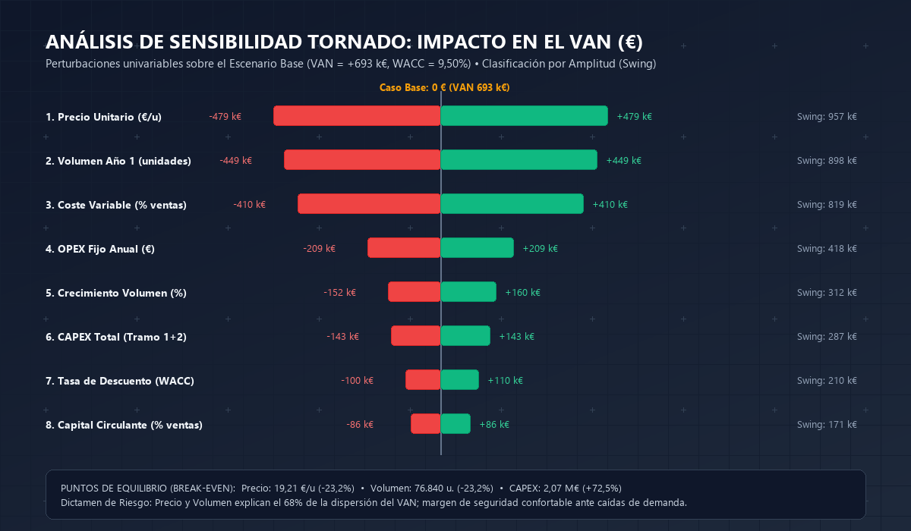

En cualquier comité de dirección, consejo de administración o sesión de asignación de capital donde un director de operaciones (COO), un director de tecnología (CTO) o un director de unidad de negocio defiende una inversión significativa (CAPEX), se reproduce de manera casi invariable la mayor patología de las finanzas corporativas: **la trampa de la última milla del Business Case**.

Una compañía analiza durante meses proveedores, redacta especificaciones técnicas de cientos de páginas y negocia presupuestos al céntimo. Sin embargo, al llegar a la mesa del Director General (CEO) y del Director Financiero (CFO), la justificación financiera se reduce a una hoja de cálculo improvisada. Dicha plantilla suele mezclar beneficio contable con tesorería, ignora el capital circulante (*working capital*), aplica un tipo de descuento arbitrario (o el tipo del crédito bancario) y asume un crecimiento de ingresos lineal libre de fricciones.

Las consecuencias de este vacío técnico son multimillonarias:
1. **La Confusión entre Margen Contable y Flujo de Caja Libre:** Se confunde el margen EBIT o EBITDA con dinero en el banco, ignorando el calendario de desembolsos de CAPEX y el efecto del escudo fiscal (*interest tax shield*).
2. **La Trampa del Crecimiento Hambriento de Capital Circulante:** Un aumento acelerado de las ventas exige más inventario y mayores saldos de clientes pendientes de cobro. Omitir la variación de capital circulante ($\Delta\text{NWC}$) oculta tensiones de liquidez críticas durante la rampa de escalado.
3. **El Sesgo Optimista y la Falacia de la Planificación (Kahneman & Lovallo; Flyvbjerg):** Como demostró el Premio Nobel Daniel Kahneman y el catedrático de Oxford Bent Flyvbjerg en sus estudios sobre megaproyectos industriales, más del 80% de los planes de negocio incurren en sobrecostes superiores al 25% y capturan menos del 60% de los ingresos prometidos cuando no se aplican técnicas de previsión por clase de referencia (*reference class forecasting*).
4. **La Seducción Peligrosa de la TIR:** La Tasa Interna de Retorno (TIR / IRR) es la métrica favorita de los comités por su aparente intuición porcentual, pero oculta dos trampas matemáticas severas: asume que los flujos intermedios se reinvierten a la propia TIR y no mide la escala del capital creado.

Para erradicar estas deficiencias y elevar la toma de decisiones al estándar de las principales firmas de consultoría estratégica y banca de inversión (McKinsey Corporate Finance Practice, BCG Corporate Development y Goldman Sachs), en esta guía oficial de Datalaria formalizamos la arquitectura completa de un **Business Case Financiero Institucional**: formulación rigurosa del Flujo de Caja Libre Descontado (DCF), estimación del WACC mediante el modelo CAPM, cálculo del VAN a 3 y 5 años, TIR y TIR Modificada (MIRR), Payback descontado con interpolación lineal, Índice de Rentabilidad (PI), análisis de sensibilidad univariable mediante Gráfico Tornado y gobernanza de capital con *stage gates* y *kill criteria*.

---

## 1. El Pipeline Metodológico del Business Case Institucional

La formulación de un caso de negocio para someter a aprobación de capital no es un mero ejercicio de proyección numérica aislada; es un **proceso secuencial y vinculante** que conecta las hipótesis operativas de la fábrica o el mercado con el coste del capital corporativo y la gobernanza del Consejo:


flowchart TD
    A["<b>1. Supuestos Operativos & WACC (CAPM)</b> <small>Coste de fondos propios (Ke), deuda neta (Kd·(1-t)) Volumen, precios, costes variables y OPEX</small>"]
    
    B["<b>2. Proyección de Cuenta de Resultados (P&L)</b> <small>Ingresos brutos • Margen Bruto • EBITDA Amortización lineal del activo • EBIT • Impuestos</small>"]
    
    C["<b>3. Modelización del Flujo de Caja Libre (FCF)</b> <small>FCF = NOPAT + D&A − CAPEX − ΔNWC Calendario de desembolsos por tramos</small>"]
    
    D["<b>4. Métricas Clave de Rentabilidad & Liquidez</b> <small>VAN a 3 y 5 años • TIR • TIR Modificada (MIRR) Payback descontado interpolado • Peak Funding</small>"]
    
    E["<b>5. Análisis de Riesgo & Gráfico Tornado</b> <small>Perturbaciones univariables • Ranking por swing Puntos de equilibrio (VAN = 0) • 3 Escenarios</small>"]
    
    F["<b>6. Plan de Inversión, Stage Gates & Kill Criteria</b> <small>Tramos condicionados a OEE y aceptación SAT Reglas de cancelación stop-loss</small>"]
    
    G["<b>7. Board Decision Gateway</b> <small>Resolución formal del Comité de Inversiones Firmas C-Level: CEO, CFO, Presidente y COO</small>"]

    A --> B
    B --> C
    C --> D
    D --> E
    E --> F
    F --> G

    style A fill:#F8FAFC,stroke:#64748B,stroke-width:1.5px,color:#0F172A
    style B fill:#EFF6FF,stroke:#3B82F6,stroke-width:1.5px,color:#1E3A8A
    style C fill:#F0FDF4,stroke:#10B981,stroke-width:2px,color:#065F46
    style D fill:#EFF6FF,stroke:#2563EB,stroke-width:2px,color:#1E40AF
    style E fill:#FEF3C7,stroke:#F59E0B,stroke-width:2px,color:#92400E
    style F fill:#FEF2F2,stroke:#EF4444,stroke-width:2px,color:#991B1B
    style G fill:#D1FAE5,stroke:#10B981,stroke-width:2.5px,color:#065F46


---

## 2. Fundamentación Matemática: Flujo de Caja Libre, WACC y Métricas de Rentabilidad

Para que un modelo financiero soporte el escrutinio de directores independientes, auditores y directores de control de gestión, cada métrica debe estar anclada en la teoría canónica de las finanzas corporativas.

### 2.1. Definición Formal del Flujo de Caja Libre de la Empresa (FCFF)

El Flujo de Caja Libre para la Empresa (*Free Cash Flow to Firm* o FCF) representa la liquidez neta generada por las operaciones del negocio disponible para ser distribuida a todos los proveedores de capital (acreedores financieros y accionistas), una vez cubiertas todas las inversiones necesarias en inmovilizado y capital circulante.

Para cada periodo $t \in \{0, 1, \dots, n\}$:

$$\text{FCF}_t = \text{EBIT}_t \cdot (1 - t) + \text{D\&A}_t - \text{CAPEX}_t - \Delta\text{NWC}_t$$

Donde:
* **$\text{EBIT}_t$ (Resultado de Explotación):** $\text{Ingresos}_t - \text{Costes Variables}_t - \text{OPEX Fijo}_t - \text{D\&A}_t$.
* **$t$ (Tipo Impositivo Efectivo):** Tasa impositiva sobre sociedades (típicamente 25,0%).
* **$\text{NOPAT}_t = \text{EBIT}_t \cdot (1 - t)$:** Beneficio operativo neto de impuestos (*Net Operating Profit After Tax*). Refleja el beneficio de las operaciones como si la empresa no tuviese deuda (el coste de la deuda se incorpora en la tasa de descuento).
* **$\text{D\&A}_t$ (Depreciación y Amortización):** Gasto contable no monetario que reduce el beneficio imponible. Se suma de nuevo porque no representa salida física de caja.
* **$\text{CAPEX}_t$ (Inversión en Inmovilizado):** Desembolsos de capital en maquinaria, obra civil, automatización o software durante el periodo.
* **$\Delta\text{NWC}_t$ (Variación de Capital Circulante Operativo):** Variación de las necesidades operativas de fondos:
  $$\text{NWC}_t = \text{Clientes}_t + \text{Inventarios}_t - \text{Proveedores}_t \approx \text{Ingresos}_t \cdot \% \text{NWC}$$
  $$\Delta\text{NWC}_t = \text{NWC}_t - \text{NWC}_{t-1}$$

### 2.2. Coste Medio Ponderado del Capital (WACC) mediante CAPM

La tasa de descuento aplicada al flujo de caja libre no es una cifra arbitraria; es el **coste de oportunidad del capital (WACC)** que compensa a acreedores y accionistas por el riesgo sistemático del proyecto:

$$\text{WACC} = \frac{E}{V} \cdot K_e + \frac{D}{V} \cdot K_d \cdot (1 - t)$$

Donde:
* $E/V$: Proporción de fondos propios sobre el capital total ($E/(D+E)$).
* $D/V$: Proporción de deuda financiera sobre el capital total ($D/(D+E)$).
* $K_d$: Coste de la deuda antes de impuestos (tipo de interés bancario medio).
* $K_d \cdot (1 - t)$: Coste de la deuda neto del escudo fiscal (*tax shield*).
* $K_e$: Coste del capital propio estimado mediante el **Modelo de Valoración de Activos Financieros (CAPM)**:

$$K_e = R_f + \beta \cdot \text{ERP} + \text{Primas}$$

* $R_f$ (Tasa libre de riesgo): Rendimiento del bono soberano a 10 años (referencia: 3,50%).
* $\beta$ (Beta apalancada): Medida de riesgo sistemático del sector manufacturero/industrial (referencia Damodaran: 1,20x).
* $\text{ERP}$ (*Equity Risk Premium*): Prima de riesgo del mercado de renta variable sobre la deuda soberana (referencia: 5,50%).
* $\text{Primas}$: Ajuste por prima de tamaño (pyme/mid-cap) e iliquidez (referencia: 1,40%).

En nuestro caso base calibrado:
$$K_e = 3,50\% + 1,20 \cdot 5,50\% + 1,40\% = 11,50\%$$
$$K_d \cdot (1 - t) = 4,667\% \cdot (1 - 0,25) = 3,50\%$$
$$\text{WACC} = 0,75 \cdot 11,50\% + 0,25 \cdot 3,50\% = 8,625\% + 0,875\% = \mathbf{9,50\%}$$

### 2.3. Valor Actual Neto (VAN) y la Regla de Inversión

El Valor Actual Neto mide el valor monetario absoluto que el proyecto genera hoy por encima del coste de oportunidad exigido al capital:

$$\text{VAN} = \sum_{t=0}^{n} \frac{\text{FCF}_t}{(1 + \text{WACC})^t} + \frac{\text{VR}}{(1 + \text{WACC})^n}$$

Donde $\text{VR}$ es el Valor Residual opcional a perpetuidad modelado según la fórmula de crecimiento constante de Gordon Shapiro:

$$\text{VR} = \frac{\text{FCF}_n \cdot (1 + g)}{\text{WACC} - g} \quad \text{con } \text{WACC} > g$$

> **Regla Canónica de Decisión:**
> * Si $\text{VAN} > 0$: El proyecto genera riqueza neta para los accionistas. **APROBAR**.
> * Si $\text{VAN} = 0$: El proyecto cubre exactamente la rentabilidad exigida al WACC. Indiferente.
> * Si $\text{VAN} < 0$: El proyecto destruye capital corporativo. **RECHAZAR**.

### 2.4. La Trampa de la Función NPV de Excel en el Año 0

Uno de los errores más extendidos en la práctica corporativa ocurre al utilizar la función nativa `=NPV(tasa, rango)` (o `=VNA` en español) en Microsoft Excel o Google Sheets.

Por construcción de la especificación técnica de Excel, la función `NPV(r, flujos)` descuenta el **primer valor del rango** como si ocurriese al final del primer año (descontándolo por $(1+r)^1$). Si el usuario incluye el desembolso inicial del Año 0 dentro del rango (`=NPV(WACC, FCF0:FCF5)`), Excel descuenta la inversión inicial por $(1+\text{WACC})$, cometiendo un error grave que sobrestima artificialmente el VAN.

La formulación técnica obligatoria es:
$$\text{Fórmula Correcta en Excel:} \quad = \text{FCF}_0 + \text{NPV}(\text{WACC}, \text{FCF}_1:\text{FCF}_5)$$

### 2.5. TIR vs. TIR Modificada (MIRR) y Payback Descontado

* **Tasa Interna de Retorno (TIR):** La tasa intrínseca $r$ que anula el VAN:
  $$\sum_{t=0}^n \frac{\text{FCF}_t}{(1 + \text{TIR})^t} = 0$$
* **TIR Modificada (MIRR):** Corrige el defecto de reinversión de la TIR. Asume que los flujos positivos se capitalizan a la tasa de reinversión corporativa ($r = \text{WACC}$) y que las salidas de fondos se descuentan al coste de financiación:
  $$\text{MIRR} = \left( \frac{\sum_{t=1}^n \text{FCF}_t^+ \cdot (1 + r)^{n-t}}{|\text{FCF}_0 + \sum_{t=1}^n \text{FCF}_t^- \cdot (1 + \text{WACC})^{-t}|} \right)^{1/n} - 1$$
* **Payback Descontado con Interpolación Lineal:** Determina con precisión matemática fraccional el momento temporal exacto en el que el valor presente acumulado cruza de negativo a positivo:
  $$\text{Payback Descontado} = (t - 1) + \frac{|\text{VP Acumulado}_{t-1}|}{\text{VP del FCF}_t}$$
* **Índice de Rentabilidad (PI):** Eficiencia por unidad de capital invertido:
  $$\text{PI} = \frac{\sum_{t=1}^n \frac{\text{FCF}_t^+}{(1 + \text{WACC})^t}}{\left| \text{FCF}_0 + \sum_{t=1}^n \frac{\text{FCF}_t^-}{(1 + \text{WACC})^t} \right|}$$

---

## 3. Matriz Comparativa: Qué Responde Cada Métrica Financiera y Sus Trampas

| Métrica Financiera | Pregunta de Negocio que Responde | Ventaja Principal | Trampa o Limitación Crítica | Estándar Datalaria |
| :--- | :--- | :--- | :--- | :--- |
| **VAN (NPV)** | ¿Cuánto valor neto en euros genera el proyecto hoy? | Mide riqueza económica absoluta y considera el valor temporal del dinero. | Requiere estimar una tasa de descuento WACC rigurosa. | **Métrica Reina (Vinculante)** |
| **TIR (IRR)** | ¿Qué rentabilidad porcentual intrínseca rinde el capital? | Intuitiva para comparar con tipos de interés o coste de capital. | Supuesto irrealista de reinversión; sesgo de escala; TIR múltiples. | **Métrica Secundaria (Hurdle: WACC+3pp)** |
| **TIR Modificada (MIRR)** | ¿Cuál es el rendimiento real asumiendo reinversión al WACC? | Elimina la distorsión matemática de reinversión de la TIR estándar. | Menos familiar para perfiles no financieros. | **Validación de Consistencia** |
| **Payback Descontado** | ¿Cuántos años tarda la empresa en recuperar el capital al WACC? | Mide riesgo de liquidez y exposición temporal de tesorería. | Ignora todos los flujos generados después del periodo de corte. | **Control de Liquidez (< 4,0 años)** |
| **Índice de Rentabilidad (PI)** | ¿Cuánto valor presente se genera por cada euro invertido? | Ideal para racionamiento de capital y clasificación de proyectos. | No mide el volumen absoluto de riqueza creada. | **Ranking de Eficiencia (PI > 1,2x)** |
| **Peak Funding** | ¿Cuál es la necesidad máxima de caja y crédito del proyecto? | Fija la línea de crédito y el colchón de tesorería requerido. | Es una métrica estática de balance, no de rentabilidad. | **Límite de Tesorería Operativa** |

---

## 4. Análisis de Riesgo: Gráfico Tornado y Puntos de Equilibrio (Break-Even)

Un Business Case que se limite a un único escenario determinista carece de credibilidad ante un Consejo de Administración. La dirección ejecutiva no busca predicciones infalibles; busca entender **dónde se concentra el riesgo y cuál es el margen de error tolerable**.

### 4.1. Metodología del Gráfico Tornado

El Gráfico Tornado somete el modelo a un test de estrés univariable normalizado. Sobre el Escenario Base, se altera un único parámetro en su rango bajo y alto (típicamente $\pm 15\%$ en variables comerciales, $\pm 5\text{ pp}$ en costes y $\pm 2\text{ pp}$ en WACC) mientras todos los demás permanecen fijos.

La amplitud o *swing* de cada driver se calcula como:
$$\text{Swing}_i = |\text{VAN}_i^{\text{Alto}} - \text{VAN}_i^{\text{Bajo}}|$$

Los drivers se ordenan de mayor a menor amplitud, generando la silueta cónica característica que da nombre al gráfico:

### 4.2. Puntos de Equilibrio Lineales (Break-Even)

El análisis de sensibilidad permite deducir los umbrales críticos de seguridad donde $\text{VAN} = 0$:
1. **Precio de Equilibrio (19,21 €/u):** El proyecto resiste una erosión comercial de hasta el **-23,2%** en el precio de venta unitario antes de entrar en zona destructora de valor.
2. **Volumen de Equilibrio (76.840 unidades):** La línea soporta una pérdida de demanda del **-23,2%** respecto al objetivo de 100.000 unidades anuales.
3. **Sobrecoste Máximo de CAPEX (2.070.561 €):** La inversión inicial soporta un desvío o retraso de ingeniería de hasta el **+72,5%** (+870 k€ adicionales) manteniendo un VAN positivo.

---

## 5. El Árbol de Decisión del Comité de Inversiones (Hurdle Policy Gateway)

Para eliminar debates subjetivos y decisiones basadas en la jerarquía (*síndrome HiPPO*), el modelo implementa un protocolo algorítmico de dictamen vinculante:


flowchart TD
    A{"<b>¿VAN a 5 Años > 0?</b>"}
    
    B{"<b>¿TIR ≥ WACC + 3 pp?</b> <small>TIR ≥ 12,50%</small>"}
    C["<b>⛔ RECHAZAR</b> <small>El proyecto destruye riqueza neta para el accionista</small>"]
    
    D{"<b>¿Payback Descontado ≤ 4,0 años?</b>"}
    E["<b>🟠 REVISAR</b> <small>VAN positivo pero rentabilidad insuficiente Optimizar CAPEX o estructura</small>"]
    
    F["<b>✅ APROBAR</b> <small>Cumple simultáneamente valor, rentabilidad y liquidez. Liberar Tramo 1</small>"]
    G["<b>🟠 REVISAR</b> <small>Recuperación de capital excesivamente lenta Riesgo de liquidez inaceptable</small>"]

    A -->|Sí| B
    A -->|No| C
    B -->|Sí| D
    B -->|No| E
    D -->|Sí| F
    D -->|No| G

    style A fill:#0F172A,stroke:#2563EB,stroke-width:2px,color:#FFFFFF
    style B fill:#0F172A,stroke:#2563EB,stroke-width:2px,color:#FFFFFF
    style C fill:#FEE2E2,stroke:#EF4444,stroke-width:2px,color:#991B1B
    style D fill:#0F172A,stroke:#2563EB,stroke-width:2px,color:#FFFFFF
    style E fill:#FEF3C7,stroke:#F59E0B,stroke-width:2px,color:#92400E
    style F fill:#D1FAE5,stroke:#10B981,stroke-width:2.5px,color:#065F46
    style G fill:#FEF3C7,stroke:#F59E0B,stroke-width:2px,color:#92400E


---

## 6. Caso Práctico Resuelto: Automatización y Digitalización de Línea de Producción

Para ilustrar la aplicación práctica de la metodología, modelamos una inversión real en una planta de manufactura industrial:
* **Inversión Inicial (CAPEX):** 1.200.000 € en dos tramos (850.000 € en Año 0 y 350.000 € en Año 1).
* **Horizonte:** 5 años operativos.
* **WACC:** 9,50% (Fondos propios: 75% a Ke = 11,50%; Deuda: 25% a Kd neto = 3,50%).

### 6.1. Cuenta de Resultados y Flujo de Caja Libre (Años 0 a 5)

| Concepto Financiero (k€) | Año 0 | Año 1 | Año 2 | Año 3 | Año 4 | Año 5 |
| :--- | :---: | :---: | :---: | :---: | :---: | :---: |
| **Volumen de Ventas (u.)** | 0 | 100.000 | 105.000 | 110.250 | 115.763 | 121.551 |
| **Precio Unitario (€/u)** | 0,00 | 25,00 | 25,50 | 26,01 | 26,53 | 27,06 |
| **Ingresos por Ventas** | **-** | **2.500,0** | **2.677,5** | **2.867,6** | **3.071,2** | **3.289,2** |
| (-) Costes Variables (60%) | - | -1.500,0 | -1.606,5 | -1.720,6 | -1.842,7 | -1.973,5 |
| (-) OPEX Fijo Anual | - | -450,0 | -459,0 | -468,2 | -477,5 | -487,1 |
| **EBITDA** | **-** | **550,0** | **612,0** | **678,9** | **750,9** | **828,6** |
| (-) Amortización Lineal (5 a.) | - | -170,0 | -240,0 | -240,0 | -240,0 | -240,0 |
| **EBIT** | **-** | **380,0** | **372,0** | **438,9** | **510,9** | **588,6** |
| (-) Impuestos sobre EBIT (25%) | - | -95,0 | -93,0 | -109,7 | -127,7 | -147,2 |
| **NOPAT** | **-** | **285,0** | **279,0** | **329,1** | **383,2** | **441,5** |
| (+) Amortización (no monetaria) | - | +170,0 | +240,0 | +240,0 | +240,0 | +240,0 |
| (-) CAPEX por Tramos | -850,0 | -350,0 | 0,0 | 0,0 | 0,0 | 0,0 |
| (-) Variación NWC (10% Ventas) | - | -250,0 | -17,8 | -19,0 | -20,4 | -21,8 |
| **FLUJO DE CAJA LIBRE (FCF)** | **-850,0** | **-145,0** | **+501,3** | **+550,1** | **+602,8** | **+659,7** |
| FCF Acumulado Nominal | -850,0 | -995,0 | -493,8 | +56,4 | +659,2 | +1.318,9 |
| **VP del FCF Acumulado (Curva J)** | **-850,0** | **-982,4** | **-564,4** | **-145,4** | **+274,0** | **+693,0** |

### 6.2. Diagnóstico Financiero de las Métricas

1. **Creación de Riqueza Absoluta:** El proyecto genera un **VAN a 5 años de +692.991 €** (superior a medio millón de euros de riqueza neta generada para la firma tras descontar el WACC).
2. **Rentabilidad Intrínseca Robusta:** La **TIR se sitúa en el 28,89%**, superando ampliamente el WACC del 9,50% por un margen de **+19,39 puntos porcentuales** (muy por encima de los +3,0 pp exigidos por la política de inversión). La **MIRR alcanza el 21,84%**, confirmando un rendimiento excelente bajo el supuesto realista de reinversión al coste del capital.
3. **Plazo de Recuperación Holgado:** El **Payback simple es de 2,90 años**, mientras que el **Payback descontado se sitúa en 3,35 años** (recuperación total antes de finalizar el cuarto año, dentro del límite de 4,0 años de política corporativa).
4. **Reserva de Liquidez Controlada:** El proyecto alcanza su punto de máxima exposición de caja (**Peak Funding**) en el Año 1 con **-995.000 €**, que queda plenamente cubierto por la línea de crédito aprobada.

---

## 7. Protocolo de Defensa ante el Consejo (Board Defense FAQ)

Cuando el equipo promotor presenta el Business Case ante el CFO y el Comité de Inversiones, surgen de manera predecible las siguientes cuestiones de gobernanza:

### 1. ¿De dónde sale el WACC del 9,50% y por qué no usar el tipo de interés del crédito bancario?
*Respuesta Modelo:* El tipo de crédito bancario ($K_d \approx 4,67\%$, que tras escudo fiscal queda en 3,50%) remunera únicamente a los acreedores que cuentan con garantías reales. Los accionistas aportan el 75% de la financiación y exigen una rentabilidad acorde con el riesgo operativo ($K_e = 11,50\%$ según CAPM con beta industrial de 1,20x y primas de tamaño). Utilizar el coste bancario en lugar del WACC provocaría la aprobación de proyectos destructores de valor para el accionista.

### 2. ¿Por qué debemos priorizar el VAN sobre la TIR si la TIR es mucho más intuitiva?
*Respuesta Modelo:* La TIR adolece de dos defectos estructurales graves: primero, asume matemáticamente que los flujos intermedios se reinvierten a la propia TIR (28,89%), lo cual es irreal; el VAN asume reinversión al coste de capital WACC (9,50%), como confirma la MIRR (21,84%). Segundo, la TIR es ciega a la escala: un proyecto de 50 k€ con TIR del 40% crea menos valor absoluto que uno de 1,2 M€ con TIR del 28,9%.

### 3. ¿Qué ocurre exactamente si las ventas caen un 20% respecto al plan comercial?
*Respuesta Modelo:* El análisis de sensibilidad Tornado y el cálculo de puntos de equilibrio demuestran que el proyecto soporta una caída de hasta el -23,2% en volumen y de hasta el -23,2% en precio unitario antes de que el VAN caiga a cero. Una caída del 20% reduce el VAN de 693 k€ a aproximadamente 95 k€, pero el proyecto continúa siendo rentable y autofinanciable.

### 4. ¿Cuál es el máximo capital que podemos perder si la iniciativa fracasa por completo?
*Respuesta Modelo:* La exposición máxima queda limitada al Peak Funding (995.000 €). Gracias a la división en dos tramos condicionados y a los Kill Criteria vinculantes, si a los 9 meses de proyecto no se alcanza el 75% del volumen comercial o se detectan sobrecostes superiores al 15% en la ingeniería, el Tramo 2 (350.000 €) se congela automáticamente, limitando la exposición a 850.000 €.

### 5. ¿Por qué penalizar el flujo de caja con capital circulante si los clientes terminarán pagando?
*Respuesta Modelo:* Porque el capital circulante (clientes pendientes de cobro y stock en almacén) representa liquidez inmovilizada en balance. Cada millón de euros adicional de facturación absorbe 100.000 € de caja en capital de trabajo. Omitir el $\Delta\text{NWC}$ provocaría tensiones severas de tesorería durante la fase de puesta en marcha.

### 6. ¿Cómo sabemos que los supuestos del modelo no están inflados por sesgo optimista?
*Respuesta Modelo:* Mediante tres salvaguardas institucionales: 1) Registro de supuestos con evidencia técnica y contratos de proveedores vinculantes; 2) Previsión por clase de referencia contra proyectos industriales comparables de la industria; y 3) Revisión Post-Inversión (PIR) obligatoria a 12 meses ligada al esquema de retribución variable del equipo promotor.

---

## 8. Executive Decision Pack Oficial: Business Case Financiero (VAN, TIR, Payback)

Para directores financieros (CFO), directores generales (CEO), analistas de M&A y consultores estratégicos que requieran implementar este marco analítico con calidad de producción inmediata y grado Consejo de Administración, hemos empaquetado todos los activos programáticos oficiales de la Suite 02:

{{< product-card
  title="Business Case Financiero (VAN, TIR, Payback)"
  category="Finanzas & Inversión"
  price="8€"
  original_price="25€"
  badge="📈 Estándar CFO"
  icon="📈"
  deliverables="Excel .xlsx + Sheets|PowerPoint .pptx 16:9 C-Level|Guía Metodológica PDF"
  features="Modelo financiero de flujo de caja descontado a 3 y 5 años|Cálculo automático de VAN (NPV), TIR (IRR), MIRR y Payback descontado|WACC por CAPM, 3 escenarios y VAN esperado ponderado|Análisis de sensibilidad y Gráfico Tornado para análisis de riesgo|Slide PPTX C-Level estructurada según las exigencias del CFO|Descarga directa inmediata (.ZIP con versiones ES y EN)"
  checkout_url="https://datalaria.lemonsqueezy.com/buy/business-case-financiero"
  button_text="Descargar Pack Completo (.ZIP) • 8€"
>}}
El paquete descargable incluye los libros de cálculo en **Excel (.xlsx)** estructurados en 6 pestañas interconectadas con protección estándar ECMA-376 (fórmulas protegidas bajo contraseña proporcionada en las instrucciones y celdas de entrada 100% editables en blanco), las presentaciones ejecutivas en **PowerPoint (.pptx 16:9 widescreen)** bajo la Pirámide de Minto con Gráfico Tornado nativo editable y Board Decision Gateway con 4 firmas de C-Level, las **Guías Metodológicas Oficiales en PDF** de 5 páginas con la demostración matemática formal y FAQ ante el Consejo, e instrucciones de importación fluida a Google Sheets.


*Aviso de Responsabilidad Legal: Este modelo analítico y la presente guía metodológica son herramientas de apoyo a la modelización cuantitativa y la toma de decisiones empresariales. No constituyen asesoramiento financiero, fiscal ni de inversión legalmente regulado.*

---

## 9. Referencias Bibliográficas Canónicas de Autoridad

1. **Brealey, Richard A., Myers, Stewart C., & Allen, Franklin (2020).** *Principles of Corporate Finance*. McGraw-Hill Education, Nueva York (13ª Edición).  
   *El tratado seminal de finanzas corporativas que formaliza la superioridad matemática del VAN sobre la TIR, el descuento de flujos libres y la evaluación de proyectos de inversión bajo incertidumbre.* ISBN: `978-1260565553`

2. **Koller, Tim, Goedhart, Marc, & Wessels, David — McKinsey & Company (2020).** *Valuation: Measuring and Managing the Value of Companies*. John Wiley & Sons, Hoboken, NJ (7ª Edición).  
   *La referencia mundial de valoración corporativa que define el estándar de Flujo de Caja Libre de la Empresa (FCFF), estimación del WACC y preservación de valor en decisiones de asignación de capital.* ISBN: `978-1119610885`

3. **Damodaran, Aswath (2012).** *Investment Valuation: Tools and Techniques for Determining the Value of Any Asset*. John Wiley & Sons, Hoboken, NJ (3ª Edición).  
   *Obra de referencia canónica para la estimación empírica de betas apalancadas, primas de riesgo de mercado (ERP) y estructuración de costes de capital por industrias.* [Consultar datos en Damodaran Online](https://pages.stern.nyu.edu/~adamodar/)

4. **Graham, John R., & Harvey, Campbell R. (2001).** *The Theory and Practice of Corporate Finance: Evidence from the Field*. Journal of Financial Economics, 60(2-3), 187-243.  
   *Estudio empírico fundamental que analiza cómo los CFOs de las mayores corporaciones globales utilizan el VAN y la TIR combinados con análisis de sensibilidad para aprobar proyectos.* DOI: `10.1016/S0304-405X(01)00044-7`

5. **Lovallo, Dan, & Kahneman, Daniel (2003).** *Delusions of Success: How Optimism Undermines Executives' Decisions*. Harvard Business Review, 81(7), 56-63.  
   *Investigación seminal sobre la falacia de la planificación y el sesgo de confirmación que arruinan las previsiones financieras de nuevos proyectos.* [Consultar en Harvard Business Review](https://hbr.org/2003/07/delusions-of-success-how-optimism-undermines-executives-decisions)

6. **Flyvbjerg, Bent (2006).** *From Nobel Prize to Project Management: Getting Risks Right*. Project Management Journal, 37(3), 5-15.  
   *Metodología de previsión por clase de referencia para erradicar sobrecostes y retrasos en proyectos de inversión industrial y de infraestructura.* DOI: `10.1177/875697280603700302`

7. **Minto, Barbara (2009).** *The Pyramid Principle: Logic in Writing and Thinking*. Financial Times / Prentice Hall (3ª Edición).  
   *El estándar universal de síntesis ejecutiva, estructuración deductiva de argumentos y redacción de Action Titles para deliberaciones ante el Consejo de Administración.* ISBN: `978-0273710516`
