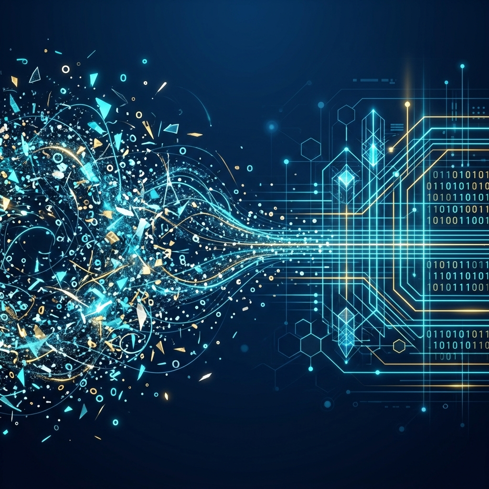

Hay figuras históricas que descubren continentes, y hay figuras que inventan la física subyacente que permite que existan los barcos. En el mundo de la tecnología y los datos, **Claude Shannon** pertenece inequívocamente a la segunda categoría. Si hoy puedes leer este artículo en tu pantalla, si tu smartphone puede comprimir una foto de 12 megapíxeles, y si [Multiverse Computing](/es/posts/multiverse_computing/) puede comprimir un LLM masivo en un chip periférico, es porque Shannon dictó las leyes matemáticas de la información hace más de 75 años.

Mientras [Abraham Wald](/es/posts/abraham_wald/) nos enseñaba a leer el silencio de los datos ausentes y [W. Edwards Deming](/es/posts/deming/) sistematizaba la calidad industrial, Shannon hizo algo aún más fundamental: **aisló el concepto de 'información' del significado físico del mensaje**.

### El Nacimiento del Bit: Bell Labs, 1948

Para entender el logro titánico de Shannon, hay que entender el caos que era la comunicación a principios del siglo XX. El telégrafo, el teléfono, la radio y la televisión se consideraban fenómenos físicos distintos. Los ingenieros mejoraban la transmisión reduciendo el ruido eléctrico en los cables, pero no existía una teoría unificada.

En 1948, trabajando en los míticos laboratorios Bell, Shannon publicó *"Una Teoría Matemática de la Comunicación"*. En sus páginas, Shannon introdujo por primera vez en la historia impresa la palabra **"bit"** (una contracción de *binary digit*, sugerida por su colega John Tukey).

Shannon demostró matemáticamente que **toda información —ya sea texto, audio, imagen o video— podía codificarse en una secuencia de 1s y 0s**. El significado humano del mensaje era irrelevante para el problema de la ingeniería de transmitirlo. Al desacoplar el *significado* de la *mecánica*, Shannon unificó todos los medios de comunicación bajo un mismo marco matemático.

### La Entropía de la Información: Midiendo lo Impredecible

El concepto más revolucionario que Shannon tomó prestado de la termodinámica fue la **Entropía**. En física, la entropía mide el grado de desorden de un sistema. Shannon adaptó el término para medir la **incertidumbre o sorpresa** en un mensaje de datos.

Imagina que te envío un mensaje predecible: *"El sol sale por el este"*. Ese mensaje tiene muy baja entropía; no te aporta información nueva. Ahora imagina un mensaje que contiene la contraseña de acceso a una base de datos crítica. Ese mensaje tiene una entropía altísima; es pura sorpresa y valor informativo.

Shannon formuló que **la cantidad de información en un mensaje es inversamente proporcional a su probabilidad**. Esta idea es la piedra angular de:

1. **La Compresión de Datos**: Si un dato es altamente predecible, podemos omitirlo o comprimirlo. Es el principio que rige los formatos ZIP, MP3 y JPEG. Es la misma matemática que hoy permite a startups deep-tech usar redes de tensores para "exprimir" la redundancia de los LLMs.
2. **La Criptografía**: Durante la Segunda Guerra Mundial, Shannon trabajó junto a Alan Turing cruzando ideas sobre criptografía. Un mensaje perfectamente cifrado debe parecer ruido aleatorio puro; es decir, debe tener máxima entropía para un interceptor.
3. **El Límite de Shannon**: Calculó la velocidad máxima teórica a la que se pueden transmitir datos sin errores sobre un canal ruidoso. Hoy, el 5G y el Wi-Fi 6 operan asombrosamente cerca de ese límite matemático trazado hace décadas.

### El Eslabón con la IA Moderna y la Industria 4.0

La influencia de Shannon no se quedó en las telecomunicaciones. Hoy, la Teoría de la Información es el tejido conectivo de las arquitecturas de datos industriales y de inteligencia artificial que construimos y operamos.

Cuando en la [serie de Ingeniería S&OP](/es/posts/sop-ingenieria-parte2-prediccion/) utilizamos Prophet para extraer la "señal" de la demanda del "ruido" estacional y las anomalías de los datos sucios, estamos aplicando directamente los principios de canal y ruido de Shannon. Separar la señal del ruido es el problema fundacional del análisis predictivo.

Cuando plataformas de ciberseguridad como [Devo](/es/posts/devo/) ingieren petabytes de telemetría de red buscando la anomalía que delate un ataque lateral, lo que realmente están haciendo es buscar picos de entropía inesperados en un canal que debería tener un comportamiento predecible. El atacante genera entropía; el analista la detecta.

### El Legado del Genio Solitario

A diferencia de otros gigantes tecnológicos contemporáneos que buscaron la fama o fundaron imperios corporativos, Shannon era un académico juguetón. Pasaba su tiempo libre construyendo máquinas de ajedrez, malabares robotizados, un ratón mecánico llamado *Theseus* (uno de los primeros experimentos de Machine Learning capaz de resolver laberintos) y una "Máquina Definitiva" que, al encenderse, simplemente sacaba una mano de una caja para apagarse a sí misma.

El legado de Claude Shannon es la demostración definitiva del **Pensamiento desde los Primeros Principios** (*First Principles Thinking*). En lugar de intentar construir un cable telefónico mejor, Shannon se retiró al pizarrón y se preguntó: *¿Qué es la información?*

Al responder a esa pregunta fundamental, no construyó una herramienta mejor; inventó el ecosistema entero en el que todas nuestras herramientas operan. Todo el software, toda la infraestructura cloud, y todos los agentes de IA autónomos que desplegamos hoy, viven, respiran y se comunican dentro del universo matemático que Shannon imaginó en 1948.

---

#### Fuentes de Interés:
* [**Quanta Magazine**: How Claude Shannon Invented the Future](https://www.quantamagazine.org/how-claude-shannons-information-theory-invented-the-future-20201222/)
* [**Bell Labs**: The History of Information Theory](https://www.bell-labs.com/about/history-innovation/)
* [**Documental**: The Bit Player (Sobre la vida y obra de Claude Shannon)](https://thebitplayer.com/)
* [**Datalaria**: Abraham Wald y la Epistemología de los Datos Ausentes](/es/posts/abraham_wald/)
* [**Datalaria**: Multiverse Computing y la compresión de la IA](/es/posts/multiverse_computing/)
