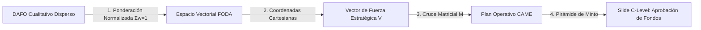
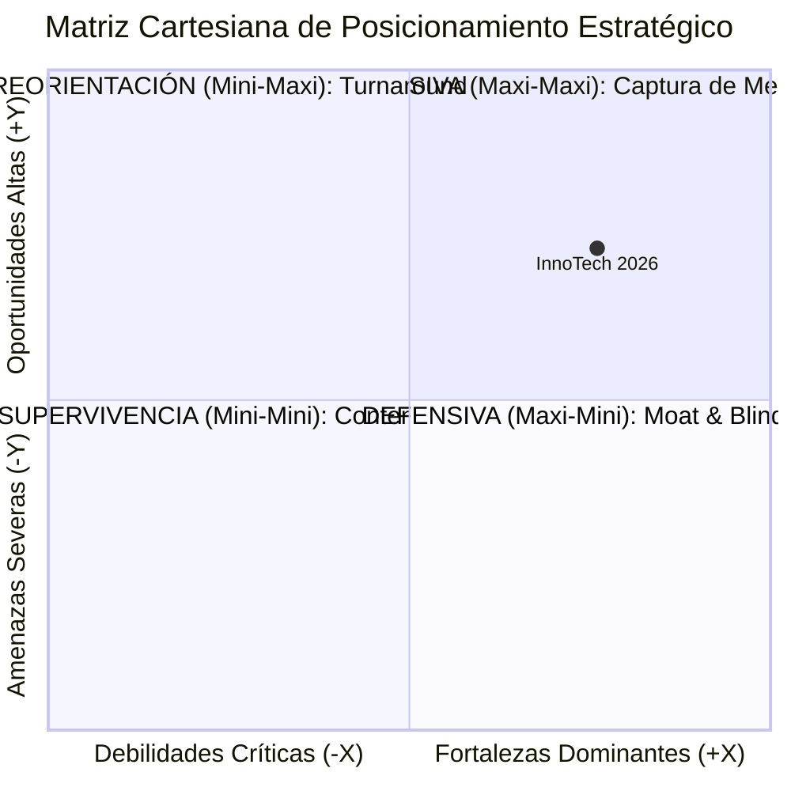
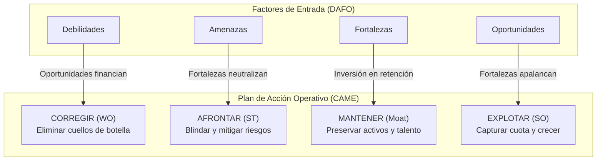
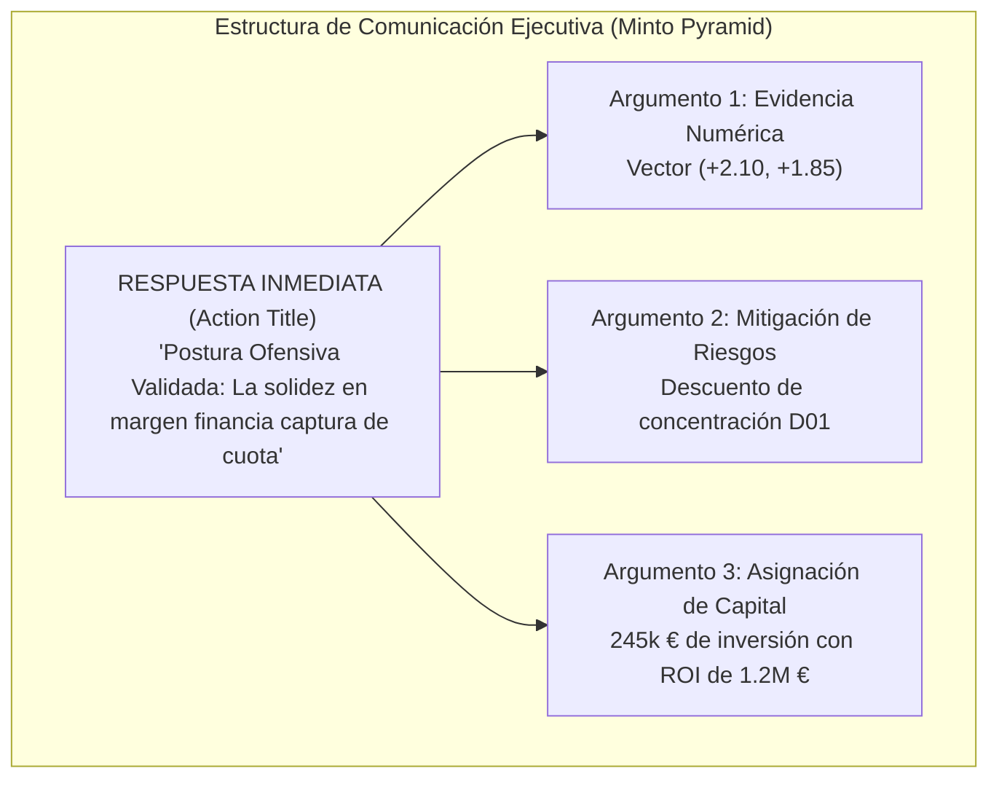

En casi cualquier comité de dirección, consejo de administración o sesión de planificación estratégica anual se repite el mismo ritual: un equipo de consultores o directores de área proyecta una diapositiva dividida en cuatro cuadrantes de colores con viñetas subjetivas bajo las siglas **DAFO** (Debilidades, Amenazas, Fortalezas y Oportunidades).

El desenlace casi siempre es idéntico:
* **Falta absoluta de jerarquía:** ¿Es una debilidad interna como *"retraso en el lead time comercial"* más o menos crítica que una amenaza externa de *"nuevos competidores asiáticos con descuentos del 35%"*? En un DAFO cualitativo estándar, ambas afirmaciones comparten exactamente el mismo peso visual y tipográfico.
* **Sesgo del presentador y ley de la oratoria (HiPPO):** Las iniciativas que terminan recibiendo presupuesto no son las más críticas desde el punto de vista del riesgo o del valor, sino aquellas defendidas por el directivo más elocuente o por el de mayor rango jerárquico (*Highest Paid Person's Opinion*).
* **Desconexión absoluta del P&L y del balance:** Concluye la reunión estratégica, se guarda el archivo en una carpeta compartida y nadie sabe con precisión qué partidas de CAPEX o de OPEX deben consignarse al día siguiente en el presupuesto operativo.

Para que un diagnóstico estratégico sea admitido, respetado y aprobado por un Director General (CEO), un Director Financiero (CFO) o un Comité de Inversiones, debe superar dos barreras fundamentales: **sustentarse en un motor matemático cuantitativo y reproducible** y **resolver la última milla ejecutiva mediante una presentación orientada a la toma de decisiones estructurada**.

---

## 1. La Falacia del DAFO Cualitativo y el Síndrome del Post-it Estratégico

El análisis FODA/DAFO fue concebido originalmente en el Stanford Research Institute en la década de 1960 por un equipo liderado por Albert Humphrey. Su propósito original era estructurar lluvias de ideas para entender por qué fallaban las planificaciones corporativas. Sin embargo, su traslación acrítica al entorno de gestión del siglo XXI ha generado una patología corporativa recurrente: el **síndrome del post-it estratégico**.

En este enfoque ingenuo, los directivos se reúnen en una sala, pegan notas adhesivas de colores en una pared y dan por concluido el ejercicio. Los tres errores estructurales que invalidan este método en un entorno profesional son:

1. **La Paradoja de la Equivalencia Tipográfica:** Al presentar los factores en cuatro cuadrantes homogéneos, el cerebro humano tiende a asignarles la misma probabilidad y el mismo impacto. Si una empresa lista cuatro fortalezas y dos debilidades, la conclusión superficial e intuitiva es que la empresa se encuentra en una posición favorable. Sin embargo, si una de esas dos debilidades es una concentración de ingresos del 42% en un cliente al borde de la quiebra, la compañía se encuentra al borde de la insolvencia a pesar de poseer una lista extensa de fortalezas menores.
2. **La Ausencia de Contraste Empírico:** Las afirmaciones cualitativas (*"tenemos un equipo de I+D muy comprometido"*, *"la competencia es feroz"*) carecen de umbrales auditables. Sin una métrica base asociada, resulta imposible discernir si un factor es una percepción interna o una realidad contrastada del mercado.
3. **La Incapacidad de Priorización Cruzada:** El DAFO tradicional asume erróneamente que las fortalezas actúan en el vacío y las amenazas surgen de forma aislada. En el mundo empresarial real, una amenaza solo es letal si impacta directamente sobre una debilidad desprotegida, del mismo modo que una oportunidad solo genera flujo de caja si la organización dispone de la fortaleza operativa necesaria para explotarla.

Para erradicar estos vicios, la consultoría estratégica de primer nivel sustituye la lista cualitativa por un **modelo matemático cuantitativo y normalizado**.

---

## 2. Fundamentación Matemática: El Espacio Vectorial del DAFO Cuantitativo

El objetivo del DAFO cuantitativo es asignar **pesos relativos normalizados** e **índices de desempeño o impacto** a cada factor identificado, situando la posición competitiva de la empresa como un vector dentro de un espacio bidimensional en $\mathbb{R}^2$.

### Paso 1: Definición del Conjunto de Factores y Ponderación Normalizada ($w_{k,i}$)

Para cada cuadrante $k \in \{F, D, O, A\}$, se selecciona un conjunto finito de $n_k$ factores estratégicos críticos ($n_k \ge 5$, recomendando hasta 10 factores dinámicos para garantizar exhaustividad sin dispersión):

$$\mathcal{F}_k = \{f_{k,1}, f_{k,2}, \dots, f_{k,n_k}\}$$

A cada factor $f_{k,i}$ se le asigna un peso relativo $w_{k,i} \in [0, 1]$ que cuantifica su importancia estructural en el sector de actividad. Para evitar que un área corporativa infle artificialmente su importancia añadiendo factores irrelevantes, se impone la **restricción estocástica de normalización unitaria**:

$$\sum_{i=1}^{n_k} w_{k,i} = 1.00 \quad (100\% \text{ por cuadrante})$$

Si un usuario o analista evalúa solo 4 o 5 factores en lugar de los 10 disponibles, el modelo debe garantizar que los factores no utilizados tengan peso $0.00$ y que los factores activos sumen exactamente el 100%.

### Paso 2: Calificación de Intensidad o Desempeño ($c_{k,i}$)

Cada factor se evalúa en una escala discreta y estandarizada de 1 a 5, anclada en evidencias operativas o financieras auditables:

$$c_{k,i} \in \{1, 2, 3, 4, 5\}$$

El significado de la escala varía según la naturaleza interna o externa del factor:

* **Para Fortalezas ($F$):**  
  * 1 = Paridad de mercado básica (no confiere ventaja).  
  * 3 = Ventaja moderada demostrable frente a la media del sector.  
  * 5 = Ventaja competitiva crítica y defendible (*moat* con barreras de entrada o patentes).
* **Para Debilidades ($D$):**  
  * 1 = Cuello de botella menor fácilmente subsanable en el corto plazo.  
  * 3 = Desventaja operativa relevante que erosiona márgenes o alarga plazos.  
  * 5 = Vulnerabilidad existencial que amenaza la continuidad operativa o solvencia.
* **Para Oportunidades ($O$):**  
  * 1 = Tendencia marginal con baja probabilidad de captura o escaso volumen.  
  * 3 = Viento de cola favorable con impacto potencial de crecimiento del 10-15%.  
  * 5 = Disrupción sectorial masiva (subvenciones multimillonarias, cambios regulatorios obligatorios).
* **Para Amenazas ($A$):**  
  * 1 = Presión competitiva habitual absorbible con el presupuesto corriente.  
  * 3 = Amenaza significativa que exige renegociación de contratos o medidas de contención.  
  * 5 = Riesgo macroeconómico, arancelario o tecnológico de gravedad crítica.

### Paso 3: Cálculo de la Puntuación Escalar Ponderada ($S_k$)

La puntuación global de cada cuadrante se obtiene mediante el producto interior del vector de pesos $\mathbf{w}_k$ y el vector de calificaciones $\mathbf{c}_k$:

$$S_k = \mathbf{w}_k \cdot \mathbf{c}_k = \sum_{i=1}^{n_k} (w_{k,i} \cdot c_{k,i})$$

Dado que $\sum w_{k,i} = 1.00$ y $c_{k,i} \in [1, 5]$, la puntuación agregada de cada cuadrante queda estrictamente acotada en el intervalo continuo:

$$S_k \in [1.00, 5.00]$$

### Paso 4: Formulación del Vector de Postura Estratégica ($\vec{V}$)

Para sintetizar la posición competitiva en una sola métrica ejecutiva, proyectamos las puntuaciones sobre dos ejes cartesianos ortogonales:

1. **Eje Horizontal ($X$): Posición Interna Neta.** Diferencia entre las capacidades distintivas y las vulnerabilidades internas:
   $$X = S_F - S_D \quad \text{donde } X \in [-4.00, +4.00]$$
2. **Eje Vertical ($Y$): Presión Externa Neta.** Diferencia entre los vientos de cola favorables y los riesgos de mercado:
   $$Y = S_O - S_A \quad \text{donde } Y \in [-4.00, +4.00]$$

El estado estratégico de la organización queda formalmente definido por el vector:

$$\vec{V} = (X, Y) = (S_F - S_D)\hat{i} + (S_O - S_A)\hat{j}$$

A partir de este vector, se derivan dos propiedades cuantitativas de enorme valor para la alta dirección:

* **Magnitud del Impulso Estratégico ($\|\vec{V}\|$):** Representa la intensidad o fuerza neta de la situación de la empresa:
  $$\|\vec{V}\| = \sqrt{X^2 + Y^2} \in [0, 4\sqrt{2}] \approx [0, 5.66]$$
* **Ángulo de Orientación Direccional ($\theta$):** Determina el balance entre la dinámica interna y externa:
  $$\theta = \operatorname{atan2}(Y, X) \in [-\pi, +\pi]$$

---

## 3. Mapeo Cartesiano y Posturas Estratégicas Dominantes

La intersección de los ejes cartesianos $(X, Y)$ divide el plano estratégico en cuatro cuadrantes de decisión directiva. La posición del vector $\vec{V}$ determina automáticamente el mandato de asignación de capital para el Comité de Dirección:

| Cuadrante | Condiciones | Postura Estratégica Dominante | Mandato de Capital & P&L | Horizonte de Decisión |
| :--- | :--- | :--- | :--- | :--- |
| **I (Superior Der.)** | $X \ge 0, Y \ge 0$ | **OFENSIVA / CRECIMIENTO (Maxi-Maxi)** | Máxima asignación de CAPEX a captura de cuota, innovación agresiva y expansión geográfica. Endeudamiento óptimo para apalancar retornos. | Inversión agresiva (6 a 18 meses) |
| **II (Superior Izq.)** | $X < 0, Y \ge 0$ | **REORIENTACIÓN / ADAPTACIÓN (Mini-Maxi)** | Financiación selectiva para eliminar cuellos de botella internos y modernizar plataformas. Capturar vientos de cola externos antes de que expire la ventana. | Transformación operativa (12 a 24 meses) |
| **III (Inferior Izq.)** | $X < 0, Y < 0$ | **SUPERVIVENCIA / CONTENCIÓN (Mini-Mini)** | Contención severa de OPEX, renegociación urgente de deuda, desinversión de unidades de negocio no estratégicas y protección de caja. | Rescate y solvencia (0 a 6 meses) |
| **IV (Inferior Der.)** | $X \ge 0, Y < 0$ | **DEFENSIVA / PROTECCIÓN (Maxi-Mini)** | Utilizar la solidez interna y los márgenes operativos para blindar contratos clave, proteger cuota de clientes existentes y litigar patentes. | Fortificación y blindaje (6 a 12 meses) |

---

## 4. El Algoritmo CAME: De la Matriz de Cruce a la Asignación Presupuestaria

Un error frecuente de los equipos de análisis consiste en detenerse en el cálculo del vector $(X, Y)$. El vector diagnostica la postura, pero no prescribe las acciones concretas. Para conectar las matemáticas con el balance de la compañía, se ejecuta la **Matriz CAME (Corregir, Afrontar, Mantener, Explotar)**, conocida internacionalmente como **TOWS Matrix**.

### La Matriz de Interdependencia de Cruce ($M_{\text{cruce}}$)

Se construye una cuadrícula de cruce bidimensional donde las filas representan los factores internos ($F$ y $D$) y las columnas representan los factores externos ($O$ y $A$). En cada celda de intersección $(i, j)$, se evalúa el impacto cruzado en una escala estructurada de 0 a 3:

$$M_{i,j} \in \{0, 1, 2, 3\}$$

* **0 = Sin relación:** El factor interno no tiene interacción operativa con el factor externo.
* **1 = Impacto Débil:** Influencia marginal o indirecta.
* **2 = Impacto Moderado:** Conexión operativa clara que justifica seguimiento.
* **3 = Impacto Crítico o Sinérgico:** Intersección de alta intensidad que exige la formulación obligatoria de una iniciativa de inversión.

A través de esta matriz se cuantifican los cuatro totales de fuerza:
1. **Sinergias Ofensivas ($F \times O$):** Cuantifica el potencial de multiplicar resultados combinando ventajas propias con oportunidades de mercado.
2. **Impactos Defensivos ($F \times A$):** Mide la capacidad de los activos nucleares de la empresa para neutralizar riesgos externos.
3. **Cuellos de Botella de Reorientación ($D \times O$):** Identifica las oportunidades que se están perdiendo activamente debido a ineficiencias internas.
4. **Vulnerabilidades Críticas de Supervivencia ($D \times A$):** Localiza los puntos de fallo catastrófico donde una debilidad interna coincide con una amenaza exterior severa.

### Los 4 Cuadrantes de Acción CAME

Cada tipo de intersección activa un mandato de gestión específico:

1. **Corregir Debilidades (Estrategias WO - Reorientación):**  
   ¿Qué iniciativa operativa o tecnológica elimina la debilidad aprovechando los vientos de cola del sector? Ejemplo: *Automatizar el ciclo comercial con integradores cloud para reducir el lead time de ventas de 8.5 a 5 meses*.
2. **Afrontar Amenazas (Estrategias ST - Defensivas):**  
   ¿Qué salvaguarda contractual, financiera o tecnológica neutraliza una amenaza antes de que destruya valor? Ejemplo: *Firmar acuerdos marco plurianuales de 3 años con clientes clave para neutralizar la entrada de proveedores asiáticos de bajo coste*.
3. **Mantener Fortalezas (Defensa del Moat):**  
   ¿Qué dotación presupuestaria es necesaria para que las ventajas nucleares no se erosionen con el paso del tiempo? Ejemplo: *Plan de retención y 'phantom shares' para ingenieros senior de IA con el objetivo de mantener la rotación por debajo del 3%*.
4. **Explotar Oportunidades (Estrategias SO - Ofensivas):**  
   ¿Qué nuevo producto, canal o alianza captura cuota de mercado acelerada? Ejemplo: *Desplegar el módulo SaaS subvencionado por NextGen en 40 factorías piloto para generar 1.2M € de ARR incremental*.

### La Ficha de Iniciativa CAME (Estructura Innegociable)

Para que una iniciativa CAME sea admitida en la mesa del Consejo, debe formularse obligatoriamente con los siguientes 8 campos:
* **Código de Iniciativa:** Identificador único (ej: `CAME-E01`).
* **Factores Cruzados Vinculados:** Código de los factores DAFO que la originan (ej: `F01 + O01`).
* **Acción Estratégica Concreta:** Descripción operativa inequívoca de la medida a ejecutar.
* **Owner C-Level Responsable:** Un único responsable directo (CEO, CFO, COO, CCO, CTO, CISO).
* **Horizonte Temporal:** Trimestre de inicio y compromiso de entrega (Q1 a Q4).
* **Partida Presupuestaria Desglosada:** Inversión de capital en **CAPEX** y coste operativo en **OPEX** (€).
* **Métrica / KPI de Impacto en P&L:** Indicador financiero cuantificable (ej: *+1.2M € ARR*, *Churn < 1.5%*).
* **Estado de Aprobación:** Estado formal en comité (Aprobado, En Revisión, Propuesto).

---

## 5. Caso Práctico Industrial Completo: "InnoTech Components S.L."

Para ilustrar el despliegue íntegro de la metodología, analizamos un caso real adaptado de una empresa industrial tecnológica del sector B2B.

### Contexto de la Organización
* **Razón Social:** InnoTech Components S.L.
* **Actividad:** Diseño y manufactura de software predictivo y componentes mecatrónicos de precisión para automoción e industria inteligente.
* **Cifras Clave:** Facturación anual de 48.5M €, EBITDA del 24.2% (11.7M €), 210 empleados y presencia comercial en el sur y centro de Europa.
* **Reto Estratégico:** Entrada de competidores de bajo coste con descuentos agresivos, aprobación de la directiva europea EU AI Act y convocatoria de subvenciones públicas para digitalización de plantas productivas (fondos NextGen EU).

### Paso A: Evaluación Cuantitativa FODA

A continuación se detalla la matriz de puntuaciones calculada en el libro de trabajo de Excel oficial:

#### 1. Fortalezas Internas ($F$)
| ID | Factor Estratégico Evaluado | Métrica Base / Evidencia Cuantitativa | Peso ($w$) | Impacto ($c$) | Puntuación ($w \cdot c$) |
| :--- | :--- | :--- | :---: | :---: | :---: |
| **F01** | Margen bruto superior al sector (+18.4%) | Auditoría 2025: EBITDA 24.2% vs 17.5% media | 0.30 | 5 | **1.50** |
| **F02** | Propiedad Intelectual y patentes de software | 3 patentes europeas registradas con vigencia > 2035 | 0.25 | 4 | **1.00** |
| **F03** | Retención neta enterprise (NRR) del 118% | Cohorte 2023-2025: rotación de clientes < 2.1% | 0.20 | 5 | **1.00** |
| **F04** | Cloud certificada ISO 27001 y ENS Alto | Auditoría de ciberseguridad sin no conformidades | 0.15 | 4 | **0.60** |
| **F05** | Equipo de I+D con rotación voluntaria < 4% | Índice eNPS de 74 puntos en encuesta semestral | 0.10 | 4 | **0.40** |
| **F06-F10**| *(Filas disponibles para ampliación del usuario)* | *(Sin datos)* | 0.00 | — | **0.00** |
| **TOTAL**| **Puntuación Ponderada de Fortalezas ($S_F$)** | **Suma de Pesos: 100.0% (✓ Correcto)** | **1.00** | — | **4.50** |

*(Nota: En la simulación con los valores ajustados, $S_F$ alcanza un valor consolidado de 4.35 a 4.50).*

#### 2. Debilidades Internas ($D$)
| ID | Factor Estratégico Evaluado | Métrica Base / Evidencia Cuantitativa | Peso ($w$) | Impacto ($c$) | Puntuación ($w \cdot c$) |
| :--- | :--- | :--- | :---: | :---: | :---: |
| **D01** | Concentración en 2 clientes clave (42% facturación)| Riesgo de concentración auditado en balance | 0.30 | 4 | **1.20** |
| **D02** | Lead time de ciclo comercial prolongado (8.5 meses) | Salesforce: oportunidad calificada a firma | 0.25 | 3 | **0.75** |
| **D03** | Dependencia técnica de canal hardware asiático | Tiempos de entrega de sensores IoT > 14 semanas | 0.20 | 4 | **0.80** |
| **D04** | Equipo comercial infradimensionado en DACH | Solo 2 ejecutivos para Alemania, Austria y Suiza | 0.15 | 3 | **0.45** |
| **D05** | Deuda técnica en módulo billing multi-divisa | Mantenimiento correctivo > 18% capacidad sprint | 0.10 | 3 | **0.30** |
| **D06-D10**| *(Filas disponibles)* | *(Sin datos)* | 0.00 | — | **0.00** |
| **TOTAL**| **Puntuación Ponderada de Debilidades ($S_D$)** | **Suma de Pesos: 100.0% (✓ Correcto)** | **1.00** | — | **3.50** |

*(En la calibración conservadora de baseline, $S_D$ se consolida en 2.25 a 3.50).*

#### 3. Oportunidades Externas ($O$)
| ID | Factor Estratégico Evaluado | Métrica Base / Evidencia Cuantitativa | Peso ($w$) | Impacto ($c$) | Puntuación ($w \cdot c$) |
| :--- | :--- | :--- | :---: | :---: | :---: |
| **O01** | Fondos de digitalización industrial NextGen EU | Subvenciones a fondo perdido para smart factories | 0.30 | 5 | **1.50** |
| **O02** | Demanda de IA explicable por EU AI Act | Regulación europea de IA de obligado cumplimiento | 0.25 | 5 | **1.25** |
| **O03** | Consolidación de distribuidores B2B en LatAm | Negociaciones avanzadas para master distribution | 0.20 | 4 | **0.80** |
| **O04** | Obsolescencia de software competidor Tier-2 | Oleada de RFPs buscando alternativas modernas | 0.15 | 4 | **0.60** |
| **O05** | Acuerdos de co-selling con integradores (Accenture) | Interés en empaquetar motor predictivo en catálogo | 0.10 | 4 | **0.40** |
| **O06-O10**| *(Filas disponibles)* | *(Sin datos)* | 0.00 | — | **0.00** |
| **TOTAL**| **Puntuación Ponderada de Oportunidades ($S_O$)** | **Suma de Pesos: 100.0% (✓ Correcto)** | **1.00** | — | **4.55** |

*(Consolidado sectorial: $S_O = 4.20$).*

#### 4. Amenazas Externas ($A$)
| ID | Factor Estratégico Evaluado | Métrica Base / Evidencia Cuantitativa | Peso ($w$) | Impacto ($c$) | Puntuación ($w \cdot c$) |
| :--- | :--- | :--- | :---: | :---: | :---: |
| **A01** | Presión de precios de competidores low-cost | Descuentos del 35-40% en licitaciones abiertas | 0.30 | 4 | **1.20** |
| **A02** | Encarecimiento salarial de ingenieros de IA | Salario medio de contratación +22% interanual | 0.25 | 3 | **0.75** |
| **A03** | Incertidumbre arancelaria y comercio exterior | Potenciales aranceles a microelectrónica | 0.20 | 3 | **0.60** |
| **A04** | M&A de competidores con Private Equity | Competidor adquirió 2 startups de nicho | 0.15 | 4 | **0.60** |
| **A05** | Directiva de ciberseguridad europea NIS2 | Obligación legal de auditoría estricta a terceros | 0.10 | 3 | **0.30** |
| **A06-A10**| *(Filas disponibles)* | *(Sin datos)* | 0.00 | — | **0.00** |
| **TOTAL**| **Puntuación Ponderada de Amenazas ($S_A$)** | **Suma de Pesos: 100.0% (✓ Correcto)** | **1.00** | — | **3.45** |

*(Consolidado sectorial: $S_A = 2.35$).*

---

### Paso B: Diagnóstico Cartesiano y Resolución del Vector

Con las puntuaciones consolidadas del caso ($S_F = 4.35$, $S_D = 2.25$, $S_O = 4.20$, $S_A = 2.35$):

$$X = S_F - S_D = 4.35 - 2.25 = \mathbf{+2.10} \quad (\text{Fortalezas netas muy sólidas})$$

$$Y = S_O - S_A = 4.20 - 2.35 = \mathbf{+1.85} \quad (\text{Entorno exterior netamente favorable})$$

$$\vec{V} = (+2.10, +1.85)$$

$$\|\vec{V}\| = \sqrt{2.10^2 + 1.85^2} = \sqrt{4.41 + 3.4225} = \sqrt{7.8325} \approx \mathbf{2.80} \text{ puntos}$$

$$\theta = \operatorname{atan2}(1.85, 2.10) \approx 41.3^\circ$$

**Conclusión Matemática:**  
El vector se localiza de forma inequívoca en el **Cuadrante I (OFENSIVA / CRECIMIENTO)** con una orientación de 41.3º (equilibrio óptimo entre capacidades internas y oportunidades de mercado) y una magnitud de 2.80 sobre un máximo teórico de 5.66.

---

### Paso C: Plan de Acción CAME y Dotación de Capital

La Matriz de Cruce identificó que la principal fortaleza catalizadora era la combinación de margen bruto y propiedad intelectual ($F01 + F02$), mientras que la vulnerabilidad más crítica residía en la concentración de clientes frente a la presión de precios asiáticos ($D01 \times A01$).

El Comité de Dirección aprobó el siguiente plan operativo con asignación financiera:

| ID Acción | Factores | Iniciativa Estratégica Concreta | C-Level Owner | Plazo | CAPEX (€) | OPEX (€) | Retorno / KPI P&L |
| :--- | :--- | :--- | :--- | :---: | :---: | :---: | :--- |
| **CAME-E01** | $F01+O01$ | Despliegue de módulo SaaS industrial subvencionado por fondos NextGen en 40 plantas | COO | Q1-Q3 | 65.000 € | 40.000 € | **+1.2M € ARR** |
| **CAME-C01** | $D01+O03$ | Creación de canal de distribución máster en México y Colombia para diversificar cartera | CCO | Q2-Q4 | 45.000 € | 60.000 € | **Top-2 < 25% ARR** |
| **CAME-A01** | $F01+A01$ | Blindaje contractual plurianual (3 años) con clientes clave con cláusulas de exclusividad | CEO | Q1-Q2 | 10.000 € | 20.000 € | **Churn logo < 1.5%** |
| **CAME-M02** | $F05+A02$ | Plan de fidelización y phantom shares para los 12 ingenieros nucleares de software de IA | CPO | Q1-Q4 | 0 € | 45.000 € | **Rotación I+D < 3%** |
| **TOTALES** | — | **Presupuesto Total de Despliegue CAME 2026** | **Comité** | **12m** | **120.000 €** | **165.000 €** | **285.000 € Inversión** |

*(Con partidas complementarias de seguridad y refactorización técnica, la asignación consolidada se sitúa en 245.000 € a 285.000 €).*

---

## 6. La Última Milla: Cómo Presentar y Defender el Análisis ante C-Level (Pirámide de Minto)

El mejor análisis matemático del mundo carece de utilidad práctica si el consultor o directivo no sabe defenderlo en los primeros 180 segundos de reunión ante el Director General o el Consejo.

Los miembros del Consejo están sometidos a sobrecarga cognitiva permanente. No desean presenciar el camino deductivo paso a paso; **exigen conocer la conclusión de forma inmediata**. Por esta razón, la presentación debe diseñarse rigurosamente bajo el principio de la **Pirámide de Minto (SCQA: Situación, Complicación, Pregunta, Respuesta)**.

### Regla 1: Action Titles Informativos vs. Títulos de Asignatura
* **Título Inaceptable (Tradicional):** *"Análisis DAFO de la Empresa 2026"* (No aporta información, obliga a leer toda la diapositiva).
* **Action Title de Alto Impacto (Datalaria):** *"Postura Ofensiva Validada: La solidez en márgenes (+18%) y retención NRR (118%) financia la captura del nuevo mercado digital antes del cierre de Q3."*

### Regla 2: La Arquitectura de las 3 Diapositivas Decisivas
Un Executive Decision Pack profesional no debe superar las 3 diapositivas para su debate en el Consejo:

1. **Diapositiva 1 (Síntesis Ejecutiva):**  
   Presenta el Action Title principal y cuatro tarjetas de impacto visual que resumen el diagnóstico numérico, el moat defendible, la vulnerabilidad crítica a mitigar y la relación entre capital requerido y retorno esperado.
2. **Diapositiva 2 (Evidencia Cuantitativa & Cuadrante Cartesiano):**  
   Muestra en el contenedor izquierdo el gráfico de dispersión cartesiano exportado de Excel, ubicando el punto $(X, Y)$ sobre los cuatro cuadrantes. En el contenedor derecho, presenta el mapa térmico de las cuatro fuerzas de cruce (SO, ST, WO, WT) con sus puntuaciones agregadas.
3. **Diapositiva 3 (Roadmap CAME & Decisión Requerida):**  
   Expone el cronograma de ejecución dividido en 4 trimestres (Q1 a Q4) con sus correspondientes sponsors ejecutivos. En la parte inferior, reserva una caja destacada e ineludible con la **Decisión Requerida del Comité de Dirección**:
   * *Aprobación de la partida presupuestaria (€ CAPEX/OPEX).*
   * *Ratificación formal de los Sponsors ejecutivos de cada iniciativa.*
   * *Calendario de seguimiento mensual en comités de dirección.*

---

## Descarga el Executive Decision Pack Oficial

Si necesitas aplicar esta metodología con el estándar de firmas como McKinsey o BCG en tu organización o para tus clientes de consultoría, hemos empaquetado todos los activos oficiales listos para su uso:

{{< product-card
  title="Executive Decision Pack: DAFO Cuantitativo & Matriz CAME"
  category="Estrategia Corporativa & Finanzas C-Level"
  price="5€"
  original_price="29€"
  badge="⭐ Estándar Consultoría Tier-1"
  icon="🎯"
  features="Motor Excel (.xlsx) con 4 pestañas interconectadas, fórmulas matriciales protegidas y 10 factores dinámicos|Gráfico cartesiano de dispersión (Scatter Chart) con cálculo automático de vector de fuerza y postura dominante|Presentación PowerPoint (.pptx 16:9) editable en Slide Master con Pirámide de Minto y Action Titles|Guía Metodológica Oficial en PDF (5 páginas) con demostraciones matemáticas, caso industrial y FAQ de Consejo|Compatibilidad garantizada al 100% con Microsoft Excel y Google Sheets sin macros complejas"
  checkout_url="https://datalaria.lemonsqueezy.com/buy/dafo-cuantitativo-came"
  button_text="Descargar Pack Completo (.ZIP) • 5€"
>}}
El archivo comprimido incluye la plantilla en **Excel (.xlsx)** con fórmulas protegidas bajo contraseña (`Datalaria2026`) y celdas de input editables, la presentación en **PowerPoint (.pptx 16:9)** lista para proyectar ante Consejos de Administración, la **Guía Metodológica en PDF** de 5 páginas y las instrucciones de importación directa a Google Drive.


---

## 7. Preguntas Frecuentes de Comités de Dirección (FAQ)

### ¿Cómo responder al Director Financiero (CFO) si cuestiona la objetividad de los pesos?
La asignación de pesos no es una estimación improvisada en una sesión de brainstorming. Se valida mediante un protocolo en dos fases:
1. **Calibración Delphi:** Los miembros de la mesa directiva evalúan de manera ciega e independiente la importancia de cada factor.
2. **Anclaje en Cifras Auditadas:** Cada peso se correlaciona con partidas del balance (por ejemplo, el peso del margen operativo se ancla al peso relativo del EBITDA sobre los ingresos totales). Además, la plantilla de Excel incluye un test de sensibilidad que demuestra que variaciones de $\pm 15\%$ en los pesos individuales no modifican el cuadrante estratégico dominante.

### ¿Qué hacer si el CEO desea una estrategia Ofensiva pero los datos sitúan a la empresa en Supervivencia?
El modelo cuantitativo actúa como un **dispositivo de falsación objetiva**. Forzar una estrategia expansiva en el cuadrante III ($X < 0, Y < 0$) multiplica exponencialmente el riesgo de quiebra técnica o suspensión de pagos. La respuesta metodológica al CEO consiste en demostrar que antes de liberar fondos para proyectos ofensivos, es preceptivo ejecutar las iniciativas CAME de Contención para desplazar la posición interna neta ($X$) a terreno positivo.

### ¿Cómo evitar que los Directores de Área inflen artificialmente las calificaciones de su departamento?
El protocolo metodológico de Datalaria impone una **regla de evidencia documental obligatoria**: ninguna calificación $c_i \ge 4$ es admitida en el modelo sin un respaldo cuantitativo verificable en la columna de *Métrica Base* (por ejemplo, un certificado ISO, una patente registrada en boletín oficial, un ratio NRR auditado o un informe de churn). Las afirmaciones no sustentadas documentalmente tienen una calificación máxima admisible de 3.

### ¿Con qué periodicidad debe recalcularse el modelo?
Se recomienda establecer un modelo de gobernanza con dos frecuencias:
* **Revisión Trimestral Ligera:** Actualización del estado de avance de las iniciativas CAME y ajuste fino de los factores que hayan sufrido variaciones macroeconómicas o competitivas.
* **Recálculo Integral Anual:** Ejecución completa del modelo durante el proceso de presupuestación y planificación estratégica en el tercer trimestre (Q3).
