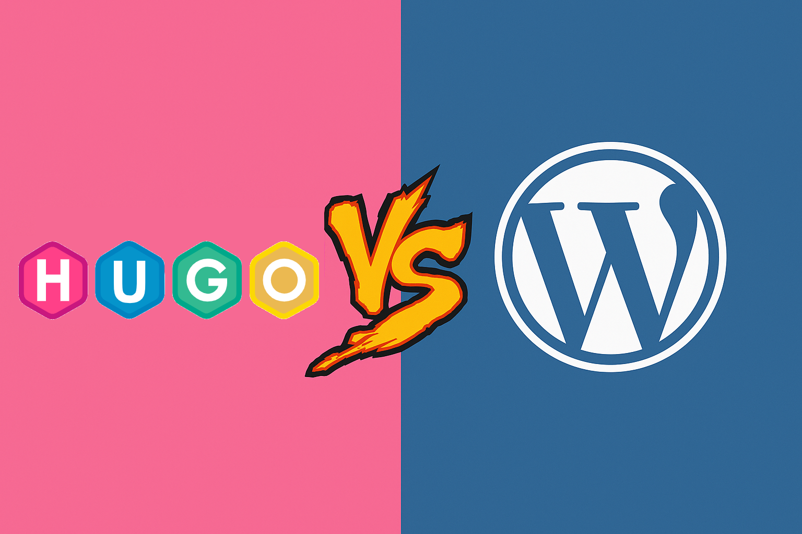

El objetivo fundamental de [Datalaria](https://datalaria.com/) es la experimentación y exploración de diferentes temas, herramientas, tecnologías... Tras unos primeros artículos más bien teóricos y didácticos para sentar las bases de futuros análisis y experimentos, es un buen momento para plantear las entrañas de este primer proyecto el cual es este blog. Vamos a examinar la tecnología detrás y los motivos de su elección frente a quiénes esperarían oír la palabra "Wordpress".

Este post es un viaje personal por el proceso de decisión técnica que me llevó a construir Datalaria con un stack moderno: **Hugo**, **GitHub** y **Netlify**. El objetivo no es demonizar otras plataformas, sino explicar por qué esta combinación era la perfecta para los objetivos de este proyecto basados en experimentar y explorar.

## Definiendo los Objetivos 

Partiendo de los principales aspectos de interés que recogía en mi post de [bienvenida](https://datalaria.com/posts/sobre-mi/), los cuales son la experimentación y el  **aprendizaje a largo plazo**, definí los pilares de este proyecto:

1.  **Aprendizaje y Control (Prioridad #1)**: Quería un sistema que me forzara a entender cómo funcionan las cosas por debajo, a usar control de versiones (Git) y a familiarizarme con flujos de despliegue continuo (CI/CD).
2.  **Rendimiento**: La web debía ser muy ágil, con tiempos de carga mínimos para la experiencia de usuario y el SEO.
3.  **Seguridad**: Quería minimizar los posibles puntos de ataque y no tener que preocuparme por actualizaciones constantes de seguridad de plugins o temas.
4.  **Bajo Coste inicial y Escalabilidad**: El proyecto no tiene un fin comercial, por lo que los costes de mantenimiento debían ser cercanos a cero, pero con la capacidad de escalar si el tráfico aumentara o integrara nuevas funcionalidades.

Con estos criterios en mente, evalué las dos principales filosofías de construcción web.

---

## El Camino Tradicional: ¿Por Qué No WordPress?

[Wordpress](https://wordpress.com/es/) es el rey indiscutible de la gestión de contenidos, moviendo más del 40% de toda la web. Es una herramienta potentísima, flexible y con un ecosistema gigantesco.

Su arquitectura es **dinámica**. Esto significa que cada vez que visitas una página, el servidor ejecuta código PHP, realiza consultas a una base de datos MySQL para obtener el contenido, ensambla la página en una plantilla HTML y te la envía.

### Desventajas para mis Objetivos

Pese a sus fortalezas, para los pilares de Datalaria, WordPress presentaba varios inconvenientes:

* **Curva de aprendizaje distinta**: Aprender WordPress es, en gran medida, aprender a usar su interfaz y su ecosistema de plugins. Es decir, es un aprendizaje de la herramienta en sí. No te expone de forma nativa a procesos de diseño web como tal, ni a herramientas como Git, la línea de comandos o procesos de build modernos.
* **Rendimiento**: La naturaleza dinámica, con sus llamadas a la base de datos, introduce una latencia inevitable. Aunque se puede mitigar con complejos sistemas de caché, la base es inherentemente más lenta que servir un fichero estático.
* **Seguridad**: Al ser tan popular y depender de una base de datos y código que se ejecuta en el servidor, es un objetivo constante de ataques. Requiere un mantenimiento proactivo: actualizar el core, los temas y los plugins debe ser una tarea continua.
* **Coste**: Necesitas un hosting compatible con PHP y MySQL, que suele ser más caro que un simple alojamiento de ficheros estáticos.

WordPress es una solución fantástica para usuarios no técnicos, para sitios con funcionalidades complejas (e-commerce, foros) o para aquellas personas que quieran desplegar una solución rápida centrada en el contenido y no en todo lo que hay detrás del desarrollo web. Con todo esto, Wordpress no se alineaba con mi objetivo principal de aprendizaje técnico y entender lo que hay detrás.

---

## El Camino Moderno: Jamstack al Rescate

Y entonces apareció el [Jamstack](https://jamstack.org/) (JavaScript, APIs y Markup) como una arquitectura que desacopla el frontend del backend.

La idea es revolucionaria en su simplicidad: en lugar de construir la página cada vez que un usuario la pide, **la construyes una sola vez** durante el despliegue. El resultado es un conjunto de ficheros HTML, CSS y JavaScript pre-generados, es decir, un sitio **estático**. Estos ficheros se distribuyen después a través de una Red de Distribución de Contenidos (CDN) global.

### Ventajas para mis Objetivos

Esta filosofía encajaba como un guante con mis metas:

* **Rendimiento**: Servir un fichero HTML desde un CDN es la forma más rápida de entregar una página web. Los resultados en herramientas como [PageSpeed Insights](https://pagespeed.web.dev/) son espectaculares.
* **Seguridad**: Al no haber base de datos ni código ejecutándose en el servidor en tiempo de ejecución, los posibles puntos de riesgo de ataque se reducen drásticamente.
* **Escalabilidad y coste casi nulos**: Los CDNs están diseñados para manejar picos de tráfico masivos sin esfuerzo. Servicios como [Netlify](https://app.netlify.com/) o [Vercel](https://vercel.com/) ofrecen planes gratuitos increíblemente generosos para proyectos personales.
* **Experiencia de desarrollo y aprendizaje**: ¡El punto clave! Este enfoque te *obliga* a usar las herramientas que quería aprender. El contenido se escribe en lenguaje [Markdown](https://markdown.es/), se versiona con [Git](https://git-scm.com/) y cada `git push` lanza un proceso automatizado que construye y despliega el sitio. Es el flujo de trabajo de un desarrollador de software moderno aplicado a la creación de contenido.

---

## Mi Stack: Hugo + GitHub + Netlify

Una vez decidido el enfoque Jamstack, solo quedaba elegir las herramientas:

* **[Hugo](https://gohugo.io/) (El Generador de Sitios Estáticos - SSG)**: Es el cerebro. Toma mis ficheros de contenido en Markdown, los combina con plantillas HTML y genera el sitio estático final. Elegí Hugo por su velocidad (está escrito en Go y es capaz de generar miles de páginas en segundos) y su potencia.
* **[GitHub](https://github.com/) (El Repositorio y Control de Versiones)**: Es la "fuente de la verdad". Todo el código y el contenido de Datalaria viven en un repositorio de GitHub. Esto me da un historial completo de cambios y un punto central para gestionar el proyecto.
* **[Netlify](https://app.netlify.com/) (El Hosting y Despliegue Continuo - CI/CD)**: Es la magia. Netlify está conectado a mi repositorio de GitHub. Cuando hago un `git push` a la rama principal, Netlify lo detecta automáticamente, ejecuta el comando de Hugo para construir el sitio, y si todo va bien, publica la nueva versión en su CDN global en cuestión de segundos.

## Conclusión

Elegir entre WordPress y un stack Jamstack no es una cuestión de "mejor" o "peor", sino de **alinear la herramienta con el objetivo**. Con otros objetivos en mente, como por ejemplo lanzar un e-commerce rápido, probablemente habría usado WordPress.

Pero para Datalaria, un proyecto nacido de la curiosidad y el deseo de aprender, el camino del Jamstack con Hugo, GitHub y Netlify ha sido la elección idónea. Me ha ofrecido control, rendimiento y, lo más importante, ha convertido el propio acto de mantener el blog en una valiosa experiencia de aprendizaje continuo.

---

#### Fuentes y Referencias de Interés:

* **Jamstack.org**: El sitio oficial para entender la filosofía Jamstack. [https://jamstack.org/](https://jamstack.org/)
* **Documentación de Hugo**: Para conocer el generador de sitios estáticos. [https://gohugo.io/](https://gohugo.io/)
* **Netlify**: Descubre cómo funciona la plataforma de despliegue. [https://www.netlify.com/](https://www.netlify.com/)
* **Smashing Magazine - A Look At The Modern WordPress Stack**: Un artículo interesante (en inglés) sobre cómo se puede modernizar WordPress, para tener una visión equilibrada. [https://www.smashingmagazine.com/2022/07/modern-wordpress-stack/](https://www.smashingmagazine.com/2022/07/modern-wordpress-stack/)