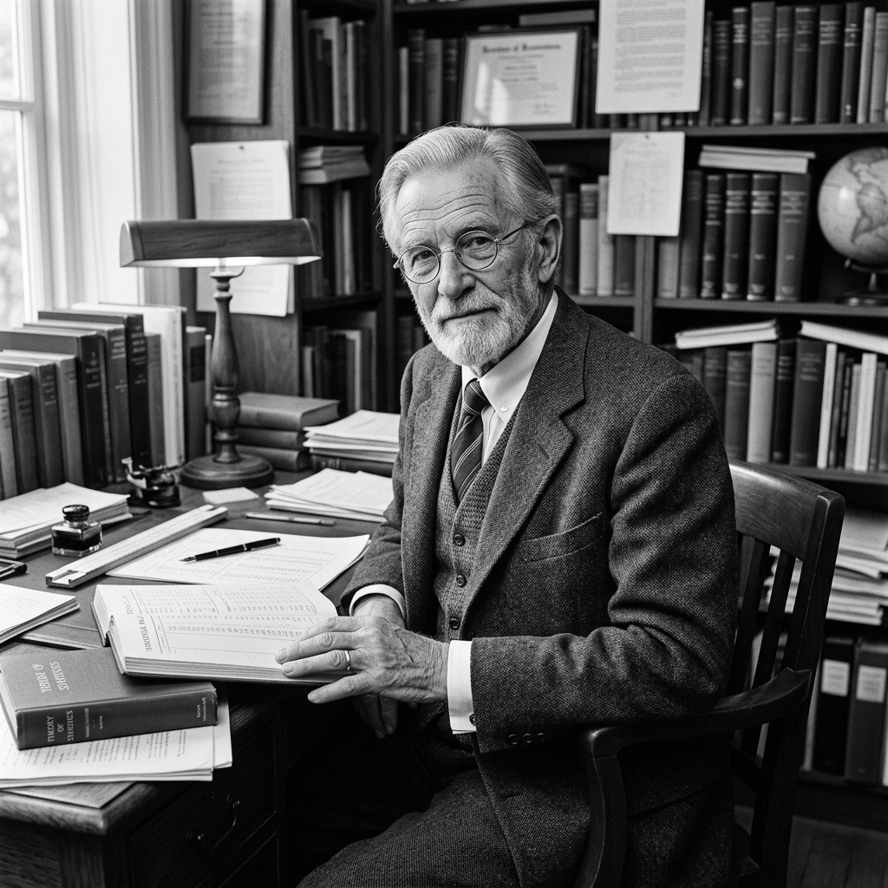

El panorama industrial contemporáneo exige marcos de gestión robustos frente a la extrema volatilidad. En el epicentro de esta arquitectura organizativa y analítica se encuentra la filosofía monumental de **W. Edwards Deming**. Concebido en las primeras décadas del siglo XX, su enfoque teórico ha trascendido la planta de producción para convertirse en el cimiento indiscutible de la Planificación de Ventas y Operaciones (S&OP) y la gestión de redes de valor complejas.

La premisa fundamental de Deming postula que la calidad no se logra mediante la inspección masiva al final, que es reactiva y costosa. La verdadera calidad nace de reducir la variación en los procesos subyacentes.

## El Sistema de Conocimiento Profundo y el Control Estadístico

Deming proponía un paradigma gerencial radical: el **Sistema de Conocimiento Profundo** (System of Profound Knowledge). Este sistema requiere que optimicemos el "todo" (la red interconectada) en lugar de maximizar silos departamentales. Nos enseñó que la variación es inherente a cualquier actividad, pero que la clave del liderazgo radica en diferenciar la "variación crónica" (causas comunes) de las "anomalías" (causas especiales) mediante el **Control Estadístico de Procesos (SPC)**.

  
  <em>W. Edwards Deming</em>

Uno de sus insights más destructivos hacia la gestión tradicional fue el concepto de **Tampering** o sobre-ajuste. Cuando la gerencia (por ejemplo, en las reuniones mensuales de S&OP) reacciona a variaciones estadísticas normales como si fueran crisis sistémicas ajustando el plan drásticamente, paradójicamente amplifica el desastre y aumenta la inestabilidad. Esta es la raíz de por qué un pronóstico de ventas asustadizo engendra el infame **Efecto Látigo** en la cadena de suministro.

## Toyota y la Revolución Impulsada por Datos

El impacto de Deming se vio con mayor contundencia en la milagrosa reconstrucción industrial del Japón de la posguerra. **Toyota** abrazó su doctrina, instaurando el famoso ciclo **PDCA** (Planificar-Hacer-Verificar-Actuar). 

Antes de Deming, las decisiones dependían del instinto. Después, los ingenieros de Toyota comprendieron que planificar el S&OP o diseñar capacidad de planta sin datos estadísticamente fiables equivalía a caminar a ciegas hacia la obsolescencia. Gracias a él, Toyota erradicó la filosofía de inspección final en favor de "construir la calidad dentro del proceso", cimentando lo que más tarde el mundo conocería como *Lean Manufacturing*.

## El Horizonte Tecnológico: IA y Concept Drift

Quizás la prueba más asombrosa de la inmortalidad de las matemáticas de Deming es su aplicación actual en la frontera de la Inteligencia Artificial y la automatización corporativa.

La regla fundamental de la robótica moderna es: **"Estabilizar antes de automatizar, siempre"**. La IA no puede inferir causalidades precisas a partir de un flujo de trabajo humano caótico o datos ruidosos. Los principios de estandarización de Deming son requisitos ineludibles para cualquier iniciativa de Machine Learning.

Aún más profundo es cómo la ciencia de datos moderna utiliza el Control Estadístico de Procesos para vigilar a los propios modelos de IA. Cuando un modelo predictivo en el mundo real comienza a fallar debido a cambios macroeconómicos imprevistos (un fenómeno conocido como **Concept Drift** o Deriva de Concepto), los ingenieros recurren a gráficos de control multivariantes—esencialmente, el motor estadístico de Deming—para identificar matemáticamente cuándo el modelo está enfrentando una "Causa Especial" y requiere ser reentrenado.

## Conclusión

El legado de Deming nos advierte frente a la fe ciega en la tecnología: la única forma de domar la IA, mitigar las disrupciones globales y optimizar el S&OP en nuestra era es subordinar la abrumadora potencia de cálculo a los inexorables dictámenes de la estabilidad del proceso y la reducción de la varianza. El Control Estadístico no ha muerto; de hecho, hoy orquesta a los algoritmos que mueven el mundo.

---

#### Fuentes de interés
- Deming, W. E. (1993). *The New Economics for Industry, Government, Education*.
- [The W. Edwards Deming Institute](https://deming.org/)
- [Historia del Sistema de Producción Toyota (TPS)](https://global.toyota/en/company/vision-and-philosophy/production-system/)
