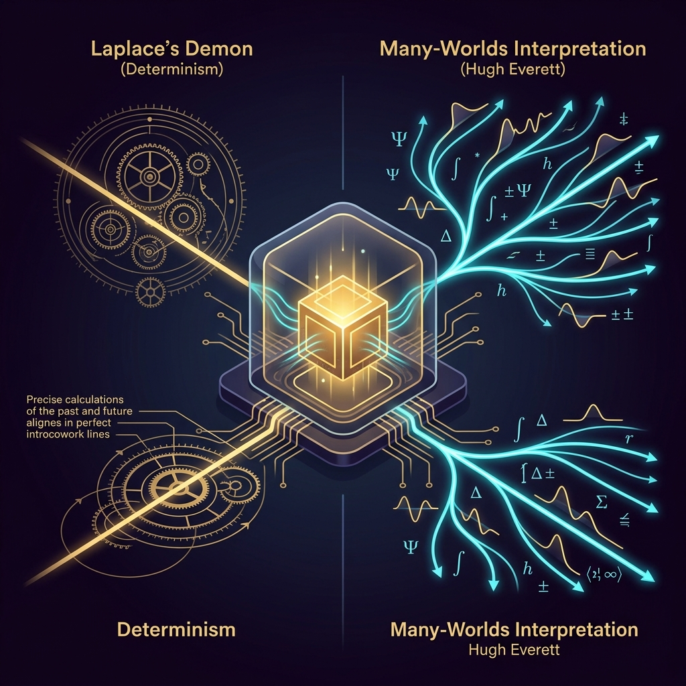

En 1814, el matemático y astrónomo francés Pierre-Simon Laplace formuló uno de los experimentos mentales más célebres de la historia de la ciencia: si una inteligencia hipotética —conocida popularmente como el **Demonio de Laplace**— conociera la posición y el momento exacto de cada átomo del universo en un instante dado, nada sería incierto. El pasado y el futuro estarían desplegados ante sus ojos con la misma claridad matemática que el presente. El libre albedrío sería solo una ilusión nacida de nuestra ignorancia de las variables subyacentes.

Dos siglos después, el cineasta y escritor **Alex Garland** (*Ex Machina*, *Annihilation*) tomó ese postulado filosófico y lo introdujo en un procesador cuántico de millones de cúbits en la miniserie **"DEVS"** (FX / Hulu).

Al igual que hicimos con [The Thinking Game](/es/posts/the_thinking_game/) al desgranar la odisea de DeepMind hacia la AGI, o con [Halt and Catch Fire](/es/posts/halt_and_catch_fire/) al explorar la era fundacional del software, este post analiza los pilares físicos, computacionales y éticos de *DEVS*: la obra que mejor ha entendido la aterradora intersección entre **la mecánica cuántica, el determinismo estricto y la soberbia de Silicon Valley**.



### La Premisa: El Cubo de Oro en el Bosque de Secuoyas

La trama se sitúa en los montes de Santa Cruz, al sur de Silicon Valley, en el campus de **Amaya**, una corporación tecnológica omnipotente liderada por el enigmático **Forest** (interpretado magistralmente por Nick Offerman). En mitad de un bosque milenario de secuoyas, bajo la sombra de una colosal estatua dorada de una niña (Amaya, la hija fallecida de Forest), se oculta una instalación secreta construida con hormigón brutalista.

En el corazón de este complejo flota un laboratorio cúbico de oro puro suspendido en un vacío electromagnético absoluto mediante levitación magnética. El diseño no es un capricho estético; responde a la mayor pesadilla de la computación cuántica real: **la decoherencia cuántica**.

Para que los cúbits mantengan su estado de **superposición** (estar en 0 y 1 simultáneamente) y **entrelazamiento**, deben aislarse de cualquier perturbación térmica, acústica, gravitacional o electromagnética del entorno. Si una sola partícula de polvo o una radiación parásita interactúa con el sistema, la función de onda colapsa y el cálculo se destruye.

En ese búnker de oro, un equipo selecto de criptógrafos y físicos —entre ellos Sergei, Lyndon, Stewart y Katie (Alison Pill)— trabaja en un software cuyo propósito inicial se oculta bajo un secretismo casi religioso: construir un simulador cuántico capaz de **reconstruir el pasado y proyectar el futuro con precisión atómica**.

### El Choque de Paradigmas: Determinismo vs. Multiverso de Everett

El núcleo dramático y científico de *DEVS* estalla en el debate entre dos interpretaciones irreconciliables de la mecánica cuántica:

#### 1. La Teoría de la Onda Piloto (De Broglie–Bohm) y el Determinismo Estricto
Forest defiende una visión determinista del cosmos. Cree en una versión cuántica de la teoría de variables ocultas de De Broglie-Bohm: el universo es una única línea temporal ininterrumpida que se rige por leyes de causa y efecto implacables. Si el ordenador cuántico procesa los datos suficientes, puede sintonizar la pantalla y ver a Jesucristo en la cruz, a Sócrates bebiendo la cicuta o a su propia hija jugando en el salón minutos antes del accidente de coche que le costó la vida.

Para Forest, el determinismo es su único refugio psicológico: si el universo es un tranvía sobre raíles fijos donde cada segundo estaba predeterminado desde el Big Bang, **él no es culpable de la muerte de su hija**.

#### 2. La Interpretación de los Muchos Mundos de Hugh Everett III (*Many-Worlds*)
Sin embargo, el sistema inicial de Amaya tiene un defecto crítico: las proyecciones del pasado se ven borrosas, con un ruido blanco ensordecedor que hace ininteligibles las imágenes y voces.

El joven prodigio **Lyndon** descubre la solución matemática: el ruido se debe a que el algoritmo intenta forzar una realidad única. Al reescribir el código aplicando la **interpretación de los Muchos Mundos de Hugh Everett** (según la cual cada evento cuántico ramifica el universo en infinitas realidades paralelas en superposición), la pantalla sintoniza de inmediato una imagen nítida en 4K con audio perfecto.

La reacción de Forest ante este triunfo técnico es reveladora: en lugar de premiar a Lyndon, **lo despide fulminantemente**. ¿Por qué? Porque si la simulación se basa en el multiverso de Everett, la niña que aparece riendo en la pantalla no es *su* hija Amaya en *su* pasado, sino una versión alternativa en una rama dimensional paralela. Para Forest, un multiverso infinito vacía de sentido su dolor y su búsqueda.

### La Paradoja de la Simulación y el Colapso del Libre Albedrío

A medida que el poder de cálculo del ordenador se multiplica, la máquina deja de mirar al pasado y empieza a proyectar el **futuro inmediato**.

Aquí la serie se adentra en la paradoja recursiva más fascinante de la ciencia ficción:
1. Si el ordenador proyecta con exactitud matemática lo que vas a hacer dentro de cinco segundos en la pantalla frente a ti... ¿tienes la capacidad de desobedecer la pantalla?
2. Si intentas cruzar los brazos porque la pantalla dice que vas a aplaudir, el propio cálculo de la máquina ya previó tu intento de rebelión, mostrando en la pantalla que ibas a cruzar los brazos.

Los personajes quedan atrapados en un estado de parálisis existencial: se convierten en autómatas que recitan las frases que la pantalla predijo segundos antes. La predicción perfecta aniquila la voluntad.

El nudo solo se rompe a través de **Lily Chan** (Sonoya Mizuno). En el clímax de la serie, enfrentada a la predicción inmutable de que disparará a Forest en el elevador del laboratorio cuántico, Lily toma una decisión imprevista: tira el arma fuera del cubículo. En ese instante infinitesimal, **el libre albedrío rompe el determinismo algorítmico**. El ordenador cuántico, incapaz de calcular más allá de ese punto de bifurcación infinita, sufre un colapso en su horizonte de eventos.

### El Significado de DEVS: La Tecnología como Teología

Hacia el final de la obra se revela el juego lingüístico que da título a la serie: en el alfabeto latino clásico, el carácter **'V'** se utilizaba para representar el sonido y la grafía de la **'U'**. El proyecto secreto nunca fue *DEVS*; siempre fue **DEUS** (*Dios* en latín).

Alex Garland no sutura la herida con tecnofilia ingenua. *DEVS* es una advertencia sobre la desmesura de los monopolios tecnológicos actuales: corporaciones con presupuestos superiores al PIB de naciones enteras que operan fuera del escrutinio democrático, jugando a ser demiurgos capaces de dictar qué es real y qué no.

### Conexiones con la Computación Cuántica y la IA Real en 2026

Aunque *DEVS* es una obra de ficción especulativa, los problemas que plantea están en el centro del debate tecnológico de nuestra era:

* **Hardware Cuántico Real**: Empresas pioneras como IBM Quantum, Google Quantum AI y startups deep-tech españolas como [Multiverse Computing](/es/posts/multiverse_computing/) están utilizando algoritmos inspirados en redes tensoriales cuánticas para resolver problemas intratables en optimización industrial y compresión extrema de LLMs.
* **Información y Entropía**: La necesidad del laboratorio de Amaya de eliminar el ruido térmico es la manifestación física más pura de la teoría de la información de [Claude Shannon](/es/posts/claude_shannon/): separar la señal del ruido es la condición indispensable para que exista el cómputo.
* **Probabilidad vs. Certeza**: Mientras el algoritmo de Forest busca un determinismo newtoniano absoluto, la ciencia de datos moderna opera bajo el paradigma de [Thomas Bayes](/es/posts/thomas_bayes/): no podemos conocer el universo con certeza absoluta; solo podemos actualizar nuestras probabilidades a medida que observamos nueva evidencia.
* **Ética y Gobernanza Algorítmica**: La opacidad de Amaya y sus sistemas predictivos es el escenario exacto que el [EU AI Act](/es/posts/eu_ai_act/) clasifica como sistemas de riesgo inaceptable o alto riesgo: algoritmos predictivos que manipulan la conducta humana o realizan vigilancia sin supervisión ni explicabilidad.

### Conclusión

*DEVS* es una obra monumental porque no trata sobre ordenadores que disparan rayos láser o rebeliones de robots humanoides; trata sobre la **búsqueda humana de significado frente al vacío cósmico**.

Nos recuerda que el deseo de predecir el futuro o recuperar el pasado no nace de la matemática, sino del amor, la pérdida y la culpa. Y nos deja una lección indeleble: sin importar cuántos cúbits tenga tu procesador ni cuántos parámetros entrene tu red neuronal, la incertidumbre no es un fallo del sistema; **la incertidumbre es el espacio donde reside la libertad humana**.

---

#### Fuentes de Interés:
* [**Hulu / FX**: DEVS — Portal Oficial de la Serie](https://www.fxnetworks.com/shows/devs)
* [**YouTube**: DEVS (Hulu) — Tráiler Oficial en HD](https://www.youtube.com/watch?v=Fp9LMsI6uJ8)
* [**Stanford Encyclopedia of Philosophy**: The Many-Worlds Interpretation of Quantum Mechanics](https://plato.stanford.edu/entries/qm-manyworlds/)
* [**Datalaria**: Multiverse Computing — Algoritmos Cuánticos Españoles](/es/posts/multiverse_computing/)
* [**Datalaria**: The Thinking Game — Demis Hassabis y DeepMind](/es/posts/the_thinking_game/)
* [**Datalaria**: Halt and Catch Fire — La Historia de la Computación](/es/posts/halt_and_catch_fire/)
* [**Datalaria**: Claude Shannon — Teoría de la Información y Entropía](/es/posts/claude_shannon/)
* [**Datalaria**: Thomas Bayes — Inferencia Probabilística](/es/posts/thomas_bayes/)
* [**Datalaria**: EU AI Act — Guía para Ingenieros y Ética Algorítmica](/es/posts/eu_ai_act/)
