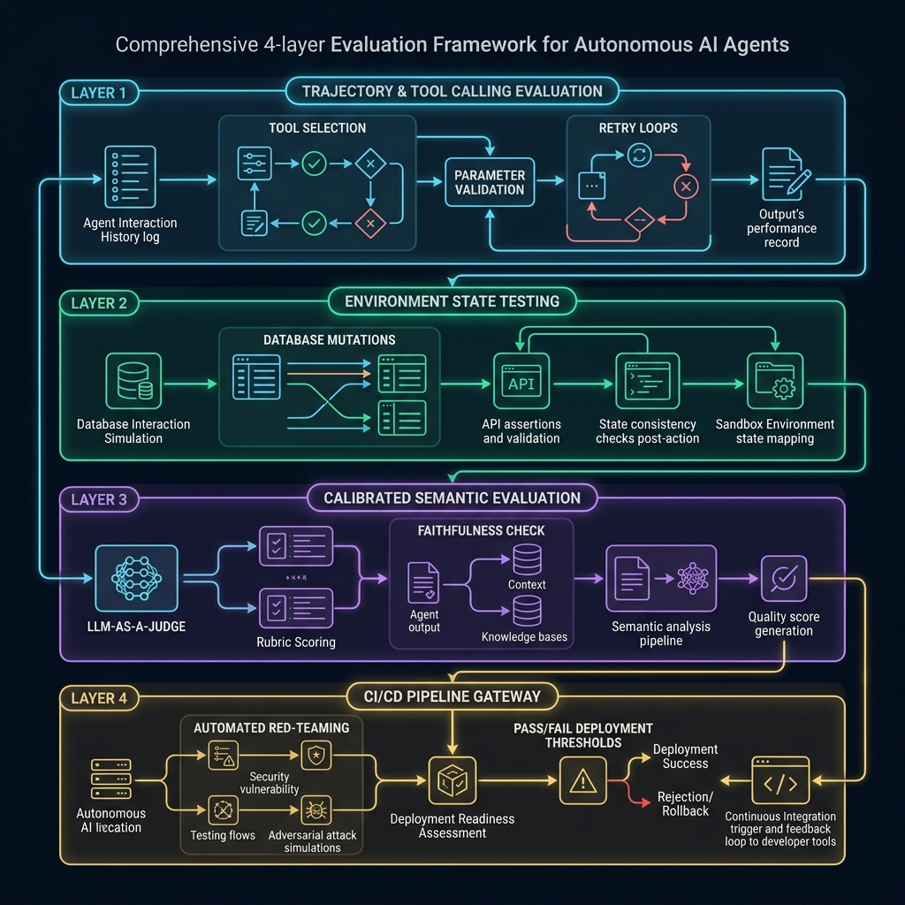

En el desarrollo de software convencional, la frontera entre el éxito y el fracaso es nítida, binaria y determinista. Escribes una función matemática, diseñas un test unitario con `assert calculate_discount(100, 0.2) == 80` y, si la aserción pasa en tu pipeline de integración continua, el código se despliega a producción con total confianza.

Pero cuando construyes un **Agente Autónomo de IA**, todo ese edificio de certezas se desmorona:

* El input del usuario es impredecible y abierto en lenguaje natural.
* El modelo fundacional subyacente es intrínsecamente estocástico (probabilístico).
* El agente debe encadenar múltiples herramientas (*Tool Calling*), consultar bases de datos relacionales, navegar APIs externas y decidir dinámicamente cuántos pasos intermedios necesita para completar su objetivo.
* Y lo más peligroso: **una ligera modificación en una sola frase del prompt del sistema para afinar una respuesta en un idioma puede provocar que, de forma invisible, el agente omita un parámetro crítico en una llamada a Stripe o entre en un bucle infinito de reintentos en otro caso de uso**.

En pleno 2026, tras haber analizado la madurez de los despliegues en [MLOps para Ingenieros](/es/posts/mlops_para_ingenieros/), las vulnerabilidades de ejecución en [Prompt Injection](/es/posts/prompt_injection/) y la orquestación en la [serie Autopilot](/es/posts/ia_agents_part9/), la industria ha topado con una verdad incontrovertible: **más del 80% de los proyectos de agentes de IA fracasan al intentar cruzar el abismo que separa una demo vistosa en un notebook de un entorno corporativo en producción**.

El motivo no es la falta de inteligencia de modelos como **Gemini 3.8**, **Claude Fable 5.1** o **GPT Sol 5.6**. El motivo es la **carencia de una disciplina rigurosa de evaluación y testing continuo**.

¿Cómo evaluamos aquello cuyo comportamiento es no determinista por diseño?

### La Muerte de las Métricas Heredadas y el Peligro del 'Vibe Checking'

Durante los primeros años del auge de los LLMs, los equipos de ingeniería intentaron evaluar sus aplicaciones recurriendo a dos atajos metodológicos que hoy están técnicamente obsoletos:

#### 1. Las Métricas del NLP Clásico (BLEU, ROUGE, METEOR)
Diseñadas hace décadas para la traducción automática y el resumen extractivo, estas métricas miden el solapamiento superficial de n-gramas entre el texto generado y una respuesta de referencia. En agentes que ejecutan flujos de trabajo, son totalmente inútiles:
* Un agente puede devolver una respuesta con un léxico completamente diferente pero técnicamente impecable.
* Por el contrario, un agente puede calcar el 95% de las palabras de la referencia pero cometer un error catastrófico en un dato numérico (*«El vuelo sale a las 14:00»* vs *«El vuelo sale a las 04:00»*).

#### 2. La Distancia Coseno de Embeddings
Medir la similitud semántica mediante vectores (como vimos en [GraphRAG](/es/posts/graphrag/)) es una trampa mortal en evaluación. Las frases *«El contrato ha sido firmado y aprobado»* y *«El contrato no ha sido firmado ni aprobado»* comparten una proximidad en el espacio vectorial superior a **0.93**, a pesar de tener consecuencias legales y operativas diametralmente opuestas.

#### 3. El 'Vibe Checking'
El antipatrón más extendido: el desarrollador prueba tres prompts manualmente en su consola, lee las respuestas por encima, asiente satisfecho porque «suena convincente» y aprueba el *Pull Request*. Esta práctica equivale a desplegar un sistema bancario sin tests unitarios porque el cajero automático encendió las luces al conectarlo a la corriente.



### El Framework de Evaluación de 4 Capas para Agentes de IA

Para medir y asegurar la fiabilidad de un agente en producción, debemos descomponer su ejecución en cuatro niveles analíticos independientes pero interconectados:

```
┌─────────────────────────────────────────────────────────────┐
│  CAPA 1: Evaluación de Trayectoria y Tool Calling           │
│  (Selección de herramientas, validación de schemas, bucles)  │
├─────────────────────────────────────────────────────────────┤
│  CAPA 2: Aserciones de Estado del Entorno                   │
│  (Mutaciones en BD, idempotencia de APIs, rollbacks)        │
├─────────────────────────────────────────────────────────────┤
│  CAPA 3: Evaluación Semántica Calibrada (LLM-as-a-Judge)    │
│  (Rúbricas con CoT, fidelidad RAGAS, mitigación de sesgos)  │
├─────────────────────────────────────────────────────────────┤
│  CAPA 4: CI/CD Pipeline Gateway y Red-Teaming Continuo      │
│  (Golden datasets, umbrales de pase/bloqueo, adversarial)   │
└─────────────────────────────────────────────────────────────┘
```

#### Capa 1: Evaluación de Trayectoria y Tool Calling (Trajectory Evaluation)
Un agente no es solo su respuesta final; es el camino que recorre para llegar a ella. Evaluar la trayectoria implica auditar cada decisión intermedia en el grafo de ejecución:

* **Precisión en la Selección de Herramientas (*Tool Choice Accuracy*)**: ¿Eligió la herramienta adecuada para el paso correspondiente? (Por ejemplo: usar `query_database` en lugar de inventar la cifra con su conocimiento paramétrico).
* **Validación de Parámetros y Schemas**: ¿Construyó la carga JSON con los tipos de datos correctos? ¿Respetó los enums y las restricciones de formato?
* **Eficiencia de Trayectoria y Bucles Infinitos (*Step-to-Goal Ratio*)**: Si un agente necesita doce pasos para resolver una tarea que habitualmente requiere tres, estamos ante una degradación silenciosa que multiplica por cuatro la latencia y los costes de inferencia. El framework debe detectar bucles de reintentos improductivos antes de agotar el límite de tokens.

#### Capa 2: Aserciones de Estado del Entorno (State Assertions)
La única verdad inmutable de un sistema informático son las mutaciones que provoca en el mundo exterior. En esta capa recuperamos el determinismo clásico:

* Si el agente afirma: *«He cancelado su suscripción y emitido el reembolso»*, el test no evalúa el texto del agente. El test inspecciona directamente la base de datos de pruebas o el *mock* de Stripe:
```python
assert user.subscription.status == "cancelled"
assert refund_transaction.amount == 49.99
```
* **Pruebas en Sandboxes Aislados**: Los agentes deben ejecutarse contra entornos de pruebas desechables (contenedores Docker efímeros) donde las llamadas a APIs externas queden registradas para verificar idempotencia y control de efectos secundarios.

#### Capa 3: Evaluación Semántica Calibrada (LLM-as-a-Judge)
Cuando evaluamos aspectos cualitativos (tono de atención al cliente, completitud de una síntesis o relevancia explicativa), recurrimos a otro modelo de lenguaje como juez. Sin embargo, un juez LLM ingenuo es tan peligroso como la falta de tests:

Los evaluadores LLM sufren de **tres sesgos sistemáticos documentados**:
1. **Sesgo de Posición (*Position Bias*)**: En evaluaciones comparativas A/B, los LLMs tienden a preferir la primera respuesta que leen.
   * *Solución técnica*: Evaluación cruzada intercambiando el orden (*Swap Test*) y promediando los resultados.
2. **Sesgo de Verborrea (*Verbosity Bias*)**: Los jueces tienden a calificar mejor las respuestas más largas y floridas, aunque contengan información superflua o errores sutiles.
   * *Solución técnica*: Normalizar la longitud en la rúbrica y penalizar la redundancia.
3. **Adulación y Falta de Rigor (*Sycophancy*)**: El modelo juez tiende a ser indulgente para evitar penalizaciones estrictas.
   * *Solución técnica*: Utilizar **Rúbricas con Cadena de Pensamiento (*Chain-of-Thought Rubrics*)** que obliguen al juez a citar evidencias textuales explícitas antes de emitir una puntuación numérica discreta (de 1 a 5).

En sistemas con recuperación de información, integramos el estándar del framework **RAGAS**:
* **Fidelidad (*Faithfulness*)**: ¿Cada afirmación de la respuesta está respaldada por el contexto recuperado en el grafo o vector? (Detección matemática de alucinaciones).
* **Relevancia de la Respuesta (*Answer Relevance*)**: ¿Responde directamente a lo que el usuario preguntó sin desviarse del objetivo?

#### Capa 4: CI/CD Pipeline Gateway y Red-Teaming Automatizado
La evaluación no sirve de nada si se realiza como una auditoría trimestral estática. Debe vivir integrada en el flujo diario de ingeniería:

* **Golden Datasets Curados**: Conjuntos de pruebas inmutables con cientos de casos de uso reales etiquetados por expertos de dominio.
* **Generación Sintética de Casos Adversarios**: Utilizar agentes atacantes (*Adversarial Agents*) que inyectan intencionadamente ruido, faltas de ortografía, ambigüedades y ataques de [Prompt Injection](/es/posts/prompt_injection/) para evaluar la resiliencia del sistema antes de cada despliegue.
* **Umbrales de Bloqueo (*Deployment Gates*)**: En GitHub Actions o GitLab CI, si el agente sufre una regresión superior al **2% en precisión de Tool Calling** o un **0,5% en fidelidad factual**, el *Pull Request* se bloquea automáticamente.

---

### Evaluación Offline vs. Monitorización Online

El testing de agentes no termina en el despliegue; se transforma en un bucle continuo de telemetría:

| Dimensión | Evaluación Offline (Pre-Despliegue) | Monitorización Online (Producción) |
| :--- | :--- | :--- |
| **Entorno** | Sandboxes controlados con datos simulados y mocks. | Tráfico real de usuarios finales y APIs de producción. |
| **Volumen** | Suites de cientos o miles de casos etiquetados (*Golden Sets*). | Millones de interacciones continuas en tiempo real. |
| **Métricas Clave** | Precisión de schema, cobertura de branches, regresión de prompts. | Latencia P95/P99, tasa de errores de herramientas, coste por interacción, feedback explícito (thumbs up/down). |
| **Herramientas Típicas** | Pytest, RAGAS, DeepEval, Promptfoo, eval harnesses propios. | OpenTelemetry, LangSmith, Arize Phoenix, Datadog LLM Observability. |
| **Objetivo** | Evitar regresiones funcionales antes de fusionar código a *main*. | Detectar deriva de datos (*drift*), anomalías de comportamiento y abuso en tiempo real. |

---

### Exigencia Regulatoria: El Impacto del EU AI Act

Este rigor metodológico ha dejado de ser una mera buena práctica técnica para convertirse en una **obligación legal estricta**.

Bajo el **[EU AI Act](/es/posts/eu_ai_act/)**, los sistemas de IA clasificados de alto riesgo están sujetos a mandatos imperativos de auditoría:
* **Artículo 15 (Precisión, Robustez y Ciberseguridad)**: Exige formalmente que los sistemas de IA sean evaluados sistemáticamente frente a fallos, perturbaciones imprevistas y ataques adversarios a lo largo de todo su ciclo de vida.
* **Trazabilidad y Registro de Logs (Artículo 12)**: Obliga a registrar con precisión forense cada llamada intermedia, parámetro y decisión tomada por el agente para permitir auditorías externas independientes.

Aquellas organizaciones que despliegan agentes de IA basándose en simples comprobaciones manuales no solo se arriesgan a fallos catastróficos en sus operaciones; se exponen a sanciones regulatorias severas por falta de gobernanza técnica demostrable.

---

### 5 Mandamientos Prácticos para Ingenieros de Agentes de IA

Si lideras el desarrollo de sistemas agénticos en tu organización, adopta estas cinco reglas desde hoy mismo:

#### 1. Nunca toques un prompt sin ejecutar una suite de regresión
El «prompt engineering» a ciegas es el equivalente moderno a editar código directamente en producción sin control de versiones. Todo cambio de prompt debe someterse a una batería completa de evaluación automatizada.

#### 2. Separa la evaluación del razonamiento de la verificación del estado
No le preguntes al agente si ejecutó la acción con éxito: compruébalo tú mismo inspeccionando las tablas de la base de datos o el estado de los microservicios.

#### 3. Calibra periódicamente a tus jueces LLM con evaluadores humanos
Un juez LLM no calibrado deriva hacia el optimismo complaciente. Calcula trimestralmente el coeficiente de concordancia inter-evaluador (*Cohen's Kappa*) entre tus jueces automáticos y tus ingenieros senior.

#### 4. Mide el coste y la latencia junto a la precisión
Un agente con un 98% de precisión que tarda 45 segundos y cuesta 0,35 dólares por llamada en tokens es inviable en la gran mayoría de casos de negocio. La evaluación debe balancear el triángulo: **Precisión, Latencia y Coste**.

#### 5. Integra el Red-Teaming en tu pipeline de CI/CD
El peor momento para descubrir que tu agente filtra credenciales ante una instrucción maliciosa es cuando un usuario malintencionado lo publica en redes sociales. Diseña agentes que intenten engañar a tus propios agentes en cada commit.

---

### Conclusión

La madurez de una disciplina de ingeniería no se mide por la audacia de sus prototipos, sino por la **solidez y reproducibilidad de sus métodos de ensayo y validación**.

Construir agentes autónomos de IA sin un framework de evaluación riguroso es como construir rascacielos sin calcular la resistencia de los materiales al viento. Los modelos fundacionales seguirán avanzando en potencia y velocidad, pero la verdadera ventaja competitiva de las empresas no radicará en quién tiene el modelo más grande, sino en **quién tiene la infraestructura de testing más fiable para desplegar agentes con total tranquilidad en el corazón de sus operaciones**.

---

#### Fuentes de Interés:
* [**RAGAS Framework**: Automated Evaluation of Retrieval Augmented Generation](https://docs.ragas.io/)
* [**DeepEval**: The Open-Source LLM Evaluation Framework](https://github.com/confident-ai/deepeval)
* [**OpenTelemetry**: Semantic Conventions for Generative AI and LLM Observability](https://opentelemetry.io/docs/specs/semconv/gen-ai/)
* [**Datalaria**: MLOps para Ingenieros — De los Experimentos en Jupyter a Producción](/es/posts/mlops_para_ingenieros/)
* [**Datalaria**: Prompt Injection — Seguridad y Vulnerabilidades en Agentes](/es/posts/prompt_injection/)
* [**Datalaria**: Serie Autopilot — Orquestación y Supervisión de Agentes de IA](/es/posts/ia_agents_part9/)
* [**Datalaria**: GraphRAG — Por Qué los Vectores No Bastan](/es/posts/graphrag/)
* [**Datalaria**: Silicon Valley y el Dilema de PiperNet — Seguridad y Pérdida de Control](/es/posts/silicon_valley/)
* [**Datalaria**: EU AI Act — Guía Práctica de Robustez y Compliance Técnico](/es/posts/eu_ai_act/)
