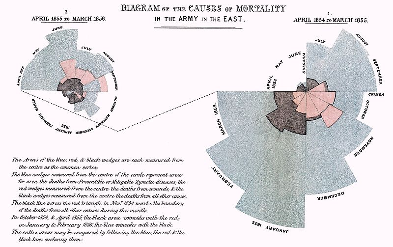

Continuamos con los casos de éxito en el análisis de datos para hablar de Florence Nightingale (12/05/1820 – 13/08/1910), una figura revolucionaria. Enfermera, escritora y estadística británica, es considerada la **madre de la enfermería moderna** y, como veremos, **una de las primeras y más influyentes científicas de datos**.

Su caso es especialmente relevante dado que, además de luchar por la emancipación de la mujer mediante la apertura de nuevos rumbos profesionales cualificados, destacó en el ámbito de la enfermería por ser considerada la precursora de la enfermería profesional moderna gracias a la creación del **primer modelo conceptual**.
Para la confección de este modelo, Florence aplicó sus conocimientos estadísticos y matemáticos, así como todos los datos e información relativa a cuidados de enfermería que fue recopilando durante un período de aprendizaje en el que visitó diferentes hospitales, prisiones, asilos y orfelinatos de Francia, Alemania, Italia, Suiza, Irlanda e Inglaterra.

El éxito de este nuevo modelo profesionalizado de enfermería, se vio refrendado bajo el ámbito de estudio y aplicación del mismo en el **alto índice de mortandad de los heridos de la guerra de Crimea**, la cual había estallado en el año 1853 tras las pretensiones rusas de ocupar los territorios danubianos.

Las mortalidades dentro del ejército británico eran elevadas, fruto no de la guerra sino del caótico sistema sanitario por el que se regían. Los hospitales de campaña apenas disponían de medios y la suciedad era indescriptible.

Ante esta situación, el Gobierno Británico decidió enviar a Florence Nightingale para reformar completamente la administración sanitaria del ejército. A su llegada Florence comenzó una ardua labor de recolección y recogida de datos con el objetivo de analizar el estado sanitario existente y presentar dichas conclusiones al Parlamento. Para ello, Florence creó un gráfico, conocido como **diagrama polar o de la rosa**, que facilitó la labor de visualización e interpretación de todos los datos recopilados y en el que destacaba  mayor grado de mortalidad en los hospitales ingleses que en la propia guerra.

Ante estos datos, convenció al Parlamento de la necesidad de mejorar las condiciones sanitarias de los hospitales y como resultando Florence revolucionó aspectos como la atención a los enfermos, la higiene y la mejora de la alimentación

Al finalizar la guerra regresó a Londres y se centró en el ámbito civil, donde escribió un libro de texto con sus conocimientos y fundó una escuela de enfermería para la formación de estas profesionales. Dentro de dichos conocimientos también cabe destacar la **Formulación de un modelo de Estadística Hospitalaria** para que los hospitales recolecten y generen datos y estadísticas consistentes.

Por lo tanto, y en resumen, Florence Nightingale representa un claro caso de éxito y de disrupción dentro del ámbito sanitario gracias a la aplicación de la recogida y análisis de los datos con el objetivo de obtener una mayor claridad en la interpretación de los mismos y sobre todo de mejora continua.

#### Fuentes de interés
- [CODEM - Colegio Oficial de Enfermería de Madrid](https://www.codem.es/Adjuntos/CODEM/Documentos/Informaciones/Publico/7e040f14-0bea-421f-b327-440fe67f3617/6B276772-CAC4-4790-810D-A61458561AC2/a725b57c-c56a-45ad-a794-fe9942e52081/a725b57c-c56a-45ad-a794-fe9942e52081.pdf)
- [Master Telefónica en Big Data & Business Analytics](https://www.campusbigdata.com/master-telefonica-en-big-data-y-business-analytics)
- [Did Nightingale’s ‘Rose Diagram’ save millions of lives?](http://www.florence-nightingale-avenging-angel.co.uk/?p=462)
