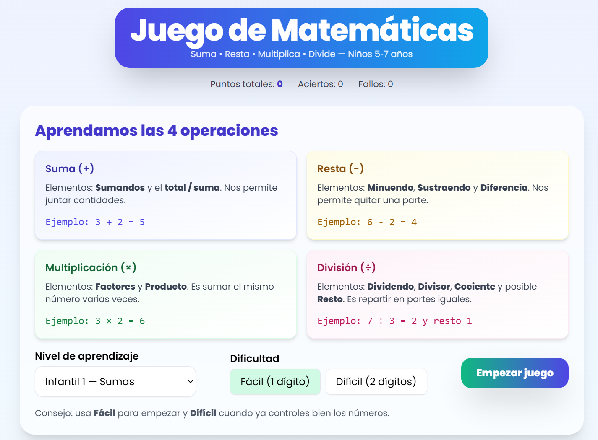

En nuestro día a día, nos enfrentamos constantemente a barreras en la implementación de buenas ideas y su ejecución por falta de conocimiento técnico y el tiempo necesario para saber por donde empezar e investigar como resolverlo. Los modelos de IA existentes actualmente han supuesto una revolución en este sentido gracias a la aceleración del tiempo y eliminación de los obstáculos de aprendizaje y resolución de problemas en este sentido. Gracias a estos modelos podemos hacer más cosas en menos tiempo, y adentrarnos en campos de gran complejidad como el mundo de la programación permitiéndonos hacer realidad aplicaciones sencillas que implementen buenas ideas de nuestro día a día. 

En este sentido, recientemente completé el curso **[Introducción a la IA y Prompt Engineering de Founderz](https://founderz.com/es/programa/introduccion-a-la-ia-y-prompt-engineering)** impartido por Pau García-Millá (Fundador y Co-CEO de Founderz), Anna Cejudo (Fundadora y Co-CEO de Founderz) y Magda Teruel (Manager de cuentas de cliente en Microsoft) el cual diría que es un curso Muy recomendable! Es muy fácil de seguir, muy bien didáctico, muy bien hilado en sus contenidos y que no te deja indiferente, sino que Pau nos ofrece varias pinceladas de lo que se puede llegar a hacer con la IA con unas breves y buenas instrucciones.

El curso consiste en videos breves de entre 5 y 15 minutos donde se va explicando y desarrollando la idea de los modelos de IA como "Copilotos" en nuestro día a día. Pau, Anna y Magda nos van presentando ejemplos de como "hablarles" a estos "Copilotos" y como usarlos para nuestro día a día, enseñándonos algunos casos de uso más avanzados y llegando a varios casos prácticos sobre como materializar nuestras ideas de proyectos en aplicaciones web sin saber programar gracias al buen hacer de nuestros "Copilotos". Para finalizar te proponen probar tú mismo a crear un proyecto básico con estos modelos basado en lo aprendido durante el curso y proporcionan un mecanismo de feedback propio y de otros alumnos que me ha parecido muy interesante.

Al margen de recomendar inscribirse y realizar este curso a quién quiera saber introducirse en el uso de los modelos de IA y quiera saber más sobre como contar con estos "Copilotos", voy a aprovechar esta entrada para ilustrar una de las pinceladas dadas en este curso y centrada en como aprender a crear una aplicación funcional mediante una simple conversación con ChatGPT y unas instrucciones adecuadas para tal efecto. 

### El "¡Ajá!" Moment del Curso de Founderz

El curso de Founderz es tremendamente didáctico, y su gran aprendizaje es presentar a la IA (en su caso, Copilot y ChatGPT) no solo como un simple asistente de búsqueda sino como un **compañero de creación (un copiloto)**.

El ejemplo más claro de este copilotaje consiste en como un modelo de lenguaje puede ayudarnos a crear código estructurado y funcional a partir de una idea inicial a través de una serie de instrucciones sencillas. Y, para ello, a través de varios casos prácticos se enseña como crear aplicaciones web autocontenidas en un solo fichero HTML que den rienda suelta a nuestras ideas para mejorar nuestro día a día.

### El Desafío: Como crear una Herramienta Útil desde Cero con ChatGPT

Para poner a prueba esta habilidad, vamos a crear un **juego de aprendizaje de operaciones matemáticas básicas enfocada a niños de infantil y primaria de entre 5 y 7 años**.

El objetivo era simple: una página web que permitiera enseñar y practicar las operaciones matemáticas básicas (suma, resta, multiplicación y división) por niveles de aprendizaje haciéndolo atractivo para los usuarios.

### La Receta: El Prompt Detallado (y su Refinamiento) es la Clave

Aquí es donde entra en juego el *Prompt Engineering*. No se trata de pedirle a ChatGPT "hazme una app", sino de actuar como un responsable de producto que le da al equipo de desarrollo (la IA) unas especificaciones claras y detalladas.

#### El Prompt Inicial

Este fue el primer prompt que utilicé, inspirado en la metodología del curso, donde definí toda la estructura y funcionalidad que quería (animo a quienquiera a experimentar y reproducirlo por si mismo sobre ChatGPT):

> Crea una aplicación web simple para practicar las funciones de matemáticas básicas: sumas, restas, multiplicaciones y divisiones. El objetivo es crear una aplicación sencilla que facilite el aprendizaje de estas operaciones a niños de infantil y primaria (entre 5 y 7 años). Para ello la aplicación debe:
> 1.  Empezar con una página de aprendizaje donde se expliquen las 4 operaciones matemáticas.
> 2.  Permitir seleccionar el nivel de aprendizaje entre 4 niveles (infantil 1 y 2, primaria 1 y 2).
> 3.  Permitir seleccionar un grado de dificultad (fácil con 1 dígito, difícil con 2).
> 4.  Disponer de un botón de "Empezar juego" que pase a una pantalla de operaciones.
> 5.  Comprobar si la respuesta es correcta y mostrar un mensaje motivador y un emoticono.
> 6.  Llevar la cuenta de aciertos y fallos.
> 7.  Tener un diseño atractivo y responsivo utilizando Tailwind CSS.
> 8.  Incluir todo el código HTML, CSS y JavaScript en un solo archivo.

ChatGPT procesó la petición y, en segundos, me devolvió un único bloque de código que contenía una aplicación completamente funcional.

#### El Refinamiento: La Conversación Continúa

El primer resultado funcionaba bastante bien, pero siempre se puede mejorar 😄. Aquí es donde reside la verdadera potencia de la IA conversacional: la capacidad de iterar y mejorar gracias a la coherencia que es capaz de mantener en sus resultados. Como prueba, le pedí una serie de cambios para hacer la aplicación más dinámica y atractiva:

> ¡Funciona! Ahora quiero que hagas los siguientes cambios:
> 1.  Edita el diseño hacia algo más atractivo con colores degradados y tipografías más bonitas.
> 2.  Añade una cuenta atrás de 10 segundos en cada operación y un sistema de puntuación.
> 3.  Una vez enviada la respuesta, muestra el mensaje de correcto/incorrecto durante 3 segundos y pasa a la siguiente operación.
> 4.  Muestra la puntuación total en todo momento.
> 5.  Al llegar a 10 operaciones, enseña el resultado final.
>
> Escribe todo el código completo de nuevo.

Y como por arte de magia, la IA integró todas las mejoras y me proporcionó el código final y pulido. Puedes ver la conversación completa y el resultado aquí: **[Prompt de la App de Matemáticas en ChatGPT](https://chatgpt.com/share/68b5fa88-be78-8004-8d93-612409d559f5)**.

### La "Magia": Tu App Funcionando en 30 Segundos

Esta es la parte más gratificante. Para ejecutar la aplicación que acabamos de crear, solo hay que seguir estos pasos:

1.  **Abre un editor de texto plano** (como el Bloc de Notas en Windows o TextEdit en Mac).
2.  **Pega el código completo** que te ha proporcionado ChatGPT.
3.  **Guarda el fichero** con el nombre que quieras, pero asegurándote de que la extensión sea `.html` (por ejemplo: `juego-mates.html`).
4.  **Haz doble clic en el fichero guardado.**

¡Y ya está! El fichero se abrirá en tu navegador y tendrás una aplicación educativa completamente funcional, creada por ti y tu copiloto de IA.

### Conclusión y Próximos Pasos

Esta experiencia demuestra la increíble democratización que la IA está trayendo al mundo de la creación digital. Ya no es imprescindible ser un programador experto para construir herramientas sencillas y útiles. Lo que ahora es crucial es la habilidad de **pensar de forma estructurada y dar instrucciones claras**, la esencia del *Prompt Engineering*.

Este método es increíblemente rápido para crear y probar herramientas. Pero, ¿cómo podemos llevarlo un paso más allá y publicar esta aplicación para que cualquiera en el mundo pueda usarla?

De eso hablaremos en uno de nuestros siguientes post, donde exploraremos el proceso de creación con **la Pizarra de Código de Gemini** y su despliegue público usando **GitHub Pages**. Mientras tanto, para los que no hayáis ido probando en paralelo, podéis ver el resultado creado aquí: [Mi aplicación de matemáticas para niños creada con ChatGPT](https://datalaria.com/apps/math)

---

#### Fuentes y Recursos:
* **Founderz**: [Curso de Introducción a la IA y Prompt Engineering](https://founderz.com/es/programa/introduccion-a-la-ia-y-prompt-engineering)
* **OpenAI**: [ChatGPT](https://chat.openai.com/)
* **Web App**: [Mi aplicación de matemáticas para niños creada con ChatGPT](https://datalaria.com/apps/math)