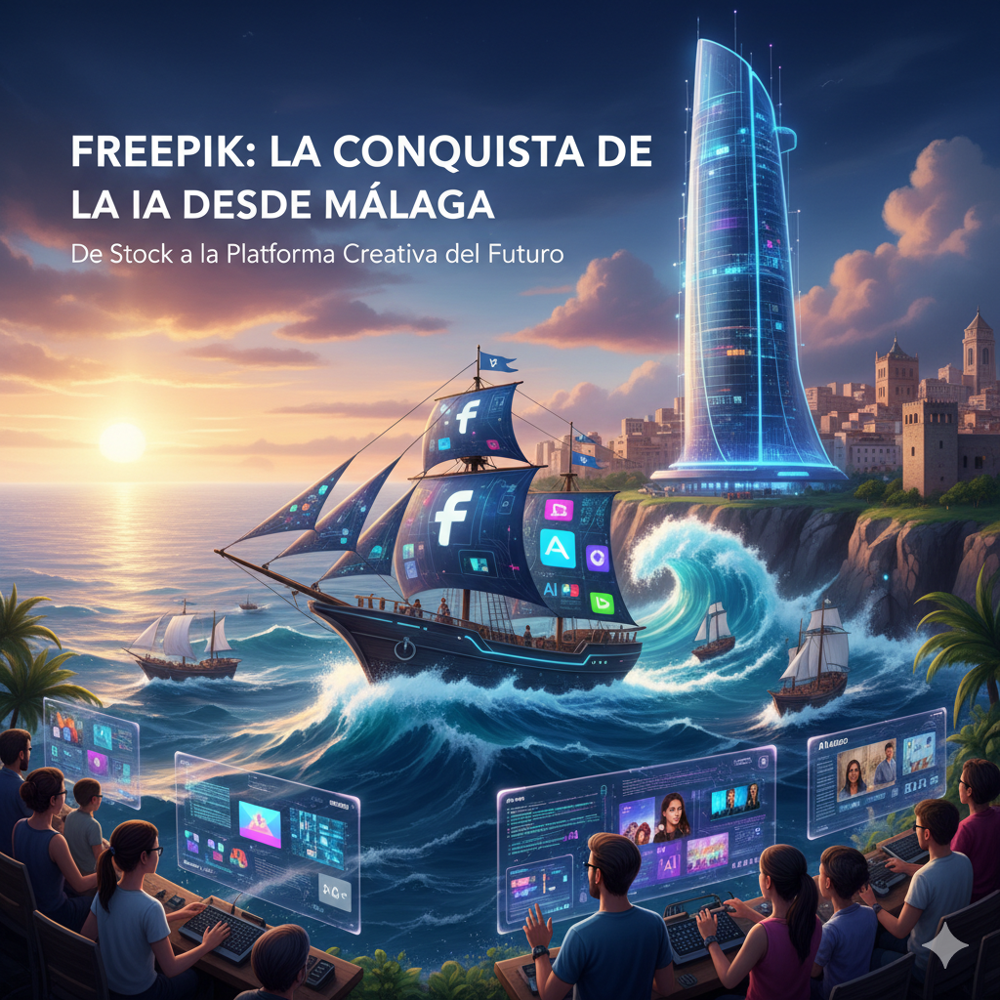

En 2022, la explosión de la inteligencia artificial generativa provocó un terremoto en la industria creativa. Modelos como Midjourney o DALL-E 2 plantearon una pregunta existencial que hizo temblar los cimientos de los gigantes del contenido de stock: **"¿Qué sentido tiene un banco de imágenes cuando los usuarios pueden crear exactamente lo que necesitan desde cero?"**. Muchas empresas se paralizaron. Una, sin embargo, vio la amenaza venir y decidió apostar "todo o nada" por una reinvención total.

Esa empresa no nació en Silicon Valley, sino en Málaga. Esta es la historia de [**Freepik**](https://www.freepik.com/), el viaje de una startup española que, gracias a una cultura única y una agilidad estratégica asombrosa, no solo ha sobrevivido a la disrupción de la IA, sino que se está posicionando para liderar la nueva era de la creatividad.

### El ADN: Mentalidad de Google, Corazón de "Cantera"

El éxito de Freepik no fue casual. Fundada en 2010, su cultura se forjó a partir de una combinación única de talentos: los hermanos Alejandro (el diseñador frustrado que tuvo la idea original) y Pablo Blanes, junto a Joaquín Cuenca, un emprendedor en serie que ya había vendido su empresa Panoramio a Google.

Cuenca importó la disciplina y la metodología de datos de Google, pero al operar desde Málaga, lejos de los grandes fondos, no podían permitirse "fichajes estrella". En sus propias palabras, eran como el **"Athletic de Bilbao"**: su fortaleza residía en la "cantera", en desarrollar el talento local y en un enfoque obsesivo en el producto.

Su modelo de negocio inicial fue una genialidad disruptiva. Empezaron como un simple buscador que indexaba recursos gratuitos. Su modelo *freemium* eliminaba la barrera del coste, atrayendo a millones de usuarios. ¿Su primera fuente de ingresos? Una astuta alianza con su principal competidor, Shutterstock, a quien enviaban tráfico a cambio de una comisión. Al mismo tiempo, el requisito de atribución para los recursos gratuitos convirtió a su masiva base de usuarios en un **ejército de marketing global no remunerado**, generando millones de enlaces que catapultaron su dominio en Google.



### El Pivote Existencial: Sacrificar el Crecimiento para Ganar el Futuro

Freepik ya era un gigante antes de la IA. Tras ser adquirida por el fondo EQT en 2020 por una cifra estimada de 250 millones de euros, duplicó sus ingresos hasta los 61,5 millones en 2021 y superó a Shutterstock en número de suscriptores premium.

Pero entonces llegó el "terremoto" de la IA generativa. La dirección entendió que una respuesta tibia no era suficiente; la amenaza requería una reinvención total. Tomaron una decisión valiente: **apostar "todo o nada" por la IA**, reasignando masivamente sus recursos para construir un nuevo ecosistema de herramientas creativas.

Esta decisión tuvo un coste deliberado. Tras crecer un 45% en 2022, el crecimiento de la compañía **se desaceleró drásticamente a solo un 11% en 2023**. Fue una ralentización consciente: sacrificaron los resultados a corto plazo para invertir en su supervivencia y liderazgo a largo plazo.

| Año Fiscal | Ingresos (€M) | Crecimiento Anual (%) | Contexto Estratégico Clave |
| :--- | :--- | :--- | :--- |
| 2019 | 31 | - | Crecimiento orgánico pre-adquisición. |
| 2021 | 61.5 | - | Crecimiento acelerado post-EQT; supera a Shutterstock. |
| 2022 | 79 | 45% | Fuerte crecimiento; inicio de la disrupción de la IA. |
| 2023 | 88 | 11% | **Año del pivote a la IA**: Crecimiento ralentizado para invertir en la AI Suite. |
| 2024 (E) | > 100 | > 13.6% | Retorno al crecimiento impulsado por las nuevas herramientas de IA. |

El resultado de esta inversión es la **Freepik AI Suite**, un ecosistema que incluye desde un generador de imágenes y vídeo hasta herramientas innovadoras como **Pikaso** (que convierte bocetos en imágenes en tiempo real) y la tecnología de escalado de la recién adquirida **Magnific**.

### El Arma Secreta: Un Ecosistema Híbrido para el Mundo Real

La estrategia de Freepik no es ganar a Midjourney en la creación de arte conceptual. Su objetivo es ganar en el **flujo de trabajo comercial**. Mientras Midjourney sirve al "Artista/Explorador", Freepik se ha posicionado para dominar el segmento, mucho más grande, del "Creador/Comunicador": el profesional de marketing, el educador o el pequeño empresario que necesita crear contenido de aspecto profesional de forma rápida y, sobre todo, legalmente segura.

Su ventaja competitiva reside en un modelo híbrido único:

1.  **Flujo de Trabajo Integrado**: Un usuario puede generar una imagen con IA, quitarle el fondo, añadirle un icono de su librería de stock y ponerle texto con su editor, todo dentro de la misma plataforma y suscripción. Esto es imposible en herramientas de IA puras.
2.  **Biblioteca de Stock como Foso Estratégico**: Su gigantesca librería de más de 200 millones de activos ya no es solo un producto, sino una ventaja defensiva. Ofrece una vía rápida y segura para los usuarios ("es más fácil retocar una foto de stock que generar la perfecta desde cero") y funciona como un potencial dataset "limpio" para entrenar futuros modelos de IA propietarios, evitando problemas de derechos de autor.
3.  **Seguridad Legal**: Al ofrecer indemnización legal en sus planes para empresas, Freepik ataca directamente el mayor punto de dolor de los clientes corporativos, ofreciendo una seguridad que las herramientas entrenadas con datos de internet no pueden garantizar.

### Conclusión: Definiendo el Nuevo Estándar Creativo

La historia de Freepik es una lección magistral de agilidad estratégica. Ha navegado dos cambios sísmicos en su industria: la disrupción del modelo *freemium* contra el de pago, y ahora, la transformación de la IA generativa.

Con el mercado de la IA en diseño gráfico proyectado a crecer hasta casi **14.000 millones de dólares en 2034**, Freepik está en una posición inmejorable para capturar una porción significativa de este crecimiento. Al construir un ecosistema que combina generación, edición y una vasta librería de contenido seguro, Freepik no solo está participando en la revolución de la IA, sino que se está posicionando para convertirse en la **plataforma de referencia para la nueva era de la creatividad aumentada**. Su viaje demuestra que, en la era de la IA, la capacidad de adaptarse no es solo una ventaja, es la clave para definir el futuro y por otro lado, que con creatividad y sabiendo tocar las teclas adecuadas desde Málaga o cualquier rincón del planeta se puede competir contra los grandes colosos de Silicon Valley o contra los nuevos referentes que están surgiendo en este mundo de la IA como en [Hangzhou la casa de los Six Little Dragons](https://www.xataka.com/robotica-e-ia/hay-ciudad-china-que-se-mide-cara-a-cara-silicon-valley-bienvenidos-a-hangzhou-casa-six-little-dragons)

---

#### Fuentes de Interés:
* [**Freepik**: Página web Freepik](https://www.freepik.com/)
* [**Youtube**: Video de Itnig entrevistando a Joaquín Cuenca de Freepik](https://www.youtube.com/watch?v=WrdIIUZ_ScA)
* [**Jot Down**: Entrevista a Joaquín Cuenca, "La gente tiene en mente que lo más importante es la idea, y eso hay que desmitificarlo"](https://www.jotdown.es/2023/05/joaquin-cuenca-entrevista/)
* [**EQT**: Comunicado de la adquisición de Freepik Company](https://eqtgroup.com/news/eqt-acquires-freepik-company-the-global-leading-freemium-provider-of-digital-visual-content-2020-05-28)
* [**20Minutos**: Freepik prevé cerrar este año con más de 100 millones de ingresos en pleno giro hacia la IA](https://www.20minutos.es/lainformacion/empresas/freepik-cerrar-cien-millones-ingresos-pleno-giro-ia-5635101/)
* [**Xataka**: La startup española Freepik es ya uno de los 'exits' más importantes de la historia de España tras ser comprada por el fondo EQT"](https://www.xataka.com/empresas-y-economia/fondo-inversion-sueco-eqt-compra-a-startup-espanola-freepik)
* [**Xataka**: Freepik adquiere Magnific y refuerza su arsenal de herramientas de IA "made in Spain"](https://www.xataka.com/robotica-e-ia/freepik-adquiere-magnific-refuerza-su-arsenal-herramientas-ia-made-in-spain)
* [**Xataka**: Hangzhou la casa de los Six Little Dragons](https://www.xataka.com/robotica-e-ia/hay-ciudad-china-que-se-mide-cara-a-cara-silicon-valley-bienvenidos-a-hangzhou-casa-six-little-dragons)