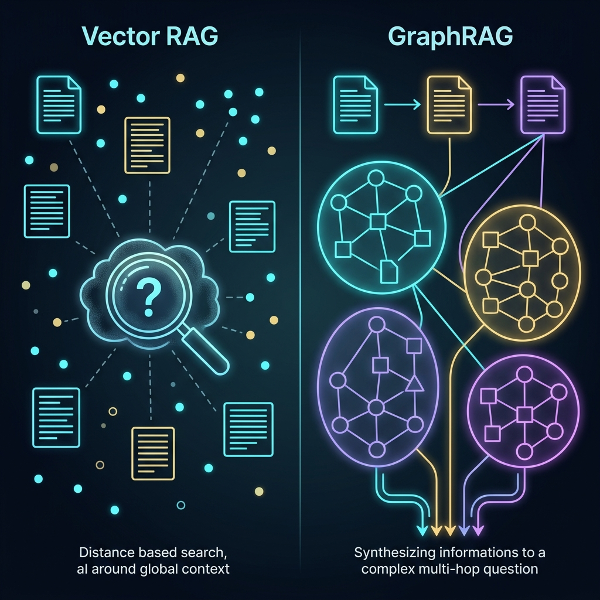

Le haces a tu pipeline RAG tradicional una pregunta aparentemente sencilla:

> *«Analiza los 500 contratos y auditorías de los últimos dos años y dime cuáles son los tres riesgos operativos recurrentes que comparten nuestros proveedores críticos y qué productos terminados se verían paralizados si uno de ellos quiebra».*

Tu base de datos vectorial se activa al instante. Calcula la distancia coseno de la consulta contra cientos de miles de fragmentos de texto (*chunks*), recupera los quince párrafos semánticamente más cercanos y se los inyecta al modelo de lenguaje en el prompt.

El resultado es un desastre predecible: una respuesta genérica, inconexa y superficial. El modelo menciona dos cláusulas aisladas y alucina el resto.

No es culpa del LLM ni de los hiperparámetros del embedding. **Es un fallo intrínseco de la arquitectura vectorial**.

Tras haber analizado los errores más comunes en [RAG: 7 Antipatrones](/es/posts/rag_antipatrones/) y haber defendido la eficiencia pragmática en [PostgreSQL con pgvector vs Vector DBs](/es/posts/pgvector_vs_vectordb/), ha llegado el momento de abordar la frontera técnica más determinante de 2026: **GraphRAG**. Una disciplina pionera que combina los **Grafos de Conocimiento (*Knowledge Graphs*)** con la inteligencia generativa para dotar a los modelos de lo que los vectores jamás podrán ofrecerles: **comprensión estructural y razonamiento relacional multi-salto**.



### La Ceguera Semántica de los Vectores Planos

Para comprender por qué los vectores no son suficientes, debemos recordar cómo funciona el RAG convencional:

Los embeddings proyectan fragmentos de texto en un espacio geométrico multidimensional. Dos textos que tratan sobre temas similares se ubican cerca en ese espacio. Esto convierte a la búsqueda vectorial en una herramienta insuperable para resolver el problema de **«la aguja en el pajar»** (*needle-in-a-haystack*):
* *«¿Cuál es la política de devoluciones para pedidos internacionales?»* ➔ El vector localiza con precisión quirúrgica el párrafo exacto donde se menciona esa política.

Sin embargo, el conocimiento humano y los sistemas industriales rara vez operan como agujas aisladas. Operan como **redes complejas e interdependientes**.

La búsqueda vectorial sufre de dos cegueras estructurales insalvables:

1. **Incapacidad para el razonamiento multi-salto (*Multi-hop Reasoning*)**: Si responder a una pregunta requiere conectar una entidad $A$ con una entidad $B$ a través de un intermediario $C$ que no comparte vocabulario directo con la consulta, el vector nunca recuperará ese puente. Los vectores ven similitud léxica y semántica, pero no entienden relaciones de causalidad ni dependencias jerárquicas.
2. **Incapacidad para la síntesis global (*Global Sensemaking*)**: Preguntas como *«¿Cuáles son los temas principales de este corpus?»* o *«¿Qué patrones anómalos emergen en las quejas de clientes?»* no tienen un único fragmento relevante. Requieren sintetizar el todo, no buscar una parte.

### La Arquitectura de GraphRAG: Cómo Microsoft Rompió el Muro

Popularizado por el equipo de **Microsoft Research** (Darren Edge, Jonathan Larson et al.), GraphRAG transforma por completo el paradigma de ingesta e indexación. En lugar de limitarse a trocear texto en bloques rectangulares ciegos, el sistema ejecuta un pipeline de cuatro fases:

#### 1. Extracción de Entidades y Relaciones
Un LLM procesa los documentos y extrae de forma estructurada todas las entidades relevantes (personas, organizaciones, componentes, tecnologías, regulaciones) y las **relaciones explícitas** que las conectan, generando tuplas semánticas `(Sujeto, Predicado, Objeto)` junto a descripciones textuales detalladas de cada enlace.

#### 2. Construcción del Grafo de Conocimiento
Todas las extracciones se unifican en un grafo relacional homogéneo, resolviendo co-referencias y eliminando duplicados. Los nodos representan entidades y las aristas representan interacciones verificadas en los datos fuente.

#### 3. Detección Jerárquica de Comunidades (Algoritmo de Leiden)
Aquí reside la genialidad de GraphRAG: aplica algoritmos de análisis de redes complejas (como el **algoritmo de Leiden**) para particionar el grafo en **clústeres o comunidades de nodos estrechamente vinculados**.
* En el nivel superior (macro), detecta grandes áreas temáticas.
* En niveles intermedios, agrupa sub-ecosistemas.
* En el nivel inferior (micro), mapea detalles operacionales concretos.

#### 4. Generación Precomputada de Reportes de Comunidad
Para cada comunidad del grafo, un LLM genera un **resumen ejecutivo exhaustivo** (*Community Report*) que sintetiza las dinámicas, riesgos y conclusiones clave de ese grupo de nodos.

Cuando un usuario lanza una consulta global, GraphRAG no busca en millones de palabras dispersas: **consulta en paralelo los resúmenes jerárquicos de las comunidades del grafo**, permitiendo una síntesis conceptual completa del corpus con un consumo de tokens drásticamente optimizado.

### Búsqueda Local vs. Búsqueda Global

Esta arquitectura dual permite a los sistemas de IA responder a dos tipologías de preguntas con una precisión antes inalcanzable:

| Tipo de Búsqueda | Mecánica en GraphRAG | Tipo de Preguntas que Resuelve |
| :--- | :--- | :--- |
| **Búsqueda Local (*Local Search*)** | Navega el subgrafo inmediato de una entidad, recuperando sus vecinos directos, relaciones y fragmentos de texto fuente asociados. | *«¿Qué historial de fallos y proveedores alternativos tiene el componente X?»* |
| **Búsqueda Global (*Global Search*)** | Sintetiza en paralelo los reportes de las comunidades de alto nivel generadas por el algoritmo de Leiden. | *«¿Cuáles son las mayores vulnerabilidades estratégicas detectadas en toda la organización este trimestre?»* |

### El Eslabón Hacia la AGI: De la Memoria Asociativa a los Modelos del Mundo

En nuestro análisis sobre [Alan Turing](/es/posts/alan_turing/) vimos cómo la inteligencia artificial no puede consagrarse como verdadera cognición si se reduce a la mera imitación estadística de palabras contiguas.

Los Grandes Modelos de Lenguaje actuales son prodigios de la **memoria asociativa**, pero carecen de un **modelo estructurado del mundo**. Cuando un modelo alucina, lo hace porque completa probabilidades de tokens sin una red de hechos y restricciones lógicas que actúe como anclaje ontológico.

GraphRAG es un paso de gigante hacia la **Inteligencia Artificial General (AGI)** porque actúa como la corteza asociativa y el hipocampo del sistema:
* **Fusión Simbólica y Conexionista**: Une la flexibilidad y creatividad de las redes neuronales profundas con el rigor auditable, determinista y explicable de la lógica de grafos.
* **Cero Alucinaciones Relacionales**: Si el grafo indica que la pieza $A$ pertenece al subsistema $B$ y este depende del proveedor $C$, el agente de IA navega esa ruta con certeza matemática indiscutible.
* **Trazabilidad Absoluta para Compliance**: Cada afirmación del modelo puede rastrearse directamente hasta las aristas y nodos del grafo, cumpliendo de forma nativa con los estrictos requisitos de explicabilidad y auditoría que impone el [EU AI Act](/es/posts/eu_ai_act/) (Artículo 13).

### Aplicación Industrial: Del Radar de Obsolescencia al Enterprise RAG

En Datalaria conocemos de primera mano el valor de esta convergencia. En la serie del [Radar de Obsolescencia](/es/posts/obs_parte5_radar/), diseñamos un sistema agéntico capaz de auditar listas de materiales industriales (*Bill of Materials*, BOM).

Un árbol de componentes no es un texto plano: es un **grafo acíclico dirigido (DAG)**. Saber si una resistencia obsoleta paraliza la fabricación de un satélite o un vehículo no se resuelve buscando textos por similitud vectorial; se resuelve **recorriendo el grafo desde el componente elemental hasta el conjunto final**.

Al alimentar a los agentes autónomos de [CrewAI](/es/posts/ia_agents_part1/) y los servidores de [MCP](/es/posts/mcp_protocol/) con arquitecturas GraphRAG, la IA deja de ser un simple redactor de respuestas y se convierte en un **motor de diagnóstico operativo** capaz de evaluar impactos en cadena en cuestión de segundos.

### Conclusión

Los vectores nos enseñaron a encontrar información dispersa en el océano digital. Los grafos nos enseñan a **entender cómo esa información se conecta para formar conocimiento**.

El futuro de la inteligencia artificial corporativa no consiste en descartar la búsqueda vectorial, sino en orquestar arquitecturas híbridas donde los vectores aporten la intuición semántica rápida y los grafos de conocimiento aporten la estructura, el contexto y la verdad irrefutable.

Si tu objetivo es construir sistemas de IA generativa que no solo respondan preguntas triviales, sino que razonen sobre la complejidad de tu organización, ha llegado el momento de dar el salto: **deja de tratar tus datos como una nube de puntos ciegos y empieza a tratarlos como el grafo vivo que realmente son**.

---

#### Fuentes de Interés:
* [**Microsoft Research**: Project GraphRAG — Unlocking LLM Discovery on Complex Data](https://www.microsoft.com/en-us/research/project/graphrag/)
* [**arXiv (2024)**: From Local to Global — A Graph RAG Approach to Query-Focused Summarization](https://arxiv.org/abs/2404.16130)
* [**YouTube**: GraphRAG Methods for Optimized LLM Context Windows (Jonathan Larson)](https://www.youtube.com/watch?v=kYJjO1559H4)
* [**GitHub**: Microsoft GraphRAG Official Repository](https://github.com/microsoft/graphrag)
* [**Datalaria**: RAG en Producción — 7 Antipatrones que Destruyen la Precisión](/es/posts/rag_antipatrones/)
* [**Datalaria**: PostgreSQL con pgvector vs Vector DBs Dedicadas](/es/posts/pgvector_vs_vectordb/)
* [**Datalaria**: Alan Turing — El Genio que Preguntó si las Máquinas Podían Pensar](/es/posts/alan_turing/)
* [**Datalaria**: Radar de Obsolescencia con Grafos BOM](/es/posts/obs_parte5_radar/)
* [**Datalaria**: Protocolo MCP — El Estándar de Conexión de la IA](/es/posts/mcp_protocol/)
* [**Datalaria**: EU AI Act — Guía de Gobernanza y Explicabilidad](/es/posts/eu_ai_act/)
