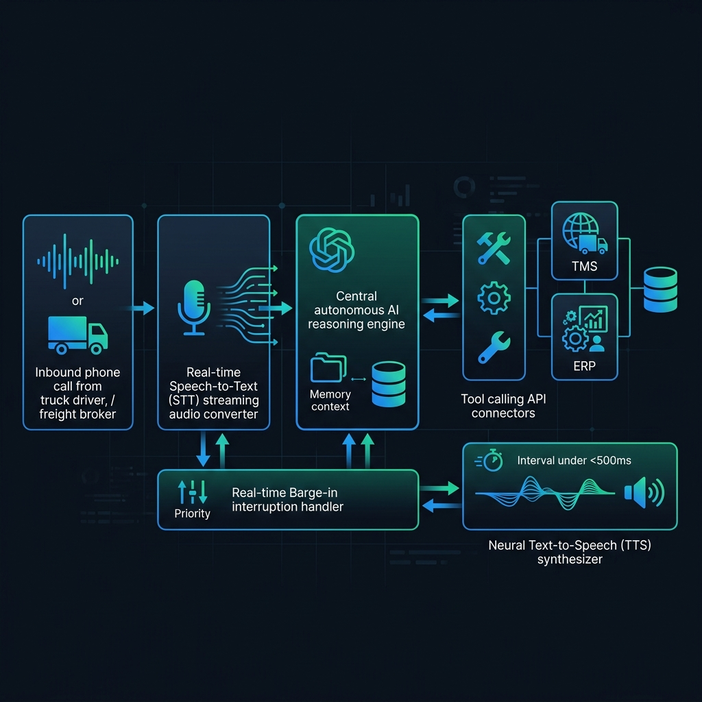

Son las 6:15 de la mañana en una interestatal de Texas. Un camionero autónomo que transporta 20 toneladas de productos refrigerados recibe una llamada telefónica en el manos libres de su cabina.

Al otro lado de la línea, una voz natural, fluida y con tono profesional le pregunta por su posición actual, verifica la temperatura del remolque y confirma si alcanzará la ventana de entrega de las 9:30 en el centro de distribución de Dallas. El camionero responde entre el ruido ensordecedor del motor diésel: comenta con acento tejano que ha encontrado una retención por obras en la I-35 y que probablemente llegará cuarenta minutos tarde.

Sin la más mínima pausa artificial, la voz calcula mentalmente el impacto, le tranquiliza y le asigna una nueva franja en el muelle número 4 para evitar que su mercancía quede bloqueada. La llamada dura exactamente **48 segundos**.

Lo extraordinario es que al otro lado de la línea no había ningún despachador humano. **Era un agente de voz autónomo de HappyRobot**.

Mientras el camionero colgaba el teléfono, el agente había transcrito el audio, procesado la interrupción en tiempo real, ejecutado dos llamadas a la API del sistema de gestión de transporte (*Transportation Management System*, TMS) de la compañía logística, actualizado el ERP en SAP y enviado una alerta automática por SMS al supervisor del almacén.

Tras haber analizado los casos de éxito de [Wallapop](/es/posts/wallapop/) en el marketplace circular, [Devo](/es/posts/devo/) en la ingesta masiva de datos, [Clarity AI](/es/posts/clarity_ai/) en la analítica ESG y [Nextail](/es/posts/nextail/) en la optimización del retail, este artículo examina la trayectoria fulgurante de **HappyRobot**: la startup que ha transformado la llamada telefónica —el eslabón más analógico, caótico y resistente a la digitalización del comercio global— en un **imperio de inteligencia artificial valorado en 1.200 millones de dólares**.



### El Origen: De las Aulas de Munich a Y Combinator

La industria logística mueve más del 10% del PIB mundial, pero su operativa cotidiana sigue funcionando sobre una infraestructura sorprendentemente arcaica: **la llamada telefónica**. Cada día, cientos de miles de agentes de operaciones en empresas de transporte pasan entre 6 y 8 horas al teléfono realizando tareas repetitivas de baja densidad cognitiva: *check calls* para saber dónde está un camión, negociación de tarifas de flete, reprogramación de citas en muelles y cobro de facturas.

Durante años, las empresas de software intentaron digitalizar el sector mediante portales web y aplicaciones móviles. Fracasaron en gran medida por una razón elemental: **un transportista que conduce un camión de 40 toneladas no puede rellenar formularios en una pantalla; necesita hablar**.

Los fundadores de HappyRobot entendieron este dolor desde los primeros principios de la ingeniería:
* **Pablo Palafox (CEO)**: Graduado en Robótica y Electrónica, Máster en Ingeniería Mecánica por la Universidad Técnica de Munich (TUM) y doctorando en visión artificial 3D en uno de los laboratorios punteros de Alemania.
* **Javier Palafox (COO)**: Hermano de Pablo, con formación económica y experiencia en operaciones y finanzas.
* **Luis Paarup (CTO)**: Compañero inseparable de Pablo desde su segundo día de carrera universitaria y también graduado de máster en la TUM.

Reunidos en 2022, el equipo comprendió que la eclosión de los Grandes Modelos de Lenguaje (LLMs) abría una oportunidad histórica: construir un sistema operativo nativo de IA capaz de escuchar, razonar y actuar en la economía real.

Con esta tesis radicalmente vertical, la compañía fue seleccionada por la prestigiosa aceleradora **Y Combinator para su promoción de verano de 2023 (YC S23)**, trasladando su sede a San Francisco y captando de inmediato la atención del ecosistema inversor internacional.

### Rondas de Financiación y el Salto a Unicornio (1.200M$)

El crecimiento de HappyRobot en los últimos tres años ha seguido una trayectoria geométrica, respaldada por los fondos de capital riesgo más exigentes de Silicon Valley y Europa:

* **Fase Seed y YC (2023)**: Entrada de fondos de capital semilla de referencia como **Andreessen Horowitz (a16z)** y el fondo hispano **Samaipata**, permitiendo a la empresa validar los primeros pilotos en operadores de carga estadounidenses.
* **Serie A y B (2024–2025)**: Rondas consecutivas que sumaron más de **44 millones de dólares** (cubiertas por medios como *Reuters* y *The Information*), destinadas a expandir la plantilla de ingenieros e integrar el producto con los principales proveedores de TMS de Norteamérica (McLeod, MercuryGate, Descartes).
* **Serie C y Estatus de Unicornio (2026)**: En agosto de 2026, la compañía anunció una ronda Serie C de **150 millones de dólares** liderada por **Prysm Capital** y coliderada por **Eurazeo**, alcanzando una valoración oficial de **1.200 millones de dólares** y consagrando a HappyRobot como uno de los unicornios tecnológicos de origen español más rápidos de la década (hito recogido en portada por la revista *Fortune*).

Una de las claves maestras de esta expansión fue su adopción del modelo de **Forward Deployed Engineers (FDE)**, popularizado originalmente por Palantir: en lugar de vender software como un producto empaquetado y desatendido, HappyRobot despliega a sus propios ingenieros de software directamente en los centros de operaciones de sus clientes para modelar los flujos conversacionales y las reglas de negocio sobre el terreno.

### La Arquitectura Técnica de Voice AI en Tiempo Real

Construir un agente de voz para llamadas telefónicas corporativas es un desafío de ingeniería infinitamente más complejo que desplegar un chatbot de texto o una aplicación web tradicional. HappyRobot estructura su plataforma en seis capas críticas de sincronización:

#### 1. Ingesta Telefónica y Latencia Sub-500ms
En una conversación humana natural, una pausa superior a **600 milisegundos** genera incomodidad y hace que ambos interlocutores comiencen a hablar a la vez. En las redes telefónicas tradicionales (SIP/VoIP), la latencia de ida y vuelta ya consume entre 150 y 200 ms.

HappyRobot optimizó su pipeline extremo a extremo para responder en **menos de 450 milisegundos**:
$$\text{Latencia Total} = T_{\text{Audio In}} + T_{\text{STT Stream}} + T_{\text{LLM First Token}} + T_{\text{TTS Stream}} + T_{\text{Audio Out}} < 500\,\text{ms}$$
Para lograrlo, no esperan a que el usuario termine una frase completa para procesarla: utilizan modelos de **Speech-to-Text (STT) en streaming** continuo que predicen la intención semántica mientras las ondas de audio aún están entrando por el canal de voz.

#### 2. Detección de Interrupciones en Tiempo Real (*Barge-In*)
En las operaciones de transporte, los camioneros interrumpen con frecuencia (*«Espera, no, me he equivocado de salida»*). Si el bot sigue reproduciendo audio mientras el usuario habla, la experiencia se desmorona.

El motor de HappyRobot implementa clasificadores locales de baja latencia que detectan si el sonido entrante es una palabra humana relevante o simplemente ruido de fondo de la cabina (baches, frenazos o música de radio). Si es voz humana, el sistema corta la emisión del audio de forma instantánea (**barge-in determinista**) y recalibra el prompt del LLM con el nuevo contexto.

#### 3. Orquestación y Tool Calling Bidireccional
El modelo de lenguaje no es un simple generador de texto conversacional: es un motor de decisión que opera con llamadas a herramientas (*Tool Calling*), en directa sintonía con las arquitecturas agénticas que analizamos en la [serie Autopilot](/es/posts/ia_agents_part1/) y el protocolo [MCP](/es/posts/mcp_protocol/).

Durante una llamada de 60 segundos, el agente puede consultar en tiempo real el inventario en el ERP, contrastar la política de precios de flete, comprobar las restricciones de horario de un almacén y registrar el resultado de la llamada en la base de datos sin requerir ninguna intervención humana posterior.

#### 4. Modelado de Contexto y Jerga Sectorial
El sector del transporte utiliza una jerga densa y siglas crípticas (*dry van*, *reefer*, *deadhead miles*, *detention pay*, *BOL*). Los modelos estándar de OpenAI o Anthropic fallan sistemáticamente al transcribir estos términos bajo acentos cerrados. HappyRobot entrena capas de adaptación de dominio (*LoRA adapters*) sobre sus modelos de STT y LLM para garantizar una precisión de reconocimiento superior al **98,5%** en entornos acústicamente hostiles.

---

### Situación Actual: Clientes y Expansión Más Allá del Flete

Hoy, HappyRobot cuenta con más de **80 empleados** y da servicio a más de **150 grandes corporaciones logísticas y multinacionales**, gestionando millones de llamadas autónomas al mes. Entre sus clientes de referencia destacan:
* **DHL Supply Chain**: Automatización de confirmación de entregas y citas de muelles a nivel global.
* **Schneider & Werner Enterprises**: Dos de las mayores flotas de camiones de Estados Unidos, que gestionan su seguimiento de cargas de forma desatendida.
* **Uber Freight & Kuehne+Nagel**: Despliegue de agentes autónomos para la negociación de tarifas y cobertura de rutas de última hora.

Aunque su bastión inicial ha sido la logística, la ronda Serie C de 2026 financia su expansión horizontal hacia otros siete sectores de la economía real con alta densidad de llamadas operativas: **aerolíneas, compañías eléctricas (*utilities*), seguros, servicios financieros, telecomunicaciones y manufactura**.

---

### Cuadro Comparativo: Startups Tecnológicas Analizadas en Datalaria

Con la incorporación de HappyRobot, el catálogo de innovación tecnológica de origen español analizado en Datalaria consolida una panorámica excepcional de la ingeniería de datos contemporánea:

| Compañía | Fundación / Sede | Dominio Tecnológico Clave | Modelo de Negocio | Hito Corporativo Destacado |
| :--- | :---: | :--- | :--- | :--- |
| **Devo** | 2011 / Madrid–Boston | Ingesta masiva de logs en tiempo real y ciberseguridad | B2B SaaS Enterprise / SIEM | Unicornio (valoración >1.500M$) |
| **Flywire** | 2011 / Valencia–Boston | Pasarelas de pago transfronterizas complejas con ML | B2B2C Fintech | Salida a bolsa en NASDAQ ($FLYW) |
| **Carto** | 2012 / Madrid–NY | Inteligencia geoespacial (Location Intelligence) y Spatial SQL | B2B Cloud Data Analytics | Líder mundial en analítica espacial |
| **Clarity AI** | 2017 / Madrid–NY | Scoring ESG y analítica de sostenibilidad con IA | B2B SaaS Fintech | Alianzas con BlackRock y BNP Paribas |
| **Nextail** | 2014 / Madrid | Optimización de inventario retail con analítica prescriptiva | B2B SaaS Retail / Supply Chain | Despliegue en retailers de 30+ países |
| **Freepik** | 2010 / Málaga | Banco de recursos creativos y modelos fundacionales GenAI | B2C/B2B Freemium / GenAI | Adquisición por el fondo EQT |
| **Multiverse Computing** | 2019 / San Sebastián | Redes tensoriales cuánticas para compresión de LLMs | B2B Deep Tech Cuántica | Líder europeo en software cuántico |
| **Wallapop** | 2013 / Barcelona | Visión artificial, grafos antifraude y economía circular | C2C/B2C Marketplace | Adquisición mayoritaria por NAVER (>800M€) |
| **HappyRobot** | 2022 / SF–Madrid | **Agentes de voz autónomos en tiempo real y automatización operativa** | **B2B SaaS Enterprise / Voice AI** | **Unicornio (valoración 1.200M$, Serie C)** |

---

### 5 Lecciones de Producto e Ingeniería de HappyRobot

El éxito de HappyRobot encierra valiosas directrices para fundadores, ingenieros de software y arquitectos de soluciones de IA:

#### 1. Automatiza donde está el dolor real, no donde es cómodo para el código
Muchos equipos de IA crean herramientas de chat porque son sencillas de programar con APIs estándar. HappyRobot triunfó porque atacó el canal más difícil y temido por los ingenieros: la voz telefónica con latencias milimétricas y ruido acústico. Quien resuelve el canal más difícil se queda con el mercado.

#### 2. La latencia es una característica troncal del producto (*Latency as a Feature*)
En los sistemas conversacionales de voz, un retraso de medio segundo arruina por completo la ilusión de naturalidad. Tratar la latencia no como una optimización secundaria, sino como el requisito de arquitectura número uno desde el día cero, fue lo que permitió a HappyRobot desplazar a competidores generalistas.

#### 3. El modelo de 'Forward Deployed Engineering' vence al laboratorio
Los mejores modelos de IA fracasan si no comprenden los flujos de trabajo reales del cliente. Enviar ingenieros a los muelles de carga para escuchar cómo hablan los camioneros y cómo operan los despachadores construyó un foso defensivo (*moat*) que ningún competidor de Silicon Valley pudo replicar a distancia.

#### 4. Conéctate a los sistemas heredados (*Legacy-First*)
En la economía real, nadie va a sustituir su sistema SAP o su TMS de hace quince años para usar tu IA. El valor de un agente autónomo reside en su capacidad para interoperar de forma transparente con bases de datos y APIs legadas sin fricción para el cliente.

#### 5. Diseña para la excepción, no para el camino feliz (*Happy Path*)
En logística, el 80% de las llamadas ocurren cuando algo ha salido mal (retrasos, averías, direcciones incorrectas). Un agente de IA que solo funciona en condiciones ideales es inútil; la robustez radica en cómo el sistema gestiona la ambigüedad, el conflicto y la escalada a un supervisor humano cuando es estrictamente necesario.

---

### Conclusión

HappyRobot es la constatación definitiva de que la Inteligencia Artificial de mayor impacto no es la que genera imágenes artísticas o redacta ensayos académicos, sino la que **resuelve los cuellos de botella invisibles de la economía física**.

Al devolver la voz a la vanguardia de la automatización digital, Pablo Palafox, Javier Palafox y Luis Paarup han demostrado que los agentes de IA no están aquí para reemplazar la actividad humana con interfaces frías, sino para liberar a los trabajadores de millones de horas de fricción mecánica y tedio burocrático.

Su viaje desde las aulas de Munich y el programa de Y Combinator hasta alcanzar la cúspide de los 1.200 millones de dólares de valoración consolida un nuevo referente en el cuadro de honor de la tecnología global.

---

#### Fuentes de Interés:
* [**HappyRobot**: Newsroom y Portal Oficial de la Compañía](https://www.happyrobot.ai/press)
* [**Fortune**: HappyRobot is worth $1.2 billion. Its founder says it’s just ‘getting started’](https://fortune.com/2026/08/04/happyrobot-worth-1-2-billion-founder-says-just-getting-started/)
* [**YouTube**: How HappyRobot Automates Transactional Freight Calls](https://www.youtube.com/watch?v=bzFrrSNleVA)
* [**Y Combinator**: HappyRobot Company Profile (YC S23)](https://www.ycombinator.com/companies/happyrobot)
* [**Reuters**: HappyRobot raises funding to expand AI agents for freight operators](https://www.reuters.com/technology/happyrobot-raises-44-million-expand-ai-agents-freight-operators-2025-09-03/)
* [**Datalaria**: Wallapop — La Ingeniería Invisible detrás del Mayor Marketplace Circular](/es/posts/wallapop/)
* [**Datalaria**: Devo — Ingesta Masiva de Datos y Analítica en Tiempo Real](/es/posts/devo/)
* [**Datalaria**: Clarity AI — La Revolución de la Sostenibilidad y el Scoring ESG](/es/posts/clarity_ai/)
* [**Datalaria**: Nextail — Analítica Prescriptiva y Optimización de Retail](/es/posts/nextail/)
* [**Datalaria**: Serie Autopilot — Orquestación de Agentes Autónomos](/es/posts/ia_agents_part1/)
* [**Datalaria**: Protocolo MCP — El Estándar de Integración de la IA](/es/posts/mcp_protocol/)
