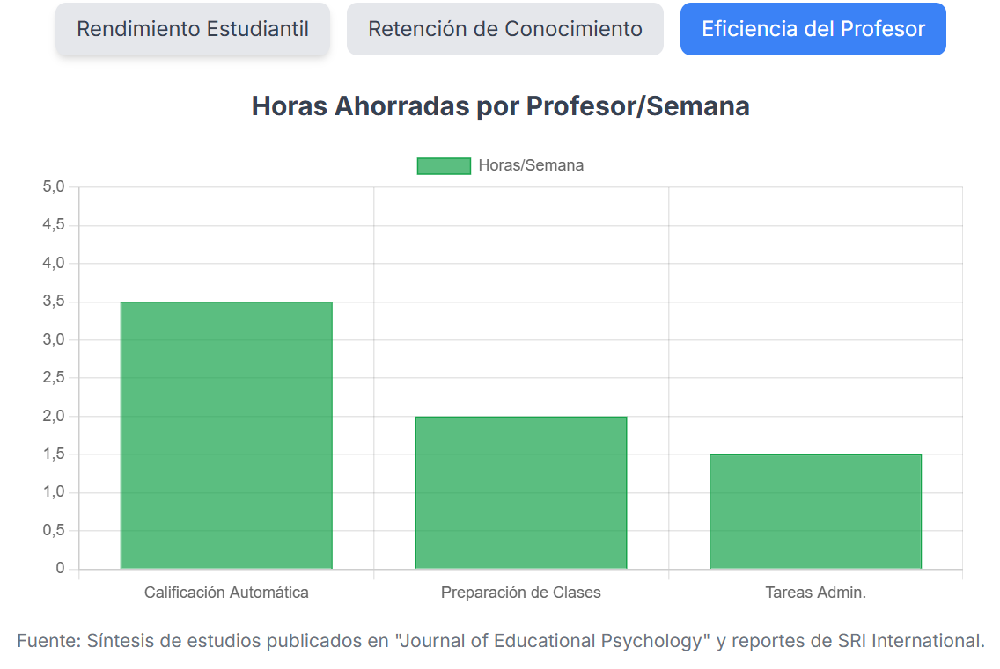

La investigación profunda es la base del conocimiento, pero seamos sinceros: es un proceso arduo y que requiere mucha dedicación y trabajo. Recopilar docenas de fuentes, sintetizar datos contradictorios y estructurar una narrativa coherente puede llevar semanas, si no meses. ¿Y si pudiéramos acelerar ese proceso de semanas a minutos?

Esa es la promesa de la funcionalidad **Deep Research de Gemini**, una herramienta que he puesto a prueba para crear un informe exhaustivo sobre uno de los temas más candentes de nuestro tiempo: **el impacto de la Inteligencia Artificial en la Educación**.

Este post no es solo sobre los fascinantes hallazgos de esa investigación, sino también sobre el propio proceso. Es la crónica de cómo una simple pregunta a la IA puede generar un análisis de calidad académica, y cómo podemos transformar esa densa información en una historia accesible para todos.

### El Punto de Partida: Una Pregunta a Gemini

Todo comenzó con una conversación entre amigos sobre como nos imaginábamos la educación de esta generación y las próximas teniendo en cuenta el impacto de la Inteligencia Artificial que lo está cambiando todo. Para dotar de más profundidad y detalle a nuestras reflexiones, lanzamos una simple petición a Gemini con su opción de **Deep Research** a ver que es lo que pasaba, le preguntamos simplemente "Investiga sobre el impacto de la IA en la educación a nivel global". La herramienta se puso a trabajar, analizando y sintetizando información de multitud de fuentes para generar un informe completo y estructurado durante unos 5-10 minutos... y este fue el resultado de su trabajo: [Investigación sobre el impacto de la IA en la educación de Deep Research](IA_en_Educación_InformeGlobal.docx)

Lo que sigue a continuación son los hallazgos más reveladores de ese análisis, un conocimiento que ahora podemos explorar en una fracción del tiempo que habría llevado tradicionalmente manteniendo un altísimo nivel de calidad en su contenido.

### El Panorama Global: Un Mercado Explosivo Chocando con la Ética

Para empezar, hablemos de dinero. El mercado de la IA en la educación está en plena ebullición, con proyecciones que superan los **32 mil millones de dólares para 2030**, impulsado por una demanda insaciable de aprendizaje personalizado.

Sin embargo, esta expansión vertiginosa choca con la visión de organismos como la **UNESCO**, que abogan por un enfoque centrado en el ser humano y la ética. El problema es que la tecnología se mueve mucho más rápido que las políticas y las regulaciones. Una encuesta de 2023 reveló un dato alarmante: **solo el 10% de las escuelas y universidades a nivel mundial tienen un marco oficial para el uso de la IA**. Esto crea un "abismo entre la política y la práctica", donde los riesgos no se están abordando en el su uso del día a día.

Si quieres una visión general y rápida de este complejo panorama, he utilizado NotebookLM (recordando lo aprendido en [Post de NotebookLM en Datalaria](https://datalaria.com/es/posts/notebooklm-sql/)) para generar un **vídeo resumen** con los puntos clave de este informe que puedes ver aquí: [Vídeo Resumen del Informe sobre IA en Educación](https://notebooklm.google.com/notebook/86d7a334-5bee-4b40-8932-4c42eeb1707d?artifactId=900393d9-67e7-4715-9813-9ddc0614a45a).

### La Carrera Mundial por la IA Educativa: 4 Países, 4 Estrategias

La forma en que cada país adopta la IA en sus aulas es un reflejo de sus valores y ambiciones geopolíticas. El aula se ha convertido en un nuevo escenario para la competencia global.

* **China:** Su estrategia es centralizada y obligatoria. A partir de 2025, la educación en IA será **obligatoria para todos los estudiantes de primaria y secundaria**. El currículo es sistemático, diferenciado por edad y establece un mínimo de ocho horas de instrucción en IA al año. Los alumnos de primaria se centran en el aprendizaje experiencial con robótica, mientras que los de secundaria abordan proyectos avanzados y algoritmos.

* **Singapur:** Integra la IA como parte de su "Plan Maestro de EdTech 2030", con un enfoque sistémico y una fuerte inversión en I+D. La estrategia se centra en la plataforma nacional *Student Learning Space (SLS)*, que se está mejorando con herramientas de IA accesibles para todos los estudiantes. Ya se están implementando programas piloto, como un Sistema de Aprendizaje Adaptativo para matemáticas que ofrece recomendaciones personalizadas en 33 escuelas desde 2023.

* **Finlandia:** Fiel a sus valores nórdicos, basa su estrategia en la **ética y la privacidad de datos**. Su piedra angular es la formación de docentes y la alfabetización en IA para todos los ciudadanos. Una de sus iniciativas más reconocidas es el curso gratuito y mundialmente famoso "Elements of AI" de la Universidad de Helsinki. Además, su enfoque en la ética es tan profundo que llegan a exigir revisiones éticas para el uso de herramientas como ChatGPT en el aula.

* **Estados Unidos:** Con una estructura federal, carece de un mandato único. El enfoque se basa en incentivos y asociaciones público-privadas, creando un mosaico de políticas diversas. Esto se materializa en iniciativas como el "Desafío Presidencial de IA", que anima a los estudiantes a usar la IA para resolver problemas comunitarios. Esta descentralización también genera reacciones dispares, como cuando grandes distritos escolares (Nueva York, Los Ángeles) prohibieron inicialmente ChatGPT para luego revertir su decisión.

### Pero, ¿Funciona Realmente? La Evidencia Científica

Más allá del dinero y las políticas, ¿mejora la IA el aprendizaje? La ciencia dice que sí, y de forma contundente.

Un metaanálisis de 2025 encontró un **impacto positivo muy grande de la IA en los resultados educativos** (con un tamaño del efecto Hedges' g de 0.86). Pero, ¿qué significa exactamente ese número? El **[Hedges' g](https-www-scribbr-es/estadisticas/tamano-del-efecto/)** es una medida estadística que nos indica la magnitud o la fuerza de un efecto; en este caso, cuánto mejora el aprendizaje gracias a la intervención de la IA. Para ponerlo en perspectiva, en la investigación social un valor de 0.2 se considera un efecto pequeño, 0.5 uno mediano y cualquier valor por encima de 0.8, como en este caso, se considera un efecto grande. En investigación educativa, un efecto de esta magnitud es una evidencia muy sólida.

Sin embargo, el impacto es directamente proporcional a su capacidad para facilitar un aprendizaje activo y personalizado. Los **chatbots y la IA generativa** muestran el impacto más sustancial, mientras que plataformas más pasivas tienen un efecto más modesto.

### El Futuro del Profesor: ¿Reemplazado o Reimaginado?

Una de las mayores ansiedades es si la IA reemplazará a los profesores. El consenso de la investigación es un rotundo no. Sin embargo, su papel se está redefiniendo fundamentalmente, pasando de ser el "sabio en el escenario" al **"guía al lado"**. Con la IA encargándose de tareas como la calificación (donde puede ahorrar hasta un 90% del tiempo) o la planificación de lecciones, los profesores tendrán más tiempo para centrarse en los aspectos únicamente humanos de la educación, que la IA no puede replicar.

Este nuevo rol se desglosa en varias facetas clave:

* **Facilitadores del Aprendizaje:** En lugar de ser la principal fuente de información, guiarán a los estudiantes a través de experiencias de aprendizaje complejas, ayudándoles a plantear las preguntas correctas y a navegar críticamente por el contenido que la IA proporciona.
* **Curadores de Contenido:** Se encargarán de seleccionar, evaluar y adaptar el material generado por la IA para asegurar que se alinee con los objetivos pedagógicos y las necesidades específicas de sus alumnos.
* **Mentores de Habilidades Socioemocionales:** Al liberarse de tareas administrativas, podrán dedicar más tiempo a fomentar la empatía, la colaboración, el pensamiento crítico y la creatividad, competencias esenciales que la IA no puede enseñar.
* **Diseñadores de Rutas de Aprendizaje:** Colaborarán con los estudiantes para trazar trayectorias educativas personalizadas que se ajusten a sus fortalezas, intereses y aspiraciones profesionales.

Esta transformación, sin embargo, presenta un desafío inmenso: la **brecha en la formación de los propios educadores**. El informe identifica esta carencia como el mayor cuello de botella para una integración efectiva de la IA, ya que sin una formación adecuada, los profesores no pueden integrar estas herramientas de manera responsable ni enseñar a sus alumnos a usarlas de forma crítica.

### Los Desafíos Críticos: Sesgo, Privacidad y Nuestro Propio Cerebro

El camino hacia la integración de la IA no está exento de peligros que requieren una gestión proactiva.

* **Sesgo Algorítmico:** Los sistemas de IA entrenados con datos sesgados pueden amplificar la discriminación. Por ejemplo, se ha demostrado que los detectores de IA están **sesgados en contra de los hablantes no nativos de inglés**.
* **Privacidad de los Datos:** La confianza del público es baja: casi el **70% de los padres se oponen a que la IA acceda a los datos de sus hijos**.
* **"Descapacitación" Cognitiva:** Quizás el riesgo más sutil. La dependencia excesiva de la IA podría erosionar el pensamiento crítico. Un estudio del MIT encontró que los estudiantes que usaban ChatGPT para escribir ensayos mostraban una **menor participación cerebral y un recuerdo más débil**, sugiriendo que se estaban eludiendo los procesos cognitivos profundos.

### Conclusiones Finales: Un Camino a Seguir Basado en la Evidencia

Tras analizar el panorama completo, desde el mercado hasta el aula, la investigación científica converge en una serie de hallazgos clave que nos marcan el camino a seguir.

#### Síntesis de la Investigación

El consenso científico es claro: la integración de la Inteligencia Artificial en la educación, cuando se implementa de forma reflexiva, tiene un **fuerte y significativo impacto positivo** en los resultados del aprendizaje y la motivación de los estudiantes. Sin embargo, este enorme potencial está equilibrado por riesgos igualmente significativos que requieren una gestión proactiva, como el sesgo algorítmico, la privacidad de los datos y la equidad en el acceso. Tanto estudiantes como profesores reconocen los beneficios de la IA, pero expresan una profunda preocupación por la posible erosión del pensamiento crítico, la integridad académica y su propia falta de formación para integrar estas herramientas de manera efectiva y ética.

#### Recomendaciones Estratégicas

Basado en la evidencia, el informe concluye con un llamado a la acción a tres niveles para una implementación responsable. Los **legisladores** deben desarrollar marcos éticos y legales claros, además de invertir en cerrar la brecha digital para evitar un sistema educativo de dos niveles. Las **instituciones educativas** tienen la tarea de establecer políticas de uso transparente, priorizar la alfabetización en IA para toda la comunidad y asegurar que siempre haya un "humano en el circuito" en las decisiones de alto riesgo. Finalmente, los **educadores** deben abrazar su nuevo rol como facilitadores, modelando un uso crítico de la IA y centrando su labor en fomentar las habilidades que las máquinas no pueden replicar.

### La Revolución de la Investigación y los Próximos Pasos

Este post es, en esencia, explora y resume la información de la investigación realizada por la IA Deep Research en Gemini. La experiencia demuestra el poder de herramientas como "Deep Research" para democratizar el acceso al conocimiento profundo.

Lo más interesante es que, una vez finalizada la investigación, la propia herramienta te ofrece los siguientes pasos para transformar los hallazgos en otros formatos, sugiriendo acciones como:
* **Crear una página web** con la información.
* Generar un **informe ejecutivo**.
* Producir un **resumen de audio** o podcast.
* Elaborar un **cuestionario** para evaluar la comprensión.

La IA no solo investiga por ti, sino que te ayuda a comunicar los resultados. El desafío, como siempre, no es tecnológico, sino pedagógico y humano: aprovechar estas herramientas para aumentar nuestra inteligencia sin disminuir nuestra humanidad.

#### Fuentes y Recursos:
* **Gemini**: [Página de Gemini para uso de chatbot con la opción de investigaciones seleccionando Deep Research](https://gemini.google.com/app?hl=es)