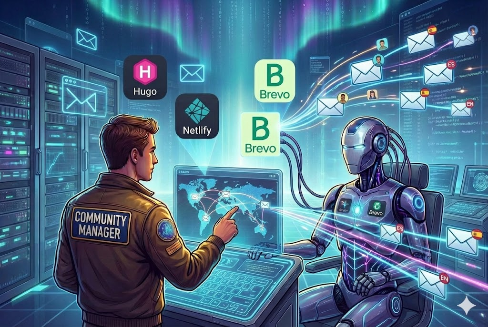
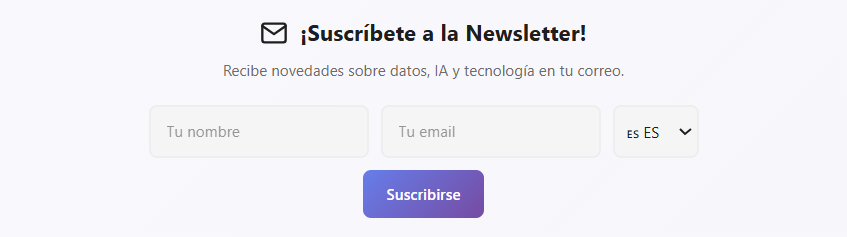

Pensaba que el Autopilot estaba completo. Twitter, LinkedIn, Dev.to... todo automatizado con un simple `git push`. Pero me faltaba algo importante: **una conexión directa con los lectores**.

Las redes sociales son geniales para el alcance, pero los algoritmos deciden quién ve mi contenido. Con una **newsletter**, yo tengo el control. El email llega directamente a la bandeja de entrada de quien realmente quiere leerme.

Así que me puse manos a la obra para añadir esta nueva pieza al puzzle.



## El Objetivo

Quería un sistema que cumpliera estos requisitos:

1. **Formulario elegante** integrado en el footer de todas las páginas
2. **Bilingüe**: que funcione perfectamente en español e inglés
3. **Segmentación por idioma**: cada suscriptor elige su idioma preferido
4. **Automatización total**: cuando publico un post, se envía la newsletter automáticamente
5. **Contenido personalizado**: emails con el nombre del suscriptor y texto generado por IA

## Eligiendo la Plataforma: Brevo

Después de evaluar opciones como Mailchimp, ConvertKit y Sendinblue (ahora Brevo), me decidí por **Brevo** por varias razones:

- **API gratuita** para volúmenes pequeños (300 emails/día)
- **Personalización avanzada** con variables en el contenido
- **Listas y segmentación** para gestionar idiomas
- **Integración sencilla** con Netlify Functions
- **Cumplimiento GDPR (General Data Protection Regulation)** Sede en Francia y cumplimiento GDPR nativo.

## Arquitectura de la Solución

El sistema tiene tres componentes principales:


%%{init: {'theme': 'base', 'themeVariables': { 'primaryColor': '#f0f4f8', 'edgeLabelBackground':'#ffffff', 'tertiaryColor': '#e6e6e6'}}}%%
flowchart LR
    subgraph Frontend["🌐 Frontend (Hugo + Netlify)"]
        FORM[Formulario en Footer]
        FUNC[Netlify Function]
    end
    
    subgraph Backend["🤖 Backend (Autopilot)"]
        ORC[Orchestrator]
        BRAIN[Agente IA Newsletter]
        MGR[Newsletter Manager]
    end
    
    subgraph Brevo["📧 Brevo"]
        LIST_ES[Lista ES #3]
        LIST_EN[Lista EN #4]
        CAMP[Campañas]
    end
    
    FORM -->|"POST + idioma"| FUNC
    FUNC -->|"API Contacts"| LIST_ES
    FUNC -->|"API Contacts"| LIST_EN
    
    ORC -->|"Nuevo post"| BRAIN
    BRAIN -->|"Contenido IA"| MGR
    MGR -->|"API Campaigns"| CAMP
    CAMP -->|"Email ES"| LIST_ES
    CAMP -->|"Email EN"| LIST_EN


## Parte 1: El Formulario de Suscripción

### Diseño del Footer

El formulario vive en `layouts/partials/extend_footer.html`, un partial de Hugo que se inyecta automáticamente en toda la web. Lo diseñé para que se adapte al idioma de la página:

```html
{{- $isSpanish := eq .Site.Language.Lang "es" -}}
{{- $title := cond $isSpanish "¡Suscríbete a la Newsletter!" "Subscribe to the Newsletter!" -}}

<div class="newsletter-section">
    <div class="newsletter-container">
        <h3 class="newsletter-title">{{ $title }}</h3>
        <form id="newsletter-form" class="newsletter-form">
            <div class="newsletter-inputs">
                <input type="text" id="newsletter-name" placeholder="{{ $namePlaceholder }}" required />
                <input type="email" id="newsletter-email" placeholder="{{ $emailPlaceholder }}" required />
                <select id="newsletter-lang" name="language" class="newsletter-select">
                    <option value="es" {{ if $isSpanish }}selected{{ end }}>🇪🇸 ES</option>
                    <option value="en" {{ if not $isSpanish }}selected{{ end }}>🇬🇧 EN</option>
                </select>
                <button type="submit" class="newsletter-btn">{{ $buttonText }}</button>
            </div>
        </form>
    </div>
</div>
```

El selector de idioma es clave: **por defecto toma el idioma de la página**, pero el usuario puede cambiarlo si prefiere recibir los emails en otro idioma.



### Netlify Function: El Puente con Brevo

El formulario envía los datos a una Netlify Function que se encarga de comunicarse con la API de Brevo:

```javascript
// netlify/functions/subscribe.js
const { email, name, language } = JSON.parse(event.body);

// Separar nombre y apellido
const nameParts = (name || '').trim().split(' ');
const firstName = nameParts[0] || '';
const lastName = nameParts.slice(1).join(' ') || '';

// Seleccionar lista según idioma
const listId = language === 'es' ? 3 : 4;

// Crear contacto en Brevo
const response = await fetch('https://api.brevo.com/v3/contacts', {
  method: 'POST',
  headers: {
    'api-key': process.env.BREVO_API_KEY
  },
  body: JSON.stringify({
    email: email,
    attributes: {
      FIRSTNAME: firstName,
      LASTNAME: lastName,
      LANGUAGE: language
    },
    listIds: [listId],
    updateEnabled: true
  })
});
```

Lo más importante aquí es la **segmentación por idioma**:
- Los suscriptores que eligen **ES** van a la Lista #3
- Los que eligen **EN** van a la Lista #4

## Parte 2: El Agente de Newsletter

Para el contenido del email, creé un nuevo "Agente" en el sistema de IA del Autopilot. Este agente tiene una personalidad diferente a los de Twitter o LinkedIn:

```python
# brain.py - Agente Newsletter
sys_instruction = (
    "Estás escribiendo un email personal a un amigo que ama la tecnología.\n"
    "Tono: Cálido, personal, emocionado por compartir algo interesante.\n"
    "Estructura:\n"
    "1. GANCHO: Una frase atractiva sobre por qué este tema te llamó la atención.\n"
    "2. CONTEXTO: Breve explicación del problema o situación.\n"
    "3. VALOR: El insight clave del artículo.\n"
    "4. ADELANTO: Un detalle que les haga querer hacer clic.\n"
    "Reglas:\n"
    "- Escribe 3-4 párrafos CORTOS.\n"
    "- CRÍTICO: Usa DOBLE SALTO DE LÍNEA entre párrafos.\n"
    "- Usa 2-3 emoticonos sutiles (🔍, 💡, 🎯).\n"
    "- NO incluyas saludo ni firma (se añaden automáticamente)."
)
```

La diferencia clave con los agentes de redes sociales es el **tono personal**. Un email es una conversación uno a uno, no un post para las masas.

El agente no se limita a traducir. Si el post está en español, el 'cerebro' cambia el contexto para generar un copy culturalmente relevante para la audiencia hispana, en lugar de una simple traducción literal

## Parte 3: El Newsletter Manager

Esta es la pieza que orquesta todo el envío. Se encarga de:

1. **Generar el HTML** del email con diseño profesional
2. **Personalizar el contenido** con el nombre del suscriptor
3. **Crear y enviar la campaña** a la lista correcta

```python
# newsletter_manager.py
class NewsletterManager:
    def __init__(self):
        self.api_key = os.getenv("BREVO_API_KEY")
        self.list_id_es = int(os.getenv("BREVO_LIST_ID_ES", "3"))
        self.list_id_en = int(os.getenv("BREVO_LIST_ID_EN", "4"))
    
    def send_campaign(self, subject, intro_text, post_title, post_url, lang="es"):
        # Seleccionar lista según idioma
        list_id = self.list_id_es if lang == "es" else self.list_id_en
        
        # Generar HTML del email
        html_content = self._build_html_template(intro_text, post_title, post_url, lang)
        
        # Crear campaña en Brevo
        create_payload = {
            "name": f"Newsletter {lang.upper()} - {post_title}",
            "subject": subject,
            "sender": {"name": "Datalaria", "email": "datalaria@gmail.com"},
            "htmlContent": html_content,
            "recipients": {"listIds": [list_id]}
        }
        
        # Enviar inmediatamente
        response = requests.post(f"{self.base_url}/emailCampaigns", json=create_payload)
        campaign_id = response.json().get("id")
        requests.post(f"{self.base_url}/emailCampaigns/{campaign_id}/sendNow")
```

### El Template HTML

El email tiene un diseño limpio con personalización dinámica:

```html
<p style="font-size: 18px;">
    Hola {{ contact.FIRSTNAME | default: 'amigo/a' }},
</p>

<div style="font-size: 16px; line-height: 1.7;">
    {{ contenido_generado_por_ia }}
</div>

<a href="{{ post_url }}" style="background: linear-gradient(135deg, #667eea 0%, #764ba2 100%);">
    👉 Leer artículo completo
</a>
```

La variable `{{ contact.FIRSTNAME }}` es magia de Brevo: automáticamente reemplaza con el nombre de cada suscriptor.

## Parte 4: Integración con el Orquestador

El último paso fue conectar todo esto con el flujo existente del Autopilot:

```python
# orchestrator.py
if enable_newsletter:
    post_lang = post_data['lang']  # 'es' o 'en' según el directorio
    
    # Generar contenido personalizado
    newsletter_text = brain.generate_social_copy(
        post_data['title'], 
        post_data['content'], 
        platform='newsletter', 
        lang=post_lang
    )
    
    # Enviar solo al idioma del post
    newsletter_manager.send_campaign(
        subject=f"🚀 Nuevo en Datalaria: {post_data['title']}",
        intro_text=newsletter_text,
        post_url=post_url,
        lang=post_lang
    )
```

La lógica es simple pero poderosa:
- Si publico un post en `/es/posts/` → se envía a la **Lista ES**
- Si publico en `/en/posts/` → se envía a la **Lista EN**

No hay mezclas ni traducciones automáticas. Cada audiencia recibe contenido en su idioma, sobre posts escritos para ellos.

## El Resultado

Después de toda esta implementación, mi flujo de trabajo quedó así:

1. Escribo un artículo en `/content/es/posts/nuevo-articulo/`
2. Hago `git push`
3. GitHub Actions detecta el cambio
4. El Autopilot:
   - Genera tweets y posts de LinkedIn (como antes)
   - **NUEVO**: Genera contenido de newsletter personalizado
   - Crea una campaña en Brevo
   - Envía el email a todos los suscriptores de la Lista ES

**Email recibido por los suscriptores:**


El email incluye:
- ✅ Saludo personalizado con el nombre
- ✅ Contenido generado por IA con emoticonos sutiles
- ✅ Botón de llamada a la acción con gradiente
- ✅ Logo de Datalaria
- ✅ Enlace para darse de baja

## Configuración en GitHub Actions

Para que todo funcione en producción, añadí las siguientes variables al workflow:

```yaml
# .github/workflows/autopilot.yml
env:
  ENABLE_NEWSLETTER: ${{ vars.ENABLE_NEWSLETTER }}
  BREVO_API_KEY: ${{ secrets.BREVO_API_KEY }}
  BREVO_LIST_ID_ES: ${{ vars.BREVO_LIST_ID_ES }}
  BREVO_LIST_ID_EN: ${{ vars.BREVO_LIST_ID_EN }}
```

## Lecciones Aprendidas

### 1. Brevo no soporta filtros inline
Inicialmente intenté usar `segmentConditions` para filtrar por atributo LANGUAGE directamente en la llamada de la API. No funciona. Brevo requiere **listas predefinidas** o **segmentos guardados**. La solución fue crear dos listas separadas.

### 2. Los saltos de línea importan
El contenido generado por la IA venía como texto plano. Tuve que crear una función `_text_to_html_paragraphs()` que convierte los saltos de línea dobles en etiquetas `<p>` para que el email se renderice correctamente.

### 3. El tono importa más que el contenido
Para la newsletter dediqué tiempo extra a calibrar el prompt del agente IA. A diferencia de Twitter (viral) o LinkedIn (profesional), el email tiene que sonar como **un amigo escribiéndote**. La temperatura del modelo y las instrucciones de formato fueron clave.

## Conclusión

El Autopilot ya no solo publica en redes sociales. Ahora también cultiva una relación directa con los lectores a través del email.

Lo mejor de todo es que el esfuerzo adicional al publicar es **cero**. Todo sigue siendo un simple `git push`. La magia ocurre sola.

¿Y tú? ¿Ya tienes newsletter? Si no la tienes, espero que este post te haya dado ideas para empezar. Y si la tienes... ¿por qué no la automatizas? 😉

---

**¿Te ha gustado este artículo?**

Entonces ya sabes qué hacer: scroll hacia abajo y suscríbete a la newsletter. Prometo no enviarte spam, solo contenido tan interesante como este. 👇
