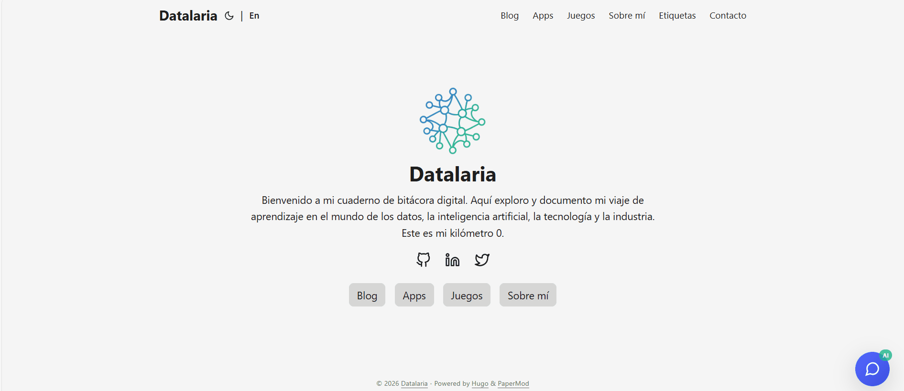

*Esta es una submission para el [Algolia Agent Studio Challenge](https://dev.to/challenges/algolia): Consumer-Facing Conversational Experiences*

## Qué He Construido

**Ops Engineering Copilot** es un widget de chat potenciado por IA que vive en mi blog de Hugo y responde a las preguntas de los visitantes usando IA conversacional fundamentada en mi contenido real.

Pregúntale "¿Qué es Datalaria?" y en lugar de una respuesta genérica, obtienes:

> "Datalaria es un blog técnico enfocado en ingeniería de datos, inteligencia artificial y operaciones de negocio. Como el Ops Engineering Copilot, me especializo en proporcionar consejos accionables y orientados a la ingeniería en cuatro pilares clave: S&OP, Producto, Proyectos y Personas..."

**Esto NO es solo búsqueda** – es un agente conversacional que sintetiza conocimiento de 72 posts indexados para proporcionar respuestas contextuales y útiles.

## Demo



**Demo en vivo:** [datalaria.com](https://datalaria.com)

**Prueba estas preguntas:**
- "¿Qué es el proyecto Autopilot?"
- "¿Cómo detecto outliers en datos de S&OP?"
- "Cuéntame sobre automatización con GitHub Actions"

## La Arquitectura

Este proyecto extiende mi sistema Autopilot existente (documentado en las Partes 1-7) con una nueva capacidad: **búsqueda con IA para consumidores**.


flowchart TB
    subgraph "Pipeline de Contenido"
        Hugo["📝 Blog Hugo<br/>72 Posts Markdown"]
        Sync["🐍 Script de Sincronización<br/>algolia_sync.py"]
        Index["☁️ Índice Algolia<br/>datalaria_posts"]
    end

    subgraph "Algolia Agent Studio"
        Agent["🤖 Ops Engineering Copilot<br/>Agent ID: f27a..."]
        LLM["🧠 Google Gemini<br/>Proveedor LLM"]
        RAG["📚 Pipeline RAG<br/>Recuperación de Contexto"]
    end

    subgraph "Frontend"
        Widget["💬 Widget de Chat<br/>algolia-agent.html"]
        Netlify["⚡ Función Netlify<br/>agent-chat.js"]
    end

    subgraph "Usuario"
        Visitor["👤 Visitante del Blog"]
    end

    Hugo -->|"Extraer y Limpiar"| Sync
    Sync -->|"Subir Registros"| Index
    Index -->|"Proporciona Contexto"| RAG
    RAG -->|"Aumenta Prompt"| LLM
    LLM -->|"Genera Respuesta"| Agent
    
    Visitor -->|"Pregunta"| Widget
    Widget -->|"POST /agent-chat"| Netlify
    Netlify -->|"API de Completions"| Agent
    Agent -->|"Respuesta IA"| Netlify
    Netlify -->|"Mostrar"| Widget

    style Agent fill:#5468ff,color:white
    style LLM fill:#4285f4,color:white
    style Index fill:#5468ff,color:white


### Componentes Clave

| Componente | Tecnología | Propósito |
|-----------|------------|---------|
| Fuente de Contenido | Hugo + Markdown | 72 posts bilingües (EN/ES) |
| Indexación | Python + API Algolia | Extraer, limpiar, clasificar, subir |
| Agente | Algolia Agent Studio | Orquestación RAG + LLM |
| LLM | Google Gemini | Generación de respuestas |
| Proxy | Netlify Functions | Bypass CORS + manejo de errores |
| Widget | Vanilla JS | Interfaz de chat embebida |

## Cómo Usé Algolia Agent Studio

### Paso 1: Indexando la Base de Conocimiento

La base es un script Python que procesa todos los posts de Hugo y los sube a Algolia:

```python
# algolia_sync.py - Lógica de extracción principal
def extract_post_data(filepath: Path, lang: str) -> Optional[Dict]:
    """Extrae y limpia datos del post para indexación en Algolia."""
    post = frontmatter.load(filepath)
    
    # Limpiar markdown a texto plano
    html = markdown.markdown(post.content)
    soup = BeautifulSoup(html, 'html.parser')
    clean_text = soup.get_text(separator=' ', strip=True)
    
    # Clasificar en dominios operacionales
    domain = classify_domain(post.metadata.get('categories', []))
    
    return {
        'objectID': generate_object_id(filepath),
        'title': post.metadata.get('title', ''),
        'content': clean_text[:8000],  # Límite de Algolia
        'description': post.metadata.get('description', ''),
        'url': build_url(filepath, lang),
        'lang': lang,
        'domain': domain,  # S&OP, Product, Projects, People
        'date': post.metadata.get('date'),
        'tags': post.metadata.get('tags', []),
    }
```

**Resultado:** 72 registros indexados (36 inglés + 36 español) en 4 dominios operacionales.

### Paso 2: Configurando el Agente en Agent Studio

En el dashboard de Algolia, creé un agente con un system prompt especializado:

```
Eres el "Ops Engineering Copilot" para el blog técnico Datalaria.

Tu experiencia abarca cuatro pilares:
- 📊 S&OP: Previsión de demanda, higiene de datos, detección de outliers
- 📦 Producto: Gestión del ciclo de vida, decisiones basadas en datos
- 📋 Proyectos: CI/CD, GitHub Actions, automatización, DevOps
- 👥 Personas: Dinámica de equipos, onboarding, colaboración

Directrices:
1. Fundamenta todas las respuestas en el contenido indexado del blog
2. Sé conversacional pero técnicamente preciso
3. Cuando sea relevante, sugiere artículos específicos para leer
4. Soporta consultas en inglés y español
```

**Proveedor LLM:** Google Gemini (excelente tier gratuito para prototipar)

### Paso 3: El Problema de CORS (y la Solución)

Aquí es donde se puso interesante. La API de Agent Studio no permite llamadas directas desde el navegador debido a restricciones CORS. Mi primer intento:

```javascript
// ❌ Esto falla con error CORS
fetch('https://agent-studio.eu.algolia.com/1/agents/{id}/completions', {
    method: 'POST',
    headers: { 'X-Algolia-API-Key': key }
});
```

**Solución:** Una Función de Netlify como proxy:

```javascript
// netlify/functions/agent-chat.js
exports.handler = async (event) => {
    const { query, conversationId } = JSON.parse(event.body);
    
    // Llamar a Agent Studio desde el servidor (¡sin CORS!)
    const response = await fetch(
        `https://agent-studio.eu.algolia.com/1/agents/${AGENT_ID}/completions?compatibilityMode=ai-sdk-4&stream=false`,
        {
            method: 'POST',
            headers: {
                'Content-Type': 'application/json',
                'X-Algolia-API-Key': SEARCH_KEY,
                'X-Algolia-Application-Id': APP_ID
            },
            body: JSON.stringify({
                messages: [{ role: 'user', content: query }],
                id: conversationId
            })
        }
    );
    
    const data = await response.json();
    
    return {
        statusCode: 200,
        body: JSON.stringify({
            answer: data.content,
            conversationId: data.id
        })
    };
};
```

**Descubrimientos clave:**
- `compatibilityMode=ai-sdk-4` es obligatorio
- `stream=false` devuelve JSON en lugar de SSE
- El formato de respuesta es `{id, role, content}`, no estilo OpenAI

### Paso 4: El Widget de Chat

Un widget ligero en vanilla JS que se integra con Hugo:

```html
<!-- layouts/partials/algolia-agent.html -->
<script src="https://cdn.jsdelivr.net/npm/algoliasearch@4/dist/algoliasearch-lite.umd.js"></script>

<script>
async function sendMessage() {
    const query = input.value.trim();
    
    try {
        // Intentar Agent Studio via proxy Netlify
        const response = await fetch('/.netlify/functions/agent-chat', {
            method: 'POST',
            body: JSON.stringify({ query, conversationId, language })
        });
        
        const data = await response.json();
        addMessage(data.answer, 'agent');
        
    } catch (error) {
        // Fallback a búsqueda directa de Algolia
        await fallbackSearch(query);
    }
}
</script>
```

**Características:**
- 🌙 Soporte de modo oscuro
- 📱 Responsive para móvil
- 🌐 Bilingüe (ES/EN)
- ⚡ Fallback elegante a búsqueda si el Agente falla

## Desafíos Técnicos

### Desafío 1: El Error de Validación 422

Mis primeras llamadas a la API devolvían `422: Field required: compatibilityMode`. La documentación lo mencionaba, pero lo pasé por alto inicialmente.

**Solución:** Añadí parámetros de query `?compatibilityMode=ai-sdk-4&stream=false`

### Desafío 2: Formato de Respuesta Streaming

Incluso después de arreglar el error 422, obtuve `SyntaxError: Unexpected token 'f:'`. La API estaba devolviendo formato SSE (`f:{"message"...`) en lugar de JSON.

**Solución:** Añadí `stream=false` para desactivar el streaming.

### Desafío 3: Parseo de Respuesta

La estructura de respuesta no era compatible con OpenAI. Esperaba `choices[0].message.content` pero obtuve `{id, role, content}`.

**Solución:** Actualicé la lógica de parseo para verificar `data.content` primero.

## Resultados

| Métrica | Valor |
|--------|-------|
| Posts Indexados | 72 (36 EN + 36 ES) |
| Tiempo de Respuesta Medio | ~3-4 segundos |
| Cobertura de Fallback | 100% (degradación elegante) |
| Idiomas Soportados | Inglés y Español |
| Despliegue | Totalmente automatizado via Netlify |

## Código Fuente

La implementación completa es open source:

- **Script de Indexación:** [algolia_sync.py](https://github.com/Dalaez/datalaria-website/blob/main/scripts/algolia_sync.py)
- **Función Netlify:** [agent-chat.js](https://github.com/Dalaez/datalaria-website/blob/main/netlify/functions/agent-chat.js)
- **Widget de Chat:** [algolia-agent.html](https://github.com/Dalaez/datalaria-website/blob/main/layouts/partials/algolia-agent.html)

## Próximos Pasos

Esta es la Parte 8 de mi serie Autopilot. El sistema ahora tiene:

1. ✅ **Generación de Contenido** (Partes 1-3): La IA crea posts sociales
2. ✅ **Distribución** (Partes 4-5): Publicación automatizada en Twitter/LinkedIn
3. ✅ **Newsletter** (Parte 6): Campañas de email automatizadas
4. ✅ **Control de Calidad** (Parte 7): Auditoría con Copilot CLI
5. ✅ **Búsqueda para Consumidores** (Parte 8): Q&A con IA - *Estás aquí*

---

## Por Qué Importa la Recuperación Rápida

En Ingeniería de Operaciones, las decisiones ocurren rápido. Cuando un analista de supply chain pregunta "¿Cuál es la mejor práctica para detectar outliers en la demanda?", necesita respuestas en segundos, no minutos navegando por archivos.

La recuperación en milisegundos de Algolia lo hace posible:

| Escenario | Sin Recuperación Rápida | Con Algolia |
|-----------|------------------------|---------------|
| Encontrar artículo relevante | ~30-60s navegando | ~100ms recuperación |
| Obtener respuesta sintetizada | Requiere lectura manual | ~3-4s respuesta IA |
| Precisión del contexto | Puede omitir contenido relacionado | RAG asegura completitud |

El pipeline RAG funciona porque:
1. **Búsqueda vectorial rápida** encuentra contenido semánticamente similar en 72 posts instantáneamente
2. **Filtrado facetado** reduce resultados por idioma y dominio (S&OP, Proyectos, Producto, Personas)
3. **Extracción de snippets** proporciona al LLM contexto precisamente relevante

Sin recuperación sub-segundo, la conversación se sentiría lenta y los usuarios abandonarían el chat. Algolia habilita lo "instantáneo" en el descubrimiento instantáneo de conocimiento – transformando un blog estático en una base de conocimiento interactiva potenciada por IA.

---

## Conclusión

Algolia Agent Studio transforma un blog estático en una base de conocimiento interactiva. En lugar de forzar a los visitantes a buscar y leer múltiples posts, pueden simplemente *preguntar* y obtener respuestas sintetizadas.

La combinación de:
- **Algolia Search** (recuperación rápida y relevante)
- **Agent Studio** (orquestación RAG)
- **Google Gemini** (generación de lenguaje natural)
- **Netlify Functions** (proxy serverless)

...crea un asistente de IA potente y económico que funciona 24/7.

**¿Preguntas?** Prueba la demo en vivo en [datalaria.com](https://datalaria.com) o deja un comentario abajo 👇

---

*Este post es parte de la serie [Proyecto Autopilot](https://datalaria.com/es/tags/agents/), donde documento cómo automatizo la creación de contenido, distribución y ahora la interacción con consumidores usando IA.*
