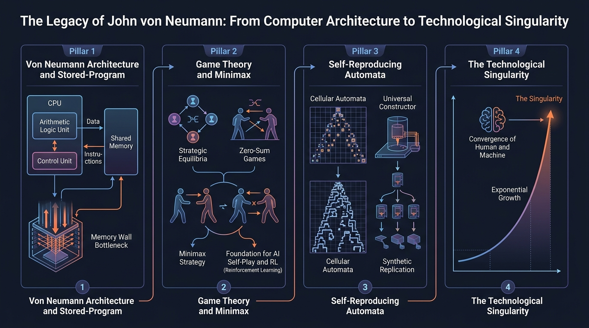
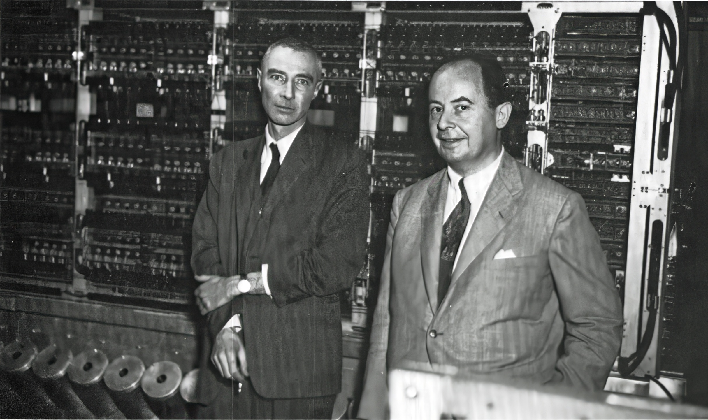

En los círculos académicos de Princeton durante los años cuarenta y cincuenta circulaba una célebre frase atribuida al físico Eugene Wigner, futuro Premio Nobel y amigo de la infancia del protagonista de este artículo:

> *«He conocido a muchas mentes brillantes en mi vida: traté de cerca a Max Planck, a Max von Laue y al propio Albert Einstein. Pero Paul Dirac era un genio y Johnny von Neumann era simplemente de otra especie. Solo Johnny estaba completamente despierto»*.

Hans Bethe, líder de la división teórica de Los Álamos y también Premio Nobel de Física, fue aún más lejos con una confesión que rozaba la estupefacción biológica: *«A veces me he preguntado si un cerebro como el de von Neumann no indica una especie superior a la del ser humano»*.

No exageraban. Aquel hombre regordete de baja estatura, traje impecable de banquero de tres piezas —que vestía incluso cuando cabalgaba sobre una mula por el Gran Cañón del Colorado—, risa contagiosa y pasión desmedida por las limusinas veloces y las fiestas ruidosas, poseía una capacidad de procesamiento cognitivo que desafiaba cualquier escala conocida.

Su nombre era **János Lajos Neumann**, universalmente inmortalizado como **John von Neumann** (o simplemente *Johnny* para sus colegas).

Hoy en día, cada smartphone en nuestro bolsillo, cada servidor en la nube, cada supercomputador que entrena modelos de frontera como Gemini o Claude, y cada algoritmo de auto-juego por refuerzo descansa directamente sobre los cimientos matemáticos y arquitectónicos que él formuló en apenas tres décadas de actividad frenética.

Continuando la serie de grandes figuras del pensamiento analítico que hemos explorado en Datalaria —como [Ada Lovelace](/es/posts/ada_lovelace/), [Alan Turing](/es/posts/alan_turing/), [Claude Shannon](/es/posts/claude_shannon/), [Thomas Bayes](/es/posts/thomas_bayes/) y [J. Robert Oppenheimer](/es/posts/oppenheimer/)—, este artículo desgrana la fascinante vida de John von Neumann, sus aportaciones cruciales a la computación, el infame "cuello de botella" que hoy asfixia al hardware de IA y la asombrosa profecía con la que acuñó, por primera vez en la historia humana, el concepto de **Singularidad Tecnológica**.



---

### El Prodigio de Budapest y «Los Marcianos»

Nacido en Budapest en diciembre de 1903 en el seno de una acomodada familia judía no practicante, János dio muestras tempranas de una anomalía cerebral portentosa:
* **Cálculo relámpago**: A los seis años de edad era capaz de dividir mentalmente dos números de ocho cifras y conversar con su padre en griego clásico sobre historia romana.
* **Memoria eidética total**: Podía leer una página de la guía telefónica o un capítulo del *Fausto* de Goethe en alemán y recitarlo de memoria palabra por palabra décadas después. Si se le pedía, era capaz de traducirlo al vuelo al inglés o al francés sin la menor vacilación.
* **El dilema de la doble titulación**: Su padre, un banquero pragmático ennoblecido con el título de *Margittai*, temía que las matemáticas puras no le permitieran ganarse la vida. Como solución de compromiso, Johnny cursó simultáneamente la licenciatura en Ingeniería Química en la prestigiosa ETH de Zúrich y el Doctorado en Matemáticas en la Universidad de Budapest. A los veintidós años ya se había graduado con honores en ambas instituciones sin asistir a casi ninguna clase en Hungría, presentándose únicamente a rendir los exámenes finales.

Von Neumann formó parte de una irrepetible constelación de mentes húngaras emigradas a Estados Unidos antes del ascenso del fascismo en Europa, entre las que figuraban Leo Szilard, Edward Teller, Eugene Wigner y Theodore von Kármán. El grupo era tan extraordinario y exhibía una velocidad intelectual tan desconcertante que Enrico Fermi solía bromear en Los Álamos diciendo: *«Los extraterrestres ya están entre nosotros; solo que fingen ser húngaros y hablan con un acento peculiar»*. Se les conocía como **«Los Marcianos»** (*A marslakók*).

A finales de los años veinte, instalado en Gotinga y Berlín, von Neumann revolucionó los fundamentos de la mecánica cuántica con su tratado seminal de 1932, proporcionando la formulación rigurosa sobre Espacios de Hilbert que la física moderna sigue utilizando en la actualidad. Pero su verdadero salto hacia el silicio estaba a punto de germinar.

---

### La Arquitectura Von Neumann (1945): El Plano Maestro del Silicio

A mediados de 1944, mientras esperaba un tren en el andén de la estación de Aberdeen (Maryland), von Neumann coincidió por casualidad con el teniente Herman Goldstine, un matemático militar asignado al proyecto ultrasecreto del **ENIAC** (*Electronic Numerical Integrator and Computer*) en la Universidad de Pensilvania. 

Al escuchar que el ejército estaba construyendo un mastodonte electrónico capaz de computar 5.000 sumas por segundo mediante 18.000 tubos de vacío, la curiosidad de von Neumann se encendió de inmediato.

El ENIAC era una proeza de cálculo balístico, pero arrastraba una tara operativa demoledora: **carecía de programa interno**. Para cambiar de un cálculo de trayectorias de artillería a una ecuación de propagación de ondas de choque, un equipo de ingenieras debía pasar días enteros desenchufando cables, alterando conmutadores manuales y reconectando paneles físicos de forma artesanal. La máquina era flexible en teoría, pero rígida como el hormigón en la práctica.

Von Neumann se incorporó como consultor para el diseño de la máquina sucesora: el **EDVAC** (*Electronic Discrete Variable Automatic Computer*). 

En junio de 1945, von Neumann redactó un documento fundacional de 101 páginas titulado ***First Draft of a Report on the EDVAC***. Aquel texto manuscrito estableció el diseño estructural definitivo que gobierna casi cualquier ordenador fabricado en los últimos ochenta años: **el ordenador de programa almacenado**.

```
+-----------------------------------------------------------+
|                   SISTEMA VON NEUMANN                     |
|                                                           |
|  +--------------------+        +-----------------------+  |
|  |   CPU              |        |   MEMORIA PRINCIPAL   |  |
|  |  +--------------+  |  Bus   |  +-----------------+  |  |
|  |  | Control Unit |<===========> | Datos           |  |  |
|  |  +--------------+  |        |  +-----------------+  |  |
|  |  | ALU          |  |        |  | Instrucciones   |  |  |
|  |  +--------------+  |        |  | (Mismo Espacio) |  |  |
|  |  | Registros    |  |        |  +-----------------+  |  |
|  +--------------------+        +-----------------------+  |
|           ^                                               |
|           | Bus de E/S                                    |
|           v                                               |
|  +--------------------+                                   |
|  | Entrada / Salida   |                                   |
|  +--------------------+                                   |
+-----------------------------------------------------------+
```

La idea maestra fue tan elegante como subversiva: **tratar a las instrucciones del programa con el mismo formato binario que a los datos numéricos, conviviendo ambos en un único espacio de memoria homogénea**. 

De pronto, un ordenador ya no necesitaba ser reconfigurado físicamente: un programa era simplemente una secuencia de números cargada en memoria que la Unidad de Control leía, decodificaba y ejecutaba secuencialmente, con capacidad para bifurcarse, saltar o incluso modificarse a sí mismo dinámicamente en tiempo de ejecución.

El diseño constaba de cuatro pilares básicos:
1. **Unidad Central de Procesamiento (CPU)**: Integrada por la Unidad Aritmético-Lógica (ALU) para operaciones matemáticas y booleanas, y registros de alta velocidad.
2. **Unidad de Control (CU)**: Encargada de leer instrucciones secuenciales de memoria y orquestar el flujo de datos.
3. **Memoria Primaria Compartida**: Almacena indistintamente código ejecutable y datos de variables.
4. **Mecanismo de Entrada/Salida (E/S)**: Interfaz con el mundo exterior.

Aunque John Mauchly y J. Presper Eckert (los constructores del ENIAC) aportaron ideas esenciales al concepto del programa almacenado, fue la síntesis matemática y la claridad formal de von Neumann lo que estandarizó la arquitectura a escala planetaria.

---

### El «Cuello de Botella de Von Neumann» y el Muro de la IA

La arquitectura von Neumann fue un triunfo absoluto que impulsó la revolución digital. Sin embargo, su propia virtud llevaba insertada una condena física que los arquitectos de hardware denominan el **Cuello de Botella de Von Neumann** (*The Von Neumann Bottleneck* o *Memory Wall*).

Dado que las instrucciones y los datos deben transitar a través del mismo bus compartido entre la memoria y la unidad de procesamiento, el rendimiento del sistema queda limitado no por la velocidad a la que la CPU puede procesar datos, sino por **la velocidad y el ancho de banda con los que la memoria puede suministrárselos**.

```
[ CPU / Núcleos Tensor ] <=== CUELLO DE BOTELLA (Bus Limitado) ===> [ Memoria HBM / DRAM ]
       (Ultra rápido)                 (Latencia y Calor)                (Almacén Masivo)
```

En la era del software convencional, las cachés multinivel (L1, L2, L3) y la predicción de saltos mitigaron el problema. Pero en 2026, con la irrupción de modelos de lenguaje masivos y clústeres de supercómputo para la AGI, el cuello de botella se ha convertido en una barrera existencial:
* En arquitecturas como NVIDIA Blackwell (B200 / GB200) o los procesadores TPU v6, el consumo energético ya no se produce al multiplicar matrices de coma flotante (FP8 / FP4), sino al **trasladar billones de parámetros desde los módulos de memoria HBM3e/HBM4 hasta los núcleos de cómputo**.
* Como analizamos en nuestro reciente caso de estudio sobre [Submer](/es/posts/submer/), este movimiento masivo de datos genera densidades térmicas superiores a los **100 kW por rack**, empujando a los centros de datos a sustituir el aire por refrigeración líquida por inmersión dieléctrica.
* Asimismo, la industria explora activamente arquitecturas *no-von-Neumann*: desde el cómputo en memoria (*Processing-in-Memory* o PIM) hasta procesadores neuromórficos y aceleradores de flujo de datos por streaming como los LPUs (*Language Processing Units*), buscando romper la separación entre cálculo y almacenamiento que Johnny concibió hace ochenta años.

---

### Teoría de Juegos y Minimax: Las Reglas de los Agentes Autónomos

Si von Neumann solo hubiera diseñado la arquitectura de los ordenadores, su nombre ya figuraría en el Olimpo de la ciencia. Pero su mente operaba simultáneamente en frentes totalmente dispares.

En 1928, obsesionado por comprender por qué las partidas de póquer dependían tanto del farol (*bluffing*) y de la información asimétrica en lugar del cálculo combinatorio perfecto como el ajedrez, demostró el célebre **Teorema del Minimax**. 

El teorema probó que en cualquier juego de dos personas de suma cero con información finita, siempre existe una estrategia mixta óptima para cada jugador que garantiza el mejor resultado posible frente al peor escenario que plantee el oponente.



En 1944, junto al economista austriaco Oskar Morgenstern, publicó un tomo monumental que fundó formalmente una disciplina entera: ***Theory of Games and Economic Behavior***.

#### De la Guerra Fría a la Inteligencia Artificial Moderna

La Teoría de Juegos transformó de raíz la economía moderna, pero donde desplegó su dimensión más sobrecogedora fue en la geopolítica de la Guerra Fría. Como asesor de la Corporación RAND y del gobierno de EE.UU., von Neumann aplicó la teoría de juegos para modelar el enfrentamiento nuclear entre Washington y Moscú, acuñando los principios de la doctrina **MAD** (*Mutually Assured Destruction* o Destrucción Mutua Asegurada).

Pero para los ingenieros y científicos de datos de hoy, la Teoría de Juegos es el lenguaje nativo con el que se entrenan los sistemas inteligentes:
1. **Auto-juego (*Self-Play*)**: El entrenamiento por refuerzo donde dos agentes compiten entre sí para explorar el espacio de soluciones —base de AlphaGo y AlphaZero, analizados en [The Thinking Game](/es/posts/the_thinking_game/)— es una encarnación computacional directa del minimax y de los equilibrios estratégicos de von Neumann.
2. **Razonamiento en Modelos Frontera**: En los modelos de razonamiento contemporáneos basados en *System 2 thinking*, los algoritmos de búsqueda guiada (como Monte Carlo Tree Search y el auto-debate entre agentes) aplican funciones de utilidad y minimización de pérdidas derivadas directamente de la obra de Johnny.
3. **Inferencia Probabilística y Utilidad**: La formalización que hizo von Neumann de la *función de utilidad esperada* cerró el círculo con la inferencia bayesiana que analizamos en [Thomas Bayes](/es/posts/thomas_bayes/), dotando a los agentes de software de un marco formal para actuar bajo incertidumbre.

---

### Los Álamos, Oppenheimer y el Método de Monte Carlo

Durante la Segunda Guerra Mundial y los primeros compases de la Guerra Fría, von Neumann fue un puntal imprescindible del Proyecto Manhattan en Los Álamos.

Fue él quien realizó los cálculos hidrodinámicos que demostraron la viabilidad de la **lente de implosión** para la bomba de plutonio *Fat Man* —un problema de compresión simétrica tan diabólicamente complejo que muchos físicos lo consideraban irrealizable—.



Allí forjó una profunda alianza intelectual con [J. Robert Oppenheimer](/es/posts/oppenheimer/) y con el matemático Stanisław Ulam. Como relatamos en nuestro artículo sobre Oppenheimer, cuando Ulam concibió la idea de resolver problemas físicos intratables mediante experimentos de muestreo pseudoaleatorio con cartas, fue von Neumann quien tradujo esa intuición a un algoritmo ejecutable para las computadoras electrónicas: el **Método de Monte Carlo**.

Para acelerar las simulaciones de la bomba de hidrógeno, von Neumann diseñó y construyó en Princeton la legendaria máquina **IAS**, cariñosamente apodada **MANIAC** (*Mathematical Analyzer, Numerical Integrator and Computer*).

Su relación con otros gigantes de la época está repleta de anécdotas memorables:
* **Con Alan Turing**: En 1938, von Neumann quedó tan impresionado por el artículo de Turing sobre los números computables que le ofreció una plaza como su asistente de investigación en el Instituto de Estudios Avanzados (IAS) de Princeton. [Alan Turing](/es/posts/alan_turing/) rechazó la oferta para regresar a Inglaterra, pero von Neumann siempre reconoció que la noción teórica de la Máquina Universal de Turing fue la chispa que encendió su diseño del programa almacenado.
* **Con Claude Shannon**: En 1948, cuando [Claude Shannon](/es/posts/claude_shannon/) buscaba un nombre para su medida cuantitativa de la incertidumbre en los Laboratorios Bell, consultó a von Neumann. Johnny le dio una respuesta magistral y socarrona: *«Deberías llamarlo entropía por dos razones. Primero, porque esa función ya se utiliza con ese nombre en termodinámica estadística. Segundo, y más importante: nadie sabe realmente lo que es la entropía, ¡así que en cualquier debate siempre tendrás ventaja!»*.
* **Con Leonid Kantorovich**: Von Neumann reconoció de inmediato el genio de [Leonid Kantorovich](/es/posts/kantorovich/) y George Dantzig, y demostró formalmente el **Teorema de la Dualidad**, probando que la optimización lineal y los juegos de suma cero entre dos personas son matemáticamente dos caras de la misma moneda.

---

### Autómatas Celulares y Máquinas Autorreplicantes

En sus últimos años, la mente de von Neumann se adelantó varias décadas a la biología molecular y a la vida artificial.

Inspirado por las conversaciones con el neurofisiólogo Warren McCulloch sobre cómo el cerebro procesa información a partir de componentes imperfectos y poco fiables, von Neumann se propuso responder a una pregunta biológica y mecánica fundamental: **¿puede una máquina construir una copia exacta de sí misma, o incluso una máquina más compleja que ella?**

En su obra póstuma ***Theory of Self-Reproducing Automata*** (1966), demostró matemáticamente que la autorreplicación artificial era perfectamente viable. Para lograrlo, inventó el concepto de **Autómata Celular**: un universo abstracto cuadriculado donde cada celda adopta un estado discreto según reglas locales prefijadas (el predecesor directo del famoso *Juego de la Vida* de John Conway).

Dentro de este marco, concibió el **Constructor Universal** (*Universal Constructor*), compuesto por:
1. Una cinta de instrucciones que describe cómo fabricar el autómata.
2. Un mecanismo ejecutor que lee la cinta y ensambla los componentes.
3. Un mecanismo duplicador que copia la cinta de instrucciones y la inserta en el nuevo autómata generado.

Lo fascinante es que von Neumann formuló este modelo lógico antes de que James Watson y Francis Crick descubrieran la estructura del ADN en 1953: anticipó con asombrosa exactitud que los sistemas biológicos necesitaban separar el código genético como plantilla descriptiva (ADN) de su mecanismo de traducción y duplicación celular (ribosomas y polimerasas).

En astrofísica y ciencia ficción, esta teoría dio origen a las **Sondas de Von Neumann** (*Von Neumann probes*): naves espaciales autorreplicantes capaces de colonizar una galaxia entera en pocos millones de años utilizando recursos locales. Y en la IA moderna de 2026, su visión resuena con fuerza en los agentes autónomos de software capaces de inspeccionar su propio código fuente, generar parches, compilarse y desplegar instancias derivadas de sí mismos en entornos distribuidos.

---

### El Origen de la «Singularidad Tecnológica»

Existe una creencia generalizada de que el término "Singularidad" fue acuñado por el escritor de ciencia ficción Vernor Vinge en los años noventa o por Ray Kurzweil en sus ensayos futuristas.

Sin embargo, el origen histórico exacto se remonta a una conversación informal que John von Neumann mantuvo a mediados de los años cincuenta con su íntimo amigo Stanisław Ulam. 

En mayo de 1958, en un homenaje póstumo publicado en el *Bulletin of the American Mathematical Society*, Ulam dejó registrado para la posteridad aquel momento visionario:

> *«Una de nuestras conversaciones se centró en el progreso siempre acelerado de la tecnología y los cambios en el modo de vida humana, lo que da la apariencia de aproximarse a alguna **singularidad esencial** en la historia de la especie, más allá de la cual los asuntos humanos, tal como los conocemos, no podrían continuar»*.

Fue la primera vez en la historia del pensamiento humano en que la palabra matemática *singularidad* —un punto en el que una función matemática se dispara hacia el infinito y las reglas convencionales dejan de tener validez— se aplicó a la evolución de la civilización impulsada por la computación y la inteligencia artificial.

Von Neumann no concebía la tecnología como una meseta estática, sino como un vector exponencial retroalimentado: computadores que diseñan computadores mejores, que a su vez aceleran el descubrimiento científico, comprimiendo siglos de progreso en décadas y décadas en horas.

---

### El Vuelo Final y el Espejo de la AGI

A comienzos de 1955, a von Neumann se le diagnosticó un agresivo cáncer de huesos y páncreas, posiblemente derivado de su exposición a la radiación ionizante durante los ensayos nucleares en Los Álamos y el atolón de Bikini.

En sus últimos meses en el Hospital Militar Walter Reed de Washington, postrado en cama bajo estricta vigilancia militar por temor a que en sus delirios febriles revelara secretos de estado de máxima seguridad, Johnny libró su batalla más amarga. 

Para un hombre cuya identidad entera reposaba sobre una velocidad mental sin parangón, presenciar el lento declive de sus facultades cognitivas fue un tormento desgarrador. Su hermano le leía en voz alta pasajes de Goethe en alemán, y Johnny se esforzaba febrilmente por completar los versos antes de que se extinguieran sus fuerzas. Murió el 8 de febrero de 1957, con apenas cincuenta y tres años.

Ochenta años después del informe del EDVAC, el mundo que habitamos en 2026 parece haber alcanzado finalmente las coordenadas que Johnny vislumbró antes que nadie:
* La arquitectura que ideó procesa cada instrucción de nuestra civilización digital.
* Los algoritmos de auto-juego y teoría de juegos gobiernan el aprendizaje de los modelos frontera como Gemini, Claude o ChatGPT.
* Y la curva exponencial del progreso tecnológico se aproxima, con vértigo innegable, a esa **singularidad esencial** que anticipó en sus paseos por Princeton.

---

### Una Pregunta Abierta para el Lector

John von Neumann fue un fenómeno irrepetible: un hombre con un cerebro tan prodigioso que sus propios colegas dudaban de si pertenecía a la misma rama evolutiva que el resto de los mortales.

Sin embargo, dedicó su intelecto a construir la máquina que eventualmente haría obsoleta la necesidad del cerebro biológico. Diseñó el hardware para que el silicio pensara, las reglas del juego para que los agentes compitieran y formuló la teoría de cómo las máquinas podrían replicarse y evolucionar.

La pregunta que nos deja su vida flotando en este 2026 no es sobre el pasado, sino sobre nuestro destino inmediato:

**¿Fue Johnny von Neumann el último gran polímata biológico de nuestra historia... o el ingeniero que construyó la cuna para la primera mente sintética que cruzará el horizonte de la Singularidad?**

**Y cuando crucemos ese umbral que él bautizó... ¿sabremos jugar la partida, o descubriremos que el tablero ya no nos pertenece?**

Nos encantaría conocer tu reflexión. Déjanos tu opinión en los comentarios.

---

#### Fuentes de Interés:
* [**Ananyo Bhattacharya (2021)**: *The Man from the Future: The Visionary Life of John von Neumann*](https://www.penguin.co.uk/books/308118/the-man-from-the-future-by-bhattacharya-ananyo/9780141989068)
* [**John von Neumann (1945)**: *First Draft of a Report on the EDVAC* — University of Pennsylvania](https://archive.org/details/firstdraftofrepo00vonn)
* [**John von Neumann & Oskar Morgenstern (1944)**: *Theory of Games and Economic Behavior* — Princeton University Press](https://press.princeton.edu/books/paperback/9780691130613/theory-of-games-and-economic-behavior)
* [**Stanisław Ulam (1958)**: *John von Neumann 1903–1957* — Bulletin of the American Mathematical Society](https://projecteuclid.org/journals/bulletin-of-the-american-mathematical-society/volume-64/issue-3P2/John-von-Neumann-19031957/bams/1183522373.pdf)
* [**YouTube**: *John von Neumann — The Man Who Taught Machines to Think*](https://www.youtube.com/watch?v=A2dYq1h821w)
* [**Datalaria**: Alan Turing — El Genio que Rompió Enigma y Preguntó si las Máquinas Podían Pensar](/es/posts/alan_turing/)
* [**Datalaria**: J. Robert Oppenheimer — De Monte Carlo al Dilema Ético de la AGI](/es/posts/oppenheimer/)
* [**Datalaria**: Claude Shannon — El Padre de la Teoría de la Información](/es/posts/claude_shannon/)
* [**Datalaria**: Thomas Bayes — Inferencia Probabilística y el Peso de la Evidencia](/es/posts/thomas_bayes/)
* [**Datalaria**: Leonid Kantorovich — La Optimización Matemática y la Dualidad](/es/posts/kantorovich/)
* [**Datalaria**: The Thinking Game — Demis Hassabis, DeepMind y el Auto-Juego](/es/posts/the_thinking_game/)
* [**Datalaria**: Submer — El Muro Térmico de la IA y la Refrigeración Líquida](/es/posts/submer/)
